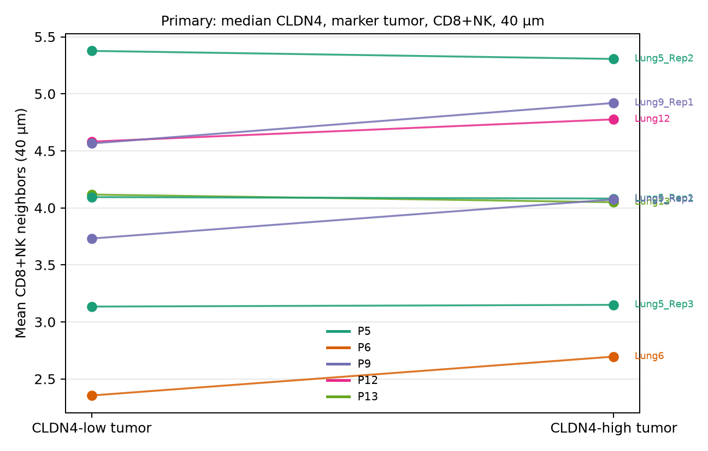
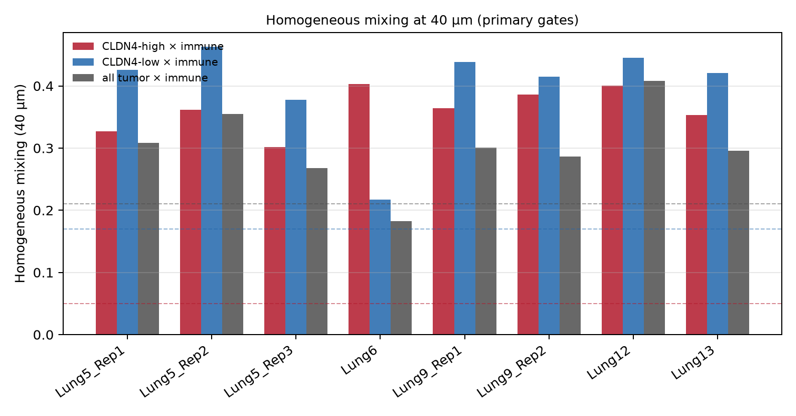
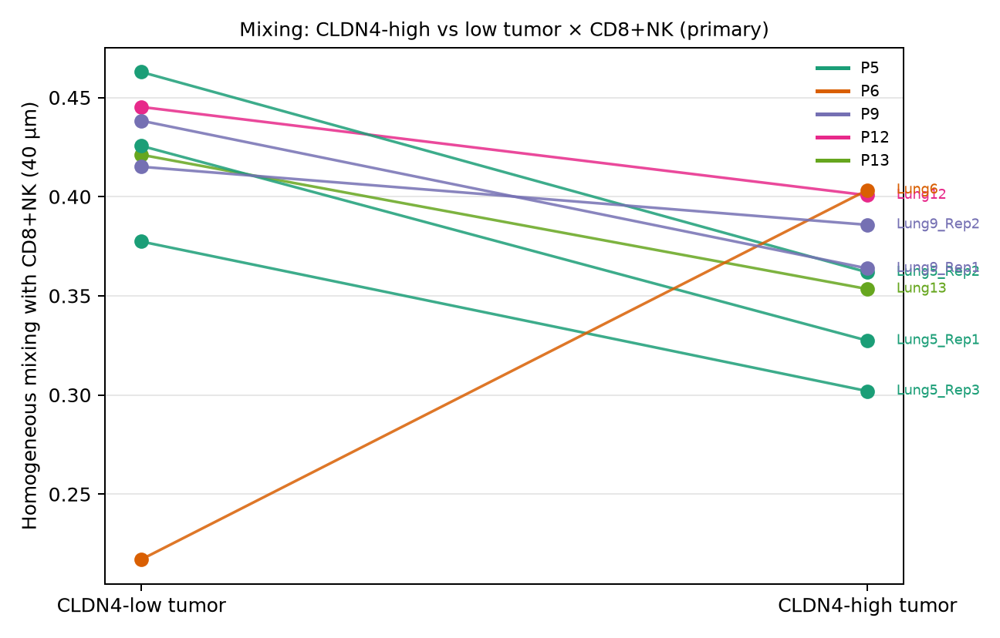
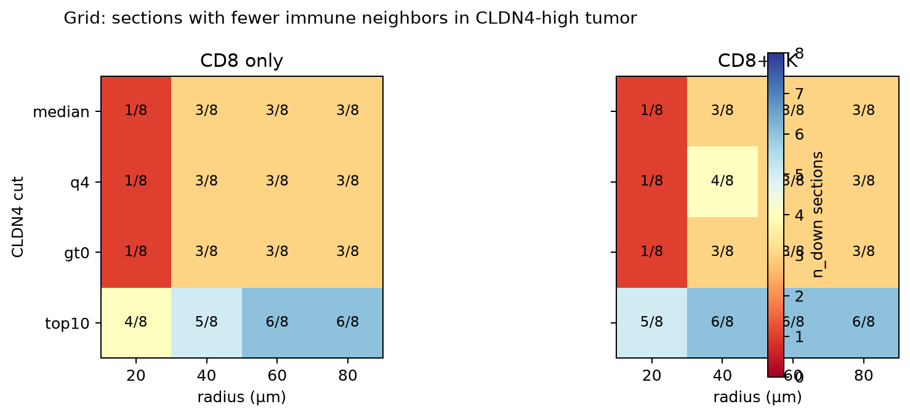

# CosMx NSCLC July-style neighbor retune (CLDN4-only)

Official NanoString/Bruker CosMx NSCLC FFPE 960-plex (He et al. 2022): **all 8 sections / 5 patients** (Lung5_Rep1/2/3, Lung6, Lung9_Rep1/2, Lung12, Lung13). Additive. CLDN4-only. No private 8-KL.

July PPT target metric family (reference, not copied): CD8/NK neighbors 3.15→2.05, 8/8 sections P=0.008, 5/5 donors P=0.031, mixing 0.05/0.17/0.21. Primary readout here is **mean immune-neighbor count**, not nearest-µm to CD8.

## Pre-specified primary

Declared before inspecting the grid:

- CLDN4 cut: **median-split among tumor cells**
- Radius: **40 µm**
- Immune: **CD8+NK** (CD8A+ / author T CD8; NKG7+ or author NK)
- Tumor gate: **author tumor if labels are present, else PanCK/KRT8/EPCAM high AND not CD8**
- Tumor cells are **not** required to have CD8A=0
- FOVs with <50 tumor cells or <20 CD8 dropped (no contrast)
- Unit of test: **section (n=8)** and **donor (n=5)** paired Wilcoxon on section-mean (donor-mean) neighbor counts

Author cell-type labels: **not in the official flat metadata** (`fov`, morphology, `Mean.PanCK`/`CD45`/`CD3` only). Primary therefore uses the PanCK/KRT8/EPCAM marker gate. Author-gate grid rows are empty (0 author-tumor cells).

Inventory: 763,683 QC cells; 348,003 marker-tumor cells; 63,197 CD8; 37,905 NK; FOVs kept 231/231 (every FOV met ≥50 tumor and ≥20 CD8). Panel = 960 genes. **CLDN4, CD8A, NKG7, KRT8, EPCAM present on all 8 exprMats.**

### 1. Mean CD8+NK neighbor count (primary)

| Unit | CLDN4-high | CLDN4-low | Δ (high−low) | n_down / n | paired Wilcoxon P |
|---|---:|---:|---:|---:|---:|
| section n=8 | 4.132 | 3.994 | +0.137 | **3/8** | 0.195 |
| donor n=5 | 4.039 | 3.880 | +0.159 | **2/5** | 0.312 |

Three sections are down (Lung13, Lung5_Rep1, Lung5_Rep2); five are up (Lung6 and both Lung9 sections the largest). Lung5_Rep3 is nearly flat (3.150 vs 3.135).



### 2. Neighborhood fraction (density-normalized)

CD8+NK / all neighbors inside 40 µm (a crowded tumor nest is not penalized):

- section means: high **0.1516** vs low **0.1383**, **0/8** down, P=0.008
- residualized neighbor count on local epithelial density (same radius): high −0.025 vs low +0.031, **5/8** down, P=0.461
- companion k=10 NN CD8+NK count: high 1.498 vs low 1.354, **0/8** down, P=0.008

### 3. Mixing (homogeneous, 40 µm)

Section-mean mixing n_AB/(n_AB+n_AA+n_BB) among CLDN4-arm tumor ∪ CD8+NK:

| contrast | mixing |
|---|---:|
| CLDN4-high × CD8+NK | **0.362** |
| CLDN4-low × CD8+NK | **0.400** |
| all tumor × CD8+NK | **0.301** |
| July family | 0.05 / 0.17 / 0.21 |

High vs low mixing is **7/8 down** (Lung6 is the up section), paired Wilcoxon P=0.195. Donor-mean mixing is **4/5 down** (P6 up), P=0.625. Absolute mixing sits above the July 0.05/0.17/0.21 levels; the high < low direction matches that family on 7/8 sections.





### Per-section primary means

| section | donor | n_high | n_low | neighbors high | neighbors low | Δ | mix high | mix low |
|---|---|---:|---:|---:|---:|---:|---:|---:|
| Lung5_Rep1 | P5 | 15614 | 23165 | 4.082 | 4.094 | −0.013 | 0.327 | 0.426 |
| Lung5_Rep2 | P5 | 15506 | 20811 | 5.306 | 5.376 | −0.071 | 0.362 | 0.463 |
| Lung5_Rep3 | P5 | 12425 | 20875 | 3.150 | 3.135 | +0.015 | 0.302 | 0.377 |
| Lung6 | P6 | 15856 | 52455 | 2.696 | 2.355 | +0.341 | 0.403 | 0.217 |
| Lung9_Rep1 | P9 | 19390 | 20537 | 4.920 | 4.565 | +0.355 | 0.364 | 0.438 |
| Lung9_Rep2 | P9 | 33974 | 37771 | 4.074 | 3.731 | +0.343 | 0.386 | 0.415 |
| Lung12 | P12 | 7662 | 21515 | 4.776 | 4.581 | +0.195 | 0.401 | 0.445 |
| Lung13 | P13 | 15145 | 15302 | 4.050 | 4.117 | −0.067 | 0.353 | 0.421 |

## Parameter grid

CLDN4 cut × tumor gate × immune × radius. Test = paired Wilcoxon on section-mean **radius neighbor counts**. `n_down` = sections where CLDN4-high has fewer immune neighbors than CLDN4-low. Author-tumor gate omitted (0 labeled tumor cells in official metadata).



| cut | tumor gate | immune | radius µm | mean high | mean low | Δ | section n_down/8 | section P | donor n_down/5 | donor P | mix high/low/all |
|---|---|---|---:|---:|---:|---:|---:|---:|---:|---:|---|
| top10 | marker | cd8_nk | 60 | 8.662 | 8.717 | −0.054 | **6/8** | 0.547 | **4/5** | 0.625 | 0.340/0.405/0.307 |
| top10 | marker | cd8_nk | 80 | 15.133 | 15.182 | −0.049 | **6/8** | 0.547 | **4/5** | 0.625 | 0.344/0.409/0.312 |
| top10 | marker | cd8_nk | 40 | 3.947 | 3.994 | −0.047 | **6/8** | 0.312 | **4/5** | 0.438 | 0.334/0.400/0.301 |
| top10 | marker | cd8 | 80 | 9.422 | 9.454 | −0.032 | **6/8** | 0.547 | **4/5** | 0.625 | 0.393/0.338/0.233 |
| top10 | marker | cd8 | 60 | 5.389 | 5.416 | −0.027 | **6/8** | 0.547 | **4/5** | 0.625 | 0.385/0.333/0.228 |
| top10 | marker | cd8 | 40 | 2.450 | 2.463 | −0.013 | 5/8 | 0.461 | 3/5 | 0.812 | 0.375/0.326/0.221 |
| top10 | marker | cd8_nk | 20 | 1.018 | 1.029 | −0.011 | 5/8 | 0.461 | 3/5 | 0.625 | 0.327/0.393/0.295 |
| top10 | marker | cd8 | 20 | 0.610 | 0.610 | +0.001 | 4/8 | 0.945 | 3/5 | 1.000 | 0.352/0.310/0.209 |
| q4 | marker | cd8_nk | 40 | 4.068 | 3.950 | +0.118 | 4/8 | 0.312 | 2/5 | 0.312 | 0.371/0.408/0.301 |
| median | marker | cd8_nk | 40 | 4.132 | 3.994 | +0.137 | 3/8 | 0.195 | 2/5 | 0.312 | 0.362/0.400/0.301 | **← primary** |
| q4 | marker | cd8 | 40 | 2.532 | 2.432 | +0.101 | 3/8 | 0.250 | 2/5 | 0.312 | 0.341/0.339/0.221 |
| gt0 | marker | cd8_nk | 40 | 4.143 | 3.950 | +0.193 | 3/8 | 0.195 | 2/5 | 0.312 | 0.349/0.408/0.301 |
| median | marker | cd8 | 40 | 2.576 | 2.463 | +0.113 | 3/8 | 0.109 | 1/5 | 0.188 | 0.301/0.326/0.221 |
| median | marker | cd8 | 20 | 0.648 | 0.610 | +0.039 | 1/8 | 0.016 | 1/5 | 0.125 | 0.281/0.310/0.209 |
| median | marker | cd8_nk | 20 | 1.094 | 1.029 | +0.065 | 1/8 | 0.016 | 1/5 | 0.125 | 0.354/0.393/0.295 |

Full 32 marker-gate cells: `results/cosmx_july_neighbor/tables/parameter_grid.csv`.

### Closest grid cell to the July 8/8-down family

No grid cell was 8/8 down on raw neighbor counts. Closest by (section n_down, donor n_down, Δ vs −1.10):

**cut = top 10% CLDN4 among tumor, marker tumor, CD8+NK, radius 60 µm** — neighbors 8.717→8.662 (Δ=−0.054), section **6/8** P=0.547, donor **4/5** P=0.625, mixing 0.340/0.405/0.307.

The same top-10% / CD8+NK combination is 6/8 down at 40 µm (3.994→3.947, P=0.312) and at 80 µm (15.182→15.133). That cut is the only one that consistently points the neighbor-count delta negative.

## Methods notes

- Coordinates: `CenterX/Y_global_px` × 0.18 µm/px (CosMx NSCLC prototype).
- CD8 = CD8A+ (official metadata has no author T labels). NK = NKG7+. CD8+NK is the union. A cell can be tumor even if CD8A>0 when it is author-tumor; under the marker gate, CD8 cells are held out of the tumor set so the interface is not deleted by an extra CD8A=0 filter on PanCK-high cells.
- Marker tumor = z-scored Mean.PanCK + KRT8 + EPCAM composite ≥ section-wide median, and not CD8.
- Residualization: per-section linear residual of immune-neighbor count on local epithelial-neighbor count (same radius).
- Mixing: homogeneous score n_AB/(n_AB+n_AA+n_BB) among CLDN4-arm tumor ∪ immune cells, radius-matched.
- k-NN is a companion (k=10/20 among all cells, count of CD8/NK in that neighborhood).
- Data: official S3 `SMI-Compressed/{sample}/{sample}+SMI+Flat+data.tar.gz` (exprMat + metadata + fov_positions). Raw tarballs are not committed.

Reproduce:

```bash
python3 scripts/download_cosmx_nsclc.py
python3 scripts/cosmx_july_neighbor_retune.py
```
