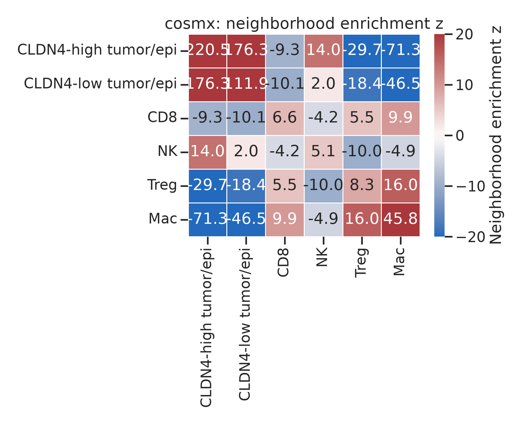
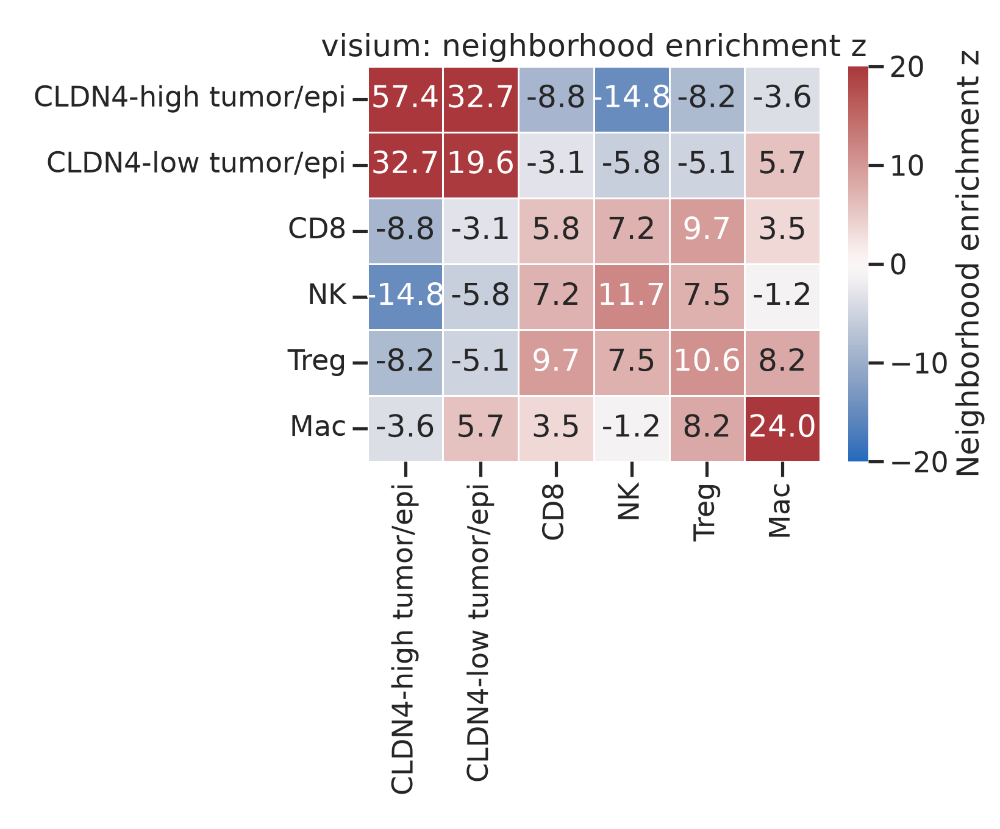
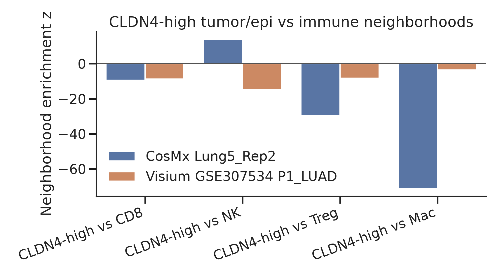
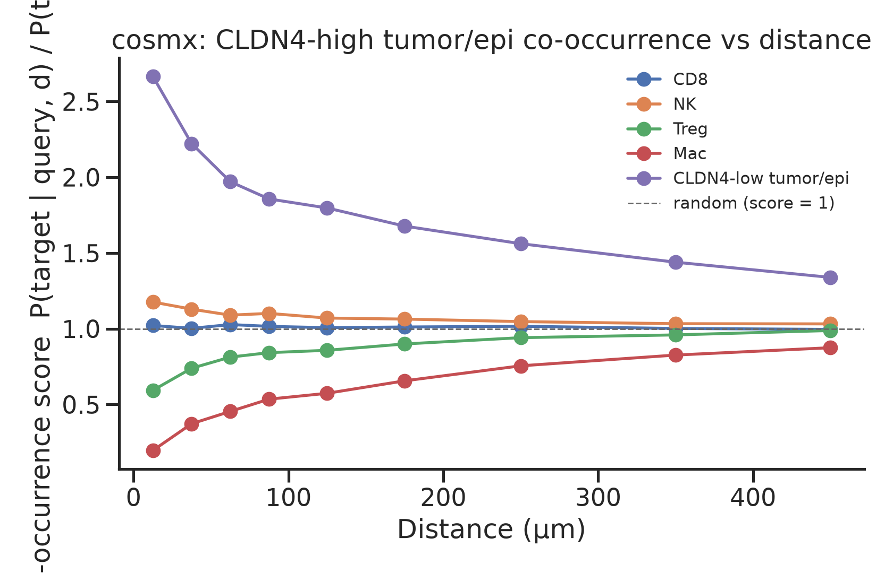
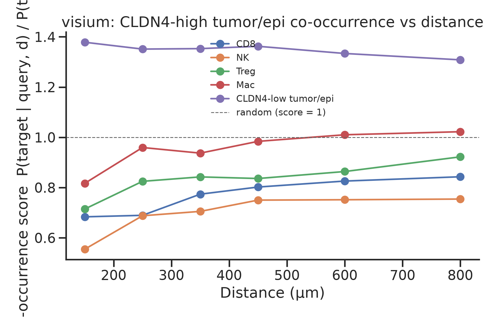
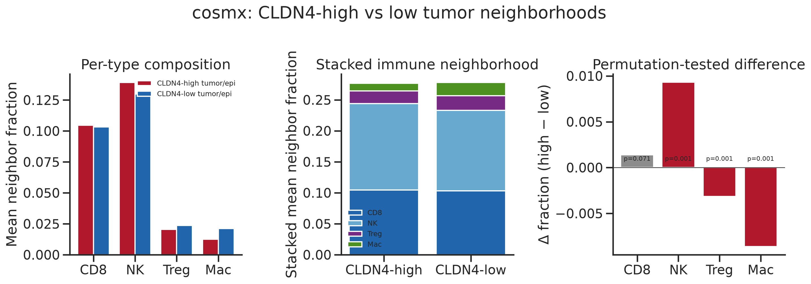
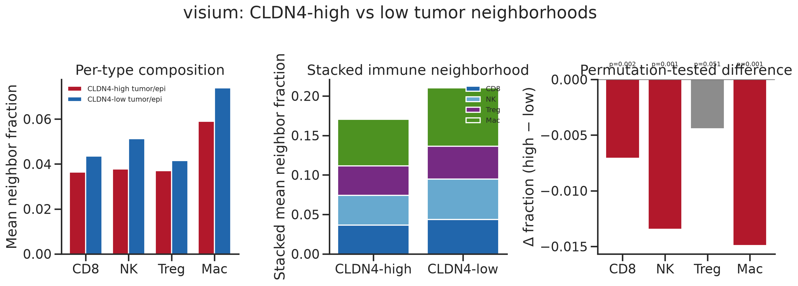
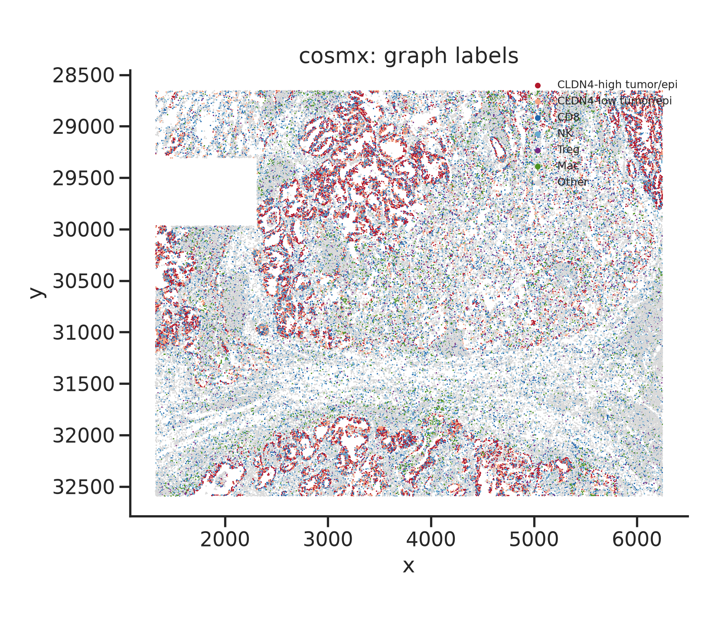
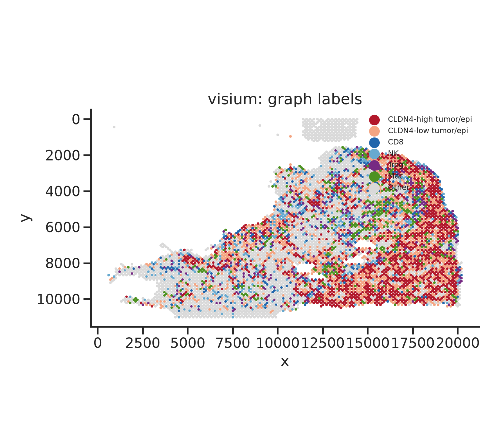

# RESULTS: CLDN4-only spatial neighbor-graph analysis

On CosMx Lung5_Rep2 (50 µm), CLDN4-high tumor/epi vs CD8 neighborhood z = -9.33 (depleted vs random), vs NK z = 13.98, vs Mac z = -71.29. Visium P1_LUAD 1–2 hop CLDN4-high vs CD8 z = -8.80. After neighboring KRT8, neighboring CLDN4 adds ΔR² = 0.0003 to non-tumor CD8A on CosMx (coef 0.0179, p=3.2e-06).

## Datasets (public only)

| Assay | Accession / source | Sample | Resolution | Graph |
| --- | --- | --- | --- | --- |
| CosMx SMI NSCLC FFPE | Official NanoString / He et al. 2022 *Nat Biotechnol* public release | **Lung5_Rep2** | single cell | radius **50 µm** (0.18 µm/px from the official SMI-ReadMe for this prototype) |
| Visium CytAssist LUAD | **GSE307534** / GSM9226169 | **P1_LUAD invasive** section | spot (~55 µm) | Visium hex **1–2 hop** |

No private 8-KL material was used. TACSTD2/TROP2 was not used as a query. Cell labels are marker- and IF-informed (CosMx PanCK/CD45/CD3 plus RNA modules); they are not a published InSituType atlas re-import. CosMx NK is a cytotoxic/NKG7-high, CD8A-negative compartment and will still include some non-canonical NK cells.

CosMx QC: drop `cell_ID==0`, `n_counts≥20`, `n_genes≥10`, area 80–25000 px. Tumor/epi cells were split by **median CLDN4 counts within tumor/epi**. Visium spots were library-size normalized to 10k and log1p-transformed; tumor spots = top 40% epithelial-score spots, then median-split on CLDN4.

## Cell / spot counts

**CosMx Lung5_Rep2** (n=100450 cells)

| Label | n |
| --- | ---: |
| CLDN4-high tumor/epi | 10757 |
| CLDN4-low tumor/epi | 7641 |
| CD8 | 10310 |
| NK | 12340 |
| Treg | 2742 |
| Mac | 3843 |
| Other | 52817 |

**Visium GSE307534 P1_LUAD** (n=6596 in-tissue spots)

| Label | n |
| --- | ---: |
| CLDN4-high tumor/epi | 1320 |
| CLDN4-low tumor/epi | 1319 |
| CD8 | 318 |
| NK | 393 |
| Treg | 323 |
| Mac | 436 |
| Other | 2487 |

## Neighborhood enrichment z-scores

Permutation test of spatial edges vs label shuffles (n=400). Positive z = more neighbors than expected; negative = avoidance.

### CosMx 50 µm (Lung5_Rep2)

CLDN4-high tumor/epi vs CD8 z = **-9.33**; vs NK **13.98**; vs Treg **-29.70**; vs Mac **-71.29**.

CLDN4-low tumor/epi vs CD8 z = **-10.12**.

### Visium 1–2 hop (P1_LUAD)

CLDN4-high tumor/epi vs CD8 z = **-8.80**; vs NK **-14.81**; vs Treg **-8.17**; vs Mac **-3.64**.

## Co-occurrence vs distance

Score = P(target in annulus d | query) / P(target). Score > 1 = attraction at that scale.

Short-range CosMx scores (0–50 µm) and Visium first occupied bin are tabulated in `*_cooccurrence.csv`. Visium graph is hop-based; the curve uses Euclidean µm from hex pitch (~100 µm center-to-center). Empty short bins are expected on Visium because spots are not 25 µm apart.

## Neighborhood composition (CLDN4-high vs low tumor) + permutation p

Mean fraction of CD8 / NK / Treg / Mac among spatial neighbors of CLDN4-high vs CLDN4-low **tumor/epi** cells. Labels of high vs low were shuffled among tumor cells (1000 permutations).

### CosMx

| Neighbor | High | Low | Δ (high−low) | perm p |
| --- | ---: | ---: | ---: | ---: |
| CD8 | 0.1046 | 0.1032 | 0.0014 | 0.0709 |
| NK | 0.1391 | 0.1298 | 0.0093 | 0.0010 |
| Treg | 0.0206 | 0.0237 | -0.0032 | 0.0010 |
| Mac | 0.0125 | 0.0212 | -0.0086 | 0.0010 |

### Visium

| Neighbor | High | Low | Δ (high−low) | perm p |
| --- | ---: | ---: | ---: | ---: |
| CD8 | 0.0365 | 0.0435 | -0.0071 | 0.0020 |
| NK | 0.0379 | 0.0513 | -0.0135 | 0.0010 |
| Treg | 0.0371 | 0.0416 | -0.0044 | 0.0509 |
| Mac | 0.0590 | 0.0739 | -0.0149 | 0.0010 |

## Spatial variance partitioning (MISTy-style)

OLS of log1p(CD8A) on **neighbor-mean KRT8**, then neighbor-mean KRT8 + **neighbor-mean CLDN4**. Incremental R² is the unique spatial contribution of neighboring CLDN4 after epithelial density (KRT8).

| Dataset | n | R² (KRT8 neigh) | R² (+ CLDN4 neigh) | ΔR² CLDN4 after KRT8 | CLDN4 coef | CLDN4 p |
| --- | ---: | ---: | ---: | ---: | ---: | ---: |
| CosMx 50 µm (non-tumor) | 82052 | 0.0180 | 0.0182 | 0.0003 | 0.0179 | 3.2e-06 |
| Visium 1–2 hop (non-tumor) | 3951 | 0.0064 | 0.0109 | 0.0044 | 0.0772 | 2.6e-05 |

Primary model is juxta-view OLS on **non-tumor** cells: log1p(CD8A) ~ neighbor-mean KRT8 + neighbor-mean CLDN4. Sign of the CLDN4 coefficient is the direction of the residual association after KRT8. Tumor-centric and all-cell models are in `results/tables/misty_cd8_partition.json`. ΔR² can be significant and still tiny; report the coefficient with the increment.

## Spatial maps

## Methods notes

- CosMx graph: `sklearn.neighbors.radius_neighbors_graph` on global µm coordinates, radius 50 µm, no self-loops.
- Visium graph: official hex 6-neighbors (`±2` columns on the same row; `±1` row/`±1` col), then 2-hop closure (`A ∨ A²`).
- Enrichment engine: `squidpy.gr.nhood_enrichment` when it completes; otherwise the same permutation z-score on undirected edges (implemented in this repo).
- Co-occurrence: BallTree annuli around a cap of 2500 CLDN4-high query cells.
- Composition p-values are two-sided label-shuffle tests among tumor/epi only (keeps tumor geography, breaks CLDN4 high/low).
- Squidpy 1.8.3 was available in this run.

## Interpretation (CLDN4-only)

Numbers above are the result. CosMx is the single-cell test: CLDN4-high epithelium is **self-clustered**, **CD8-poor vs random** (z=-9.33), and **macrophage-poor vs random** (z=-71.29). NK is not treated as equivalent to CD8. Visium P1_LUAD labels are signature-dominant mixed spots; use hop-graph z-scores and composition p-values, not cell-pure calls. Composition tests ask a different question than enrichment (high vs low tumor, not vs random).

## Files

- `results/tables/cosmx_nhood_zscore.csv`, `visium_nhood_zscore.csv`
- `results/tables/cosmx_composition.csv`, `visium_composition.csv`
- `results/tables/cosmx_cooccurrence.csv`, `visium_cooccurrence.csv`
- `results/tables/misty_cd8_partition.json`
- `results/figures/*.png`
