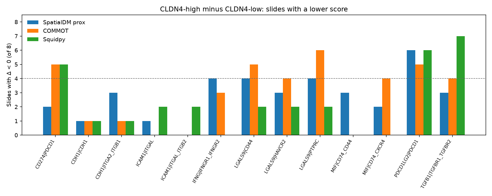
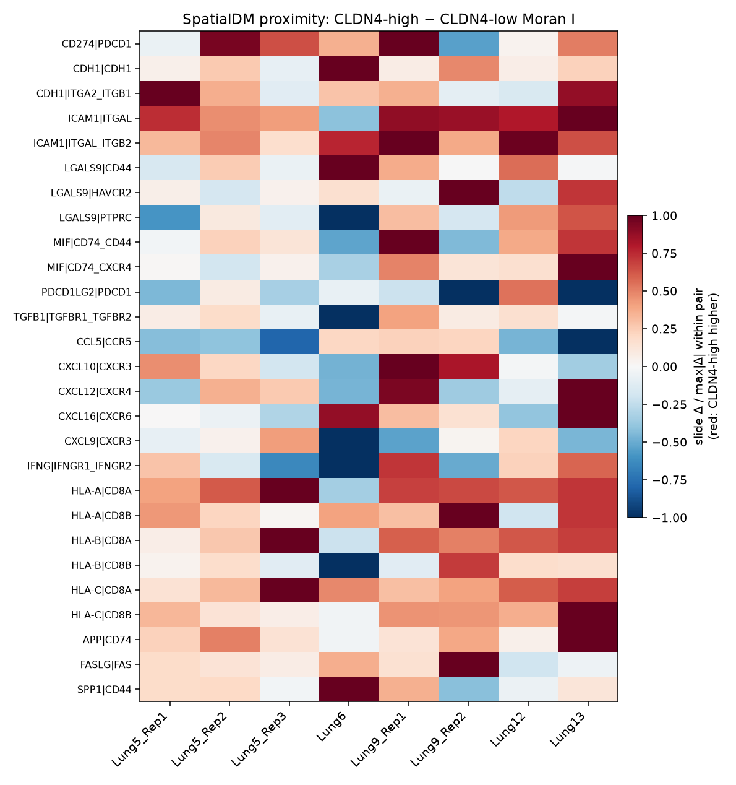
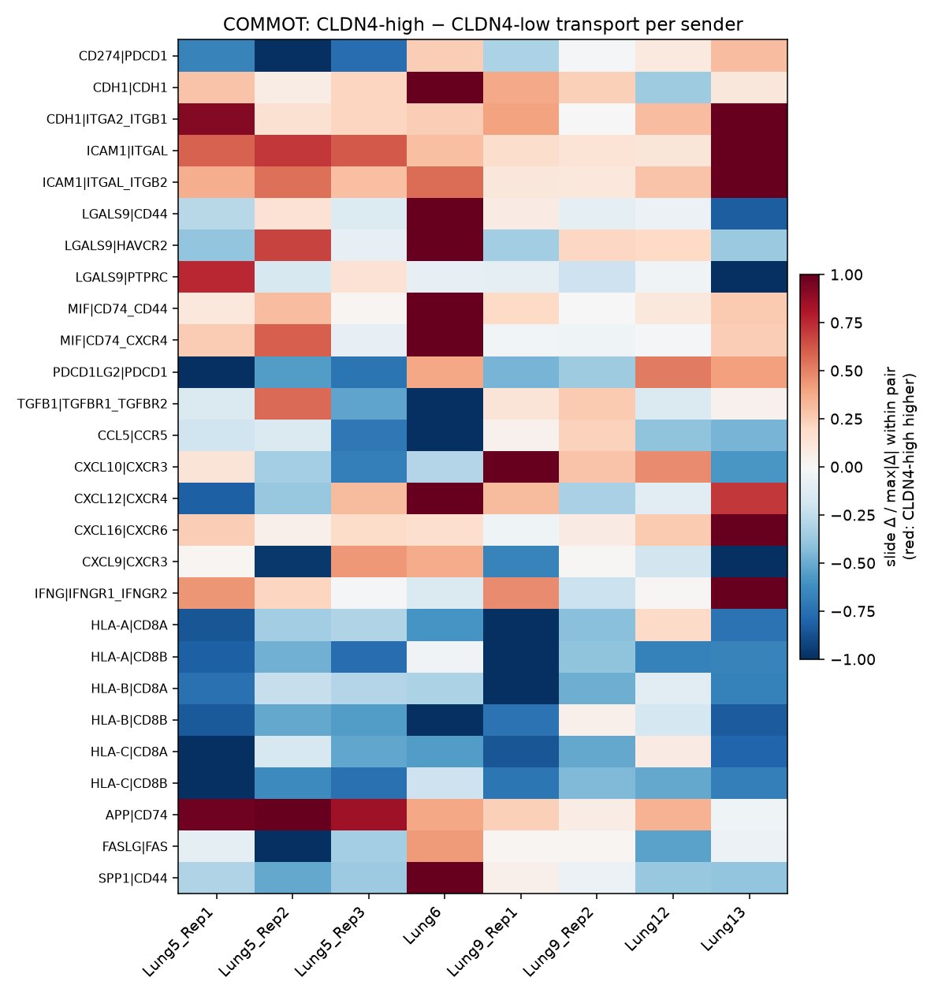

# CosMx NSCLC — spatial ligand–receptor CCC, CLDN4-high vs CLDN4-low niches vs CD8

CLDN4-only. Official CosMx SMI 960-plex NSCLC (He et al. 2022; NanoString public S3; the same 8 slides / 5 tissues as figshare 25976224). No private 8-KL. No TACSTD2 gate. No ICI labels.

This file does **not** replace the locked contact odds ratio or the Ripley g(r) result. It asks a different question: among CellChat ligand–receptor pairs that are actually on the 960-plex, is spatial coupling to CD8 different for CLDN4-high tumor than for CLDN4-low tumor?

## Definitions

| Item | Choice |
|---|---|
| QC | Drop `cell_ID==0`; ≥20 counts and ≥5 genes on the 960-plex |
| Tumor | RNA epithelial marker-score argmax |
| CD8 | `CD8A\|CD8B > 0` and `CD3D\|CD3E\|CD3G > 0` and not epithelial |
| CLDN4 split | Per-FOV rank tertiles among tumor cells (Q3 vs Q1) |
| Pixel size | 0.18 µm |
| Proximity gate | Centroid distance ≤ 40 µm, within FOV |
| Usable FOV | ≥10 CLDN4-high tumor, ≥10 CLDN4-low tumor, ≥5 CD8 |
| Expression | log1p, median-library normalized |
| Tools | squidpy 1.6.5 `gr.ligrec`; SpatialDM 0.3.1 global z-score; COMMOT 0.0.3 collective OT |

**F11R, NECTIN2, PVR, SIRPA, CD226 are not on this panel.** No score is reported for them. TIGIT is on the panel, but PVR, NECTIN2, and CD226 are not, so the TIGIT axis is not scored.

HLA-A/B/C → CD8A/CD8B is a **proximity control**, not an independent checkpoint result: CD8A/CD8B are part of the CD8 gate, so the receptor is nearly constant on CD8 cells and the spatial score mostly tracks whether tumor cells sit near CD8 cells.

### What each tool is allowed to mean

- **SpatialDM** (primary spatial test). Single-cell RBF, `l=30` µm, cutoff 0.15, up to 80 neighbors for secreted pairs and 10 nearest neighbors for contact pairs. Ligand expression is zeroed outside the sender class and receptor expression outside the receiver class. Weights are kept only on sender→receiver edges. Two cell sets: **geometry** (all cells of the two classes in the FOV) and **proximity** (only cells within 40 µm of the partner class). The slide endpoint is the mean over FOVs of I(high) − I(low).
- **COMMOT**. Collective optimal transport on proximity-conditioned cells (cap 140/140/120), `dis_thr=50` µm, heteromeric subunits combined by per-cell minimum, `cot_nitermax=1000`. Endpoint: transport mass into the receiver class divided by the number of senders. A supply-normalized version (mass / ligand sum) is secondary.
- **Squidpy `gr.ligrec`**. CellPhoneDB permutation (1,000 label shuffles, seed 20260921) on the 40 µm interface, clusters `tumor_hi`, `tumor_lo`, `cd8`. Heteromeric genes are pre-collapsed with a per-cell minimum so the tool does not replace a complex by a single globally low subunit. The score is the average of the sender-cluster ligand mean and the receiver-cluster receptor mean. With one shared CD8 receiver, high-vs-low **cancels the receptor** and equals half the ligand-mean difference, so pairs that share a ligand share one squidpy delta. It is a niche-restricted abundance test, not a distance-weighted transport score. The tool p-value is a cell-level permutation and is not the primary claim.

Primary inference is a Wilcoxon signed-rank test on the **8 slide-level deltas** (high − low). Negative means CLDN4-high scores lower than CLDN4-low. Patient signs collapse Lung5 and Lung9 technical replicates. BH q-values are within family.

## Inventory

- QC cells: 766334
- Usable FOVs / slides: 225 / 8
- Pairs on panel and in the CellChat human table shipped with COMMOT: 27 / 27

## Result

Barrier pairs with SpatialDM proximity ΔI lower on at least 6 slides: **1/12**. Higher on at least 6 slides: **5/12**.
Barrier pairs with COMMOT per-sender transport lower on at least 6 slides: **1/12**. Higher on at least 6 slides: **5/12**.

### Reading

CLDN4-high tumor is not a ligand–receptor desert next to CD8, and the galectin-9–TIM-3 and PD-L1–PD-1 pairs are not the pairs that move. Where a COMMOT per-sender increase survives BH within the barrier family, dividing that mass by ligand supply removes it. The increase tracks extra ligand on the CLDN4-high tumor cells that already have a CD8 neighbor, which is the same kind of result as the earlier contact-level CDH1 abundance contrast, not a higher delivery fraction and not evidence that CD8 cells next to CLDN4-high tumor are transcriptionally shut down.

**CDH1 abundance, not homophilic transport.** On tumor cells within 40 µm of CD8, CLDN4-high minus CLDN4-low CDH1 is 7/8 slides Δ>0 (median +0.100, Wilcoxon p=0.016; 5/5 tissues). Squidpy, which reduces to that ligand contrast, agrees (7/8 slides Δ>0 (median +0.050, Wilcoxon p=0.016, BH q=0.047; 5/5 tissues)). COMMOT CDH1–CDH1 transport per sender does not (7/8 slides Δ>0 (median +7.28e-05, Wilcoxon p=0.109, BH q=0.263; 4/5 tissues)). COMMOT CDH1–ITGA2/ITGB1 per sender does (7/8 slides Δ>0 (median +5.83e-04, Wilcoxon p=0.016, BH q=0.047; 5/5 tissues)), and the supply-normalized version does not (4/8 slides Δ>0 (median +2.98e-04, Wilcoxon p=0.945; 3/5 tissues)).

**ICAM1–LFA-1 and MIF–CD74/CD44 are the COMMOT hits inside the barrier family.** ICAM1–ITGAL/ITGB2 per sender 8/8 slides Δ>0 (median +0.001, Wilcoxon p=0.008, BH q=0.031; 5/5 tissues); ICAM1–ITGAL 8/8 slides Δ>0 (median +0.004, Wilcoxon p=0.008, BH q=0.031; 5/5 tissues); MIF–CD74/CD44 8/8 slides Δ>0 (median +0.001, Wilcoxon p=0.008, BH q=0.031; 5/5 tissues). BH q-values are within the 12 barrier pairs. SpatialDM proximity is in the same direction for ICAM1 (ITGAL/ITGB2 8/8 slides Δ>0 (median +0.040, Wilcoxon p=0.008, BH q=0.094; 5/5 tissues); ITGAL 7/8 slides Δ>0 (median +0.065, Wilcoxon p=0.016, BH q=0.094; 4/5 tissues)) but those q-values stay above 0.05. MIF SpatialDM proximity does not (5/8 slides Δ>0 (median +0.021, Wilcoxon p=0.461, BH q=0.553; 4/5 tissues)). MIF ligand abundance is higher (8/8 slides Δ>0 (median +0.121, Wilcoxon p=0.008; 5/5 tissues)). ICAM1 abundance is only a trend (6/8 slides Δ>0 (median +0.031, Wilcoxon p=0.078; 4/5 tissues)). Supply-normalized COMMOT is not significant for these pairs (ICAM1–ITGAL/ITGB2 6/8 slides Δ>0 (median +0.006, Wilcoxon p=0.195; 5/5 tissues); MIF–CD74/CD44 3/8 slides Δ>0 (median −0.005, Wilcoxon p=0.195; 2/5 tissues)).

**Checkpoint pairs do not mark CLDN4-high contacts.** LGALS9–HAVCR2 SpatialDM proximity 5/8 slides Δ>0 (median +0.004, Wilcoxon p=0.641, BH q=0.699; 3/5 tissues); COMMOT 4/8 slides Δ>0 (median +8.41e-05, Wilcoxon p=0.844, BH q=0.844; 3/5 tissues); LGALS9 abundance 5/8 slides Δ>0 (median +0.009, Wilcoxon p=0.195; 3/5 tissues). CD274–PDCD1 SpatialDM 6/8 slides Δ>0 (median +0.036, Wilcoxon p=0.148, BH q=0.356; 5/5 tissues); CD274 abundance 3/8 slides Δ>0 (median −0.002, Wilcoxon p=0.312; 3/5 tissues). PDCD1LG2–PDCD1 is the barrier pair that leans lower (SpatialDM 2/8 slides Δ>0 (median −0.017, Wilcoxon p=0.195, BH q=0.391; 1/5 tissues); abundance 1/8 slides Δ>0 (median −0.001, Wilcoxon p=0.195; 1/5 tissues)) and is not significant. TGFB1 abundance 2/8 slides Δ>0 (median −0.008, Wilcoxon p=0.148; 2/5 tissues); COMMOT 4/8 slides Δ>0 (median −4.05e-05, Wilcoxon p=0.742, BH q=0.810; 2/5 tissues).

**CD8 IFNG next to CLDN4-high tumor is flat.** IFNG on CD8 within 40 µm of CLDN4-high tumor minus CD8 within 40 µm of CLDN4-low tumor: 5/8 slides Δ>0 (median +0.001, Wilcoxon p=0.945; 3/5 tissues). SpatialDM 4/8 slides Δ>0 (median +0.003, Wilcoxon p=0.945, BH q=0.945; 3/5 tissues). COMMOT 5/8 slides Δ>0 (median +3.07e-04, Wilcoxon p=0.312, BH q=0.312; 4/5 tissues).

**HLA–CD8 is a proximity control, and the two spatial tools disagree.** SpatialDM proximity HLA-A–CD8A is higher around CLDN4-high tumor (7/8 slides Δ>0 (median +0.075, Wilcoxon p=0.016, BH q=0.028; 4/5 tissues)). COMMOT transport per sender is lower (1/8 slides Δ>0 (median −0.005, Wilcoxon p=0.016, BH q=0.016; 1/5 tissues)), as is the supply-normalized mass (0/8 slides Δ>0 (median −0.010, Wilcoxon p=0.008; 0/5 tissues)). CD8A/CD8B are part of the CD8 definition, so this is not a checkpoint result. Lower COMMOT mass is what a distance-limited transporter does when fewer CD8 cells sit in range. Higher Moran I is a correlation among the cells that were kept, not a delivered-mass estimate.

**Chemokines are not one sign.** Tumor CXCL9 is lower (0/8 slides Δ>0 (median −0.008, Wilcoxon p=0.008; 0/5 tissues)) without a significant CXCL9–CXCR3 COMMOT or SpatialDM contrast (4/8 slides Δ>0 (median −1.66e-04, Wilcoxon p=0.461, BH q=0.768; 1/5 tissues); 4/8 slides Δ>0 (median −0.002, Wilcoxon p=0.461, BH q=0.684; 2/5 tissues)). Tumor CXCL16 is higher (8/8 slides Δ>0 (median +0.044, Wilcoxon p=0.008; 5/5 tissues)); CXCL16–CXCR6 COMMOT per sender 7/8 slides Δ>0 (median +0.001, Wilcoxon p=0.016, BH q=0.078; 5/5 tissues) and does not survive BH inside the chemokine family (q above). Supply normalization removes it (5/8 slides Δ>0 (median +0.002, Wilcoxon p=1.000; 3/5 tissues)).

A high-side increase that remains after supply normalization would be the spatial-CCC version of more delivery, not just more ligand. That is not what the barrier pairs do. A high-side decrease on the geometry run, especially for HLA–CD8, would have restated exclusion as missing coupling. SpatialDM does not show that decrease. The proximity run asks about coupling given a neighbor within 40 µm.








### Barrier family — SpatialDM proximity (I high − I low)

CD274|PDCD1 6/8 slides Δ>0, median Δ=+0.036, Wilcoxon p=0.148, BH q=0.356, tissues 5/5 Δ>0; CDH1|CDH1 7/8 slides Δ>0, median Δ=+0.017, Wilcoxon p=0.055, BH q=0.219, tissues 5/5 Δ>0; CDH1|ITGA2_ITGB1 5/8 slides Δ>0, median Δ=+0.032, Wilcoxon p=0.109, BH q=0.328, tissues 4/5 Δ>0; ICAM1|ITGAL 7/8 slides Δ>0, median Δ=+0.065, Wilcoxon p=0.016, BH q=0.094, tissues 4/5 Δ>0; ICAM1|ITGAL_ITGB2 8/8 slides Δ>0, median Δ=+0.040, Wilcoxon p=0.008, BH q=0.094, tissues 5/5 Δ>0; LGALS9|CD44 4/8 slides Δ>0, median Δ=+0.020, Wilcoxon p=0.312, BH q=0.510, tissues 4/5 Δ>0; LGALS9|HAVCR2 5/8 slides Δ>0, median Δ=+0.004, Wilcoxon p=0.641, BH q=0.699, tissues 3/5 Δ>0; LGALS9|PTPRC 4/8 slides Δ>0, median Δ=−3.87e-04, Wilcoxon p=0.945, BH q=0.945, tissues 3/5 Δ>0; MIF|CD74_CD44 5/8 slides Δ>0, median Δ=+0.021, Wilcoxon p=0.461, BH q=0.553, tissues 4/5 Δ>0; MIF|CD74_CXCR4 6/8 slides Δ>0, median Δ=+0.010, Wilcoxon p=0.383, BH q=0.510, tissues 3/5 Δ>0; PDCD1LG2|PDCD1 2/8 slides Δ>0, median Δ=−0.017, Wilcoxon p=0.195, BH q=0.391, tissues 1/5 Δ>0; TGFB1|TGFBR1_TGFBR2 5/8 slides Δ>0, median Δ=+0.013, Wilcoxon p=0.383, BH q=0.510, tissues 3/5 Δ>0

### Barrier family — SpatialDM geometry

CD274|PDCD1 6/8 slides Δ>0, median Δ=+0.076, Wilcoxon p=0.250, BH q=0.429, tissues 4/5 Δ>0; CDH1|CDH1 6/8 slides Δ>0, median Δ=+0.012, Wilcoxon p=0.109, BH q=0.391, tissues 4/5 Δ>0; CDH1|ITGA2_ITGB1 5/8 slides Δ>0, median Δ=+0.022, Wilcoxon p=0.148, BH q=0.391, tissues 3/5 Δ>0; ICAM1|ITGAL 7/8 slides Δ>0, median Δ=+0.101, Wilcoxon p=0.195, BH q=0.391, tissues 4/5 Δ>0; ICAM1|ITGAL_ITGB2 8/8 slides Δ>0, median Δ=+0.079, Wilcoxon p=0.008, BH q=0.094, tissues 5/5 Δ>0; LGALS9|CD44 5/8 slides Δ>0, median Δ=+0.026, Wilcoxon p=0.383, BH q=0.574, tissues 4/5 Δ>0; LGALS9|HAVCR2 4/8 slides Δ>0, median Δ=+8.56e-04, Wilcoxon p=0.641, BH q=0.844, tissues 3/5 Δ>0; LGALS9|PTPRC 2/8 slides Δ>0, median Δ=−0.022, Wilcoxon p=0.195, BH q=0.391, tissues 2/5 Δ>0; MIF|CD74_CD44 6/8 slides Δ>0, median Δ=+0.046, Wilcoxon p=0.742, BH q=0.844, tissues 3/5 Δ>0; MIF|CD74_CXCR4 7/8 slides Δ>0, median Δ=+0.037, Wilcoxon p=0.195, BH q=0.391, tissues 4/5 Δ>0; PDCD1LG2|PDCD1 4/8 slides Δ>0, median Δ=−0.009, Wilcoxon p=0.844, BH q=0.844, tissues 2/5 Δ>0; TGFB1|TGFBR1_TGFBR2 5/8 slides Δ>0, median Δ=+0.015, Wilcoxon p=0.844, BH q=0.844, tissues 4/5 Δ>0

### Barrier family — COMMOT transport per sender

CD274|PDCD1 3/8 slides Δ>0, median Δ=−3.44e-04, Wilcoxon p=0.250, BH q=0.469, tissues 3/5 Δ>0; CDH1|CDH1 7/8 slides Δ>0, median Δ=+7.28e-05, Wilcoxon p=0.109, BH q=0.263, tissues 4/5 Δ>0; CDH1|ITGA2_ITGB1 7/8 slides Δ>0, median Δ=+5.83e-04, Wilcoxon p=0.016, BH q=0.047, tissues 5/5 Δ>0; ICAM1|ITGAL 8/8 slides Δ>0, median Δ=+0.004, Wilcoxon p=0.008, BH q=0.031, tissues 5/5 Δ>0; ICAM1|ITGAL_ITGB2 8/8 slides Δ>0, median Δ=+0.001, Wilcoxon p=0.008, BH q=0.031, tissues 5/5 Δ>0; LGALS9|CD44 3/8 slides Δ>0, median Δ=−2.89e-04, Wilcoxon p=0.742, BH q=0.810, tissues 1/5 Δ>0; LGALS9|HAVCR2 4/8 slides Δ>0, median Δ=+8.41e-05, Wilcoxon p=0.844, BH q=0.844, tissues 3/5 Δ>0; LGALS9|PTPRC 2/8 slides Δ>0, median Δ=−3.54e-04, Wilcoxon p=0.383, BH q=0.510, tissues 1/5 Δ>0; MIF|CD74_CD44 8/8 slides Δ>0, median Δ=+0.001, Wilcoxon p=0.008, BH q=0.031, tissues 5/5 Δ>0; MIF|CD74_CXCR4 4/8 slides Δ>0, median Δ=+0.002, Wilcoxon p=0.312, BH q=0.469, tissues 3/5 Δ>0; PDCD1LG2|PDCD1 3/8 slides Δ>0, median Δ=−8.47e-04, Wilcoxon p=0.312, BH q=0.469, tissues 3/5 Δ>0; TGFB1|TGFBR1_TGFBR2 4/8 slides Δ>0, median Δ=−4.05e-05, Wilcoxon p=0.742, BH q=0.810, tissues 2/5 Δ>0

### Barrier family — squidpy interface mean (ligand-driven if the CD8 receiver is shared)

CD274|PDCD1 3/8 slides Δ>0, median Δ=−0.003, Wilcoxon p=0.250, BH q=0.250, tissues 3/5 Δ>0; CDH1|CDH1 7/8 slides Δ>0, median Δ=+0.050, Wilcoxon p=0.016, BH q=0.047, tissues 5/5 Δ>0; CDH1|ITGA2_ITGB1 7/8 slides Δ>0, median Δ=+0.050, Wilcoxon p=0.016, BH q=0.047, tissues 5/5 Δ>0; ICAM1|ITGAL 6/8 slides Δ>0, median Δ=+0.015, Wilcoxon p=0.039, BH q=0.067, tissues 4/5 Δ>0; ICAM1|ITGAL_ITGB2 6/8 slides Δ>0, median Δ=+0.015, Wilcoxon p=0.039, BH q=0.067, tissues 4/5 Δ>0; LGALS9|CD44 6/8 slides Δ>0, median Δ=+0.005, Wilcoxon p=0.109, BH q=0.119, tissues 3/5 Δ>0; LGALS9|HAVCR2 6/8 slides Δ>0, median Δ=+0.005, Wilcoxon p=0.109, BH q=0.119, tissues 3/5 Δ>0; LGALS9|PTPRC 6/8 slides Δ>0, median Δ=+0.005, Wilcoxon p=0.109, BH q=0.119, tissues 3/5 Δ>0; MIF|CD74_CD44 8/8 slides Δ>0, median Δ=+0.059, Wilcoxon p=0.008, BH q=0.047, tissues 5/5 Δ>0; MIF|CD74_CXCR4 8/8 slides Δ>0, median Δ=+0.059, Wilcoxon p=0.008, BH q=0.047, tissues 5/5 Δ>0; PDCD1LG2|PDCD1 2/8 slides Δ>0, median Δ=−7.11e-04, Wilcoxon p=0.109, BH q=0.119, tissues 2/5 Δ>0; TGFB1|TGFBR1_TGFBR2 1/8 slides Δ>0, median Δ=−0.006, Wilcoxon p=0.039, BH q=0.067, tissues 1/5 Δ>0

### Barrier family — sender expression on the 40 µm interface (not a CCC score)

CD274|PDCD1 3/8 slides Δ>0, median Δ=−0.002, Wilcoxon p=0.312, tissues 3/5 Δ>0; CDH1|CDH1 7/8 slides Δ>0, median Δ=+0.100, Wilcoxon p=0.016, tissues 5/5 Δ>0; CDH1|ITGA2_ITGB1 7/8 slides Δ>0, median Δ=+0.100, Wilcoxon p=0.016, tissues 5/5 Δ>0; ICAM1|ITGAL 6/8 slides Δ>0, median Δ=+0.031, Wilcoxon p=0.078, tissues 4/5 Δ>0; ICAM1|ITGAL_ITGB2 6/8 slides Δ>0, median Δ=+0.031, Wilcoxon p=0.078, tissues 4/5 Δ>0; LGALS9|CD44 5/8 slides Δ>0, median Δ=+0.009, Wilcoxon p=0.195, tissues 3/5 Δ>0; LGALS9|HAVCR2 5/8 slides Δ>0, median Δ=+0.009, Wilcoxon p=0.195, tissues 3/5 Δ>0; LGALS9|PTPRC 5/8 slides Δ>0, median Δ=+0.009, Wilcoxon p=0.195, tissues 3/5 Δ>0; MIF|CD74_CD44 8/8 slides Δ>0, median Δ=+0.121, Wilcoxon p=0.008, tissues 5/5 Δ>0; MIF|CD74_CXCR4 8/8 slides Δ>0, median Δ=+0.121, Wilcoxon p=0.008, tissues 5/5 Δ>0; PDCD1LG2|PDCD1 1/8 slides Δ>0, median Δ=−0.001, Wilcoxon p=0.195, tissues 1/5 Δ>0; TGFB1|TGFBR1_TGFBR2 2/8 slides Δ>0, median Δ=−0.008, Wilcoxon p=0.148, tissues 2/5 Δ>0

### MHC–CD8 proximity control

Geometry: HLA-A|CD8A 7/8 slides Δ>0, median Δ=+0.103, Wilcoxon p=0.055, BH q=0.328, tissues 4/5 Δ>0; HLA-A|CD8B 5/8 slides Δ>0, median Δ=+0.014, Wilcoxon p=0.641, BH q=0.891, tissues 2/5 Δ>0; HLA-B|CD8A 6/8 slides Δ>0, median Δ=+0.049, Wilcoxon p=0.547, BH q=0.891, tissues 3/5 Δ>0; HLA-B|CD8B 5/8 slides Δ>0, median Δ=+0.020, Wilcoxon p=0.945, BH q=0.945, tissues 3/5 Δ>0; HLA-C|CD8A 6/8 slides Δ>0, median Δ=+0.092, Wilcoxon p=0.461, BH q=0.891, tissues 3/5 Δ>0; HLA-C|CD8B 5/8 slides Δ>0, median Δ=+0.061, Wilcoxon p=0.742, BH q=0.891, tissues 3/5 Δ>0

Proximity: HLA-A|CD8A 7/8 slides Δ>0, median Δ=+0.075, Wilcoxon p=0.016, BH q=0.028, tissues 4/5 Δ>0; HLA-A|CD8B 7/8 slides Δ>0, median Δ=+0.038, Wilcoxon p=0.023, BH q=0.028, tissues 4/5 Δ>0; HLA-B|CD8A 7/8 slides Δ>0, median Δ=+0.071, Wilcoxon p=0.023, BH q=0.028, tissues 4/5 Δ>0; HLA-B|CD8B 5/8 slides Δ>0, median Δ=+0.013, Wilcoxon p=0.547, BH q=0.547, tissues 4/5 Δ>0; HLA-C|CD8A 8/8 slides Δ>0, median Δ=+0.073, Wilcoxon p=0.008, BH q=0.028, tissues 5/5 Δ>0; HLA-C|CD8B 7/8 slides Δ>0, median Δ=+0.041, Wilcoxon p=0.016, BH q=0.028, tissues 4/5 Δ>0

### Chemokine, other, and CD8→tumor IFNG

Chemokine, SpatialDM proximity: CCL5|CCR5 3/8 slides Δ>0, median Δ=−0.024, Wilcoxon p=0.109, BH q=0.547, tissues 2/5 Δ>0; CXCL10|CXCR3 4/8 slides Δ>0, median Δ=+0.008, Wilcoxon p=0.547, BH q=0.684, tissues 2/5 Δ>0; CXCL12|CXCR4 4/8 slides Δ>0, median Δ=+0.008, Wilcoxon p=0.844, BH q=0.844, tissues 3/5 Δ>0; CXCL16|CXCR6 5/8 slides Δ>0, median Δ=+0.006, Wilcoxon p=0.461, BH q=0.684, tissues 3/5 Δ>0; CXCL9|CXCR3 4/8 slides Δ>0, median Δ=−0.002, Wilcoxon p=0.461, BH q=0.684, tissues 2/5 Δ>0

Chemokine, COMMOT: CCL5|CCR5 2/8 slides Δ>0, median Δ=−9.09e-04, Wilcoxon p=0.078, BH q=0.195, tissues 1/5 Δ>0; CXCL10|CXCR3 4/8 slides Δ>0, median Δ=−1.99e-04, Wilcoxon p=0.844, BH q=0.945, tissues 2/5 Δ>0; CXCL12|CXCR4 4/8 slides Δ>0, median Δ=+4.72e-04, Wilcoxon p=0.945, BH q=0.945, tissues 2/5 Δ>0; CXCL16|CXCR6 7/8 slides Δ>0, median Δ=+0.001, Wilcoxon p=0.016, BH q=0.078, tissues 5/5 Δ>0; CXCL9|CXCR3 4/8 slides Δ>0, median Δ=−1.66e-04, Wilcoxon p=0.461, BH q=0.768, tissues 1/5 Δ>0

Other, SpatialDM proximity: APP|CD74 7/8 slides Δ>0, median Δ=+0.032, Wilcoxon p=0.016, BH q=0.047, tissues 4/5 Δ>0; FASLG|FAS 6/8 slides Δ>0, median Δ=+0.018, Wilcoxon p=0.148, BH q=0.223, tissues 3/5 Δ>0; SPP1|CD44 5/8 slides Δ>0, median Δ=+0.025, Wilcoxon p=0.312, BH q=0.312, tissues 3/5 Δ>0

CD8→tumor IFNG, SpatialDM proximity: IFNG|IFNGR1_IFNGR2 4/8 slides Δ>0, median Δ=+0.003, Wilcoxon p=0.945, BH q=0.945, tissues 3/5 Δ>0

CD8→tumor IFNG, COMMOT: IFNG|IFNGR1_IFNGR2 5/8 slides Δ>0, median Δ=+3.07e-04, Wilcoxon p=0.312, BH q=0.312, tissues 4/5 Δ>0

CD8→tumor IFNG, sender expression (IFNG on CD8 near CLDN4-high tumor minus CD8 near CLDN4-low tumor): IFNG|IFNGR1_IFNGR2 5/8 slides Δ>0, median Δ=+0.001, Wilcoxon p=0.945, tissues 3/5 Δ>0

### Distance sanity check

Spearman correlation, across FOVs, of (mean nearest-CD8 distance, CLDN4-high minus CLDN4-low) versus the mean SpatialDM geometry ΔI. A negative correlation means FOVs where CLDN4-high tumor sits farther from CD8 also show less geometry-inclusive spatial coupling.

- mhc_control: ρ=0.206 , p=0.002 , n FOV=225
- barrier: ρ=0.004 , p=0.958 , n FOV=225

## What is not claimed

- No CellChat `computeCommunProb` and no causal barrier.
- No F11R result and no NECTIN2–TIGIT result. F11R, NECTIN2, PVR, and CD226 are absent. TIGIT is on the panel without those partners.
- Squidpy high-vs-low is not a distance-weighted communication probability.
- HLA–CD8 scores are not evidence of a CD8-receptor checkpoint. CD8A/CD8B define the receiver class.
- Slide Wilcoxon n=8. Patient signs are 5 tissues, with Lung5 and Lung9 replicates averaged.
- COMMOT was capped (140 high / 140 low / 120 CD8 proximal cells per FOV) and stopped at 1,000 OT iterations.
- No private 8-KL and no ICI response labels.

## Reproduce

```bash
python3 -m venv .venv && . .venv/bin/activate
pip install -r scripts/requirements-cosmx-spatial-ccc.txt
bash scripts/download_cosmx_nsclc.sh
python3 scripts/cosmx_cldn4_spatial_ccc.py
```

Tables: `results/cosmx_cldn4_spatial_ccc/`. Machine summary: `stats.json`.

## Effect-size sweep

`SWEEP.md` is a separate grid (CLDN4 split, radius, FOV filter). It does not replace the contrasts above. The large absolute effects in that grid are neighborhood percentages and ligand folds, not raw COMMOT mass. Full table: `results/cosmx_cldn4_spatial_ccc/sweep/sweep_table.tsv`.
