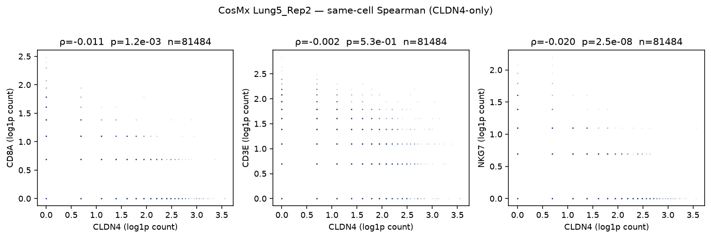
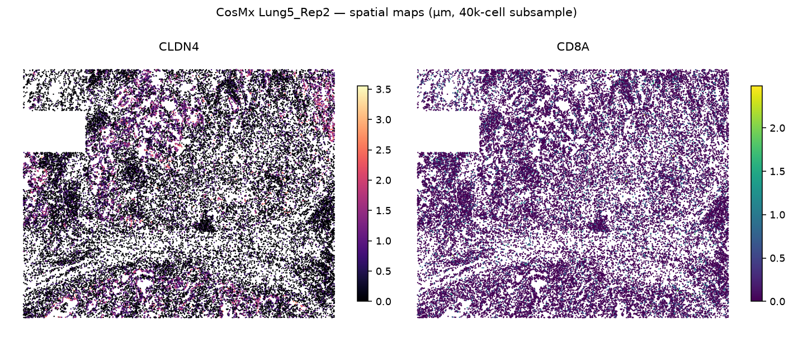
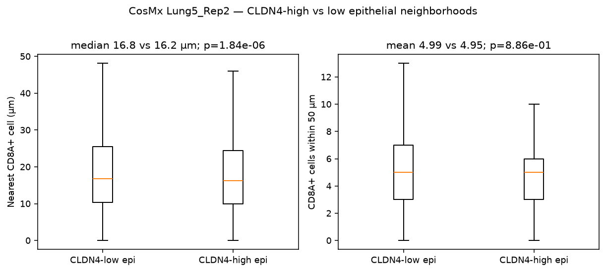
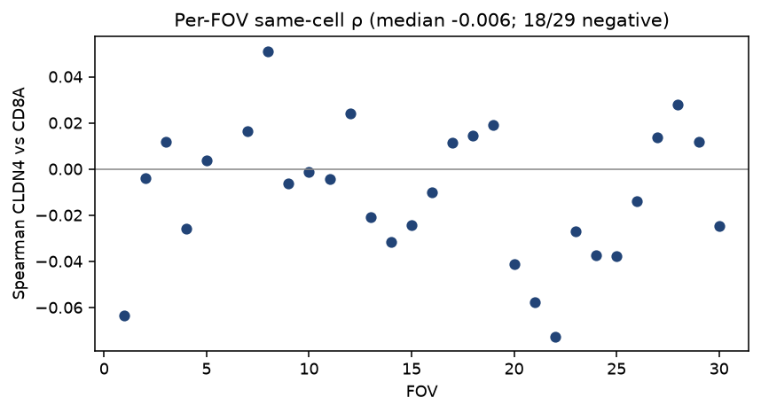
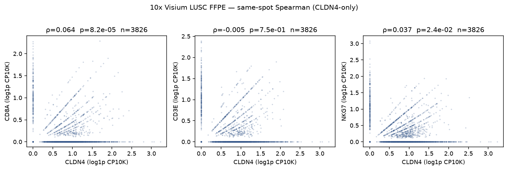
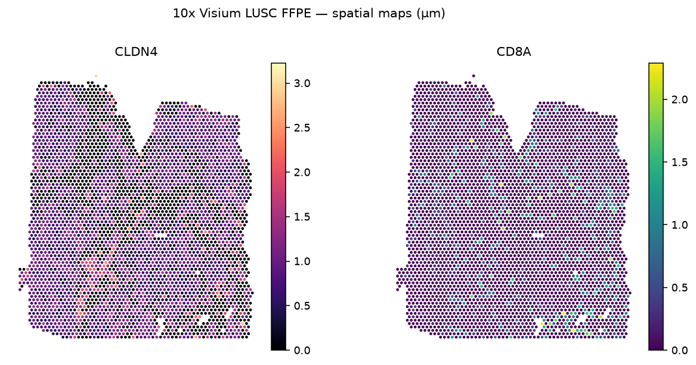
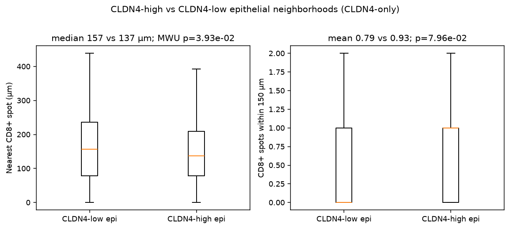

# Public spatial inventory for CLDN4 immune-exclusion (CLDN4-only)

Hunt of **public** lung / NSCLC / LUAD spatial series (Visium, Visium HD, CosMx, Xenium, Stereo-seq, GeoMx, IMC, CODEX, MIBI, mIHC) where **CLDN4 (or CLDN4 protein)** and a **CD8 / T / NK marker** both exist. Then one large accessible cell-level set and one vendor Visium slide were downloaded and scored **CLDN4-only** (no TACSTD2∩CLDN4 intersection). Private 8-KL mouse scRNA was not used. EGA/dbGaP series without access were skipped. Series whose deposited matrix/panel lacks CLDN4 were skipped for analysis.

This slice is an **additive public catalog plus two computed spatial readouts**. It does not evaluate a binary claim.

Machine-readable tables: `results/tables/inventory_eligible.tsv`, `results/tables/inventory_excluded.tsv`.

---

## 1. Eligible accessions (CLDN4 + CD8/T/NK)

Whole-transcriptome Visium / Visium HD / GeoMx WTA / Stereo-seq deposits are listed as CLDN4-present and CD8A/CD3/NKG7-present by platform. Targeted CosMx 960-plex was **verified on disk** (Lung5_Rep2 header). Targeted Xenium/MERFISH/CTA/protein panels are marked verify-or-skip.

| Accession | Platform | n samples / patients | CLDN4 | CD8A / CD8 / CD3 / NKG7 | Coords | Download | License |
|---|---|---|---|---|---|---|---|
| **NanoString CosMx NSCLC FFPE (He 2022)** | CosMx SMI 960-plex RNA + PanCK/CD45/CD3 protein | 8 sections / 5 NSCLC tissues | **yes** (RNA; header-verified) | **CD8A, CD3D, CD3E, NKG7** | **yes** (global px) | [S3 `SMI-Compressed/`](https://nanostring-public-share.s3.us-west-2.amazonaws.com/SMI-Compressed/) · [dataset page](https://brukerspatialbiology.com/products/cosmx-spatial-molecular-imager/ffpe-dataset/nsclc-ffpe-dataset/) | NanoString/Bruker showcase (research; Data License Agreement) |
| **10x CytAssist FFPE Human Lung SCC** | Visium CytAssist WTA v2 | 1 section / 1 LUSC | **yes** | **CD8A, CD3D, CD3E, NKG7** (CD8B absent) | **yes** | [10x dataset](https://www.10xgenomics.com/datasets/human-lung-cancer-ffpe-2-standard) | **CC BY 4.0** |
| 10x Visium HD LUAD FFPE (post-Xenium) | Visium HD WTA | 4 areas / 1 LUAD | yes (WTA) | CD8A / CD3 / NKG7 (WTA) | yes | [10x](https://www.10xgenomics.com/datasets/visium-hd-cytassist-gene-expression-human-lung-cancer-post-xenium-expt) | CC BY 4.0 |
| 10x Visium HD LUAD fixed-frozen | Visium HD WTA | 1 / 1 LUAD | yes | CD8A / CD3 / NKG7 | yes | [10x](https://www.10xgenomics.com/datasets/visium-hd-cytassist-gene-expression-human-lung-cancer-fixed-frozen) | CC BY 4.0 |
| 10x Xenium v1 LUAD (post-Xenium note) | Xenium Human Lung (~289 + add-on) | 1 / 1 LUAD | **verify `gene_panel.json`** | CD8A typically on lung/IO | yes | [10x](https://www.10xgenomics.com/datasets/xenium-human-lung-cancer-post-xenium-technote) | CC BY 4.0 |
| 10x Xenium Prime 5K LUAD | Xenium Prime 5K | 1 / 1 LUAD | **verify JSON** (one GEO 5K deposit lacked CLDN4) | CD8A / CD3E / NKG7 on 5K | yes | same 10x note | CC BY 4.0 |
| 10x Xenium IO + custom (lung cancer) | Xenium IO panel ± custom | 1 / 1 | only if CLDN4 is in the custom add-on | CD8A / CD3 / NKG7 (IO) | yes | [10x](https://www.10xgenomics.com/datasets/ffpe-human-lung-cancer-data-with-human-immuno-oncology-profiling-panel-and-custom-add-on-1-standard) | CC BY 4.0 |
| **E-MTAB-13530** | Visium FF WTA | 40 sections (20 tumor / 16 non-involved / 4 donor) / 8 NSCLC + 2 donors | yes | CD8A, CD3E, NKG7 | yes | [BioStudies](https://www.ebi.ac.uk/biostudies/arrayexpress/studies/E-MTAB-13530) | public BioStudies; cite De Zuani *Nat Commun* 2024 |
| **GSE189487** | Visium WTA | 6 sections / AIS→IAC LUAD | yes | CD8A, CD3E, NKG7 | yes | [GEO](https://www.ncbi.nlm.nih.gov/geo/query/acc.cgi?acc=GSE189487) | GEO public |
| **GSE200916** | Visium WTA | 12 sections / 3 MPLC pts (2 LUAD + 1 LUSC) | yes | CD8A, CD3E, NKG7 | yes | [GEO](https://www.ncbi.nlm.nih.gov/geo/query/acc.cgi?acc=GSE200916) | GEO public |
| GSE268049 | Visium | 15 lung-tumor sections | yes if WTA | CD8A if WTA | if positions deposited | [GEO](https://www.ncbi.nlm.nih.gov/geo/query/acc.cgi?acc=GSE268049) | GEO public |
| GSE246011 | Visium | 7 (incl. LUAD-14C) | yes | CD8A | **LUAD member lacks tissue_positions** | [GEO](https://www.ncbi.nlm.nih.gov/geo/query/acc.cgi?acc=GSE246011) | GEO public |
| GSE273378 | Visium | 16 stage-I LUAD sections | yes | CD8A, CD3E, NKG7 | yes | [GEO](https://www.ncbi.nlm.nih.gov/geo/query/acc.cgi?acc=GSE273378) | GEO public |
| GSE277206 | Visium CytAssist FFPE | 2 never-smoker early LUAD | yes | CD8A | **H5 only, no spatial folder** | [GEO](https://www.ncbi.nlm.nih.gov/geo/query/acc.cgi?acc=GSE277206) | GEO public |
| GSE288758 | Visium | 2 EGFR NSCLC | yes | CD8A | yes (large slide tars) | [GEO](https://www.ncbi.nlm.nih.gov/geo/query/acc.cgi?acc=GSE288758) | GEO public |
| GSE301973 | Visium | 2 EGFR NSCLC pre-osi | yes | CD8A | yes | [GEO](https://www.ncbi.nlm.nih.gov/geo/query/acc.cgi?acc=GSE301973) | GEO public |
| GSE292299 | Visium | 18 (NSCLC IO spatial biology) | yes | CD8A, CD3E, NKG7 | yes | [GEO](https://www.ncbi.nlm.nih.gov/geo/query/acc.cgi?acc=GSE292299) | GEO public |
| GSE307534 | Visium CytAssist | 56 normal / AAH / AIS / MIA / LUAD | yes | CD8A | yes | [GEO](https://www.ncbi.nlm.nih.gov/geo/query/acc.cgi?acc=GSE307534) | GEO public; RAW ~10 GB |
| GSE300827 | spatial transcriptome | 20 pre-invasive LUAD | yes if WTA | CD8A if WTA | deposit-dependent | [GEO](https://www.ncbi.nlm.nih.gov/geo/query/acc.cgi?acc=GSE300827) | GEO public |
| GSE282617 | spatial + scRNA LUAD progression | 70 AIS/MIA/IAC | yes if WTA spatial member | CD8A if WTA | deposit-dependent | [GEO](https://www.ncbi.nlm.nih.gov/geo/query/acc.cgi?acc=GSE282617) | GEO public |
| GSE287472 | CosMx | 1 LUAD | yes | CD8A, CD3E, NKG7 | yes | [GEO](https://www.ncbi.nlm.nih.gov/geo/query/acc.cgi?acc=GSE287472) | GEO public |
| GSE299786 | CosMx | 4 TMAs (LUAD n=22 cores + meso) | yes | CD8A, CD3E, NKG7 | yes | [GEO](https://www.ncbi.nlm.nih.gov/geo/query/acc.cgi?acc=GSE299786) | GEO public; RAW 2.0 GB |
| GSE300007 | Xenium | 6 (same TMA study) | verify panel | CD8A likely | yes | [GEO](https://www.ncbi.nlm.nih.gov/geo/query/acc.cgi?acc=GSE300007) | GEO public |
| GSE299886 | MERFISH | 3 (same TMA study) | verify panel | verify panel | yes | [GEO](https://www.ncbi.nlm.nih.gov/geo/query/acc.cgi?acc=GSE299886) | GEO public |
| GSE271689 | GeoMx WTA | 586 AOIs / Yale NSCLC ICI | yes | CD8A, NKG7 | AOI (not cell XY) | [GEO](https://www.ncbi.nlm.nih.gov/geo/query/acc.cgi?acc=GSE271689) | GEO public |
| GSE292098 | GeoMx WTA | 315 AOIs / Greek NSCLC ICI | yes | CD8A, NKG7 | AOI | [GEO](https://www.ncbi.nlm.nih.gov/geo/query/acc.cgi?acc=GSE292098) | GEO public |
| GSE221322 | GeoMx WTA | 96 / NSCLC ICI | yes | CD8A, NKG7 | AOI | [GEO](https://www.ncbi.nlm.nih.gov/geo/query/acc.cgi?acc=GSE221322) | GEO public |
| GSE265899 | GeoMx WTA (+ protein) | 95 / PD-L1 tumor vs immune AOIs | yes | CD8A, NKG7 | AOI | [GEO](https://www.ncbi.nlm.nih.gov/geo/query/acc.cgi?acc=GSE265899) | GEO public |
| GSE289483 | GeoMx WTA | 125 / pulmonary pleomorphic ca. | yes | CD8A, CD3, NKG7 | AOI | [GEO](https://www.ncbi.nlm.nih.gov/geo/query/acc.cgi?acc=GSE289483) | GEO public |
| GSE305762 | GeoMx WTA | 52 / LUSC + IPF | likely (WTA) | likely | AOI | [GEO](https://www.ncbi.nlm.nih.gov/geo/query/acc.cgi?acc=GSE305762) | GEO public; **DCC only** |
| GSE309894 | GeoMx WTA | 34 / ALK+ NSCLC | likely (WTA) | likely | AOI | [GEO](https://www.ncbi.nlm.nih.gov/geo/query/acc.cgi?acc=GSE309894) | GEO public; **DCC only** |
| GSE328481 | Stereo-XCR-seq | 11 / LUAD | yes (WTA) | CD8A + TCR | yes | [GEO](https://www.ncbi.nlm.nih.gov/geo/query/acc.cgi?acc=GSE328481) | GEO public |
| GSE316782 | multimodal spatial + sc | 18 / NSCLC non-metastatic LN | if WTA spatial | T-cell focused | deposit-dependent | [GEO](https://www.ncbi.nlm.nih.gov/geo/query/acc.cgi?acc=GSE316782) | GEO public |
| Zenodo 7306132 | Visium LUAD (STopover) | SNUH LUAD package | yes | CD8A | yes | [Zenodo](https://zenodo.org/records/7306132) | Zenodo DOI / CC |
| GSE193460 | Visium mouse | 4 / Perturb-map LUAD | Cldn4 (WTA) | Cd8a / Cd3e / Nkg7 | yes | [GEO](https://www.ncbi.nlm.nih.gov/geo/query/acc.cgi?acc=GSE193460) | GEO public (mouse; not 8-KL) |
| GSE270431 | Visium mouse | 12 / NKX2-1 LUAD | Cldn4 if WTA | Cd8a if WTA | deposit-dependent | [GEO](https://www.ncbi.nlm.nih.gov/geo/query/acc.cgi?acc=GSE270431) | GEO public |
| GSE300293 | spatial mouse tobacco LUAD | 19 | Cldn4 if WTA | Cd8a if WTA | deposit-dependent | [GEO](https://www.ncbi.nlm.nih.gov/geo/query/acc.cgi?acc=GSE300293) | GEO public |
| GSE303162 | Visium mouse | 2 / CAF–Treg lung ca. | Cldn4 if WTA | Cd8a if WTA | deposit-dependent | [GEO](https://www.ncbi.nlm.nih.gov/geo/query/acc.cgi?acc=GSE303162) | GEO public |

**IMC / CODEX / MIBI / mIHC.** No public lung-cancer protein panel in this hunt listed **CLDN4 protein together with CD8**. TRACERx IMC and de Vries *Nature* 2023 IMC are EGA (skipped). The WEHI NSCLC MIBI 38-plex (Zenodo 17051520) is CD8/CD3-rich and **CLDN4-negative**. Those accessions are in the excluded table, not here.

---

## 2. Skipped (CLDN4 absent, not spatial, or no access)

| Accession | Why skipped |
|---|---|
| GSE221733, GSE261345, GSE261348, GSE186213, GSE174749/174743/175927 | GeoMx **CTA**: CLDN4 absent (TACSTD2 and/or CD8 often present) |
| GSE329813 | Processed 1812-gene GeoMx matrix; **CLDN4 absent** |
| GSE319755 | Xenium 568-plex; **CLDN4 absent** |
| GSE311609 | Deposited Xenium 5K names include CLDN1/5/7/18, **not CLDN4** |
| TRACERx IMC; de Vries 2023 IMC | **EGA** — no access this run |
| WEHI MIBI NSCLC | Public images; **no CLDN4** on the 38-plex |
| GSE111672 | PDAC, not lung |
| GSE253013 | scRNA, not a spatial matrix |
| Private 8-KL mouse scRNA | Out of scope |

SCLC-only leftover series (GSE263196, GSE318867) were not required for this NSCLC/LUAD hunt and were not re-run.

---

## 3. Numbers actually computed (CLDN4-only)

Two public sets were downloaded and scored. Definitions deliberately omit TACSTD2.

### 3.1 CosMx Lung5_Rep2 (large cell-level set)

- Source: NanoString CosMx NSCLC FFPE, sample **Lung5_Rep2** (one of eight public sections).
- After join + QC: **81,484 cells**, **29 FOVs**.
- Genes on disk: CLDN4, CD8A, CD3D, CD3E, NKG7, KRT8, EPCAM, PTPRC.
- Epithelial: Mean.PanCK ≥ 60th percentile of PanCK-positive cells → **32,597**.
- CLDN4-high / low epithelium: Q75 / Q25 of log1p(CLDN4) within epithelial → **9,500 / 15,721**.
- CD8 cells: CD8A RNA count ≥ 1 → **10,716**.
- Pixel scale: 0.18 µm/px (CosMx SMI convention).

| Metric | Value |
|---|---|
| Same-cell Spearman CLDN4 vs **CD8A** (all cells) | **ρ = −0.011**, p = 1.2×10⁻³, n = 81,484 |
| Same-cell CLDN4 vs CD3E (all) | ρ = −0.002, p = 0.53 |
| Same-cell CLDN4 vs NKG7 (all) | ρ = −0.020, p = 2.5×10⁻⁸ |
| Same-cell CLDN4 vs CD8A (**epithelial only**) | **ρ = +0.019**, p = 7.4×10⁻⁴, n = 32,597 |
| CLDN4 residualized on KRT8 vs CD8A (all) | ρ = +0.004, p = 0.25 |
| CLDN4 residualized on KRT8 vs CD8A (epithelial) | ρ = +0.016, p = 3.2×10⁻³ |
| Per-FOV CLDN4 vs CD8A | median ρ = **−0.006**; 18/29 FOVs negative |
| Nearest CD8A+ cell, CLDN4-high vs low epi | median **16.2 vs 16.8 µm**; MWU p = 1.8×10⁻⁶ |
| CD8A+ count in **25 µm** | mean 1.45 vs 1.39; p = 1.2×10⁻⁵ |
| CD8A+ count in **50 µm** | mean 4.95 vs 4.99; p = 0.89 |
| CD8A+ count in **100 µm** | mean 18.45 vs 18.88; p = 6.1×10⁻³ |
| Spearman CLDN4 vs 50 µm CD8 count (all cells) | ρ = −0.024, p = 8.3×10⁻¹² |
| Spearman CLDN4 vs 100 µm CD8 count (epithelial) | ρ = −0.015, p = 7.4×10⁻³ |

JSON: `results/tables/cosmx_lung5rep2_summary.json`. Per-FOV table: `results/tables/cosmx_lung5rep2_per_fov_spearman.csv`.

### 3.2 10x Visium CytAssist FFPE LUSC (vendor slide)

- Source: [Human Lung Cancer (FFPE)](https://www.10xgenomics.com/datasets/human-lung-cancer-ffpe-2-standard), diagnosis **lung squamous cell carcinoma**, CC BY 4.0.
- **3,826** in-tissue spots, 18,085 genes. CLDN4 / CD8A / CD3D / CD3E / NKG7 / KRT8 present; CD8B absent.
- Epithelial: top 50% z-mean of EPCAM, KRT7/8/18/19, CDH1, ELF3, SFN (**CLDN4 excluded from the score**) → 1,913 spots.
- CLDN4-high / low epithelium: Q75 / Q25 within epithelial → **479 / 479**.
- CD8 spots: CD8A ≥ max(median of nonzero, Q75) → **356**.
- Scale: 55 µm spot diameter / `spot_diameter_fullres` → 0.215 µm/px.

| Metric | Value |
|---|---|
| Same-spot Spearman CLDN4 vs **CD8A** (all spots) | **ρ = +0.064**, p = 8.2×10⁻⁵, n = 3,826 |
| Same-spot CLDN4 vs CD3E (all) | ρ = −0.005, p = 0.75 |
| Same-spot CLDN4 vs NKG7 (all) | ρ = +0.037, p = 0.024 |
| Same-spot CLDN4 vs CD8A (epithelial) | **ρ = +0.062**, p = 6.8×10⁻³, n = 1,913 |
| CLDN4 residualized on KRT8 vs CD8A (all) | ρ = +0.064, p = 7.1×10⁻⁵ |
| CLDN4 residualized on KRT8 vs CD8A (epithelial) | ρ = +0.053, p = 0.020 |
| Nearest CD8+ spot, CLDN4-high vs low epi | median **137 vs 157 µm**; MWU p = 0.039 |
| CD8+ count in **100 µm** | mean 0.49 vs 0.41; p = 0.099 |
| CD8+ count in **150 µm** | mean 0.93 vs 0.79; p = 0.080 |
| CD8+ count in **250 µm** | mean 2.71 vs 2.44; p = 0.069 |
| Spearman CLDN4 vs 150 µm CD8 count (all spots) | ρ = −0.092, p = 1.3×10⁻⁸ |
| Spearman CLDN4 vs 150 µm CD8 count (epithelial) | ρ = +0.033, p = 0.15 |

JSON: `results/tables/visium_lusc_summary.json`.

---

## 4. How to read the two computed sets

On CosMx Lung5_Rep2, same-cell CLDN4 vs CD8A is near zero (ρ = −0.011 globally; +0.019 inside PanCK-high cells). Residualizing CLDN4 on KRT8 does not open a large CD8A association. Nearest-CD8 distances differ by **<1 µm** between CLDN4-high and CLDN4-low epithelium. The 100 µm ring is the first radius where CLDN4-high epithelium has a slightly **lower** CD8 count (18.45 vs 18.88).

On the Visium LUSC slide, same-spot CLDN4 vs CD8A is weakly **positive** (ρ ≈ 0.06) and remains after KRT8 residualization. CLDN4-high epithelial spots sit **closer** to a CD8+ spot than CLDN4-low epithelium (137 vs 157 µm). All-spot neighborhood Spearman is negative, consistent with a composition effect (more epithelial spots have fewer CD8 neighbors) that shrinks when the comparison is restricted to epithelium.

These are **spot- or cell-level descriptive statistics** on two public NSCLC sections (one CosMx, one Visium LUSC). They are additive measurements for a CLDN4-only spatial catalog, not a histology-wide or dual-high (TACSTD2∩CLDN4) statement.

---

## 5. Methods (computed sets only)

- **CosMx:** `Lung5_Rep2_exprMat_file.csv` + `Lung5_Rep2_metadata_file.csv`. log1p raw counts for Spearman. Epithelium = PanCK protein gate. CD8 = CD8A ≥ 1. Neighborhoods via KD-tree on global coordinates × 0.18 µm/px. Script: `scripts/analyze_cosmx_cldn4.py`.
- **Visium:** filtered H5 + `tissue_positions.csv` + scalefactors. Spots with ≥250 UMI. log1p CP10K. Epithelial score excludes CLDN4. Script: `scripts/analyze_visium` path is `scripts/analyze_spatial_cldn4.py`.
- No TACSTD2 gate. No private mouse 8-KL data.

---

## 6. What was not finished

- Remaining CosMx NSCLC sections (Lung5_Rep1/3, Lung6/9/12/13) were not scored; only Lung5_Rep2.
- E-MTAB-13530, GSE189487, GSE200916, GSE292299, GSE307534, Visium HD, and Stereo-seq GSE328481 were inventoried but not downloaded in this slice.
- Targeted Xenium/MERFISH panels still need a per-deposit `gene_panel.json` check before they can be treated as CLDN4-positive.
