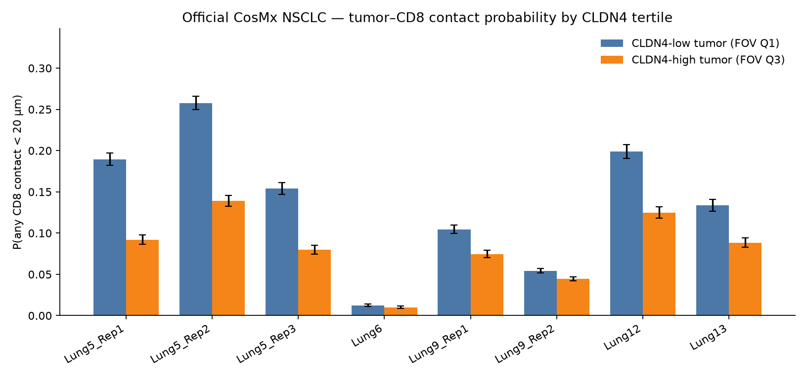

# Official CosMx NSCLC — CLDN4-high tumor vs CD8 contacts

CLDN4-only. Official CosMx SMI 960-plex NSCLC (He et al. 2022, *Nat Biotechnol*; NanoString public S3). Eight slides, five tissues. No private 8-KL. No TACSTD2 gate. No CellChat run and no communication-probability claim.

This is **exclusion as missing contacts** (binary tumor–CD8 centroid distance < 20 µm), complementary to Ripley K / pair-correlation. It asks whether CLDN4-high tumor cells simply lack a CD8 neighbor, and whether the contacts that do exist carry on-panel barrier ligands.

## Data and definitions

| Item | Choice |
|---|---|
| Dataset | Official CosMx SMI NSCLC FFPE flat files (`SMI-Compressed`, 8 slides) |
| Tissues | Lung5 (Rep1–3), Lung6, Lung9 (Rep1–2), Lung12, Lung13 |
| Panel | Prototype **960 RNA + 20 NegPrb** (not the later 1K UCC panel) |
| QC | Drop `cell_ID==0`; ≥20 counts and ≥5 genes |
| Pixel size | 0.18 µm (He 2022) |
| Contact | Euclidean centroid distance **< 20 µm**, **within FOV** |
| Tumor | RNA epithelial marker-score argmax (EPCAM / KRT / CDH1 family vs immune vs stromal) |
| CD8 | `CD8A\|CD8B > 0` AND `CD3D\|CD3E\|CD3G > 0` AND not epithelial |
| CLDN4 split | Per-FOV **rank tertiles** among tumor cells (Q3 vs Q1; ties broken by rank) |
| Inference | Slide 2×2 + FOV-stratified Mantel–Haenszel OR + **5,000 FOV-restricted permutations** of CLDN4 labels |

Usable FOVs require ≥10 tumor and ≥5 CD8 cells (225 / 232 FOVs).

| Inventory | n |
|---|---:|
| QC cells | 766,334 |
| Usable tumor cells | 329,192 |
| CD8 cells in usable FOVs | 24,761 |
| Tumor cells with any CD8 contact | 29,456 (**8.9%**) |
| Usable FOVs / slides / tissues | 225 / 8 / 5 |

The flat release has **no official 18-type labels**. Tumor and CD8 are RNA-marker definitions, with a PanCK / CD45 protein-stain robustness split.

## 1) Is CLDN4-high tumor less likely to have any CD8 contact?

**Yes, for RNA-epithelial tumor cells.** Contact is uncommon overall (8.9%). CLDN4-high tumor has lower odds of any CD8 neighbor within 20 µm than CLDN4-low tumor on the same FOV.

| Estimator | P(contact \| high) | P(contact \| low) | OR (high vs low) | 95% CI | p |
|---|---:|---:|---:|---|---|
| Pooled 2×2 (equal-n tertiles) | 6.96% | 11.34% | **0.584** | 0.567–0.602 | — |
| FOV-stratified Mantel–Haenszel (225 FOVs) | — | — | **0.560** | 0.547–0.572 | — |
| FOV-restricted permutation (5,000) | — | — | 0.584 (null mean 1.000) | null 0.973–1.029 | **0.00020** |
| Patient-collapsed MH (5 tissues) | — | — | **0.574** | 0.562–0.587 | — |

Permutation shuffles CLDN4 high/low labels **inside each FOV** and leaves contact flags fixed. The observed OR sits below every null draw (minimum two-sided p = 1/5001).

**8 / 8 slides** and **5 / 5 tissues** have OR < 1. **182 / 225 FOVs** have OR < 1.



| Slide | Tissue | n tumor | P(contact \| Q3) | P(contact \| Q1) | OR | 95% CI |
|---|---|---:|---:|---:|---:|---|
| Lung5_Rep1 | Lung5 | 31,058 | 0.092 | 0.190 | 0.433 | 0.399–0.470 |
| Lung5_Rep2 | Lung5 | 32,883 | 0.139 | 0.258 | 0.464 | 0.433–0.498 |
| Lung5_Rep3 | Lung5 | 28,777 | 0.080 | 0.154 | 0.475 | 0.433–0.521 |
| Lung6 | Lung6 | 52,780 | 0.010 | 0.012 | 0.806 | 0.661–0.984 |
| Lung9_Rep1 | Lung9 | 41,584 | 0.075 | 0.104 | 0.692 | 0.637–0.753 |
| Lung9_Rep2 | Lung9 | 89,822 | 0.044 | 0.054 | 0.809 | 0.751–0.871 |
| Lung12 | Lung12 | 25,517 | 0.125 | 0.199 | 0.575 | 0.529–0.625 |
| Lung13 | Lung13 | 26,771 | 0.088 | 0.134 | 0.629 | 0.571–0.691 |

Lung6 is almost contact-empty (~1% in both arms). The deficit is largest in Lung5 and Lung12.

### Sensitivity (same 20 µm contact, same CD8 rule)

| Split | OR | 95% CI |
|---|---:|---|
| Per-sample rank tertiles (Q3 vs Q1) | 0.537 | 0.520–0.554 |
| Per-sample rank median | 0.552 | 0.539–0.566 |
| PanCK-high ∩ CD45-low index (protein tumor) | 1.072 | 1.021–1.125 |

The contact deficit is **RNA-epithelial**. A protein-stain PanCK-high / CD45-low index does **not** show fewer CD8 contacts. Those are different cell sets; do not treat the RNA OR as a PanCK-protein exclusion effect.

Forest plot: `results/cosmx_cldn4_contact_lr/contact_or_forest.png`. Permutation null: `results/cosmx_cldn4_contact_lr/contact_or_permutation.png`.

## 2) Among contacts, are barrier ligands enriched vs CLDN4-low contacts?

Asked genes: **F11R, NECTIN2, CDH1, LGALS9**. Report only if present on the 960 panel.

### Panel membership (prototype 960, not 1K UCC)

| Gene | On 960 panel? | Symbol used | Aliases tried |
|---|---|---|---|
| F11R | **No — missing** | — | F11R, JAM1, JAM-A, JAMA |
| NECTIN2 | **No — missing** | — | NECTIN2, PVRL2, HVEB, CD112 |
| CDH1 | **Yes** | CDH1 | CDH1 |
| LGALS9 | **Yes** | LGALS9 | LGALS9, LGALS9A, GAL9 |

**F11R and NECTIN2 are not on this panel.** No contact-level enrichment is reported for them. Receptor genes TIGIT / HAVCR2 / ITGAL are on the panel; they are not used here as tumor ligands.

Among tumor cells that **do** have a CD8 contact, FOV-restricted permutation of CLDN4 labels:

| Gene | Δ log-norm (high − low contacts) | Permutation p (5,000) |
|---|---:|---:|
| CDH1 | **+0.053** | **0.00020** |
| LGALS9 | +0.0007 | 0.87 |
| Family mean (CDH1 + LGALS9) | +0.027 | 0.00020 |

CDH1 is higher in CLDN4-high contacts (positivity odds > 1 on 8/8 slides). LGALS9 is not enriched. The family signal is CDH1-driven.

Full per-slide table: [`results/cosmx_cldn4_contact_lr/ligand_enrichment_contacts.tsv`](results/cosmx_cldn4_contact_lr/ligand_enrichment_contacts.tsv). Bars: `results/cosmx_cldn4_contact_lr/ligand_enrichment_bars.png`.

This is **ligand abundance in contacting tumor cells**, not a CellChat communication probability, not a receptor occupancy, and not a causal barrier.

## 3) What is not claimed

- **No CellChat causality.** `computeCommunProb` was not run. ΔP is not estimated.
- **No F11R or NECTIN2 result** — both are absent from the official 960-plex.
- **No private 8-KL.** Official CosMx NSCLC only.
- **No ICI / response labels** on these demo tissues.
- Contact is a **centroid-distance proxy**, not a membrane-touch call.
- Complementary to Ripley K: this file is a **binary missing-contact** readout at 20 µm, not a K / PCF curve.

## Reproduce

```bash
python3 -m pip install -r scripts/requirements-cosmx-contact.txt
bash scripts/download_cosmx_nsclc.sh          # official S3 flat files → data/cosmx/
python3 scripts/cosmx_cldn4_contact_lr.py     # writes results/cosmx_cldn4_contact_lr/
```

Machine summary: [`results/cosmx_cldn4_contact_lr/stats.json`](results/cosmx_cldn4_contact_lr/stats.json).
