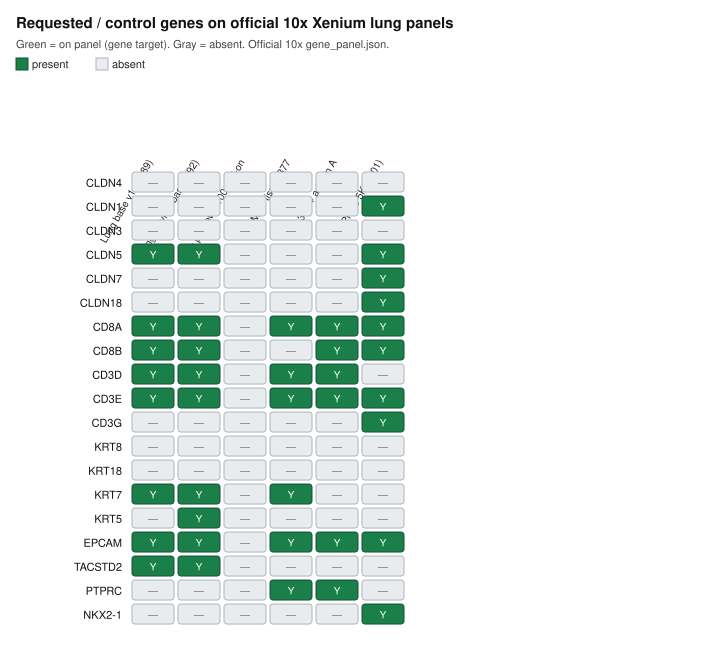
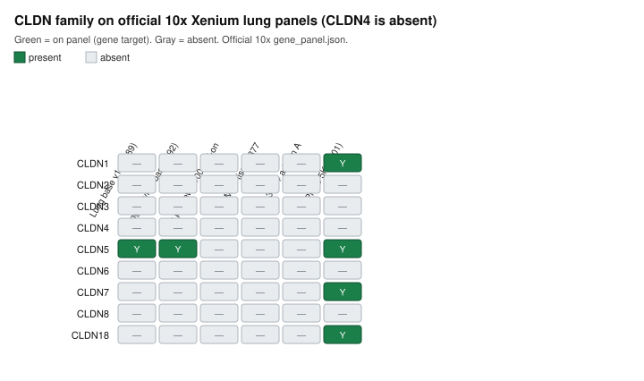

# Official 10x Xenium lung / NSCLC: CLDN4 panel gate

Honest bottom line: **CLDN4 is not on the official Xenium human lung panel (base or the 100-gene custom add-on).** Per the gate, **stop**. No cell-level CLDN4-high vs low tumor → nearest CD8 / 25–50–100 µm CD8 counts / KRT8–EPCAM control was run. No spatial transcript maps of CLDN4 exist for these public 10x runs.

This is a **panel inventory**, not a claim verdict. GSE300007 TMA was not used. Private 8-KL was not used.

## What was downloaded and checked

All files came from official 10x Genomics dataset pages (`10x.com/datasets`) or the official predesigned-panel support page. Authority for “is this gene on the run?” is each run’s `gene_panel.json` (`payload.targets` with `type.descriptor == gene`, symbol + Ensembl ID). CLDN4 was tested as the symbol **CLDN4** and as Ensembl **ENSG00000189143**.

| Dataset | Page | Panel on the run | Gene targets | CLDN4 | Other CLDN |
|---|---|---|---:|:---:|---|
| Predesigned Human Lung panel (support catalog) | [panel designer](https://www.10xgenomics.com/support/software/xenium-panel-designer/latest/tutorials/pre-designed-xenium-v1) | Xenium Human Lung Gene Expression `hLung_v1.1` | 289 | no | CLDN5 |
| [Xenium Human Lung Preview — cancer](https://www.10xgenomics.com/datasets/xenium-human-lung-preview-data-1-standard) | same | development lung base `hLung_292g` + 100-gene add-on `hLung_100g` / PD_346 | 392 | no | CLDN5 (base only) |
| [Xenium Human Lung Preview — non-diseased](https://www.10xgenomics.com/datasets/xenium-human-lung-preview-data-1-standard) | same | same PD_339 + PD_346 | 392 | no | CLDN5 (base only) |
| [Human Lung Cancer Preview (Multi-Tissue and Cancer)](https://www.10xgenomics.com/datasets/human-lung-cancer-preview-data-xenium-human-multi-tissue-and-cancer-panel-1-standard) | same | Multi-Tissue and Cancer 377 | 377 | no | none |
| [FFPE LUAD multimodal cell segmentation](https://www.10xgenomics.com/datasets/preview-data-ffpe-human-lung-cancer-with-xenium-multimodal-cell-segmentation-1-standard) | same | Multi-Tissue and Cancer 377 | 377 | no | none |
| [FFPE NSCLC Immuno-Oncology + custom add-on](https://www.10xgenomics.com/datasets/ffpe-human-lung-cancer-data-with-human-immuno-oncology-profiling-panel-and-custom-add-on-1-standard) | same | IO 380 + Add-on A (100) | 480 | no | none |
| [Post-Xenium note Exp. 1](https://www.10xgenomics.com/datasets/xenium-human-lung-cancer-post-xenium-technote) | same | official lung `hLung_v1.1` | 289 | no | CLDN5 |
| [Post-Xenium note Exp. 2](https://www.10xgenomics.com/datasets/xenium-human-lung-cancer-post-xenium-technote) | same | Prime 5K Human Pan Tissue & Pathways | 5001 | no | CLDN1, CLDN5, CLDN7, CLDN18 |

The lung **preview** add-on is the only official 10x “lung panel + custom add-on” public run. Those 100 add-on genes do not include CLDN4 (list below). The final catalog lung panel (`hLung_v1.1`, 289 genes) also does not include CLDN4. Preview base vs final catalog differs by three genes (`CXCL14`, `KRT17`, `KRT5` on the preview base only) — still no CLDN4.

Even the Prime 5K lung-cancer technical-note run (5,001 genes) has CLDN1/5/7/18 and **not** CLDN4. That is extra context, not a reason to continue: the gate was the **lung** panel (base or add-on).

## Requested analysis genes

| Gene | Role in the requested analysis | Lung base v1.1 | Lung preview +100 add-on | Notes |
|---|---|:---:|:---:|---|
| **CLDN4** | index (high vs low tumor) | no | no | **gate fail → stop** |
| CD8A / CD8B | nearest CD8; radius counts | yes / yes | no (already on base) | usable only if CLDN4 existed |
| KRT8 | epithelial control | no | no | also absent on Multi-Tissue, IO, and Prime 5K |
| EPCAM | epithelial control | yes | no (already on base) | present without CLDN4 |
| KRT7 | related keratin | yes | no | not a requested substitute |
| CLDN5 | only claudin on the lung panel | yes | no | endothelial; not CLDN4 |
| TACSTD2 | not requested (CLDN4-only) | yes | no | recorded, not analyzed |

Full presence table: `results/xenium_official_lung/marker_presence.tsv`.

## Maps (panel inventory, not tissue)

These are **panel-coverage maps**, not Xenium spatial maps. Spatial CLDN4 maps cannot be drawn from these public 10x lung runs because the probe is not on the panel.





## What was not done (by instruction)

- No download of multi-GB `outs.zip` cell/transcript bundles after the panel gate failed.
- No CLDN4-high vs low tumor vs nearest CD8 or 25/50/100 µm CD8 counts.
- No KRT8/EPCAM control neighborhood (KRT8 is also absent).
- No TACSTD2 stand-in (CLDN4-only).
- No GSE300007 TMA (assigned to another agent).
- No private 8-KL.
- No “claim-failed” write-up.

## Official lung base panel — 289 gene targets (`hLung_v1.1`)

Source: [predesigned panel JSON](https://cdn.10xgenomics.com/raw/upload/v1697489942/software-support/Xenium-panels/gene_panel_json_files/human_lung_gene_expression.json) and the Post-Xenium Exp. 1 `gene_panel.json`. One gene per line: `results/xenium_official_lung/lung_base_hLung_v1.1_genes.txt`.

ACE, ACE2, ACKR1, ADAM17, ADAM28, ADAMTS1, ADGRL4, AGER, AGR3, AIF1, ANPEP, APOD, APOLD1, AQP9, AREG, ARL14, ASCL1, ASCL2, ASCL3, ATP1B1, BAIAP2L1, BANK1, BCAS1, BMX, CA4, CCDC78, CCNA1, CCNB2, CCR7, CD14, CD163, CD19, CD1A, CD1C, CD2, CD24, CD247, CD27, CD274, CD28, CD300E, CD34, CD38, CD3D, CD3E, CD4, CD40, CD40LG, CD68, CD70, CD79A, CD80, CD86, CD8A, CD8B, CDH1, CDK1, CENPF, CFB, CFTR, CHIT1, **CLDN5**, CLEC10A, CLEC12A, CLEC4E, CNN1, COL5A2, COL8A1, CP, CSPG4, CSTA, CTLA4, CTSL, CTTN, CXCL10, CXCL13, CXCL5, CXCL6, CXCL9, CXCR5, CXCR6, CYP2F1, DAPK2, DCLK1, DES, DGKG, DIRAS3, DMBT1, DNAJB9, DPP6, DUOX1, ECSCR, EGFR, EHF, ELF3, ENAH, **EPCAM**, ETV5, F3, FABP3, FAM184A, FAS, FASLG, FASN, FBN1, FCER1A, FCGR1A, FCGR3A, FCMR, FCN1, FCN3, FGFBP2, FGFR4, FKBP11, FOXI1, FOXJ1, FOXP3, FSCN1, GJA5, GKN2, GLCCI1, GLIPR2, GNG11, GPI, GPR171, GPR183, GPR34, GPX2, GZMA, GZMB, GZMK, HAVCR2, HIF1A, HIGD1B, HMGCS1, HP, HPGDS, ICA1, IGF1, IGFBP3, IL1RL1, IL7R, IQGAP2, IRF8, ITGAM, ITGB4, KCNK3, KDR, KIT, KLF5, KLK11, KLRB1, KLRC1, KLRD1, KRT15, KRT7, LAG3, LAMC3, LCK, LGALS3BP, LGR5, LGR6, LILRA4, LILRA5, LILRB2, LILRB4, LMOD1, LTBP2, LTF, LYVE1, MALL, MAP7, MARCO, MCEMP1, MEDAG, MET, MFAP5, MIS18BP1, MKI67, MMP12, MMP9, MMRN1, MPEG1, MS4A1, MS4A2, MS4A4A, MTUS1, MUC1, MUC5B, MYC, MYH11, MYO6, MZB1, NCEH1, NFKB1, NID1, NKG7, NTN4, NTRK2, OTUD7B, P2RX1, PAMR1, PCNA, PCOLCE2, PDCD1, PDCD1LG2, PDGFRA, PDGFRB, PDPN, PEBP4, PI3, PIM1, PIM2, PLA2G2A, PLA2G4F, PLA2G7, PLN, PLVAP, POU2AF1, PROX1, PTGS1, RAMP2, RARRES1, RBP4, RERGL, RETN, RGS5, RND1, RUNX3, S100A12, S100A7, S100B, SAMD3, SCEL, SEC11C, SELE, SELL, SELP, SEMA3B, SEMA3C, SERPINA3, SFRP2, SFTA2, SFTPD, SHANK3, SLC15A2, SLC18A2, SLC1A3, SLC2A1, SLC7A11, SLIT3, SMIM24, SOX2, SOX9, SPDEF, SPIB, STAT4, STC1, STEAP4, SVEP1, SYK, **TACSTD2**, TC2N, TCL1A, THBS2, THY1, TM4SF18, TM4SF4, TMC5, TMEM100, TMPRSS2, TNFRSF13B, TNFRSF13C, TNFRSF17, TNFRSF18, TOP2A, TP63, TP73, TREM2, TRPC6, TSPAN8, UBE2C, UPK1B, UPK3B, VSIG4, VWF, WFS1, WNT2, WT1

## Official lung preview custom add-on — 100 gene targets (`hLung_100g` / PD_346)

Same add-on JSON on both preview sections (cancer and non-diseased). File: `results/xenium_official_lung/lung_preview_addon_PD346_genes.txt`.

ACTR3, ADGRE5, AK1, AKR1C1, ALDH1A3, ALOX5, ANAPC16, ANKRD36C, ARF1, C16orf89, C19orf53, CD83, CHI3L1, CMTM6, CNBP, COMMD6, CRISP3, CTSA, CTSK, CXCL3, EIF3A, EIF3E, EIF3H, EPHX1, FAM3D, FCGBP, FDCSP, FST, GPSM3, GRINA, HEXA, HNMT, HNRNPC, HSD17B11, IDO1, IGSF6, IRF1, ISCU, KRT13, LAMP2, LAMTOR4, LGALS2, LGMN, LYAR, MANF, MED24, MMP7, MPC2, NCOA7, NDRG2, NDUFA1, NDUFB4, ODAM, OST4, PAPOLA, PCBP2, PF4, PRB1, PRDX4, PRG4, PSMA1, RAD23A, RBM3, RBM8A, REEP5, RNF145, RUVBL2, S100A1, SCD, SEC61G, SEC62, SERP1, SF3B5, SFTA3, SLC12A2, SLC16A3, SMDT1, SNX2, SRSF2, SRSF7, SSR2, SSR3, SUMO3, TCN1, TGM2, TMEM106C, TMEM123, TMEM219, TMEM258, TMEM45A, TOMM5, TOMM7, TRMT112, UBD, UBE2D3, UXT, VKORC1, VPS28, WDR83OS, WSB1

## Reproduce

```bash
python3 scripts/check_xenium_official_lung_panels.py
```

Downloads each official `gene_panel.json` into `data/cache/xenium_panels/` (gitignored) and rewrites `results/xenium_official_lung/`. No extra Python packages. Exit status 2 means the CLDN4 lung-panel gate failed and analysis stopped.

Machine-readable gate: `results/xenium_official_lung/gate.json`. Per-run catalog: `results/xenium_official_lung/catalog.tsv`.

## 中文摘要

官方 10x Xenium 人肺 / NSCLC / FFPE 肺公开数据集的 **lung panel（289 基因底盘 + preview 的 100 基因 add-on）都没有 CLDN4**。按门控：列出 panel 基因并停止。未做细胞级 CLDN4-high/low 对最近 CD8 或 25/50/100 µm CD8 计数。未用 GSE300007，未用私有 8-KL。上图是 panel 覆盖图，不是组织空间图。
