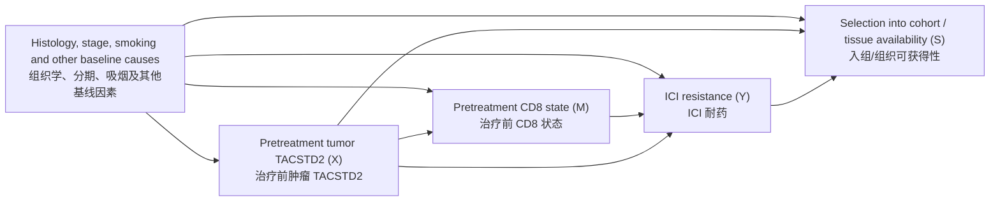

# TACSTD2 → CD8 → ICI resistance: causal-analysis playbook

> **Scope / 范围**
> Methods only. This document specifies when and how the hypothesis “TACSTD2 alters CD8 infiltration/function and thereby causes immune-checkpoint inhibitor (ICI) resistance” may be evaluated. It does not report results.

> 仅限方法。本文件说明何时以及如何评估“TACSTD2 改变 CD8 浸润/功能，进而导致免疫检查点抑制剂（ICI）耐药”这一假设，不报告任何研究结果。

## 1. State the causal question / 明确因果问题

Define all variables before analysis:

- **Exposure \(X\):** pretreatment, tumor-cell-specific TACSTD2 abundance or a prespecified high/low contrast. Bulk-tissue expression is not equivalent because tumor purity and immune-cell composition can affect it.
- **Mediator \(M\):** pretreatment intratumoral CD8 T-cell abundance and/or a prespecified CD8 functional score. Abundance and function are distinct mediators and should not be combined after inspecting outcomes.
- **Outcome \(Y\):** a prespecified definition of ICI resistance, such as primary progressive disease at a fixed landmark. Overall response, durable clinical benefit, progression-free survival, and overall survival are different outcomes.
- **Target population:** patients with a defined cancer type, disease setting, ICI regimen, treatment line, and specimen time point.
- **Time zero:** ICI initiation. \(X\) and \(M\) must be measured before time zero for the primary analysis.

分析前应定义全部变量：

- **暴露 \(X\)：** 治疗前、肿瘤细胞特异的 TACSTD2 丰度，或预先规定的高/低对比。由于肿瘤纯度和免疫细胞组成会影响检测值，bulk 组织表达不等同于肿瘤细胞表达。
- **中介 \(M\)：** 治疗前肿瘤内 CD8 T 细胞丰度和/或预先规定的 CD8 功能评分。丰度与功能是不同中介，不应在查看结局后再合并。
- **结局 \(Y\)：** 预先规定的 ICI 耐药定义，例如固定时间点前的原发进展。总体缓解、持久临床获益、无进展生存和总生存不是同一结局。
- **目标人群：** 明确癌种、疾病状态、ICI 方案、治疗线次和取样时间的患者。
- **时间零点：** ICI 开始治疗之时。主要分析中的 \(X\) 和 \(M\) 必须在此之前测量。

Three estimands must not be conflated:

1. **Prognostic association:** is \(X\) associated with outcome among ICI-treated patients?
2. **Treatment-predictive effect:** does the effect of ICI versus a clinically relevant non-ICI treatment differ by \(X\)?
3. **Mechanistic mediation:** does changing \(X\) change \(M\), which in turn changes ICI resistance?

Only the second requires a treatment comparator and an \(X \times\) treatment interaction; only the third supports the proposed causal chain.

以下三个估计目标不可混为一谈：

1. **预后关联：** 在接受 ICI 的患者中，\(X\) 是否与结局相关？
2. **疗效预测效应：** 与临床相关的非 ICI 治疗相比，ICI 的效应是否随 \(X\) 而变化？
3. **机制性中介：** 改变 \(X\) 是否会改变 \(M\)，并进一步改变 ICI 耐药？

第二个问题需要治疗对照及 \(X \times\) 治疗交互项；只有第三个问题直接对应所提出的因果链。

## 2. Prespecified DAG / 预设 DAG

The minimum baseline confounder set should be chosen from subject-matter knowledge, not stepwise \(p\)-values. It normally includes:

- histology or molecular subtype;
- disease stage and metastatic burden;
- smoking exposure, preferably pack-years rather than current/former/never alone;
- age and sex when they plausibly affect exposure and immune outcome;
- performance status, treatment line, ICI regimen, and prior systemic/radiation therapy;
- tumor mutational burden, driver alterations, PD-L1, baseline steroid use, and relevant immune state where available;
- tumor purity, specimen site, assay platform/batch, and sampling time when they affect measurement.

Whether each variable is a confounder, measurement cause, mediator, or collider must be decided before modeling. Do not automatically adjust for post-ICI variables, treatment toxicity, post-treatment CD8, or variables caused by TACSTD2; that can block part of the effect or induce collider bias. Restricting analysis to patients with available tissue or to ICI recipients can itself induce selection bias and must be described.

最小基线混杂集应依据领域知识确定，而非通过逐步回归的 \(p\) 值筛选。通常应考虑：

- 组织学类型或分子亚型；
- 疾病分期与转移负荷；
- 吸烟暴露，优先使用包年而非仅用当前/既往/从不吸烟；
- 当年龄和性别可能同时影响暴露与免疫结局时纳入二者；
- 体能状态、治疗线次、ICI 方案及既往全身/放射治疗；
- 条件允许时纳入肿瘤突变负荷、驱动变异、PD-L1、基线激素使用和相关免疫状态；
- 当其影响测量时，纳入肿瘤纯度、取材部位、检测平台/批次和取样时间。

建模前必须判定每个变量属于混杂因素、测量原因、中介还是碰撞点。不可机械调整 ICI 后变量、治疗毒性、治疗后 CD8 或 TACSTD2 的下游变量，否则可能阻断真实效应或引入碰撞偏倚。仅纳入有组织样本者或仅纳入 ICI 接受者本身也可能造成选择偏倚，需明确说明。

## 3. When the hypothesis may be tested / 何时可以检验

### 3.1 Association only / 仅关联

An ICI-treated observational cohort may test an adjusted association if:

- exposure and mediator are measured before treatment;
- histology, stage, smoking, and other key baseline causes are measured with sufficient overlap across exposure levels;
- outcome ascertainment is blinded to biomarker status where feasible;
- sample size and event count support the prespecified model without data-driven variable selection;
- the assay and analysis plan are fixed before outcome analysis; and
- patient-level observations, not cells, regions, spots, or genes, define the independent sample size.

This design cannot by itself establish that TACSTD2 is treatment-predictive or causal.

满足以下条件时，ICI 治疗观察性队列可检验调整后的关联：

- 暴露和中介均在治疗前测量；
- 已测量组织学、分期、吸烟及其他关键基线原因，且不同暴露水平间有足够重叠；
- 可行时，结局判定者不知晓生物标志物状态；
- 样本量及事件数足以支持预设模型，无需数据驱动筛选变量；
- 检测方法和分析方案在结局分析前固定；
- 独立样本量按患者计算，而不是按细胞、区域、空间点或基因计算。

该设计本身不能证明 TACSTD2 具有治疗预测性或因果性。

### 3.2 Treatment-predictive question / 疗效预测问题

To distinguish ICI-specific resistance from general poor prognosis, use a randomized trial or a defensible target-trial emulation containing both ICI and a clinically relevant comparator. Estimate the treatment effect within TACSTD2 strata and formally test the treatment-by-TACSTD2 interaction. Address treatment assignment, eligibility, time zero, immortal-time bias, treatment crossover, and positivity. A significant association in an ICI-only cohort is insufficient.

要区分 ICI 特异性耐药与一般性不良预后，应使用随机试验，或包含 ICI 与临床相关对照治疗的可靠目标试验模拟。应估计不同 TACSTD2 分层中的治疗效应，并正式检验治疗与 TACSTD2 的交互。需处理治疗分配、入组条件、时间零点、不死时间偏倚、治疗交叉和正值性。仅在 ICI 队列中发现显著关联并不充分。

### 3.3 Mechanistic causal claim / 机制性因果主张

A credible mechanistic claim requires triangulation:

1. temporally ordered human data showing \(X\) precedes \(M\) and \(M\) precedes resistance;
2. an adequately powered, independently validated patient cohort with measured confounders;
3. perturbation of TACSTD2 in appropriate tumor models, with blinded and randomized allocation where applicable;
4. evidence that TACSTD2 perturbation changes CD8 recruitment or function under otherwise comparable conditions;
5. a rescue or blockade experiment showing that manipulating CD8 reverses or abolishes the TACSTD2 effect on ICI response; and
6. replication across models representing relevant histologies, including negative controls.

Observational mediation alone is not proof of a biological mechanism.

可信的机制性因果主张需要多证据互证：

1. 人体数据具有时间顺序：\(X\) 先于 \(M\)，\(M\) 先于耐药；
2. 具有足够效能、测量了混杂因素并完成独立验证的患者队列；
3. 在合适的肿瘤模型中扰动 TACSTD2，并在适用时采用随机分配与盲法；
4. 在其他条件可比时，TACSTD2 扰动能改变 CD8 招募或功能；
5. 通过 CD8 操作的挽救或阻断实验，逆转或消除 TACSTD2 对 ICI 反应的影响；
6. 在代表相关组织学类型的多个模型中重复，并设置阴性对照。

仅靠观察性中介分析不能证明生物学机制。

## 4. Analysis plan / 分析方案

### 4.1 Data preparation / 数据准备

- Use one row per patient for the primary analysis.
- Prespecify normalization, transformation, batch correction, cut points, and CD8 score. Prefer continuous variables; if a clinical threshold is needed, fix it externally.
- Verify sample identity, pretreatment timing, tumor content, outcome definitions, missingness, and duplicate patients across GEO studies.
- Report distributions and overlap of \(X\), \(M\), and confounders by histology, stage, smoking, and outcome. Lack of overlap is a design failure, not something regression reliably repairs.
- Handle missing baseline covariates with a prespecified method such as multiple imputation; include outcome and analysis variables in the imputation model without imputing outcomes that were never observed.

- 主要分析采用每位患者一行数据。
- 预设标准化、变换、批次校正、阈值和 CD8 评分。优先保留连续变量；如需临床阈值，应由外部依据固定。
- 核查样本身份、治疗前取样时间、肿瘤含量、结局定义、缺失情况及不同 GEO 研究间的重复患者。
- 按组织学、分期、吸烟和结局报告 \(X\)、\(M\) 及混杂因素的分布与重叠。缺乏重叠属于设计缺陷，回归模型无法可靠修复。
- 基线协变量缺失应采用预设方法（如多重插补）；插补模型应包含结局和分析变量，但不应凭空插补从未观测到的结局。

### 4.2 Total association/effect / 总关联或总效应

For binary resistance, fit a prespecified logistic model or a model estimating standardized risks/risk differences:

\[
\operatorname{logit} P(Y=1)=\beta_0+\beta_X X+f(C),
\]

where \(C\) is the DAG-derived baseline adjustment set. For time-to-event outcomes, define time zero and censoring, inspect proportional-hazards assumptions, and report absolute survival contrasts in addition to hazard ratios. Use flexible terms for continuous confounders when sample size permits. Report effect estimates and uncertainty, not only \(p\)-values.

对于二元耐药结局，拟合预设 logistic 模型，或直接估计标准化风险/风险差：

\[
\operatorname{logit} P(Y=1)=\beta_0+\beta_X X+f(C),
\]

其中 \(C\) 为依据 DAG 确定的基线调整集。对于时间结局，应明确时间零点和删失机制，检查比例风险假设，并在风险比之外报告绝对生存差异。样本量允许时，对连续混杂因素使用灵活函数。应报告效应估计及其不确定性，而非仅报告 \(p\) 值。

### 4.3 Mediation / 中介分析

Use counterfactual mediation only when exposure–outcome, exposure–mediator, and mediator–outcome confounders are measured and when no mediator–outcome confounder is itself caused by \(X\). Fit:

\[
M=\alpha_0+\alpha_X X+g(C)+\varepsilon,
\]

\[
\operatorname{logit}P(Y=1)=\theta_0+\theta_X X+\theta_M M+
\theta_{XM}X M+h(C).
\]

Include the \(X \times M\) interaction unless its absence was justified in advance. Estimate the total effect, natural or interventional indirect effect, and corresponding direct effect by g-computation/standardization with patient-level bootstrap confidence intervals. Prefer interventional effects when exposure-induced mediator–outcome confounding makes natural effects unidentified. For survival outcomes, use mediation methods designed for censoring and non-collapsible effect measures rather than multiplying coefficients from ordinary regressions.

Required assumptions include consistency, positivity, correct temporal order, no unmeasured confounding for all relevant paths, no differential measurement error, and correct model specification. Examine sensitivity to an unmeasured mediator–outcome confounder. Do not use “\(X\) significant, then \(M\) significant, then \(X\) becomes nonsignificant” as proof of mediation, and do not interpret the mediated proportion when total and indirect effects have opposing signs or the total effect is near zero.

仅当暴露–结局、暴露–中介和中介–结局路径的混杂因素均已测量，且不存在由 \(X\) 引起的中介–结局混杂因素时，才使用反事实中介分析。拟合：

\[
M=\alpha_0+\alpha_X X+g(C)+\varepsilon,
\]

\[
\operatorname{logit}P(Y=1)=\theta_0+\theta_X X+\theta_M M+
\theta_{XM}X M+h(C).
\]

除非事先有充分理由，应包含 \(X \times M\) 交互项。通过 g 计算/标准化估计总效应、自然或干预型间接效应及相应直接效应，并以患者为抽样单位进行 bootstrap 计算置信区间。当暴露引起中介–结局混杂，使自然效应不可识别时，优先估计干预型效应。对生存结局，应使用能处理删失及效应尺度非可折叠性的专门中介方法，不应简单相乘普通回归系数。

必要假设包括一致性、正值性、正确时间顺序、相关路径无未测量混杂、无差异性测量误差及模型设定正确。应评估未测量中介–结局混杂的敏感性。不得以“\(X\) 显著、随后 \(M\) 显著、加入 \(M\) 后 \(X\) 不显著”作为中介证据；当总效应与间接效应方向相反或总效应接近零时，不应解释中介比例。

### 4.4 Robustness and falsification / 稳健性与证伪

Prespecify:

- models stratified by major histology, plus a pooled hierarchical model if pooling is scientifically defensible;
- interactions of TACSTD2 with histology and smoking where biologically motivated;
- alternative adjustment sets from plausible DAGs, without adjusting for descendants of \(X\);
- negative-control outcomes/exposures and technical controls for purity and batch;
- leave-one-study-out analysis when combining datasets;
- quantitative sensitivity analysis for unmeasured confounding;
- influence diagnostics and leave-one-patient-out estimates for small cohorts; and
- external replication with unchanged definitions and model specification.

Multiplicity across outcomes, cut points, CD8 signatures, and subgroups must be controlled or clearly labeled exploratory.

应预先规定：

- 按主要组织学类型分层建模；仅在科学上合理时使用汇总的层级模型；
- 有生物学依据时检验 TACSTD2 与组织学、吸烟的交互；
- 基于合理的备选 DAG 使用不同调整集，但不调整 \(X\) 的下游变量；
- 阴性对照结局/暴露，以及肿瘤纯度和批次的技术对照；
- 合并多个数据集时进行逐研究剔除分析；
- 未测量混杂的定量敏感性分析；
- 小队列中的影响诊断和逐患者剔除估计；
- 使用完全不变的定义和模型进行外部重复验证。

对多个结局、阈值、CD8 特征和亚组的检验必须控制多重性，或明确标为探索性。

## 5. Why a GEO cohort with \(n=20\) cannot prove causality / 为什么 GEO \(n=20\) 不能证明因果

A GEO dataset of 20 patients can generate a hypothesis, but cannot establish this causal pathway:

- **Effective sample size is 20.** Thousands of genes, cells, or spatial spots do not create thousands of independent patients; treating them as independent is pseudoreplication.
- **Confounding cannot be resolved by a saturated model.** Histology, stage, smoking, treatment, purity, and batch can each explain TACSTD2, CD8, and outcome. With 20 patients, adjustment for several covariates plus exposure, mediator, and interactions is unstable and may violate positivity.
- **Mediation demands more information than association.** It estimates multiple linked models and relies on strong, untestable no-unmeasured-confounding assumptions. A narrow bootstrap interval does not make those assumptions true.
- **Temporal direction is usually unclear.** A single pretreatment bulk sample cannot show that TACSTD2 changed CD8 rather than both reflecting lineage, tumor state, or sampling composition.
- **Selection and measurement are uncontrolled.** Public cohorts may be selected by tissue availability, combine histologies or platforms, use heterogeneous ICI regimens, and encode response differently.
- **Overfitting and analytic flexibility are large.** Trying many genes, signatures, thresholds, endpoints, and subgroups can produce apparently strong effects by chance.
- **An ICI-only cohort has no counterfactual treatment comparison.** It cannot distinguish an ICI-specific resistance marker from a general prognostic marker.
- **Observational expression is not intervention.** Even a reproducible \(X\)-\(M\)-\(Y\) pattern does not show what would happen if TACSTD2 or CD8 were experimentally changed.

Therefore, label any \(n=20\) analysis **exploratory and hypothesis-generating**. Report raw patient-level data, effect sizes with uncertainty, influence/leave-one-out analyses, and all tested specifications. Do not use “causes,” “mediates,” “drives,” or “confers resistance”; use “is associated with” or “is consistent with the hypothesized pathway,” pending independent validation and perturbation.

20 例患者的 GEO 数据可用于提出假设，但不能确立该因果路径：

- **有效样本量仍是 20。** 数千个基因、细胞或空间点不会形成数千名独立患者；将其视为独立样本属于伪重复。
- **饱和模型无法消除混杂。** 组织学、分期、吸烟、治疗、纯度和批次均可能同时解释 TACSTD2、CD8 与结局。20 例不足以稳定调整多个协变量、暴露、中介及交互项，也可能不满足正值性。
- **中介分析比关联分析需要更多信息。** 它包含多个相互关联的模型，并依赖“无未测量混杂”等强且不可检验的假设。bootstrap 区间较窄并不能使这些假设成立。
- **时间方向通常不清楚。** 单次治疗前 bulk 样本无法证明是 TACSTD2 改变了 CD8；两者可能共同反映细胞谱系、肿瘤状态或取样组成。
- **选择和测量难以控制。** 公共队列可能因组织可获得性而被选择，混合不同组织学或平台，使用不同 ICI 方案，并采用不同反应定义。
- **过拟合和分析自由度很大。** 尝试大量基因、特征、阈值、终点和亚组，可能偶然产生看似很强的效应。
- **仅含 ICI 的队列缺少反事实治疗对照。** 无法区分 ICI 特异性耐药标志物与一般预后标志物。
- **观察到表达不等于实施干预。** 即使 \(X\)-\(M\)-\(Y\) 模式可重复，也不能说明实验性改变 TACSTD2 或 CD8 后会发生什么。

因此，任何 \(n=20\) 分析均应标注为**探索性、假设生成性**。应报告患者层面的原始数据、带不确定性的效应量、影响/逐例剔除分析及全部检验设定。在独立验证和扰动实验完成前，不应使用“导致”“介导”“驱动”或“赋予耐药”；应表述为“与……相关”或“与假设路径一致”。

## 6. Decision rule / 决策规则

| Evidence / 证据 | Permitted conclusion / 可支持结论 |
|---|---|
| GEO \(n=20\), cross-sectional, ICI-only | Exploratory association only / 仅探索性关联 |
| Adequately powered ICI cohort with temporal ordering and DAG-based adjustment | Adjusted prognostic association; mediation only under explicit assumptions / 调整后的预后关联；仅在明确假设下讨论中介 |
| ICI and non-ICI comparator with defensible treatment assignment | Treatment-predictive effect / 疗效预测效应 |
| Independent human replication plus randomized perturbation and CD8 rescue/blockade | Evidence supporting the causal mechanism / 支持因果机制的证据 |

Before analysis, archive the protocol, DAG, data dictionary, code, outcomes, contrasts, adjustment set, exclusions, and sensitivity analyses. Any post hoc change must be labeled as such.

分析前应存档研究方案、DAG、数据字典、代码、结局、对比、调整集、排除标准和敏感性分析。任何事后修改均须明确标注。
