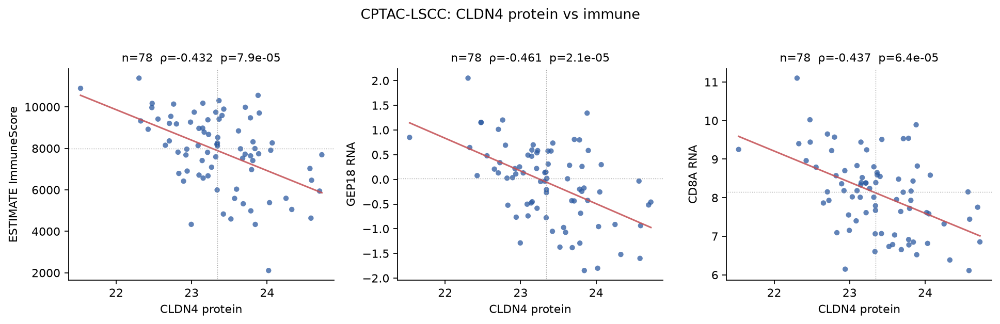
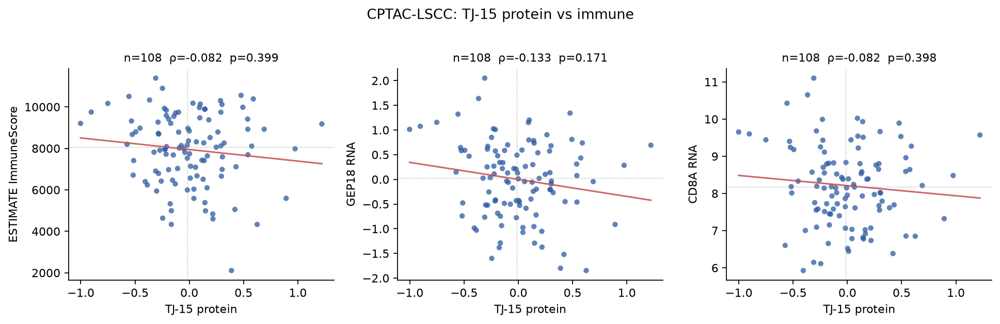
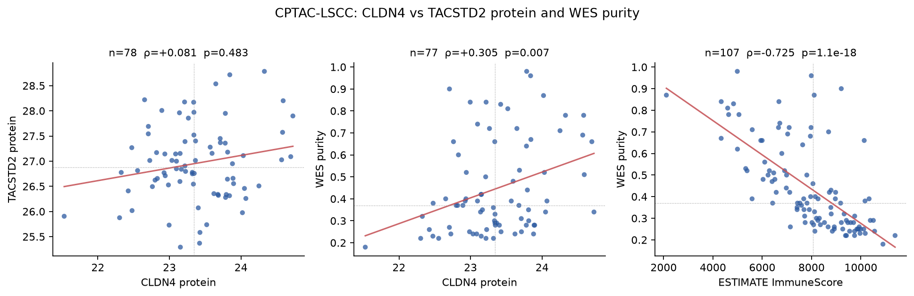
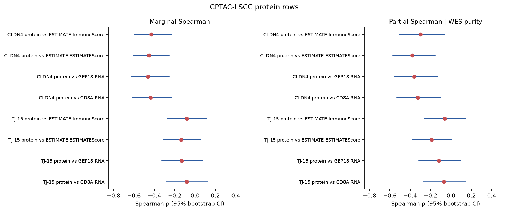
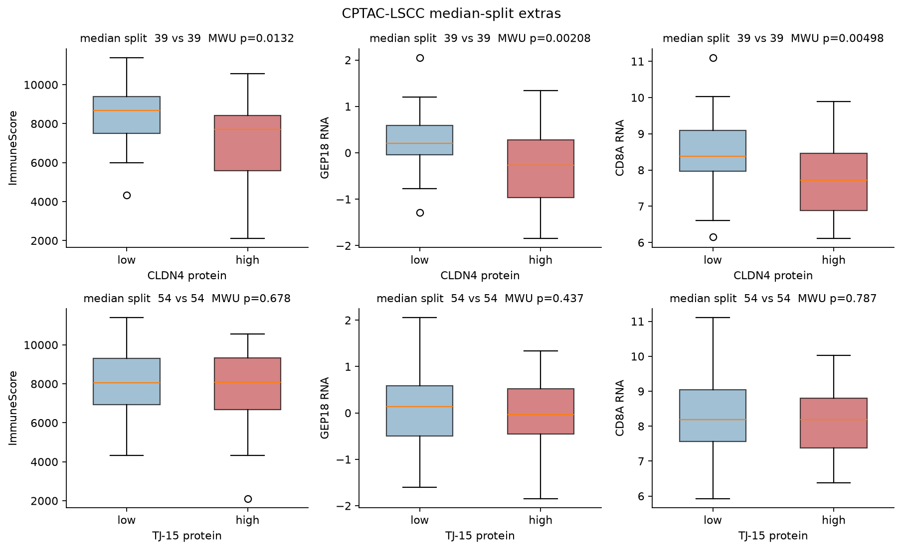

# CPTAC-LSCC (LUSC) CLDN4 / TJ-15 protein versus immune

Additive protein extra. **LUSC protein rows are first.** CPTAC LUAD TJ-15 protein versus ImmuneScore (ρ=−0.30, n=110) is taken as given from [PR #245](https://github.com/jinxuanhong1-blip/sdaxcge/pull/245) and is not re-estimated.

Question: in the public CPTAC lung squamous (LSCC / LUSC) TMT proteome, how do **CLDN4 protein** and a **structural TJ-15 protein score** associate with ImmuneScore, ESTIMATE, GEP18, and CD8A? Also CLDN4 protein versus TACSTD2 protein, and the same associations after WES purity when that column exists.

Public processed tables only. Pairwise-complete Spearman ρ, two-sided p, 2,000-resample bootstrap 95% CI (seed `20260817`). Partial ρ residualizes ranks on WES purity.

## LUSC protein (Satpathy 2021; freeze v1.2)

n = **108** treatment-naive surgical LSCC tumors. CLDN4 protein is quantified in **78 / 108** (30 NA). TACSTD2 protein is quantified in **108 / 108**. No ICI labels.

TJ-15 protein uses the same 15 structural genes as PR #245. On this public LSCC TMT table, **15 / 15** members have ≥8 non-missing tumors and enter the mean z-score: CLDN1, CLDN3, CLDN4, CLDN7, OCLN, TJP1, TJP2, TJP3, F11R, JAM2, JAM3, MARVELD2, MARVELD3, CGN, CGNL1. Not used (absent or <8 observations): none. Score requires ≥5 members per sample.

WES purity is present for **107 / 108** tumors (column `WES_purity`). CLDN7 protein is sparse (**13 / 108**); it enters the TJ mean only where measured.

CLDN4 protein is inverse with ImmuneScore (-0.432, n=78, p=7.9e-05), GEP18 RNA (-0.461), and CD8A RNA (-0.437). Those three stay negative after WES residual. The 15-gene TJ protein score versus ImmuneScore is -0.082 (n=108, p=0.399). CLDN4 and TACSTD2 proteins do not co-vary (+0.081, n=78, p=0.483).

### Primary LUSC protein rows

| Predictor | Endpoint | n | ρ | 95% CI | p | Partial \| WES (n, ρ, p) |
|---|---|---:|---:|---|---:|---|
| CLDN4 protein | ESTIMATE ImmuneScore | 78 | -0.432 | -0.595 to -0.233 | 7.9e-05 | 77, -0.298, 0.0084 |
| CLDN4 protein | ESTIMATE ESTIMATEScore | 78 | -0.453 | -0.608 to -0.255 | 3.1e-05 | 77, -0.382, 0.000598 |
| CLDN4 protein | GEP18 RNA | 78 | -0.461 | -0.629 to -0.255 | 2.1e-05 | 77, -0.362, 0.00122 |
| CLDN4 protein | CD8A RNA | 78 | -0.437 | -0.619 to -0.228 | 6.4e-05 | 77, -0.326, 0.00386 |
| TJ-15 protein | ESTIMATE ImmuneScore | 108 | -0.082 | -0.269 to +0.115 | 0.399 | 107, -0.062, 0.525 |
| TJ-15 protein | ESTIMATE ESTIMATEScore | 108 | -0.137 | -0.314 to +0.057 | 0.159 | 107, -0.191, 0.0491 |
| TJ-15 protein | GEP18 RNA | 108 | -0.133 | -0.326 to +0.072 | 0.171 | 107, -0.118, 0.227 |
| TJ-15 protein | CD8A RNA | 108 | -0.082 | -0.280 to +0.126 | 0.398 | 107, -0.070, 0.476 |

### CLDN4 protein vs TACSTD2 protein

| Predictor | Endpoint | n | ρ | 95% CI | p | Partial \| WES (n, ρ, p) |
|---|---|---:|---:|---|---:|---|
| CLDN4 protein | TACSTD2 protein | 78 | +0.081 | -0.141 to +0.305 | 0.483 | 77, +0.082, 0.476 |

### TJ-7 protein (sensitivity; same 7 genes as the claim-page module)

Not a search. CLDN7 remains n=13.

| Predictor | Endpoint | n | ρ | 95% CI | p | Partial \| WES (n, ρ, p) |
|---|---|---:|---:|---|---:|---|
| TJ-7 protein | ESTIMATE ImmuneScore | 108 | -0.340 | -0.499 to -0.154 | 0.000312 | 107, -0.185, 0.0562 |
| TJ-7 protein | ESTIMATE ESTIMATEScore | 108 | -0.420 | -0.564 to -0.253 | 6.1e-06 | 107, -0.342, 0.000308 |
| TJ-7 protein | GEP18 RNA | 108 | -0.344 | -0.507 to -0.149 | 0.000263 | 107, -0.215, 0.0264 |
| TJ-7 protein | CD8A RNA | 108 | -0.239 | -0.416 to -0.052 | 0.0128 | 107, -0.134, 0.168 |

### Extra LUSC protein rows (same tumors)

| Predictor | Endpoint | n | ρ | 95% CI | p | Partial \| WES (n, ρ, p) |
|---|---|---:|---:|---|---:|---|
| CLDN4 protein | ESTIMATE StromalScore | 78 | -0.411 | -0.573 to -0.202 | 0.000183 | 77, -0.303, 0.00734 |
| CLDN4 protein | CD8 RNA (CD8A/B) | 78 | -0.381 | -0.575 to -0.158 | 0.000577 | 77, -0.271, 0.0173 |
| CLDN4 protein | CYT RNA (GZMA/PRF1) | 78 | -0.367 | -0.563 to -0.138 | 0.000959 | 77, -0.254, 0.0261 |
| CLDN4 protein | CIBERSORT CD8 | 78 | -0.235 | -0.442 to +0.015 | 0.0385 | 77, -0.212, 0.0636 |
| CLDN4 protein | xCell CD8 | 78 | -0.387 | -0.586 to -0.160 | 0.000466 | 77, -0.301, 0.00787 |
| CLDN4 protein | xCell immune score | 78 | -0.400 | -0.565 to -0.199 | 0.00029 | 77, -0.218, 0.0572 |
| TJ-15 protein | ESTIMATE StromalScore | 108 | -0.179 | -0.345 to +0.012 | 0.064 | 107, -0.251, 0.00906 |
| TJ-15 protein | CD8 RNA (CD8A/B) | 108 | -0.071 | -0.270 to +0.133 | 0.468 | 107, -0.064, 0.51 |
| TJ-15 protein | CYT RNA (GZMA/PRF1) | 108 | -0.014 | -0.208 to +0.191 | 0.885 | 107, +0.025, 0.802 |
| TJ-15 protein | CIBERSORT CD8 | 108 | -0.050 | -0.259 to +0.164 | 0.609 | 107, -0.050, 0.606 |
| TJ-15 protein | xCell CD8 | 108 | -0.113 | -0.302 to +0.080 | 0.244 | 107, -0.126, 0.198 |
| TJ-15 protein | xCell immune score | 108 | -0.145 | -0.331 to +0.050 | 0.135 | 107, -0.130, 0.181 |

### Purity context and WGS sensitivity

CLDN4 protein vs WES purity: +0.305 (n=77, p=0.007); TJ-15 protein vs WES purity: +0.038 (n=107, p=0.697); ImmuneScore vs WES purity: -0.725 (n=107, p=1.1e-18). After **WGS** purity (sensitivity, n=75) CLDN4 protein vs ImmuneScore partial is -0.175, p=0.133. WES is the pre-specified DNA residual.

### Median-split extras

| Predictor | Endpoint | n high | n low | Δmedian (high−low) | MWU p |
|---|---|---:|---:|---:|---:|
| CLDN4 protein | ESTIMATE ImmuneScore | 39 | 39 | -979 | 0.0132 |
| CLDN4 protein | GEP18 RNA | 39 | 39 | -0.476 | 0.00208 |
| CLDN4 protein | CD8A RNA | 39 | 39 | -0.659 | 0.00498 |
| TJ-15 protein | ESTIMATE ImmuneScore | 54 | 54 | +30.1 | 0.678 |
| TJ-15 protein | GEP18 RNA | 54 | 54 | -0.179 | 0.437 |
| TJ-15 protein | CD8A RNA | 54 | 54 | +0.0102 | 0.787 |

## Extra figures











## Given LUAD protein (not re-run)

From PR #245, CPTAC LUAD TJ-15 protein versus ESTIMATE ImmuneScore is **ρ=−0.30, n=110** (reported −0.296, p=0.0017; partial \| WES −0.256, p=0.0075). That LUAD table is not re-downloaded here.

## Methods (short)

- **Source:** CPTAC pan-cancer freeze `data_freeze_v1.2_reorganized` / LinkedOmics [CPTAC-pancan-LSCC](https://www.linkedomics.org/data_download/CPTAC-pancan-LSCC/). Paper: Satpathy et al., *Cell* 2021.
- **Files:** `LSCC_proteomics_gene_abundance_log2_reference_intensity_normalized_Tumor.txt`, `LSCC_RNAseq_gene_RSEM_coding_UQ_1500_log2_Tumor.txt`, `LSCC_phenotype.txt`.
- **IDs:** Ensembl prefix match (`ENSG…` ± version). Protein values are already log2 vs reference; not logged again.
- **TJ-15:** CLDN1, CLDN3, CLDN4, CLDN7, OCLN, TJP1, TJP2, TJP3, F11R, JAM2, JAM3, MARVELD2, MARVELD3, CGN, CGNL1. Mean of per-gene z-scores; genes with <8 observations dropped.
- **TJ-7** (sensitivity): CLDN1, CLDN4, CLDN7, F11R, TJP1, TJP2, OCLN.
- **GEP18:** Ayers 2017 18-gene T-cell-inflamed list, scored on matched tumor RNA (mean z; ≥10 genes).
- **CD8A:** single RNA row. CD8 RNA = mean z of CD8A+CD8B (extra).
- **Immune / ESTIMATE:** freeze phenotype columns `ESTIMATE_ImmuneScore`, `ESTIMATE_ESTIMATEScore`, `ESTIMATE_StromalScore`.
- **Partial Spearman:** rank-transform X, Y, and WES purity; residualize X and Y ranks on the purity rank; Spearman of residuals.
- **Not done:** no LUAD re-fit; no ICI response model (this surgical proteome has no ICI labels); no gene-set fishing.

## Reproduce

```bash
python3 -m pip install -r requirements.txt
python3 scripts/cptac_lusc_cldn4_protein/download.py
python3 scripts/cptac_lusc_cldn4_protein/analyze.py
```

Tables: `methods/cptac_lusc_cldn4_protein/tables/`. Figures: `methods/cptac_lusc_cldn4_protein/figures/`.
