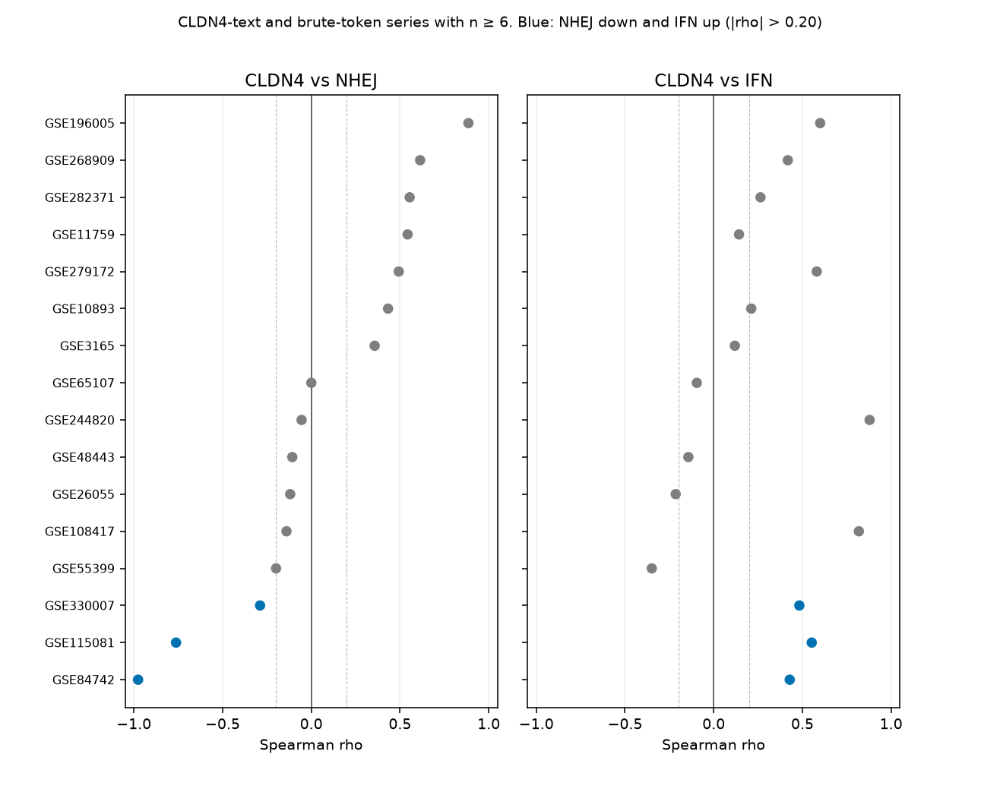

# GEO brute inventory: NHEJ down, IFN up

Additive screen of public GEO series. It does not replace the locked CosMx, concordant-4, GSE137244, TCGA, or TISMO results. The GSE50927 no-VILI EdgeR table is unchanged; the row below only re-reads the author logFC file with this wave’s gene sets.

Searched 2026-09-21, GEO database `gds`, entry type GSE.

## Search counts

| Query | GSE count | Downloaded |
|---|---:|---|
| Strict: `(CLDN4 OR Cldn4) AND ("DNA repair" OR NHEJ OR PRKDC OR STING OR cGAS OR interferon)` | **0** | — |
| Brute token: claudin/CLDN/CLDN4 and a pathway term, with STING1 / “cGAS” instead of the MeSH-expanded bare tokens | 7 | yes |
| CLDN4 or claudin-4 in the series text | 25 | yes |
| NHEJ | 149 | yes |
| PRKDC | 67 | yes |
| STING1, TMEM173, “stimulator of interferon genes”, or “cGAS-STING” | 506 | yes |
| cGAS or cyclic GMP-AMP in the title | 199 | yes |
| “DNA repair” anywhere in the record | 2525 | yes |
| “DNA repair” in the title only | 296 | already inside the row above |
| interferon (MeSH-expanded) | 6219 | count only |
| bare STING (MeSH expands toward “bites and stings”) | 969 | count only |

Unique series in the download catalog: **3236**.

## What was opened

An open matrix is an FTP series matrix or a supplementary expression table from 8 KB to 25 MB. Direction is CLDN4-high minus CLDN4-low.

NHEJ core, at least 5 of 8: PRKDC, XRCC5, XRCC6, XRCC4, LIG4, NHEJ1, DCLRE1C, PAXX. IFN ISGs, at least 8 of 18: ISG15, MX1, MX2, OAS1, OAS2, OAS3, IFIT1, IFIT2, IFIT3, IFI44, IFI44L, EIF2AK2, IRF7, STAT1, RSAD2, BST2, ISG20, CXCL10. cGAS and STING1 are reported beside the score and are not inside the IFN mean.

| Outcome | Series |
|---|---:|
| Spearman census (CLDN4 present, module coverage, n ≥ 6) | 923 |
| Other scored matrices (short ratios, paired titles, or n < 6) | 133 |
| CLDN4 absent from the open file, or the file did not parse | 614 |
| Only a raw tar, or no gene table | 218 |
| Matrix over 25 MB | 293 |
| No open matrix under 25 MB | 33 |
| More than 1500 samples | 3 |
| Not an expression series | 973 |
| CLDN4 present, module coverage short | 41 |
| Parse error | 5 |

Parse errors, left unscored: GSE278208, GSE223418, GSE273617, GSE4556 (xls, xlrd not installed), GSE87407.

## Spearman census (n = 923)

Each gene is z-scored across samples. The NHEJ score and the IFN score are means of those z-scores. A limb counts when |Spearman rho| with CLDN4 is greater than 0.20. BH-FDR is inside this census.

| Joint call | Series |
|---|---:|
| NHEJ down and IFN up | **91** |
| NHEJ up and IFN down | **41** |
| Mixed (one limb flat, or the limbs disagree) | 641 |
| Both flat | 126 |
| Rho undefined | 24 |

IFN up at FDR < 0.05: **148** series. IFN down at FDR < 0.05: 17. NHEJ down at FDR < 0.05: **33**. NHEJ up at FDR < 0.05: 103. Both limbs at FDR < 0.05 in the NHEJ-down / IFN-up direction: **4**. Both limbs the other way: **3**.

Those seven are pathway experiments that happen to measure CLDN4. They are not CLDN4 knockouts.

| Accession | n | rho NHEJ | FDR | rho IFN | FDR | Call |
|---|---:|---:|---:|---:|---:|---|
| GSE252568 | 42 | −0.547 | 0.0027 | +0.592 | 0.00056 | down / up |
| GSE103637 | 24 | −0.826 | 0.000024 | +0.891 | 2.0×10⁻⁷ | down / up |
| GSE263846 | 51 | −0.609 | 0.000063 | +0.567 | 0.00026 | down / up |
| GSE305504 | 18 | −0.819 | 0.00069 | +0.772 | 0.0022 | down / up |
| GSE315862 | 36 | +0.650 | 0.00040 | −0.688 | 0.000083 | up / down |
| GSE317774 | 48 | +0.582 | 0.00035 | −0.595 | 0.00017 | up / down |
| GSE224182 | 57 | +0.676 | 3.3×10⁻⁷ | −0.532 | 0.00036 | up / down |

## Series whose text says CLDN4 or matched the brute token

32 series. 19 scored, 7 were not expression, 6 had no usable open matrix. Sixteen of the scored series entered the Spearman census: **3** NHEJ-down / IFN-up, **0** the opposite, 11 mixed, 2 flat. None of the three has both limbs at FDR < 0.05.

| Accession | n | rho NHEJ (FDR) | rho IFN (FDR) |
|---|---:|---|---|
| GSE84742 colon barrier | 8 | −0.976 (0.00069) | +0.429 (0.54) |
| GSE115081 Caco-2 / ochratoxin | 12 | −0.762 (0.031) | +0.552 (0.20) |
| GSE330007 vocal-fold lesions | 20 | −0.289 (0.45) | +0.483 (0.12) |

GSE108417 (airway epithelium, n = 12) is the strongest IFN correlation in this block, rho +0.818, FDR 0.010. Its NHEJ rho is −0.140, inside the flat band, so the joint call stays mixed.

## CLDN4 perturbations

| Series | Contrast | NHEJ | IFN |
|---|---|---|---|
| GSE207704 | Breast CLDN4 knockout, two lines. WT minus KO on log2(FPKM+1). CLDN4 itself +0.857 | **−0.051** (flat; 8/8 genes) | **+0.550** (10 genes) |
| GSE22493 | Ovarian CLDN4 knockdown versus overexpression, 3 two-channel replicate ratios, oriented CLDN4-high minus CLDN4-low | **−0.093** | **+0.001** |
| GSE50927 | Author EdgeR table `Cldn4lungWTvsKOgenes`, Cldn4 logFC **−6.061** (KO minus WT). Flipped to CLDN4-high minus low. Not the VILI files | **−0.042** | **−0.670** |

GSE207704: IFN is higher in the CLDN4-intact cells, NHEJ mRNA is flat. GSE22493: both modules are flat. GSE50927: IFN is lower on the CLDN4-high side of the author table, which is the same direction as IFN rising after Cldn4 loss, and NHEJ is flat. That matches the locked no-VILI reading. This wave’s mean of author logFCs is not a new EdgeR test and does not replace it.

## Reading

The strict intersection the query asked for is empty, because GEO series records rarely contain both the symbol CLDN4 and those pathway words. In the matrices that could be scored, samples with higher CLDN4 more often have lower NHEJ and higher IFN than the reverse (91 versus 41), and much more often fail one of the two limbs (641 mixed). FDR does not separate the two joint directions (4 versus 3). The CLDN4 knockout and knockdown tables do not show a joint NHEJ-down and IFN-up effect.

