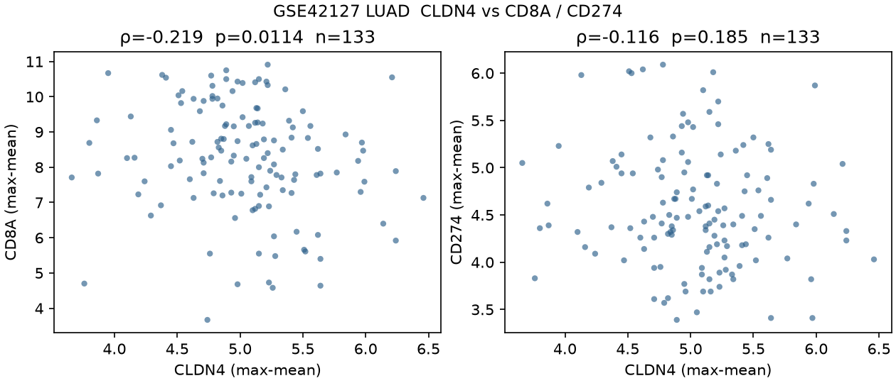

# GSE42127 — LUAD bulk CLDN4 vs CD8A / CD274

**Additive only.** Public Tang / MD Anderson resected NSCLC Illumina HumanWG-6 v3.0 series (Tang et al., *Clin Cancer Res* 2013, PMID 23357979; GEO [GSE42127](https://www.ncbi.nlm.nih.gov/geo/query/acc.cgi?acc=GSE42127); GPL6884). Unit is the **LUAD tumor array**. Squamous arrays are counted and dropped. No ICI arm. No slide was re-scored.

## Honest n

| item | n | rule |
|---|---:|---|
| arrays on the series matrix | 176 | GEO `GSE42127_series_matrix.txt.gz`; 48,803 ILMN probes |
| unique GSM | 176 | all unique |
| `source` = Non-Small-Cell Lung Cancer | 176 | every array |
| LUAD (`histology: Adenocarcinoma`) | **133** | primary filter |
| LUSC (`histology: Squamous`) | 43 | dropped |
| other / missing histology | 0 | dropped |
| normals / adjacent | 0 | none deposited |
| CLDN4 finite (max-mean) | 133 | official GPL6884 `Symbol` = CLDN4 / Entrez 1364 |
| CD8A finite (max-mean) | 133 | official GPL6884 `Symbol` = CD8A / Entrez 925 |
| CD274 finite (max-mean) | 133 | official GPL6884 `Symbol` = CD274 / Entrez 29126 |
| **Primary pairwise n (CLDN4 + CD8A)** | **133** | LUAD complete-case |
| **Primary pairwise n (CLDN4 + CD274)** | **133** | LUAD complete-case |
| ICI response | 0 | adjuvant-chemo surgical series; no PD-1/PD-L1 labels |
| published ESTIMATE / purity | 0 | not deposited |

Do not write n=176 for the correlations. The computable LUAD n is **133** adenocarcinoma arrays. The series-level n=176 mixes LUAD and squamous.

## One-row table

| dataset | histology | platform | n LUAD | CLDN4 probe | CD8A probe | CD274 probe | CLDN4–CD8A ρ (p) | CLDN4–CD274 ρ (p) |
|---|---|---|---:|---|---|---|---|---|
| GSE42127 Tang | LUAD | GPL6884 Illumina WG-6 v3 | **133** | `ILMN_2132458` | `ILMN_2353732` | `ILMN_1701914` | **-0.219 (0.0114)** | **-0.116 (0.185)** |

**What holds.** On LUAD arrays, higher CLDN4 tracks lower CD8A (n=133, ρ=-0.219, p=0.0114). The epithelial residual stays inverse (ρ_adj=-0.196, p=0.024).

**What does not hold.** CLDN4 vs CD274 is not significant (ρ=-0.116, p=0.185; CI crosses zero). This is not an ICI-response test.

Full numeric rows: `tables/one_row.tsv`, `tables/spearman.tsv`.

## Matrix and labels (nothing invented)

GEO series-matrix processed Illumina intensity (author-deposited; values span ~3–11, consistent with log2 BeadStudio). Tests use native ranks (Spearman), so a further log transform would not change ρ.

| field | public? | n | what is there |
|---|---|---:|---|
| histology | yes | 176 | Adenocarcinoma 133 / Squamous 43 |
| stage (`final.pat.stage`) | yes | 176 | IA–IV + 1 unknown; not used as a filter |
| adjuvant chemo (`had_adjuvant_chemo`) | yes | 176 | TRUE 49 / FALSE 127 |
| OS months / status | yes | 176 | deposited; **not** an ICI endpoint; not modelled here |
| ICI / PD-1 response | **no** | 0 | not an ICI series |
| tumor % / ABSOLUTE purity | **no** | 0 | only public proxy is an RNA epithelial score |

Max-mean unique-mapped GPL6884 probe (official `Symbol`; first `///` token; empty symbols dropped):

| gene | Entrez | n probes on GPL6884 | chosen probe | note |
|---|---:|---:|---|---|
| CLDN4 | 1364 | 1 | `ILMN_2132458` | single official Symbol match |
| CD8A | 925 | 3 | `ILMN_2353732` | max-mean of 3 probes |
| CD274 | 29126 | 1 | `ILMN_1701914` | aliases PDL1 / PDCD1LG1 / B7H1 on the same probe |

## Primary Spearman (LUAD n=133)

Pairwise-complete Spearman ρ, two-sided p, 2,000-resample bootstrap 95% CI (seed `20260817`). Partial residualises ranks on the pan-epithelial mean-z (5/6 of EPCAM / KRT8 / KRT18 / KRT19 / CDH1 / KRT7; **EPCAM is absent** on GPL6884); df = n − 3. The epithelial residual is a **sensitivity** row, not the primary claim.

| pair | n | ρ | 95% CI | p | ρ_adj epi | p_adj |
|---|---:|---:|---|---:|---:|---:|
| CLDN4 vs **CD8A** | 133 | **-0.219** | -0.374 to -0.054 | 0.0114 | -0.196 | 0.024 |
| CLDN4 vs **CD274** | 133 | **-0.116** | -0.272 to 0.046 | 0.185 | -0.071 | 0.418 |
| CLDN4 vs epithelial mean-z | 133 | 0.427 | 0.281 to 0.559 | 3.07e-07 | — | — |

CLDN4 Q4 vs Q1 on CD8A: 34 vs 35; MWU p=0.0672; rank-biserial -0.26.
CLDN4 Q4 vs Q1 on CD274: 34 vs 35; MWU p=0.285; rank-biserial -0.15.

## Named-probe sensitivity (same 133 LUAD arrays)

Max-mean CD8A uses `ILMN_2353732`. The other two official CD8A probes are the same sign; `ILMN_1760374` is weaker.

| CD8A probe | vs CLDN4 ρ | p | max-mean? |
|---|---:|---:|---|
| `ILMN_2353732` | -0.219 | 0.0114 | yes |
| `ILMN_1768482` | -0.200 | 0.0207 | no |
| `ILMN_1760374` | -0.148 | 0.0899 | no |

CD274 and CLDN4 each have one official Symbol probe. Full rows: `tables/named_probe_sensitivity.tsv`.

## What this does not test

- ICI response, PFS, or ORR (not on GEO).
- OS modelling (labels exist; this slice is CLDN4 vs CD8A / CD274 only).
- Pathologist CD8 / PD-L1 IHC.
- A LUAD-wide law. This is one public Illumina WG-6 v3 series.
- ESTIMATE / ABSOLUTE purity (not deposited; epithelial mean-z is the only residual shown).

## Extra figure



## Files

- `analyze.py` — GEO download, LUAD filter, max-mean collapse, Spearman, figures
- `tables/one_row.tsv`, `spearman.tsv`, `honest_n.tsv`, `probe_confirm.tsv`, `named_probe_sensitivity.tsv`, `sample_annotation.tsv`, `summary.json`
- `figures/fig1_cldn4_vs_cd8a_cd274.png`

```bash
python3 -m pip install -r methods/gse42127_cldn4/requirements.txt
python3 methods/gse42127_cldn4/analyze.py
```
