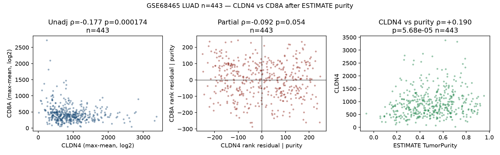

# GSE68465 LUAD: CLDN4 vs CD8A after ESTIMATE purity

Additive CLDN4 slice. **TACSTD2 is taken as given** from [PR #235](https://github.com/jinxuanhong1-blip/sdaxcge/pull/235): TACSTD2 vs CD8 partial ρ = **−0.17**, p = **3e-4**, n = 443. That TACSTD2 residual is not re-estimated here.

Question: in the public Director's Challenge LUAD microarray (GSE68465, n=443 tumors), how does **CLDN4** associate with **CD8A** before and after ESTIMATE TumorPurity?

Public processed series matrix only. Pairwise-complete Spearman ρ, two-sided p, 2,000-resample bootstrap 95% CI (seed `20260817`). Partial ρ residualizes ranks on ESTIMATE TumorPurity (Pearson of rank residuals; df = n − 3).

## Cohort

| Item | Value |
|---|---|
| GEO | [GSE68465](https://www.ncbi.nlm.nih.gov/geo/query/acc.cgi?acc=GSE68465) |
| Title | caArray_jacob-00182: gene expression–based survival prediction in lung adenocarcinoma (Director's Challenge) |
| Platform | GPL96 Affymetrix Human Genome U133A |
| Matrix | 462 arrays (22,283 probes) |
| Tumors used | **n = 443** `disease_state = Lung Adenocarcinoma` |
| Held out | 19 `Normal` arrays |
| Genes after max-mean collapse | 13,101 |
| ESTIMATE coverage | stromal **136 / 141**, immune **138 / 141** |
| ICI labels | none (surgical / multi-site prognostic series) |

Named probes are on GPL96 and in the matrix: CLDN4 `201428_at` (Entrez 1364), CD8A `205758_at` (Entrez 925). Max-mean collapse selects those same probes (single probe per gene on U133A). Complete-case n for CLDN4, CD8A, and TumorPurity is **443 / 443**.

## Primary result — CLDN4 vs CD8A

Unadjusted CLDN4–CD8A is inverse (ρ = −0.177, p = 1.7e-4). After ESTIMATE TumorPurity the residual is **ρ = −0.092, p = 0.054**; the bootstrap CI crosses zero. CLDN4 tracks purity (ρ = +0.190); CD8A is strongly inverse with purity (ρ = −0.533). The unadjusted inverse CLDN4–CD8A association is therefore largely a purity / immune-content effect in this series.

| Predictor | Endpoint | n | ρ | 95% CI | p | Partial \| TumorPurity (n, ρ, 95% CI, p) |
|---|---|---:|---:|---|---:|---|
| CLDN4 | CD8A | 443 | −0.177 | −0.268 to −0.078 | 1.7e-4 | 443, **−0.092**, −0.181 to +0.005, **0.054** |
| CLDN4 | ESTIMATE ImmuneScore | 443 | −0.209 | −0.301 to −0.116 | 9.4e-6 | 443, −0.091, −0.186 to +0.005, 0.056 |
| CLDN4 | ESTIMATE StromalScore | 443 | −0.141 | −0.229 to −0.050 | 0.0030 | 443, +0.097, +0.000 to +0.191, 0.042 |
| CLDN4 | ESTIMATE TumorPurity | 443 | +0.190 | +0.096 to +0.279 | 5.7e-5 | — |
| CD8A | ESTIMATE TumorPurity | 443 | −0.533 | −0.595 to −0.460 | 7.3e-34 | — |
| CD8A | ESTIMATE ImmuneScore | 443 | +0.598 | +0.529 to +0.656 | 2.4e-44 | — |

Named-probe CLDN4 `201428_at` vs CD8A `205758_at` is identical to the collapsed row (same probes).

### Sensitivity residuals (same 443 tumors)

TumorPurity is a monotone cosine of ESTIMATEScore, so residualizing on ESTIMATEScore equals residualizing on TumorPurity. Residualizing on ImmuneScore alone attenuates further.

| Residual | n | Partial ρ | 95% CI | p |
|---|---:|---:|---|---:|
| ESTIMATE TumorPurity (primary) | 443 | −0.092 | −0.181 to +0.005 | 0.054 |
| ESTIMATE Score (stromal + immune) | 443 | −0.092 | −0.181 to +0.005 | 0.054 |
| ESTIMATE ImmuneScore | 443 | −0.067 | −0.159 to +0.031 | 0.16 |

## Given TACSTD2 (not re-run)

From PR #235, GSE68465 TACSTD2 vs CD8 after the same ESTIMATE TumorPurity residual is **partial ρ = −0.17, p = 3e-4, n = 443** (reported −0.170, p = 3.2e-4; unadj −0.152, p = 0.0014). That TACSTD2 table is not re-downloaded or re-fit here.

On this CLDN4 slice the purity-residual CD8 association is weaker than that given TACSTD2 residual and is not significant at α = 0.05.

## Extra figure



## Methods (short)

- **Source:** GEO GSE68465 series matrix (Shedden / Director's Challenge; Jacob et al. training–testing LUAD). Paper context: Shedden et al., *Nat Med* 2008.
- **Tumor filter:** `disease_state` contains `Adenocarcinoma` (443). Normals dropped.
- **Collapse:** max-mean probe → HUGO (first `///` symbol from official GPL96 annotation).
- **CD8:** single gene `CD8A`.
- **GEO purity:** ESTIMATE ssGSEA (Barbie/GSVA τ = 0.25, ranks scaled 1…10000) on Yoshihara 2013 Stromal141 + Immune141, then `TumorPurity = cos(0.6049872018 + 0.0001467884 × ESTIMATEScore)`. Gene list: `data/signatures/estimate_yoshihara_2013.tsv` (Supp Data 1).
- **Partial Spearman:** rank-transform X, Y, and TumorPurity; residualize X and Y ranks on the purity rank; Pearson of residuals; df = n − 3.
- **Not done:** no TACSTD2 re-fit; no GEP18 (that row lives on PR #235); no ICI response model (this series has no ICI labels); no gene-set fishing.

## Reproduce

```bash
python3 -m pip install -r requirements.txt
mkdir -p data/gse68465
curl -fL -o data/gse68465/GSE68465_series_matrix.txt.gz \
  https://ftp.ncbi.nlm.nih.gov/geo/series/GSE68nnn/GSE68465/matrix/GSE68465_series_matrix.txt.gz
curl -fL -o data/gse68465/GPL96.annot.gz \
  https://ftp.ncbi.nlm.nih.gov/geo/platforms/GPLnnn/GPL96/annot/GPL96.annot.gz
python3 methods/gse68465_cldn4/analyze.py
```

Tables: `methods/gse68465_cldn4/tables/`. Figure: `methods/gse68465_cldn4/figures/`.
