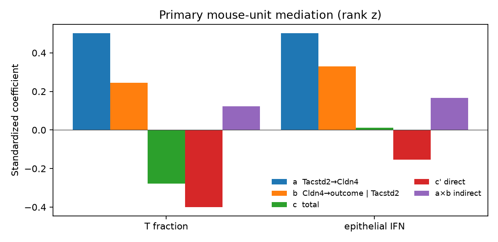
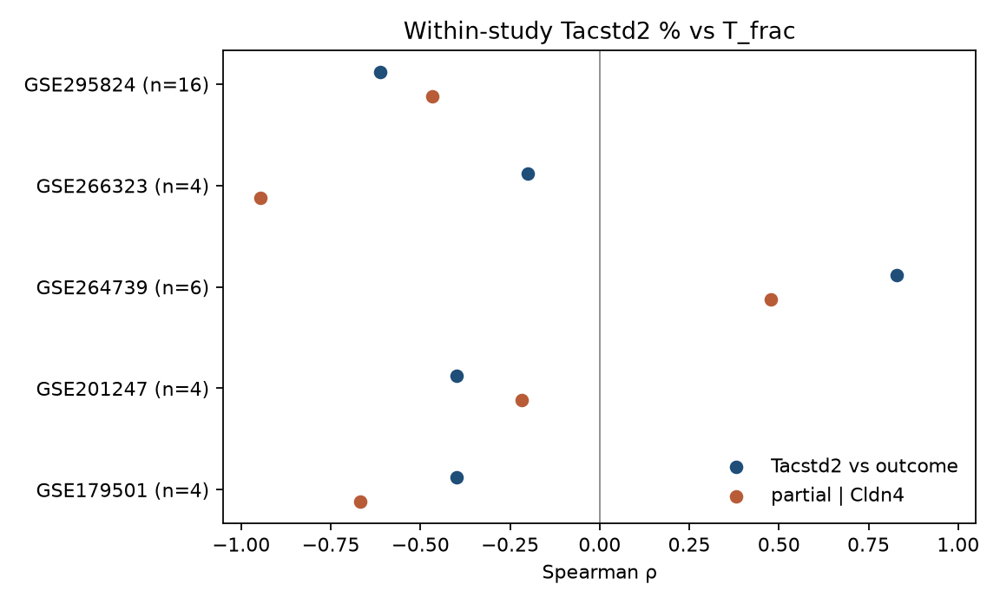
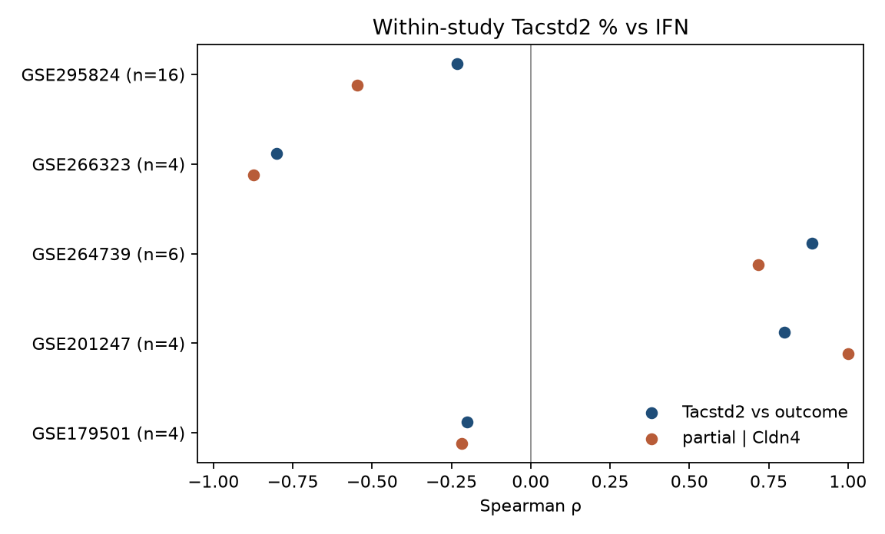
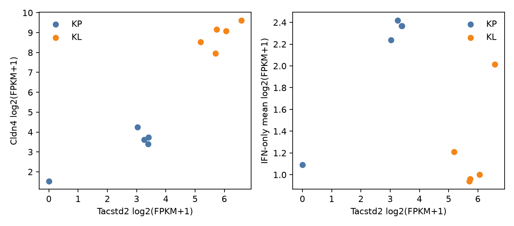

# Tacstd2, partial Cldn4, and mouse-unit mediation

Public data only. Private 8 KL matrices were not read and were not merged with these series.

Two units are kept apart. GSE137244 is ten KL/KP cell-line libraries and has no T-cell fraction. The mediation test is one row per biological mouse.

## Mouse gate

QC is 200–8000 genes, at least 500 UMIs, and mitochondrial fraction under 0.25. Epithelium is Epcam > 0 or Sftpc > 0 or (Krt8 > 0 and Ptprc = 0). T/NK is Cd3d, Cd3e, Nkg7, or Ncr1 > 0. T fraction is that count divided by QC cells. IFN is the mean log1p(CP10k) of Stat1, Stat2, Irf1, Irf7, Irf9, Isg15, Ifit1, Ifit2, Ifit3, Mx1, Oasl2, Rsad2, Ifih1, Ddx58, and Ifnb1 inside epithelial cells. Tacstd2 % and Cldn4 % are the fractions of those epithelial cells with a count above 0.

This gate reproduces the published rescore on GSE264739 and GSE295824: 22/22 mice match n_QC, n_epi, Cldn4 %, T/NK fraction, and IFN. Tacstd2 was then scored on the same cells.

WT ATTAC lungs in GSE201247 are scored and left out of the primary pool. Studies with fewer than 4 primary mice are listed and not entered into a correlation.

## Primary mouse result

The primary pool is 34 mice in five studies: GSE295824 (16), GSE264739 (6), GSE201247 tumor (4), GSE266323 (4), and GSE179501 (4). Within each study, Tacstd2 %, Cldn4 %, and the outcome are converted to ranks and then z-scored. OLS on the concatenated values gives the path coefficients. The indirect effect is a × b. The interval is a stratified bootstrap. The p-value is a within-study permutation, (1 + count) / (1 + 5000).

These studies are not a KL versus KP experiment. GSE295824 is a Sox2 GEMM, GSE264739 is KP versus KPP, GSE201247 is Kras versus ATTAC-Kras, GSE266323 is Malat1 CRISPRa versus tomato, and GSE179501 is Lkb1-XTR restored versus not.

Tacstd2 % tracks Cldn4 %: standardized a = 0.502, permutation p = 0.0054.

| outcome | total c | c p | direct c′ | partial r | partial p | indirect a×b | bootstrap 95% | indirect p |
|---|---:|---:|---:|---:|---:|---:|---|---:|
| T fraction | −0.277 | 0.137 | −0.400 | −0.346 | 0.065 | +0.123 | −0.136 to +0.291 | 0.268 |
| epithelial IFN | +0.012 | 0.946 | −0.154 | −0.138 | 0.461 | +0.166 | −0.064 to +0.532 | 0.129 |

The indirect intervals include zero. For T fraction the direct coefficient is further from zero than the total coefficient, and the indirect path is positive while the total path is negative. Removing Cldn4 does not account for the Tacstd2–T association.

### Within study

Spearman tests use the exact permutation when n ≤ 7. A study of 4 mice cannot reach p < 0.083.

| study | n | T fraction ρ | p | partial \| Cldn4 | partial p | IFN ρ | IFN p | IFN partial | IFN partial p |
|---|---:|---:|---:|---:|---:|---:|---:|---:|---:|
| GSE295824 | 16 | −0.612 | 0.012 | −0.468 | 0.082 | −0.232 | 0.383 | −0.546 | 0.036 |
| GSE264739 | 6 | +0.829 | 0.058 | +0.477 | 0.406 | +0.886 | 0.033 | +0.718 | 0.167 |
| GSE201247 | 4 | −0.400 | 0.75 | −0.218 | 0.92 | +0.800 | 0.33 | +1.00 | 0.25 |
| GSE266323 | 4 | −0.200 | 0.92 | −0.946 | 0.25 | −0.800 | 0.33 | −0.873 | 0.33 |
| GSE179501 | 4 | −0.400 | 0.75 | −0.667 | 0.50 | −0.200 | 0.92 | −0.218 | 0.92 |

GSE295824 is the study in which higher Tacstd2 % goes with lower T fraction. The partial correlation stays negative (p = 0.082). Dropping any one of the 16 mice leaves the Spearman between −0.75 and −0.53. In that study the Cldn4 coefficient in the outcome regression is negative, so the indirect product is small (−0.098) beside the total coefficient (−0.612).

GSE264739 points the other way. KP mice have higher Tacstd2 % and higher T fraction than KPP mice. The IFN Spearman is +0.886 (exact p = 0.033) and the partial given Cldn4 is +0.718 (p = 0.167).

GSE201247 epithelial Cldn4 % sits between 0.0006 and 0.0014, so the mediator has almost no range.

### Sensitivities

These do not replace the primary rows.

- Raw z-scores instead of rank z-scores: T-fraction indirect p = 0.42 (interval −0.163 to +0.256). The partial correlation is −0.369, permutation p = 0.049. IFN indirect permutation p = 0.040, with bootstrap interval −0.002 to +0.770, and the total Tacstd2–IFN coefficient is +0.065 (p = 0.74).
- Gene means instead of percents: T-fraction indirect p = 0.51; IFN indirect p = 0.11.
- Genotype residuals, restricted to studies with residual df ≥ 3 (GSE295824 and GSE264739, 22 mice): T-fraction total coefficient −0.139 (p = 0.54); indirect p = 0.89. IFN total coefficient −0.015 (p = 0.95); indirect p = 0.83.

### Two-mouse series

GSE165641 (two KL) and GSE180963 (one K, one KL) are scored with the same gate and are not tested. In GSE180963 the KL mouse has Tacstd2 % 0.060 versus 0.020, Cldn4 % 0.0038 versus 0.00019, T fraction 0.476 versus 0.518, and IFN 0.214 versus 0.145. Cldn4 is nearly absent in both.

## GSE137244 cell lines

log2(FPKM+1) on the GEO FPKM. The locked KL−KP deltas are recovered: Cldn4 +5.570, Tacstd2 +3.238. IFN is the same 15-gene mean. There is no T fraction.

On the 10 tumor libraries, Tacstd2 versus Cldn4 Spearman ρ = 0.891 (permutation p = 0.0016). Tacstd2 versus IFN ρ = −0.455 (p = 0.19). Partial IFN given Cldn4 ρ = −0.097 (p = 0.83). Within KP (n = 5) the IFN Spearman is +0.70 (exact p = 0.23). Within KL it is +0.40 (exact p = 0.52).

A KL-indicator residual on the 10 libraries gives a positive Tacstd2–IFN Spearman (ρ = 0.830, p = 0.0058; partial given Cldn4 ρ = 0.662, p = 0.049). That residual is sensitive to B6AL10-3, the KP library with Epcam log2(FPKM+1) = 1.23 and Tacstd2 = 0. Dropping libraries below Epcam log2 4 leaves 9 libraries, Tacstd2 versus IFN ρ = −0.65 (p = 0.064), partial ρ = −0.180 (p = 0.69).

## Marker-rule table, not pooled

An earlier public marker-rule mouse table already had Tacstd2. Those rows are not z-scored together with the count-gate mice. GSE165641, GSE180963, and GSE179501 are omitted here because they are rescored above.

| series | outcome | n | Spearman | p | partial \| Cldn4 | partial p |
|---|---|---:|---:|---:|---:|---:|
| GSE136246 KP mixed lung | T fraction | 7 | +0.071 | 0.91 | +0.076 | 0.88 |
| GSE136246 | epithelial IFN | 7 | +0.214 | 0.66 | +0.376 | 0.45 |
| GSE154977 KP AT2 sort | epithelial IFN | 4 | +0.800 | 0.33 | +0.316 | 0.79 |
| GSE154989 K/KP plate | epithelial IFN | 24 | +0.688 | 0.00020 | +0.697 | 0.00080 |
| GSE154989, K vs KP removed | epithelial IFN | 24 | +0.578 | 0.0026 | +0.545 | 0.0050 |
| GSE179502 sorted neoplastic | epithelial IFN | 6 | −0.429 | 0.42 | −0.877 | 0.058 |

GSE136246 has no Tacstd2–Cldn4 rank association (Spearman 0), so there is no path through Cldn4. GSE154989 plate tumor cells have a positive Tacstd2 %–IFN association that remains after Cldn4 and after a K versus KP indicator. The indirect coefficient on that series is −0.017, and Tacstd2 % versus Cldn4 % is ρ = 0.150 (p = 0.48). That series has no T-cell fraction.

## What this supports

Across the 34-mouse pool, epithelial Tacstd2 % and Cldn4 % move together. The product Tacstd2 → Cldn4 → T fraction, and the product Tacstd2 → Cldn4 → epithelial IFN, have bootstrap intervals that include zero. In the one study with a negative Tacstd2–T Spearman, the partial correlation given Cldn4 stays negative. On GSE137244 the KL libraries are higher for both genes, and the 10-library Tacstd2–IFN correlation is compatible with noise once Cldn4 is partialled.
