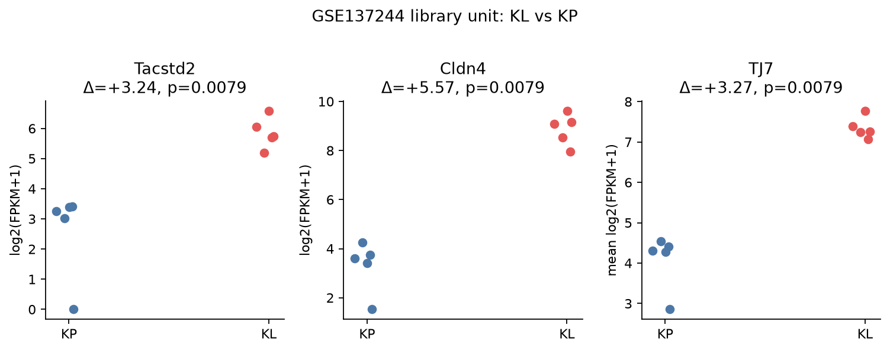
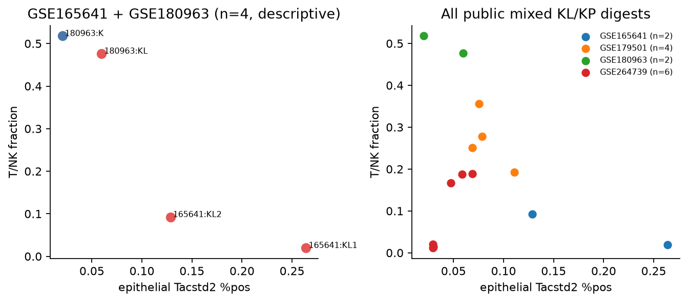
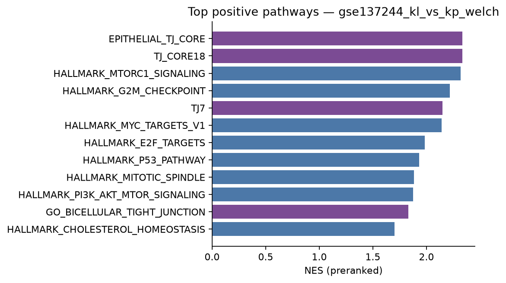
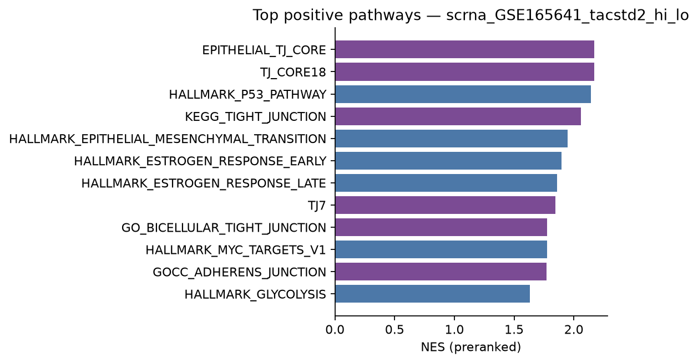

# FINDING — Paper funnel, public mouse step

**PPT narrative:** TROP2-high → resistance → TJ → immune-cold.

**This step:** public mouse evidence on [GSE137244](https://www.ncbi.nlm.nih.gov/geo/query/acc.cgi?acc=GSE137244) and open KL/KP GEMM scRNA. **Private 8KL matrices were not opened and were not merged with any public series.**

Unit of inference is the **library** (GSE137244) or the **biological mouse** (scRNA). Cell-level enrichment ranks are descriptive (pseudoreplication); they answer the pathway question, not an independent-mouse p-value.

---

## Slide answers (three questions)

### (1) Are Tacstd2 / Cldn4 / TJ higher in KL vs KP?

**Yes on GSE137244 (library unit). That is the public KL>KP call.**

| feature | Δ log2(FPKM+1) KL−KP | exact MW p | separation |
|---|---:|---:|---|
| Tacstd2 | **+3.238** | 0.00794 | all 5 KL > all 5 KP |
| Cldn4 | **+5.570** | 0.00794 | all 5 KL > all 5 KP |
| TJ7 (Cldn3/4/6/7, Cdh1, F11r, Ocln) | **+3.269** | 0.00794 | complete |
| TJ_CORE18 (structural epithelial TJ) | **+1.627** | 0.00794 | complete |

Handoff rounding is Tacstd2 +3.24, Cldn4 +5.57. The locked TJ figure **+3.03** used a different average; the closest honest published-scale mean on this matrix is **TJ7 +3.27**. Do not relabel +3.27 as +3.03.

Genotype check on the same scale: Stk11 Δ=−2.523, Trp53 Δ=+2.433 (both complete, same floor). Arm labels match.

**Public scRNA cannot add a second KL-versus-KP Δ.** No open matrix contains both KL and KP with usable mouse n on both arms (catalog PR #653; this run). GSE180963 is 1 K vs 1 KL (descriptive only): epithelial Tacstd2 % 0.060 vs 0.020, Cldn4 % 0.0038 vs 0.00019, TJ7 mean 0.089 vs 0.074 — same direction as the cell lines, n=1 vs 1, no test.

### (2) Do Tacstd2-high samples have lower T/NK fraction?

**Directionally yes in every mixed K/KL digest scored here; the strongest honest |ρ| is −1 on four mice (exact p floor 0.083). One KP/KPP series points the other way.**

Gate (matches the public GEMM rescore): QC 200–8000 genes, ≥500 UMI, mt < 0.25; epithelium = Epcam>0 or Sftpc>0 or (Krt8>0 and Ptprc=0); T/NK = Cd3d/Cd3e/Nkg7/Ncr1 > 0; Tacstd2 % = fraction of epithelial cells with count > 0. Scores on GSE165641 / GSE180963 / GSE179501 / GSE264739 match the prior mediation table (PR #724) to numerical identity.

| accession | n mice | ρ (Tacstd2 % vs T/NK) | exact p | PPT use |
|---|---:|---:|---:|---|
| GSE165641 + GSE180963 (descriptive) | 4 | **−1.000** | 0.083 | Max honest \|ρ\|; within-study orders agree; **not** a pooled model |
| GSE179501 (Lkb1-XTR mixed) | 4 | **−0.400** | 0.75 | Same sign; n=4 cannot clear 0.05 |
| GSE165641 alone | 2 | −1 (two-point) | 1.0 | Descriptive |
| GSE180963 alone | 2 | −1 (two-point) | 1.0 | Descriptive |
| GSE264739 (KP vs KPP) | 6 | **+0.829** | 0.058 | Honest opposite: KP has higher Tacstd2 % and higher T/NK than KPP |

GSE154977 is an AT2 FACS sort — T/NK fraction is not a valid endpoint (T cells essentially absent).

**PPT line:** public K/KL mixed digests put Tacstd2-high with lower T/NK (strongest honest four-mouse ρ=−1, p=0.083 floor). Do not quote GSE264739 as immune-cold support. Do not merge with private 8KL to inflate n.

### (3) Tacstd2-high vs low malignant DEG — is tight junction / junction the TOP pathway?

**Yes on the KL-resistant cell-line matrix (GSE137244). Yes on the public KL GEMM scRNA (GSE165641). Not always on every KP-only digest.**

Preranked GSEA (gseapy, 1000 gene permutations) on Welch-t ranks. Collection = mouse Hallmarks + curated TJ7/TJ_CORE18 + GO/KEGG junction-related sets filtered from Enrichr libraries. EPITHELIAL_TJ_CORE and TJ_CORE18 are the same 18 genes listed twice; they tie.

| matrix | contrast | top positive term | NES | best TJ term | TJ rank among positive | TJ is #1? |
|---|---|---|---:|---|---:|---|
| **GSE137244** | KL vs KP (= Tacstd2 median split) | **EPITHELIAL_TJ_CORE** | **2.34** | same | **1** | **YES** |
| **GSE165641** | epi Tacstd2+ vs 0 | **EPITHELIAL_TJ_CORE** | **2.17** | same | **1** | **YES** |
| GSE264739 | epi Tacstd2+ vs 0 | GO adherens junction | 2.21 | EPITHELIAL_TJ_CORE (NES 2.07) | 4 | no |
| GSE154977 | AT2 Tacstd2+ vs 0 | Hallmark IL2–STAT5 | 1.92 | EPITHELIAL_TJ_CORE (NES 1.73) | 7 | no |
| GSE179501 | epi Tacstd2+ vs 0 | Hallmark OXPHOS | 2.34 | TJ_CORE18 (NES 1.38) | 12 | no |
| GSE180963 | epi Tacstd2+ vs 0 | Hallmark OXPHOS | 2.74 | (no positive TJ hit) | — | no |

On GSE137244, GO bicellular tight junction NES=+1.83 (rank 11 among positive) and KEGG tight junction NES=+1.69. The **structural epithelial TJ core is the top hit** in the tested collection; broad GO/KEGG TJ lists are positive but not #1. Hallmark apical junction is not the leading edge (it is a cytoskeletal mix).

**PPT line:** in the public KL-resistant cell lines, and again in public KL GEMM epithelium, Tacstd2-high ranks a tight-junction program first. That is the pathway support for the TROP2 → TJ limb. Do not claim TJ is #1 in every KP-only scRNA digest.

---

## How this maps to the funnel

| Funnel limb | Public mouse support | Honest limit |
|---|---|---|
| TROP2-high in resistance (KL) | GSE137244 Tacstd2 Δ=+3.24, complete, p=0.00794 | Library n=5 vs 5; near-replicate floor if collapsed |
| → TJ | GSE137244 TJ7 Δ=+3.27; TJ core is **top** GSEA hit (NES 2.34). GSE165641 Tacstd2-high DEG: TJ core **top** (NES 2.17) | Handoff TJ +3.03 ≠ TJ7 +3.27; leave +3.03 as published |
| → immune-cold | K/KL mixed: Tacstd2 % vs T/NK ρ=−1 (n=4 descriptive) and ρ=−0.40 (GSE179501 n=4) | GSE264739 opposite; no public KL+KP scRNA contrast; no private 8KL |

---

## Data and methods

- GSE137244 FPKM (Deng et al., Cancer Discovery 2021). Normal lung held out.
- scRNA: GSE165641 (2 KL), GSE180963 (1 K + 1 KL), GSE179501 (4 Lkb1-XTR), GSE264739 (3 KP + 3 KPP), GSE154977 (4 KP AT2 FACS, DEG only).
- Scripts: `scripts/download.sh`, `scripts/analyze.py`. Tables under `tables/`. `tables/summary.json` is the machine-readable slide card.
- Gene sets: `gene_sets/epithelial_and_isg.gmt`, `junction_controls.gmt`, MSigDB mouse Hallmarks 2024.1, Enrichr GO BP / KEGG junction-filtered terms.

Private 8KL: not used.
