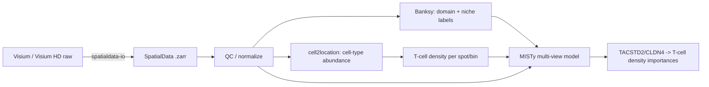

# Spatial Advanced Methods Playbook / 空间转录组进阶方法手册

> **Scope / 范围**: **METHODS ONLY**. This document is a reproducible *methods protocol* for a 2025–2026 spatial-transcriptomics analysis stack. It intentionally contains **no results, no figures, and no biological claims** — only the pipeline, parameters, and rationale needed to run and describe the analysis in a manuscript "Methods" section.
>
> **Stack / 技术栈**: `SpatialData` (data model & I/O) → `Banksy` (niche / domain segmentation) → `cell2location` (cell-type deconvolution & abundance mapping) → `MISTy` (multi-view spatial modeling) applied to a **TACSTD2 / CLDN4 niche → T-cell density** prediction task.
>
> **Platforms / 平台**: 10x Genomics **Visium** and **Visium HD**.
>
> **Bilingual / 双语**: Part I is 中文 (Chinese); Part II is the mirrored English protocol. The code blocks are identical across both parts.

---

## 0. Overview / 总览

| Stage / 阶段 | Tool / 工具 | Version (2025–2026) | Language | Output / 产物 |
|---|---|---|---|---|
| Data model & I/O / 数据模型与读写 | `spatialdata`, `spatialdata-io`, `spatialdata-plot` | `spatialdata >= 0.2`, `spatialdata-io >= 0.1.5` | Python | `SpatialData` (`.zarr`) |
| Niche / domain segmentation / 生态位与区域分割 | `Banksy` (Bioconductor) / `Banksy_py` / `squidpy` niches | `Banksy >= 1.2` (R ≥ 4.4), `squidpy >= 1.6` | R / Python | domain / niche labels |
| Deconvolution / 反卷积 | `cell2location` | `cell2location >= 0.1.4`, `scvi-tools >= 1.1` | Python | per-spot cell-type abundance |
| Spatial modeling / 空间关系建模 | `MISTy` (`mistyR`) | `mistyR >= 1.12` (Bioconductor) | R | view importances, gain.R2 |

**Analytical goal / 分析目标**: quantify whether the epithelial/tumor niche defined by **TACSTD2 (TROP2)** and **CLDN4** predicts local **T-cell density** in the surrounding microenvironment, using MISTy's paracrine/juxtacrine views on cell2location-derived T-cell abundances.



---

# Part I · 中文方法手册

## 1. 环境与依赖

建议使用两个隔离环境:Python 环境承载 `SpatialData` + `cell2location`,R 环境承载 `Banksy` + `mistyR`。二者通过磁盘上的 `.zarr` / `AnnData` (`.h5ad`) / `.csv` 交换数据。

```bash
# ---- Python 环境 (GPU 推荐用于 cell2location) ----
conda create -n spatial_py python=3.11 -y
conda activate spatial_py
pip install "spatialdata>=0.2" "spatialdata-io>=0.1.5" "spatialdata-plot>=0.2" \
            "squidpy>=1.6" "scanpy>=1.10" "anndata>=0.10"
# cell2location + scvi-tools（按官方说明匹配 CUDA 版本的 jax/torch）
pip install "cell2location>=0.1.4" "scvi-tools>=1.1"
```

```r
# ---- R 环境 (R >= 4.4) ----
if (!require("BiocManager")) install.packages("BiocManager")
BiocManager::install(c("Banksy", "SpatialExperiment", "mistyR"))
install.packages(c("tidyverse", "future", "ranger"))
```

> **可复现性 / 随机性**:所有随机步骤(PCA、Leiden、随机森林)必须固定种子。Python 用 `scanpy.settings` + `random_state`;R 用 `set.seed()`。记录 `sessionInfo()` / `pip freeze` 与硬件(GPU 型号、CUDA)。

---

## 2. 数据读取与 SpatialData 数据模型

`SpatialData` 是 2025–2026 年空间组学的统一数据框架,把一份实验组织为一组 **SpatialElement**:`Images`(H&E / 荧光)、`Labels`(分割掩膜)、`Points`(转录本)、`Shapes`(spot / bin 几何)、`Tables`(`AnnData` 表达矩阵)。所有元素通过**坐标变换 (transformations)** 对齐到共享坐标系,避免手工缩放误差。

### 2.1 Visium 读取

```python
import spatialdata as sd
from spatialdata_io import visium

sdata = visium(
    path="raw/visium/sampleA",          # 含 spatial/ 与 filtered_feature_bc_matrix.h5
    dataset_id="sampleA",
    counts_file="filtered_feature_bc_matrix.h5",
)
sdata.write("processed/sampleA.zarr", overwrite=True)
```

### 2.2 Visium HD 读取(2/8/16 µm bin)

Visium HD 产生多分辨率的分箱数据。分析主力通常选 **8 µm bin**(兼顾分辨率与稀疏度);2 µm 用于形态学对齐,16 µm 用于稳健的区域趋势。

```python
from spatialdata_io import visium_hd

sdata = visium_hd(
    path="raw/visium_hd/sampleA",
    dataset_id="sampleA",
    bin_size=[8, 16],          # 读入 8µm 与 16µm；2µm 视需求
    bins_as_squares=True,
    annotate_table_by_labels=True,
)
sdata.write("processed/sampleA_hd.zarr", overwrite=True)
```

> **HD 关键点**:①以 `bin_size` 明确记录分析分辨率;②高分辨率 bin 极稀疏,后续 Banksy 邻域与 cell2location 均需按 bin 尺度调整邻居数;③保留 `Images` 便于 H&E/形态学对照与 QC。

### 2.3 取表达表 `AnnData`

```python
adata = sdata.tables["table"].copy()   # obs 含 spot/bin 坐标（obsm["spatial"]）
adata.var_names_make_unique()
```

---

## 3. 质控与标准化(方法描述)

```python
import scanpy as sc

# QC 指标
adata.var["mt"] = adata.var_names.str.startswith(("MT-", "mt-"))
sc.pp.calculate_qc_metrics(adata, qc_vars=["mt"], inplace=True, percent_top=None)

# 过滤（Visium 用 spot 级阈值；HD 8µm 阈值更低，因单 bin 计数低）
sc.pp.filter_genes(adata, min_cells=3)
sc.pp.filter_cells(adata, min_counts=100)          # HD-8µm 可降至 ~25–50
adata = adata[adata.obs["pct_counts_mt"] < 20].copy()

# 保存原始计数供 cell2location 使用（其模型需要“原始未标准化整数计数”）
adata.layers["counts"] = adata.X.copy()

# 标准化 + log（供聚类/Banksy/可视化；不供 cell2location）
sc.pp.normalize_total(adata, target_sum=1e4)
sc.pp.log1p(adata)
adata.raw = adata
sc.pp.highly_variable_genes(adata, n_top_genes=2000, flavor="seurat_v3", layer="counts")
```

> **原则**:cell2location **必须**使用原始整数计数(存于 `layers["counts"]`);Banksy / 可视化使用 log 标准化数据。切勿混用。

---

## 4. Banksy:生态位与组织区域分割

**BANKSY** 通过把每个 spot/bin 的表达谱与其**空间邻域均值 (M)** 及**方位 Gabor 滤波梯度 (G)** 拼接,构造增广特征矩阵,再做 PCA + 图聚类。关键超参 **λ**:

- `λ = 0`:非空间聚类(等价常规 scRNA 聚类);
- `λ = 0.2`:**细胞分型 (cell-typing)** —— 偏表达、弱空间;
- `λ = 0.8`:**组织区域 / 生态位分割 (domain segmentation)** —— 强空间平滑,得到连续的解剖/微环境区域。

本手册用 `λ = 0.8` 得到**生态位标签**(供 MISTy 分层与解释),并可选 `λ = 0.2` 校核细胞分型。

### 4.1 R / Bioconductor 版(推荐,功能最全)

```r
library(Banksy); library(SpatialExperiment); library(scater)

# 从 h5ad/矩阵构造 SpatialExperiment：assay=counts/logcounts, spatialCoords=坐标
se <- SpatialExperiment(
  assays = list(logcounts = logmat),      # 基因 x spot
  spatialCoords = as.matrix(coords)       # spot x 2 (x,y)
)

# 1) 计算邻域矩阵 M（k_geom[1]=15）与 G（k_geom[2]=30）
se <- Banksy::computeBanksy(se, assay_name = "logcounts",
                            compute_agf = TRUE, k_geom = c(15, 30))

# 2) 区域分割：lambda = 0.8
lambda <- 0.8
set.seed(1000)
se <- Banksy::runBanksyPCA(se, use_agf = TRUE, lambda = lambda, npcs = 20)
se <- Banksy::runBanksyUMAP(se, use_agf = TRUE, lambda = lambda)
se <- Banksy::clusterBanksy(se, use_agf = TRUE, lambda = lambda, resolution = 1.0)

# 3) 多次聚类结果对齐标签
se <- Banksy::connectClusters(se)

# 导出生态位标签供下游
niche <- data.frame(barcode = colnames(se),
                    niche = colData(se)[[grep("clust", colnames(colData(se)))[1]]])
write.csv(niche, "processed/banksy_niche_lambda08.csv", row.names = FALSE)
```

> **HD 提示**:高分辨率 bin 空间密度高,`k_geom` 可适度增大(如 `c(18, 36)`);`lambda=0.8` 的平滑对 8 µm bin 尤其能抑制单 bin 噪声。

### 4.2 Python 备选:`Banksy_py` 或 `squidpy` 生态位

```python
# 备选 A：squidpy 内置生态位（基于邻域组成聚类）
import squidpy as sq
sq.gr.spatial_neighbors(adata, coord_type="grid", n_neighs=6)   # Visium 六边形
sq.gr.calculate_niche(adata, flavor="neighborhood", groups="cell_type",
                      n_neighbors=15, resolution=1.0)
# 结果写入 adata.obs["niche"]

# 备选 B：Banksy_py（与 scanpy 兼容，λ 语义同上）
# from banksy.initialize_banksy import initialize_banksy
# from banksy.run_banksy import run_banksy_multiparam
# banksy_dict = initialize_banksy(adata, coord_keys=('x','y','spatial'), num_neighbours=15)
# results = run_banksy_multiparam(adata, banksy_dict, lambda_list=[0.8], resolutions=[1.0])
```

---

## 5. cell2location:细胞类型反卷积与丰度制图

Visium(以及 HD 的较大 bin)每个 spot/bin 包含多个细胞。**cell2location** 用配套 scRNA-seq 参考,分两步用负二项贝叶斯模型估计每个 spot/bin 的**细胞类型绝对丰度**。T 细胞丰度即由此得到,作为 MISTy 的建模目标。

### 5.1 第一步:从单细胞参考估计基因签名

```python
import cell2location
from cell2location.models import RegressionModel

# ref_adata：带 cell_type 注释的 scRNA-seq，X 为原始整数计数
cell2location.models.RegressionModel.setup_anndata(
    adata=ref_adata,
    batch_key="sample",           # 技术批次
    labels_key="cell_type",       # 细胞类型（含 T 细胞亚型）
)
reg = RegressionModel(ref_adata)
reg.train(max_epochs=250)
ref_adata = reg.export_posterior(ref_adata)

# 导出每类的参考签名（基因 x 细胞类型）
inf_aver = reg.samples["post_sample_means"]["per_cluster_mu_fg"]
```

### 5.2 第二步:空间映射(估计每 spot/bin 丰度)

```python
# 取空间数据与参考共有基因，X 用原始计数
shared = [g for g in adata.var_names if g in inf_aver.index]
adata_sp = adata[:, shared].copy()
adata_sp.X = adata_sp.layers["counts"][:, [adata.var_names.get_loc(g) for g in shared]]

cell2location.models.Cell2location.setup_anndata(adata=adata_sp, batch_key=None)
mod = cell2location.models.Cell2location(
    adata_sp,
    cell_state_df=inf_aver.loc[shared],
    N_cells_per_location=8,        # Visium≈8；HD-8µm 显著更低（≈1–3）
    detection_alpha=20,            # 组织内检测灵敏度差异先验
)
mod.train(max_epochs=30000, batch_size=None, train_size=1)
adata_sp = mod.export_posterior(
    adata_sp, sample_kwargs={"num_samples": 1000, "batch_size": mod.adata.n_obs}
)

# 后验 5% 分位数作为保守的丰度估计（列=细胞类型）
abund = adata_sp.obsm["q05_cell_abundance_w_sf"]
abund.columns = [c.replace("q05cell_abundance_w_sf_", "") for c in abund.columns]
adata.obs = adata.obs.join(abund)      # 每个 spot/bin 追加各细胞类型丰度
```

> **HD 关键点**:8 µm bin 近单细胞尺度,`N_cells_per_location` 必须调到 ~1–3,否则会系统性高估丰度;必要时对更小 bin 先聚合到 8 µm 再反卷积。

### 5.3 定义 T 细胞密度目标

```python
# 汇总 T 细胞亚型为总 T 细胞密度（MISTy 的建模目标）
tcell_cols = [c for c in abund.columns if c.startswith(("CD4", "CD8", "Treg", "T_"))]
adata.obs["Tcell_density"] = adata.obs[tcell_cols].sum(axis=1)

# 导出供 R/MISTy：坐标 + 目标 + 生态位标记基因
export = adata.obs[["Tcell_density"]].copy()
export[["x", "y"]] = adata.obsm["spatial"]
for g in ["TACSTD2", "CLDN4"]:
    if g in adata.var_names:
        export[g] = adata[:, g].layers["counts"].toarray().ravel()   # 或 log 值
export.to_csv("processed/misty_input.csv")
```

---

## 6. MISTy:多视图空间建模(TACSTD2/CLDN4 生态位 → T 细胞密度)

**MISTy**(`mistyR`)是**可解释的多视图机器学习框架**:对每个目标(此处 `Tcell_density`),用若干**空间视图**分别建模并度量各视图的解释增益:

- **Intraview(细胞内 / 同位)**:同一 spot/bin 内的预测因子(如该位点的 `TACSTD2`、`CLDN4` 表达);
- **Juxtaview(近旁 / juxtacrine)**:**直接相邻** spot/bin 的表达聚合,刻画接触性相互作用;
- **Paraview(旁分泌 / paracrine)**:以**高斯核**(特征长度 `l`)对更远邻域加权,刻画扩散性、长程影响。

对每个目标,MISTy 报告:①各视图的 **gain.R²**(加入该视图相对仅 intra 的 R² 提升);②各预测因子在各视图的 **importance**。由此可回答:**TACSTD2/CLDN4 定义的上皮/肿瘤生态位,是通过近旁接触还是旁分泌尺度来"预测"周围 T 细胞密度。**

### 6.1 构造视图并运行

```r
library(mistyR); library(tidyverse); library(future)
plan(multisession)

d <- read.csv("processed/misty_input.csv", row.names = 1)
expr  <- d %>% select(TACSTD2, CLDN4, Tcell_density)   # 表达/目标表
coord <- d %>% select(x, y)                             # 坐标表

# 1) intraview
views <- create_initial_view(expr)

# 2) juxtaview：直接邻居（Visium 六边形 neighbor.thr 按 spot 间距设定）
views <- views %>% add_juxtaview(coord, neighbor.thr = 130)   # 单位=坐标单位(µm)

# 3) paraview：高斯核，特征长度 l 控制旁分泌尺度
views <- views %>% add_paraview(coord, l = 200)

# 4) 运行（默认随机森林；可选 bagged MARS / 线性）
run_misty(views, "results/misty_tcell")
misty_results <- collect_results("results/misty_tcell")
```

### 6.2 结果解读(方法层面,不含具体数值)

```r
# 视图贡献：intra.R2 / multi.R2 / gain.R2
misty_results %>% plot_improvement_stats("gain.R2")

# 各视图内预测因子重要性（TACSTD2 / CLDN4 对 Tcell_density）
misty_results %>% plot_interaction_heatmap(view = "intra")
misty_results %>% plot_interaction_heatmap(view = "juxta.130")
misty_results %>% plot_interaction_heatmap(view = "para.200")
```

判读逻辑(方法约定):
- **gain.R² > 0** 且集中于 `para` 视图 ⇒ TACSTD2/CLDN4 生态位以**旁分泌/长程**尺度关联 T 细胞密度;
- 集中于 `juxta` 视图 ⇒ 以**接触/近旁**尺度关联;
- 在对应视图热图中,`TACSTD2`/`CLDN4 → Tcell_density` 的**重要性高**即为该假设的证据。

### 6.3 按 Banksy 生态位分层(可选、增强解释力)

将第 4 节的 `banksy_niche_lambda08.csv` 合并进 `d`,在每个生态位内分别运行 MISTy(或将 niche 作为 intraview 附加因子),用于检验 **TACSTD2/CLDN4→T 细胞** 关系是否具有生态位特异性。

---

## 7. 参数速查与敏感性(方法记录)

| 参数 | Visium 建议 | Visium HD (8 µm) 建议 | 说明 |
|---|---|---|---|
| `filter_cells min_counts` | 100 | 25–50 | HD 单 bin 计数低 |
| Banksy `k_geom` (M,G) | 15, 30 | 18, 36 | HD 密度更高 |
| Banksy `lambda` | 0.2 分型 / 0.8 分割 | 同左 | 生态位用 0.8 |
| c2l `N_cells_per_location` | ~8 | 1–3 | HD 近单细胞 |
| MISTy `juxta neighbor.thr` | ≈100–150 µm | 按 bin 间距(≈10–20 µm)×邻域 | 直接邻居半径 |
| MISTy `para l` | 150–250 µm | 与生物扩散尺度匹配 | 旁分泌特征长度 |

**必做敏感性分析**:对 `lambda`(0.2/0.5/0.8)、`l`(如 100/200/400 µm)、`N_cells_per_location` 做网格扫描,报告结论(视图排序、TACSTD2/CLDN4 重要性符号)是否稳定。所有种子固定并记录。

---

# Part II · English Methods Protocol

## 1. Environment & dependencies

Use two isolated environments: a Python environment for `SpatialData` + `cell2location`, and an R environment for `Banksy` + `mistyR`. They exchange data on disk via `.zarr` / `AnnData` (`.h5ad`) / `.csv`.

```bash
# ---- Python env (GPU recommended for cell2location) ----
conda create -n spatial_py python=3.11 -y
conda activate spatial_py
pip install "spatialdata>=0.2" "spatialdata-io>=0.1.5" "spatialdata-plot>=0.2" \
            "squidpy>=1.6" "scanpy>=1.10" "anndata>=0.10"
pip install "cell2location>=0.1.4" "scvi-tools>=1.1"
```

```r
# ---- R env (R >= 4.4) ----
if (!require("BiocManager")) install.packages("BiocManager")
BiocManager::install(c("Banksy", "SpatialExperiment", "mistyR"))
install.packages(c("tidyverse", "future", "ranger"))
```

> **Reproducibility**: fix seeds for every stochastic step (PCA, Leiden, random forest). Record `sessionInfo()` / `pip freeze` and hardware (GPU model, CUDA).

---

## 2. Data ingestion & the SpatialData model

`SpatialData` is the 2025–2026 unified framework for spatial omics. An experiment is a set of **SpatialElements**: `Images` (H&E/IF), `Labels` (segmentation masks), `Points` (transcripts), `Shapes` (spot/bin geometry), and `Tables` (`AnnData` expression). All elements are aligned to a shared coordinate system through explicit **transformations**, avoiding manual rescaling errors.

### 2.1 Visium

```python
import spatialdata as sd
from spatialdata_io import visium

sdata = visium(
    path="raw/visium/sampleA",
    dataset_id="sampleA",
    counts_file="filtered_feature_bc_matrix.h5",
)
sdata.write("processed/sampleA.zarr", overwrite=True)
```

### 2.2 Visium HD (2 / 8 / 16 µm bins)

Visium HD yields multi-resolution binned data. The analytical workhorse is usually the **8 µm bin** (balancing resolution vs. sparsity); 2 µm for morphological alignment, 16 µm for robust regional trends.

```python
from spatialdata_io import visium_hd

sdata = visium_hd(
    path="raw/visium_hd/sampleA",
    dataset_id="sampleA",
    bin_size=[8, 16],
    bins_as_squares=True,
    annotate_table_by_labels=True,
)
sdata.write("processed/sampleA_hd.zarr", overwrite=True)
```

> **HD notes**: (i) record the analysis resolution via `bin_size`; (ii) fine bins are extremely sparse — downstream Banksy neighborhoods and cell2location must be scaled to the bin size; (iii) keep `Images` for H&E/morphology QC.

### 2.3 Get the expression `AnnData`

```python
adata = sdata.tables["table"].copy()   # coords in obsm["spatial"]
adata.var_names_make_unique()
```

---

## 3. QC & normalization (methods description)

```python
import scanpy as sc

adata.var["mt"] = adata.var_names.str.startswith(("MT-", "mt-"))
sc.pp.calculate_qc_metrics(adata, qc_vars=["mt"], inplace=True, percent_top=None)

sc.pp.filter_genes(adata, min_cells=3)
sc.pp.filter_cells(adata, min_counts=100)          # HD-8µm: ~25–50
adata = adata[adata.obs["pct_counts_mt"] < 20].copy()

# Keep raw integer counts for cell2location
adata.layers["counts"] = adata.X.copy()

# Normalize + log for clustering / Banksy / visualization (NOT for cell2location)
sc.pp.normalize_total(adata, target_sum=1e4)
sc.pp.log1p(adata)
adata.raw = adata
sc.pp.highly_variable_genes(adata, n_top_genes=2000, flavor="seurat_v3", layer="counts")
```

> **Principle**: cell2location **requires** raw integer counts (stored in `layers["counts"]`); Banksy/visualization use log-normalized data. Never mix them.

---

## 4. Banksy: niche & tissue-domain segmentation

**BANKSY** augments each spot/bin's expression with its **neighborhood mean (M)** and **azimuthal Gabor filter gradient (G)**, then runs PCA + graph clustering. The key hyperparameter **λ**:

- `λ = 0`: non-spatial clustering (equivalent to standard scRNA clustering);
- `λ = 0.2`: **cell-typing** — expression-dominant, weak spatial smoothing;
- `λ = 0.8`: **tissue-domain / niche segmentation** — strong spatial smoothing, yielding contiguous anatomical/microenvironment domains.

Here we use `λ = 0.8` to obtain **niche labels** (for MISTy stratification/interpretation), optionally cross-checking cell-typing with `λ = 0.2`.

### 4.1 R / Bioconductor (recommended, most complete)

```r
library(Banksy); library(SpatialExperiment); library(scater)

se <- SpatialExperiment(
  assays = list(logcounts = logmat),      # genes x spots
  spatialCoords = as.matrix(coords)       # spots x 2 (x, y)
)

# 1) Neighborhood matrices: M (k_geom[1]=15), G (k_geom[2]=30)
se <- Banksy::computeBanksy(se, assay_name = "logcounts",
                            compute_agf = TRUE, k_geom = c(15, 30))

# 2) Domain segmentation: lambda = 0.8
lambda <- 0.8
set.seed(1000)
se <- Banksy::runBanksyPCA(se, use_agf = TRUE, lambda = lambda, npcs = 20)
se <- Banksy::runBanksyUMAP(se, use_agf = TRUE, lambda = lambda)
se <- Banksy::clusterBanksy(se, use_agf = TRUE, lambda = lambda, resolution = 1.0)

# 3) Align labels across runs
se <- Banksy::connectClusters(se)

niche <- data.frame(barcode = colnames(se),
                    niche = colData(se)[[grep("clust", colnames(colData(se)))[1]]])
write.csv(niche, "processed/banksy_niche_lambda08.csv", row.names = FALSE)
```

> **HD tip**: with denser bins, increase `k_geom` (e.g. `c(18, 36)`); `lambda=0.8` smoothing is especially useful to suppress per-bin noise at 8 µm.

### 4.2 Python alternatives: `Banksy_py` or `squidpy` niches

```python
# Option A: squidpy built-in niches (cluster on neighborhood composition)
import squidpy as sq
sq.gr.spatial_neighbors(adata, coord_type="grid", n_neighs=6)   # Visium hexagonal
sq.gr.calculate_niche(adata, flavor="neighborhood", groups="cell_type",
                      n_neighbors=15, resolution=1.0)
# -> adata.obs["niche"]

# Option B: Banksy_py (scanpy-compatible; same λ semantics)
# from banksy.initialize_banksy import initialize_banksy
# from banksy.run_banksy import run_banksy_multiparam
# banksy_dict = initialize_banksy(adata, coord_keys=('x','y','spatial'), num_neighbours=15)
# results = run_banksy_multiparam(adata, banksy_dict, lambda_list=[0.8], resolutions=[1.0])
```

---

## 5. cell2location: deconvolution & abundance mapping

In Visium (and larger HD bins) each spot/bin mixes multiple cells. **cell2location** uses a matched scRNA-seq reference and a two-step negative-binomial Bayesian model to estimate **absolute per-spot/bin cell-type abundance**. T-cell abundance derived here is the MISTy modeling target.

### 5.1 Step 1 — reference signatures from single-cell data

```python
import cell2location
from cell2location.models import RegressionModel

cell2location.models.RegressionModel.setup_anndata(
    adata=ref_adata,
    batch_key="sample",
    labels_key="cell_type",       # includes T-cell subtypes
)
reg = RegressionModel(ref_adata)
reg.train(max_epochs=250)
ref_adata = reg.export_posterior(ref_adata)
inf_aver = reg.samples["post_sample_means"]["per_cluster_mu_fg"]   # genes x cell types
```

### 5.2 Step 2 — spatial mapping (per-spot/bin abundance)

```python
shared = [g for g in adata.var_names if g in inf_aver.index]
adata_sp = adata[:, shared].copy()
adata_sp.X = adata_sp.layers["counts"][:, [adata.var_names.get_loc(g) for g in shared]]

cell2location.models.Cell2location.setup_anndata(adata=adata_sp, batch_key=None)
mod = cell2location.models.Cell2location(
    adata_sp,
    cell_state_df=inf_aver.loc[shared],
    N_cells_per_location=8,        # Visium ≈ 8; HD-8µm much lower (≈1–3)
    detection_alpha=20,
)
mod.train(max_epochs=30000, batch_size=None, train_size=1)
adata_sp = mod.export_posterior(
    adata_sp, sample_kwargs={"num_samples": 1000, "batch_size": mod.adata.n_obs}
)

abund = adata_sp.obsm["q05_cell_abundance_w_sf"]   # conservative 5% posterior quantile
abund.columns = [c.replace("q05cell_abundance_w_sf_", "") for c in abund.columns]
adata.obs = adata.obs.join(abund)
```

> **HD note**: at 8 µm (near single-cell), set `N_cells_per_location` to ~1–3, otherwise abundances are systematically inflated; if needed aggregate smaller bins to 8 µm before deconvolution.

### 5.3 Define the T-cell density target

```python
tcell_cols = [c for c in abund.columns if c.startswith(("CD4", "CD8", "Treg", "T_"))]
adata.obs["Tcell_density"] = adata.obs[tcell_cols].sum(axis=1)

export = adata.obs[["Tcell_density"]].copy()
export[["x", "y"]] = adata.obsm["spatial"]
for g in ["TACSTD2", "CLDN4"]:
    if g in adata.var_names:
        export[g] = adata[:, g].layers["counts"].toarray().ravel()
export.to_csv("processed/misty_input.csv")
```

---

## 6. MISTy: multi-view modeling (TACSTD2/CLDN4 niche → T-cell density)

**MISTy** (`mistyR`) is an **explainable multi-view ML framework**. For each target (here `Tcell_density`) it fits several **spatial views** and measures the explanatory gain of each:

- **Intraview** (intrinsic/co-located): predictors at the same spot/bin (`TACSTD2`, `CLDN4` here);
- **Juxtaview** (juxtacrine): aggregated expression of **immediate neighbors**, capturing contact-based effects;
- **Paraview** (paracrine): a **Gaussian kernel** (length scale `l`) weighting wider neighborhoods, capturing diffusive/long-range effects.

For each target MISTy reports (i) each view's **gain.R²** (R² improvement over intra-only) and (ii) per-predictor **importance** within each view. This answers whether the **TACSTD2/CLDN4-defined epithelial/tumor niche predicts surrounding T-cell density through contact (juxta) or paracrine (para) length scales**.

### 6.1 Build views and run

```r
library(mistyR); library(tidyverse); library(future)
plan(multisession)

d <- read.csv("processed/misty_input.csv", row.names = 1)
expr  <- d %>% select(TACSTD2, CLDN4, Tcell_density)
coord <- d %>% select(x, y)

# 1) intraview
views <- create_initial_view(expr)

# 2) juxtaview: immediate neighbors (neighbor.thr in coordinate units, µm)
views <- views %>% add_juxtaview(coord, neighbor.thr = 130)

# 3) paraview: Gaussian kernel; l = paracrine length scale
views <- views %>% add_paraview(coord, l = 200)

# 4) run (random forest by default; bagged MARS / linear optional)
run_misty(views, "results/misty_tcell")
misty_results <- collect_results("results/misty_tcell")
```

### 6.2 Interpretation (method-level, no concrete values)

```r
misty_results %>% plot_improvement_stats("gain.R2")
misty_results %>% plot_interaction_heatmap(view = "intra")
misty_results %>% plot_interaction_heatmap(view = "juxta.130")
misty_results %>% plot_interaction_heatmap(view = "para.200")
```

Decision logic (method convention):
- **gain.R² > 0** concentrated in the `para` view ⇒ the TACSTD2/CLDN4 niche associates with T-cell density at a **paracrine/long-range** scale;
- concentrated in `juxta` ⇒ a **contact/immediate-neighbor** scale;
- in the corresponding heatmap, a **high importance** of `TACSTD2`/`CLDN4 → Tcell_density` is the evidence for that hypothesis.

### 6.3 Stratify by Banksy niches (optional, stronger interpretation)

Merge `banksy_niche_lambda08.csv` (Section 4) into `d` and run MISTy within each niche (or add `niche` as an intraview covariate) to test whether the **TACSTD2/CLDN4 → T-cell** relationship is niche-specific.

---

## 7. Parameter cheat-sheet & sensitivity (methods record)

| Parameter | Visium | Visium HD (8 µm) | Note |
|---|---|---|---|
| `filter_cells min_counts` | 100 | 25–50 | low per-bin counts on HD |
| Banksy `k_geom` (M, G) | 15, 30 | 18, 36 | denser HD |
| Banksy `lambda` | 0.2 typing / 0.8 domains | same | niches use 0.8 |
| c2l `N_cells_per_location` | ~8 | 1–3 | HD near single-cell |
| MISTy `juxta neighbor.thr` | ≈100–150 µm | bin pitch (≈10–20 µm) × k | immediate-neighbor radius |
| MISTy `para l` | 150–250 µm | match biological diffusion scale | paracrine length scale |

**Mandatory sensitivity analysis**: grid-scan `lambda` (0.2/0.5/0.8), `l` (e.g. 100/200/400 µm), and `N_cells_per_location`; report whether conclusions (view ranking, sign of TACSTD2/CLDN4 importance) are stable. Fix and record all seeds.

---

## 8. Reproducibility checklist / 可复现清单

- [ ] `.zarr` written with recorded `bin_size` / platform. / 记录平台与 bin 尺寸。
- [ ] Raw counts preserved in `layers["counts"]` for cell2location. / 保留原始计数。
- [ ] Seeds fixed for PCA/Leiden/RF; `sessionInfo()` + `pip freeze` archived. / 固定种子并归档环境。
- [ ] cell2location `N_cells_per_location` matched to platform resolution. / 参数匹配分辨率。
- [ ] MISTy `neighbor.thr` / `l` set in physical units (µm), not index. / 用物理单位设定。
- [ ] Sensitivity sweep over `lambda`, `l`, `N_cells_per_location` reported. / 报告敏感性扫描。

## 9. Key references / 主要参考

- **SpatialData** — Marconato et al., *Nat. Methods* (2025): unified spatial omics data framework.
- **BANKSY** — Singhal et al., *Nat. Genet.* (2024): spatial clustering unifying cell-typing and domain segmentation.
- **cell2location** — Kleshchevnikov et al., *Nat. Biotechnol.* (2022): Bayesian cell-type mapping.
- **MISTy** — Tanevski et al., *Genome Biol.* (2022): explainable multi-view spatial modeling.
- **Squidpy** — Palla et al., *Nat. Methods* (2022) and 2025 niche extensions.
- 10x Genomics **Visium HD** platform documentation (2024–2026).
