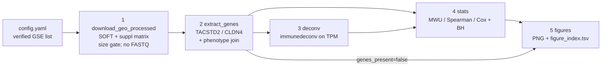

# GEO processed workflow engine / GEO 已处理数据工作流引擎

> **Scope / 范围**  
> Methods only. This playbook specifies a Snakemake / Nextflow skeleton that runs **processed GEO matrices only**: download → extract `TACSTD2` / `CLDN4` → immune deconvolution → statistics → figures. It does not report results and does not implement FASTQ or SRA alignment.
>
> 仅限方法。本手册规定一条只使用 **GEO 已处理矩阵** 的 Snakemake / Nextflow 骨架：下载 → 提取 `TACSTD2` / `CLDN4` → 免疫反卷积 → 统计 → 作图。不报告结果，也不实现 FASTQ / SRA 比对。

Draft files in this directory:

本目录中的草稿文件：

| File / 文件 | Role / 作用 |
|---|---|
| `Snakefile` | Snakemake DAG draft / Snakemake 有向无环图草稿 |
| `config.yaml` | Accessions, gene IDs, size gate, method list / 登录号、基因 ID、体积上限、方法列表 |
| `main.nf` + `nextflow.config` | Equivalent Nextflow DSL2 skeleton / 等价的 Nextflow DSL2 骨架 |
| `envs/environment.yaml` | Conda/Mamba env for the engines / 工作流引擎的 Conda/Mamba 环境 |

## 1. Why this engine exists / 为何需要该引擎

The parent analysis asks whether tumor **TROP2** (gene `TACSTD2`; UniProt P09758; `ENSG00000184292`) and **CLDN4** (`ENSG00000189143`) associate with immune-checkpoint inhibitor (ICI) outcomes and immune contexture in lung cancer. Bessede et al., *Clin Cancer Res* 2024 (PMID 38048058) reported high TACSTD2 with atezolizumab primary resistance and lower T-cell infiltration in OAK/POPLAR; those RNA matrices are typically EGA-controlled. Open GEO series are the reproducible substitute, but they arrive as heterogeneous processed tables, not a uniform FASTQ project.

父项目要回答肿瘤 **TROP2**（基因 `TACSTD2`；UniProt P09758；`ENSG00000184292`）和 **CLDN4**（`ENSG00000189143`）是否与肺癌免疫检查点抑制剂（ICI）结局及免疫微环境相关。Bessede 等（*Clin Cancer Res* 2024，PMID 38048058）在 OAK/POPLAR 中报告高 TACSTD2 与阿替利珠单抗原发耐药及较低 T 细胞浸润相关；其 RNA 矩阵通常受 EGA 管控。开放 GEO 系列是可复现的替代来源，但它们是异构的已处理表，而不是统一的 FASTQ 工程。

A workflow engine is useful only if it **refuses raw reads**. Re-aligning SRA would (i) exceed the 2 GB single-file cap for many run archives, (ii) require a reference genome and library-type decisions that the series already resolved, and (iii) break comparability with the author-provided matrix that other slices already catalogued.

只有在**拒绝原始 reads** 时，工作流引擎才有价值。重新比对 SRA 会：(i) 许多 run 压缩包超过单文件 2 GB 上限；(ii) 需要参考基因组和文库类型决策，而系列提交者已经完成；(iii) 破坏与作者提供矩阵的可比性，其他切片已经编目过这些矩阵。

## 2. Hard constraints / 硬约束

These rules are gates, not preferences. A rule that would download or launch FASTQ processing must fail.

以下规则是门控，不是偏好。任何将下载或启动 FASTQ 处理的规则必须失败。

1. **Processed GEO only.** Allowed inputs: Series Matrix, SOFT family (metadata), and Series supplementary files that are already quantified (counts, TPM, FPKM, log2TPM, microarray intensities). Allowed hosts: NCBI GEO HTTP/FTP (`https://www.ncbi.nlm.nih.gov/geo/`, `https://ftp.ncbi.nlm.nih.gov/geo/`).
2. **No FASTQ / SRA / BAM / CRAM / raw mass spec.** Do not call `prefetch`, `fasterq-dump`, `fastq-dump`, `parallel-fastq-dump`, `kingfisher`, `ffq`, or `snakemake-sra`. Do not follow “SRA Run Selector” or `raw.tar` that unpacks to FASTQ. If a Series has only SRA and no processed matrix, record `status=no_processed_matrix` and stop that cohort.
3. **Skip any single file > 2 GiB** (`max_file_bytes: 2147483648`). Check `Content-Length` (or FTP SIZE) **before** the body. Write the skipped URL, bytes, and reason to the cohort QC JSON. Do not resume a partial >2 GiB transfer.
4. **Do not invent accessions.** Every GSE/GPL/GSM in `config.yaml` must have been opened on its official GEO page. Controlled repositories (EGA, dbGaP, GSA-Human) are listed only; never fabricate matrices.
5. **Do not fabricate genes or statistics.** If `TACSTD2` / `CLDN4` are absent from the feature space (common on nCounter / Oncomine immune panels), emit `genes_present=false` and skip deconv/stats/figures for those genes. Do not impute expression.
6. **Prefer author matrices over Series Matrix expression** when both exist. Series Matrix is still downloaded for phenotype parsing.
7. **One patient, one independent row** in the stats table. Technical replicates stay nested; they are not extra *n*.

1. **仅使用 GEO 已处理数据。** 允许：Series Matrix、SOFT family（元数据），以及已经定量的系列补充文件（counts、TPM、FPKM、log2TPM、芯片强度）。允许主机：NCBI GEO HTTP/FTP。
2. **禁止 FASTQ / SRA / BAM / CRAM / 原始质谱。** 不得调用 `prefetch`、`fasterq-dump` 等。不得跟随 “SRA Run Selector” 或解压后为 FASTQ 的 `raw.tar`。若某系列只有 SRA、没有已处理矩阵，记录 `status=no_processed_matrix` 并停止该队列。
3. **跳过任何单个文件 > 2 GiB。** 在下载正文前检查 `Content-Length`（或 FTP SIZE）。将跳过的 URL、字节数和原因写入队列质控 JSON。不要续传未完成的 >2 GiB 传输。
4. **不得编造登录号。** `config.yaml` 中每个 GSE/GPL/GSM 必须已在官方 GEO 页面打开过。受控库（EGA、dbGaP、GSA-Human）只列清单，绝不伪造矩阵。
5. **不得编造基因或统计量。** 若特征空间中没有 `TACSTD2` / `CLDN4`（nCounter / Oncomine 免疫面板常见），输出 `genes_present=false`，并跳过这些基因的反卷积/统计/作图。不得填补表达值。
6. **作者矩阵优先于 Series Matrix 表达列**（两者都有时）。仍下载 Series Matrix 以解析表型。
7. **统计表中一名患者一行独立观测。** 技术重复保持嵌套，不增加 *n*。

## 3. Pipeline DAG / 流水线 DAG



Snakemake and Nextflow implement the **same** five stages and the same output contract. Choose one engine per run; do not mix lock directories.

Snakemake 与 Nextflow 实现**同一**五阶段和同一输出约定。每次运行只选一个引擎，不要混用锁目录。

Default output root (not created by this methods PR): `results/workflow_engine/`.

默认输出根目录（本方法 PR 不创建）：`results/workflow_engine/`。

## 4. Stage 1 — download GEO processed / 第 1 步：下载 GEO 已处理数据

### 4.1 What to fetch / 下载什么

For each `cohort` in `config.yaml`:

1. **SOFT family** (`GSE#####_family.soft.gz`) for sample characteristics.
2. **Author processed matrix** listed under `processed_url` (counts or TPM).
3. **Optional phenotype table** (`pheno_url`) when the authors shipped a separate xlsx/tsv (e.g. GSE207422 bulk metadata).
4. **Series Matrix** only if SOFT is missing or unreadable.

Do **not** fetch: SRA, FASTQ, BAM, `RAW.tar` that is documented as raw reads, Cel/IDAT if a processed intensity matrix already exists and is smaller.

对 `config.yaml` 中每个 `cohort`：

1. **SOFT family**（`GSE#####_family.soft.gz`）用于样本特征。
2. **作者已处理矩阵**（`processed_url`：counts 或 TPM）。
3. **可选表型表**（`pheno_url`），当作者另附 xlsx/tsv 时（如 GSE207422 bulk 元数据）。
4. 仅当 SOFT 缺失或不可读时才使用 **Series Matrix**。

**不要**获取：SRA、FASTQ、BAM、说明为原始 reads 的 `RAW.tar`；若已有更小的已处理强度矩阵，也不要下载 Cel/IDAT。

### 4.2 Size gate and checksum / 体积门控与校验

```text
HEAD/SIZE → if Content-Length > 2147483648 → skip + QC
GET → stream to workdir
SHA-256 → write sidecar .sha256
```

If the server omits `Content-Length`, stream with a running byte counter and abort at the cap. Record `content_length_missing=true`.

若服务器未提供 `Content-Length`，边下边计数，到达上限即中止，并记录 `content_length_missing=true`。

### 4.3 Seed open series (verified on GEO HTML) / 种子开放系列（已在 GEO HTML 核对）

These accessions were opened on NCBI GEO. URLs are the Series supplementary HTTP links. They are **candidates**, not a claim that every series contains both genes or ICI labels.

以下登录号已在 NCBI GEO 打开。URL 为系列补充文件的 HTTP 链接。它们是**候选**，并不声称每个系列都含两个基因或 ICI 标签。

| GSE | Processed file (GEO page size) | Role | Gene-space risk |
|---|---|---|---|
| [GSE126044](https://www.ncbi.nlm.nih.gov/geo/query/acc.cgi?acc=GSE126044) | `GSE126044_counts.txt.gz` (546.8 Kb) | NSCLC anti–PD-1 bulk counts | Full transcriptome; expect both genes |
| [GSE135222](https://www.ncbi.nlm.nih.gov/geo/query/acc.cgi?acc=GSE135222) | `GSE135222_GEO_RNA-seq_omicslab_exp.tsv.gz` (1.6 Mb) | NSCLC ICI; PFS in characteristics | Full transcriptome; expect both genes |
| [GSE166449](https://www.ncbi.nlm.nih.gov/geo/query/acc.cgi?acc=GSE166449) | `GSE166449_Raw_gene_TPM_matrix.txt.gz` (1.6 Mb) | SMC_IO TPM; **verify lung subset** | Full transcriptome; expect both genes |
| [GSE207422](https://www.ncbi.nlm.nih.gov/geo/query/acc.cgi?acc=GSE207422) | `GSE207422_NSCLC_bulk_RNAseq_log2TPM.txt.gz` (5.4 Mb) + bulk metadata xlsx (11.8 Kb) | Neoadjuvant PD-1+chemo; MPR | Bulk log2TPM; invert before deconv. scRNA UMI (175.5 Mb) is **out of this bulk engine** |
| [GSE136961](https://www.ncbi.nlm.nih.gov/geo/query/acc.cgi?acc=GSE136961) | `GSE136961_TPM.tsv.gz` (68.2 Kb) | Oncomine Immune Response panel | Targeted panel; **often lacks TACSTD2/CLDN4** — extract must fail closed |

Do not add GSE131907 log2TPM through this engine: the GEO supplementary matrix has been observed near 3.07 GB and must trip the size gate. Controlled OAK/POPLAR (EGA) stay catalog-only.

不要通过本引擎添加 GSE131907 的 log2TPM：GEO 补充矩阵曾观测到约 3.07 GB，必须触发体积门控。受控的 OAK/POPLAR（EGA）只编目、不下载。

### 4.4 Download QC JSON / 下载质控 JSON

Each cohort writes `download_qc.json`:

```json
{
  "gse": "GSE126044",
  "processed_url": "https://www.ncbi.nlm.nih.gov/geo/download/?acc=GSE126044&format=file&file=GSE126044_counts.txt.gz",
  "bytes": 0,
  "sha256": "",
  "skipped_oversize": false,
  "fastq_refused": true,
  "status": "skeleton"
}
```

`fastq_refused: true` is required so a future implementer cannot “helpfully” add SRA without editing the contract.

必须保持 `fastq_refused: true`，避免后续实现者在不改约定的情况下“顺手”加入 SRA。

## 5. Stage 2 — extract TACSTD2 / CLDN4 / 第 2 步：提取基因

### 5.1 Identifier map / 标识映射

Resolve rows in this order; keep the matched ID in the output:

按此顺序解析行，并在输出中保留匹配到的 ID：

| Symbol | Ensembl (strip version) | Aliases that may appear |
|---|---|---|
| TACSTD2 | ENSG00000184292 | TROP2, M1S1, GA733-1, EGP-1, EGP1, GP50 |
| CLDN4 | ENSG00000189143 | CPE-R, CPETR1, WBSCR8, hCPE-R |

Mouse cohorts (not in the default human config) use `Tacstd2` / `Cldn4`. Do not mix species in one matrix.

小鼠队列（不在默认人类配置中）使用 `Tacstd2` / `Cldn4`。同一矩阵中不要混用物种。

If a symbol and an Ensembl ID both match **different** rows, write `status=id_collision` and do not pick a winner after looking at expression.

若 symbol 与 Ensembl 匹配到**不同**行，写入 `status=id_collision`，不得在查看表达后再挑选。

### 5.2 Matrix hygiene / 矩阵整理

- Genes as rows, samples as columns (transpose if needed).
- Collapse duplicate gene IDs with a **prespecified** rule: `max` mean across samples (default) or `sum` for raw counts of the same ID. Record the rule.
- Do not ComBat or quantile-normalize at this stage; that belongs inside later modeling folds if ML is added.
- Parse SOFT `!Sample_characteristics_ch*` into a tidy phenotype table. Map response synonyms only from a **frozen** dictionary in `config.yaml` (`responder` / `nonresponder` / `MPR` / `non-MPR` / `CR|PR` vs `SD|PD`). Unmapped labels stay `unknown`; never guess.

- 基因为行、样本为列（必要时转置）。
- 重复基因 ID 用**预先规定**的规则合并：默认按样本均值取 `max`，或对同一 ID 的原始 counts 取 `sum`。记录所用规则。
- 此阶段不做 ComBat 或分位数标准化；若后续加入机器学习，应放在训练折内部。
- 将 SOFT 的 `!Sample_characteristics_ch*` 解析为整洁表型表。疗效同义词只能用 `config.yaml` 中的**冻结**词典映射。未映射标签保持 `unknown`，不得猜测。

### 5.3 Outputs / 输出

- `{cohort}/genes.tsv` — one row per sample: `sample_id`, `patient_id`, `TACSTD2`, `CLDN4`, `unit` (`count` / `tpm` / `log2tpm` / `unknown`), phenotype columns, `genes_present`.
- `{cohort}/matrix_symbols.tsv.gz` — full HUGO-symbol matrix for deconv (not the raw Ensembl table).
- `{cohort}/extract_qc.json` — feature count, genes found, n samples, n patients, unit, collisions.

If `genes_present=false`, still write the phenotype table and skip stages 3–4 for target-gene tests. Deconvolution may still run if the matrix is genome-wide.

若 `genes_present=false`，仍写表型表，并跳过针对目标基因的第 3–4 步检验。若矩阵为全基因组，反卷积仍可运行。

## 6. Stage 3 — deconvolution / 第 3 步：反卷积

### 6.1 Tooling / 工具

Use [immunedeconv](https://github.com/omnideconv/immunedeconv) (Sturm et al., *Bioinformatics* 2019; doi:10.1093/bioinformatics/btz363) as the single R entrypoint. Default methods (no extra license file):

使用 immunedeconv（Sturm 等，*Bioinformatics* 2019）作为唯一 R 入口。默认方法（无需额外许可文件）：

| Method | Why it is default | Citation |
|---|---|---|
| `quantiseq` | Absolute fractions; RNA-seq oriented | Finotello et al. 2019 |
| `epic` | Absolute fractions + uncharacterized | Racle et al. 2017 |
| `mcp_counter` | Robust CD8 / cytotoxic scores | Becht et al. 2016 |
| `xcell` | Rank-based; wider cell palette | Aran et al. 2017 |

**Optional, off by default:** `cibersort` / `cibersort_abs` (Newman et al. 2015) and CIBERSORTx. These need an academic license and local `CIBERSORT.R` + `LM22.txt`. Do not vendor those files in git. `timer` needs a cancer-type argument (`luad` / `lusc` / `nsclc` only when histology is known).

**默认关闭的可选项：** `cibersort` / `cibersort_abs`（Newman 等，2015）和 CIBERSORTx。需要学术许可及本地 `CIBERSORT.R` + `LM22.txt`。不要把这些文件纳入 git。`timer` 需要癌种参数（仅在组织学已知时使用 `luad` / `lusc` / `nsclc`）。

### 6.2 Input contract / 输入约定

immunedeconv expects **HGNC symbols as rownames** and, for quanTIseq / EPIC / CIBERSORT, **non-log TPM-like** values (Sturm vignette). Therefore:

1. If `unit=log2tpm` or values are clearly log-like (95th percentile < 20 and negatives present), invert with \(2^x - \epsilon\) using the author offset if documented, else \(2^x\) for log2TPM that already added a pseudocount. Record the inversion.
2. If `unit=count`, compute gene-length-unaware CPM × 1e6 / library size as a **fallback TPM proxy** and set `tpm_proxy=true`. Prefer author TPM when present (GSE166449).
3. Targeted panels (GSE136961, nCounter): do **not** run signature deconvolution. Write `deconv_status=panel_too_narrow`.
4. scRNA UMI matrices are out of scope for this bulk engine.

immunedeconv 要求**行名为 HGNC symbol**；quanTIseq / EPIC / CIBERSORT 还要求**非对数、类 TPM** 值（Sturm 说明文档）。因此：

1. 若 `unit=log2tpm` 或数值明显为对数（第 95 百分位 < 20 且存在负数），用 \(2^x - \epsilon\) 还原；若作者记录了偏移则用之，否则对已加伪计数的 log2TPM 用 \(2^x\)。记录还原方式。
2. 若 `unit=count`，用 CPM × 1e6 / 文库大小作为**后备 TPM 代理**，并设 `tpm_proxy=true`。若作者已提供 TPM（GSE166449）则优先使用。
3. 靶向面板（GSE136961、nCounter）：**不要**跑签名反卷积，写入 `deconv_status=panel_too_narrow`。
4. scRNA UMI 矩阵不在本 bulk 引擎范围内。

### 6.3 Outputs / 输出

- `{cohort}/deconv.tsv` — long table: `sample_id`, `method`, `cell_type`, `score`, `score_type` (`fraction` / `arbitrary`).
- `{cohort}/deconv_qc.json` — methods run, signature-gene coverage if available, inversion rule, skip reason.

Do not interpret MCP-counter or xCell scores as percentages. Only quanTIseq and EPIC fractions are comparable across samples as estimated cell fractions (Sturm et al. 2019).

不要把 MCP-counter 或 xCell 分数解释为百分比。按 Sturm 等（2019），只有 quanTIseq 与 EPIC 的分数可当作估计细胞比例做样本间比较。

## 7. Stage 4 — statistics / 第 4 步：统计

Prespecify the family **before** looking at *p* values. Default family (all computed only when the columns exist):

在查看 *p* 值之前预先规定检验族。默认族（仅在相应列存在时计算）：

1. **Response contrast** (binary ICI response or MPR): two-sided Mann–Whitney *U* on TACSTD2, CLDN4, and prespecified deconv scores (EPIC/quanTIseq CD8, cytotoxic, uncharacterized). Effect size: rank-biserial *r*. Require ≥4 samples per arm or write `status=underpowered`.
2. **Co-expression:** Spearman ρ(TACSTD2, CLDN4).
3. **Gene–immune:** Spearman ρ(TACSTD2, CD8 fraction) and ρ(CLDN4, CD8 fraction) using EPIC and quanTIseq separately.
4. **Survival** (only if OS/PFS and time/event are in the phenotype): Cox PH per log2 unit (or per z-score if unit is unknown) and a **prespecified** median split log-rank. Do not scan cutpoints.
5. **Multiple testing:** Benjamini–Hochberg FDR **within this family, within cohort**. Do not pool FDR across heterogeneous series unless a separate meta-analysis slice owns that estimand.

1. **疗效对比**（二分类 ICI 疗效或 MPR）：对 TACSTD2、CLDN4 及预设反卷积分数（EPIC/quanTIseq 的 CD8、细胞毒、未表征组分）做双侧 Mann–Whitney *U*。效应量：秩双列相关 *r*。每臂至少 4 例，否则写 `status=underpowered`。
2. **共表达：** Spearman ρ(TACSTD2, CLDN4)。
3. **基因–免疫：** 分别用 EPIC 与 quanTIseq 计算 ρ(TACSTD2, CD8) 和 ρ(CLDN4, CD8)。
4. **生存**（仅当表型含 OS/PFS 及时间/事件）：按每 log2 单位（单位未知则用 z 分数）做 Cox PH，以及**预先规定**的中位数切分 log-rank。禁止扫描切点。
5. **多重检验：** 在**本检验族、本队列内**做 Benjamini–Hochberg FDR。除非另有 meta 分析切片负责该估计目标，否则不要跨异构系列合并 FDR。

Write `results/workflow_engine/stats/associations.tsv` with columns:

写入 `results/workflow_engine/stats/associations.tsv`，列包括：

`cohort, test, gene_or_score, n, n_event, effect, effect_type, p, q_bh, status, note`

No fabricated numbers in the skeleton: the draft rule may write a header-only TSV plus `status=skeleton`.

骨架中不得编造数字：草稿规则可以只写表头 TSV 并加 `status=skeleton`。

## 8. Stage 5 — figures / 第 5 步：作图

Emit PNG (and optional SVG) only from the stats/deconv tables, never from ad-hoc clicks:

只从统计/反卷积表导出 PNG（可选 SVG），不要靠临时点击出图：

| File | Content |
|---|---|
| `figures/{cohort}_gene_by_response.png` | TACSTD2 / CLDN4 by mapped response |
| `figures/{cohort}_deconv_heatmap.png` | quanTIseq or EPIC fractions |
| `figures/{cohort}_tacstd2_vs_cd8.png` | Scatter + Spearman |
| `figures/{cohort}_km.png` | Only if survival test ran |
| `figures/forest_placeholder.png` | Multi-cohort forest **after** real effects exist |
| `figures/figure_index.tsv` | path, cohort, panel, n |

If a test was skipped, write a one-panel “not estimable” figure that states the reason (missing gene, panel, *n*, no survival). That is documentation, not a result.

若某检验被跳过，画一页写明原因的 “not estimable” 图（缺基因、面板、*n*、无生存）。这是文档，不是结果。

## 9. How to run the skeleton / 如何运行骨架

From this directory, after implementing the five scripts named in the Snakefile:

在本目录下，实现 Snakefile 中点名的五个脚本之后：

```bash
# Snakemake (preferred for local DAG debugging)
mamba env create -f envs/environment.yaml
mamba activate trop2-workflow-engine
snakemake -j 4 --use-conda --configfile config.yaml

# dry-run the draft (no downloads)
snakemake -n -p --configfile config.yaml

# Nextflow (same stages)
nextflow run main.nf -c nextflow.config -profile conda
nextflow run main.nf -preview
```

Both engines must honor `config.yaml` keys: `max_file_bytes`, `refuse_fastq`, `genes`, `deconv_methods`, `cohorts`.

两个引擎都必须遵守 `config.yaml` 的键：`max_file_bytes`、`refuse_fastq`、`genes`、`deconv_methods`、`cohorts`。

### 9.1 Script contract (to be implemented outside this PR if desired) / 脚本约定（如需实现，可在本 PR 之外）

The draft Snakefile calls these *logical* scripts. They are not shipped as working analyzers:

草稿 Snakefile 调用以下*逻辑*脚本。本 PR 不提供可运行的分析器：

```text
scripts/download_geo.py  --cohort ID --config config.yaml --outdir DIR
scripts/extract_genes.py --cohort ID --indir DIR --outdir DIR
scripts/deconv.R         --matrix matrix_symbols.tsv.gz --unit UNIT --outdir DIR
scripts/stats.py         --genes-glob '.../genes.tsv' --deconv-glob '.../deconv.tsv' --outdir DIR
scripts/figures.py       --stats associations.tsv --outdir DIR
```

Until those scripts exist, `snakemake` / `nextflow` should stop at the first missing script. That is intentional.

在这些脚本存在之前，`snakemake` / `nextflow` 应在第一个缺失脚本处停止。这是有意设计。

## 10. What this engine will not do / 本引擎明确不做

- Align or quantify FASTQ; call variants; run Cell Ranger / STARsolo.
- Download EGA/dbGaP/GSA-Human after a password prompt.
- Treat CPTAC protein tables as GEO (different slice / host).
- Run scRNA clustering on GSE207422 UMI or GSE205335 RDS.
- Claim a treatment-predictive (ICI × gene) effect from single-arm series.
- Tune deconv methods or survival cutpoints after seeing *p* values.

- 比对或定量 FASTQ；变异检测；运行 Cell Ranger / STARsolo。
- 在密码提示后下载 EGA/dbGaP/GSA-Human。
- 把 CPTAC 蛋白表当作 GEO（不同切片/主机）。
- 对 GSE207422 UMI 或 GSE205335 RDS 做 scRNA 聚类。
- 用单臂系列声称治疗预测（ICI × 基因）效应。
- 在看到 *p* 值后再调反卷积方法或生存切点。

## 11. Cross-links / 交叉引用

- Causal estimands (association vs predictive vs mediation): `methods/causal/playbook.md` when merged.
- Small-cohort ML leakage rules: `methods/ml/playbook.md` when merged. Any future classifier must nest batch correction **inside** training folds; this engine’s deconv scores may be features, not answers.
- Prior art to **test, not assume:** Bessede et al. 2024, PMID 38048058.

- 因果估计目标（关联 / 预测 / 中介）：合并后见 `methods/causal/playbook.md`。
- 小样本机器学习泄漏规则：合并后见 `methods/ml/playbook.md`。未来分类器必须把批次校正放在**训练折内**；本引擎的反卷积分数可以当特征，不能当结论。
- 需**检验而非假定**的先前工作：Bessede 等 2024，PMID 38048058。
