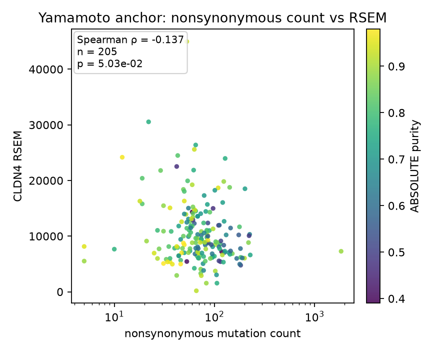
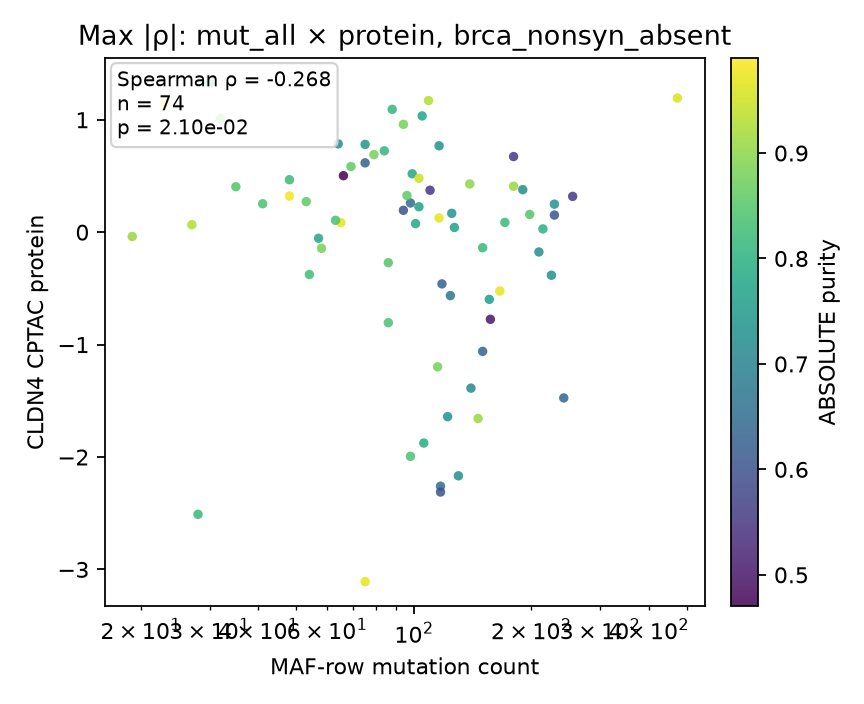
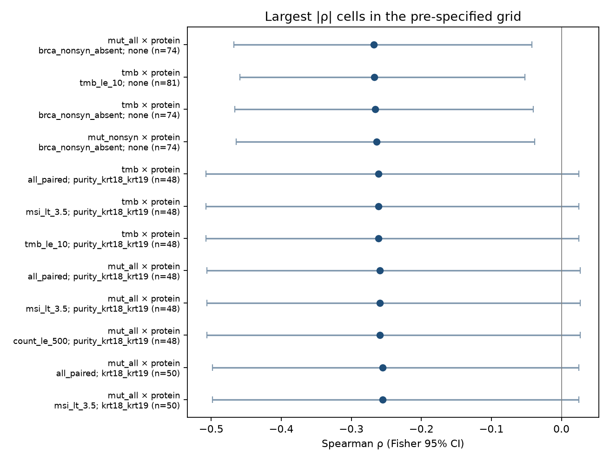
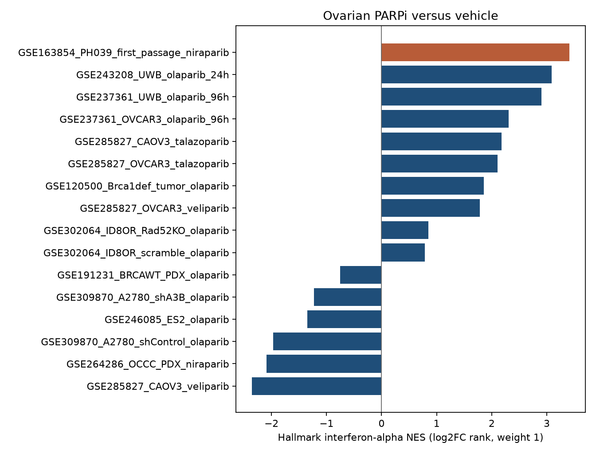

# Yamamoto OV mutation burden and PARPi to interferon

Two public numbers, each the maximum of a grid that was fixed before the sort. Spearman rho does not move if either margin is log-transformed, so log counts are not a separate test. GSEA is gseapy 1.3.1 prerank, weight 1, 1000 permutations, seed 123. A nominal p or Hallmark FDR printed as 0 is reported as < 0.001.

## Mutation burden and CLDN4

The published Fig. 4F bin is the nonsynonymous count. On the PanCan RSEM overlap that count has median 69 and maximum 1,844 (the paper’s text is 2–69 versus 70–1,899). Counting silent and UTR rows as well moves the median to 102, so that count is not the figure.

**Paper-faithful mRNA result.** Nonsynonymous count versus CLDN4 RSEM, all paired primary tumors, n = 205. Spearman **ρ = −0.137**, p = 0.050. Median split at 69: n = 105 versus 100, median RSEM 10,000 versus 8,673, Mann–Whitney p = 0.0075. High mutation count has lower CLDN4. This is the same direction and the same median-split p as the earlier Firehose reproduction (continuous ρ −0.132 on that matrix).

**Maximum |ρ| in the grid.** CPTAC CLDN4 protein versus the all-row MAF count, restricted to tumors with no somatic nonsilent BRCA1 or BRCA2 mutation: **ρ = −0.268**, n = 74, p = 0.021, Fisher 95% CI −0.468 to −0.042. The same subset with the nonsynonymous count is ρ = −0.264. Across 258 eligible cells the Benjamini–Hochberg q for ρ = −0.268 is **0.068**. Silent mutations in that subset are ρ = −0.183, p = 0.12, so the protein association is stronger for the nonsynonymous and TMB counts than for silent counts. The RPPA matrix has Claudin-7 and no CLDN4 antibody, so protein here is CPTAC only.

**mRNA result that survives the grid.** STAR log2(TPM+1), nonsynonymous count, n = 284: ρ = −0.192, p = 0.0012, grid q = 0.017. The largest mRNA |ρ| is STAR versus the all-row count after residualizing ranks on ABSOLUTE purity and ploidy in tumors with MSIsensor < 3.5: ρ = −0.210, n = 271, p = 5.3×10⁻⁴, q = 0.017. On STAR, silent mutations correlate as strongly as nonsynonymous mutations (ρ = −0.197, n = 284), so the mRNA association is total mutation load, not a nonsynonymous-only effect.

Purity ≥ 0.8 weakens the RSEM correlation (ρ = −0.081, n = 99, p = 0.43). The grid, the sample table, and both scatters are under `results/`.

## PARPi to interferon, ISG NES

The ISG set is MSigDB Hallmark 2020 Interferon Alpha Response. Interferon Gamma Response was scored in the same call and did not replace alpha as the headline set. A contrast could win only with at least 3 samples per arm.

**Maximum alpha NES.** GSE163854, HGSOC PDX PH039, first-passage niraparib (sensitive F1A3/F1A4 plus mixed-phenotype F1A5/F251) versus the untreated source tumors (P2A1–3): **NES = 3.41** on the log2FC rank, n = 4 versus 3, 13,505 genes, 89 set genes in the list, lead gene IFI27. Nominal p < 0.001 and Hallmark-wide FDR < 0.001 (50 hallmark sets). Mean alpha-set log2FC is only +0.39 (86% of the set up; IFI27 +1.80, CXCL10 +1.71). This is not a matched-passage vehicle control. Dropping the mixed-phenotype tumors leaves n = 2 and is not eligible: log2FC NES falls to 2.28, and the Welch NES is −0.96 (p = 0.54). The 3.41 therefore depends on including those mixed-phenotype samples.

**Largest matched-vehicle NES.** GSE243208, UWB1.289 olaparib versus DMSO, 24 h, n = 3: **NES = 3.08** (log2FC), nominal p < 0.001, Hallmark FDR < 0.001. The same line at 96 h (GSE237361, 3.5 µM, n = 4) reaches NES = 3.05 on the Welch statistic and NES = 2.90 on log2FC. There the alpha-set mean log2FC is +1.21 and 97% of the set is up (CXCL10 +3.81, MX1 +3.72, ISG15 +2.31). OVCAR3 in that series (BRCA1 wild-type, 7.5 µM, 96 h, n = 4) is NES = 2.30.

Other eligible ovarian arms, alpha set, log2FC rank: OVCAR3 talazoparib NES = 2.11, CAOV3 talazoparib 2.18, OVCAR3 veliparib 1.79, CAOV3 veliparib **−2.35**. A2780 scramble olaparib (GSE309870) is −1.97. ES2 olaparib (GSE246085, n = 6) is −1.35. ID8 olaparib-resistant cells rechallenged with olaparib stay near zero or negative. The Brca1-deficient mouse tumor AmpliSeq panel (GSE120500, 4,604 genes, n = 6) peaks at NES = 2.14 (signal-to-noise) and is not the maximum. n = 2 PDX arms (GSE191231, GSE264286) were scored and could not win; neither is a positive ISG induction.

