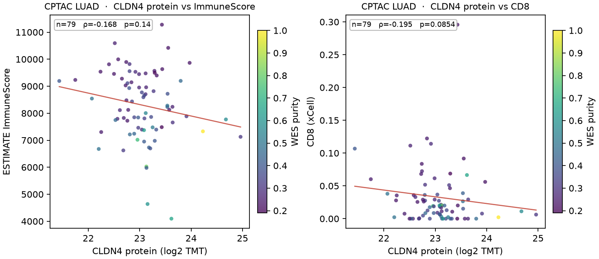
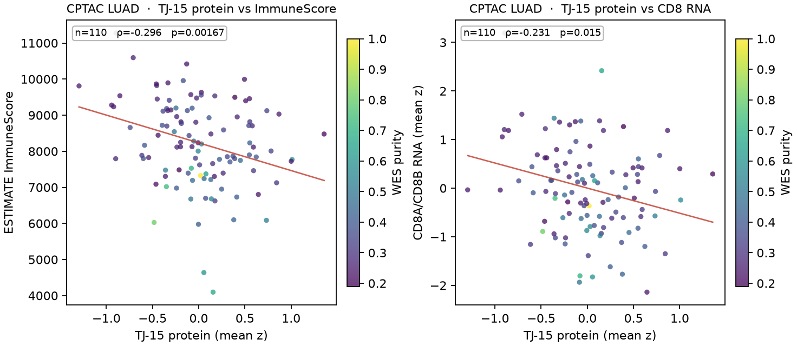
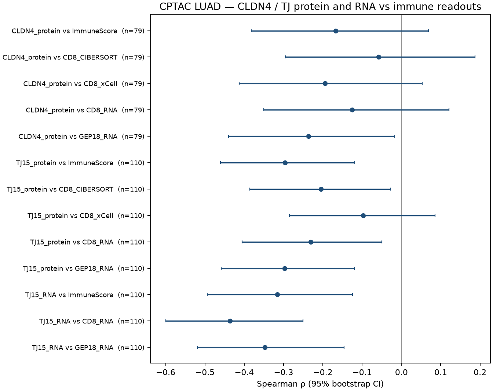
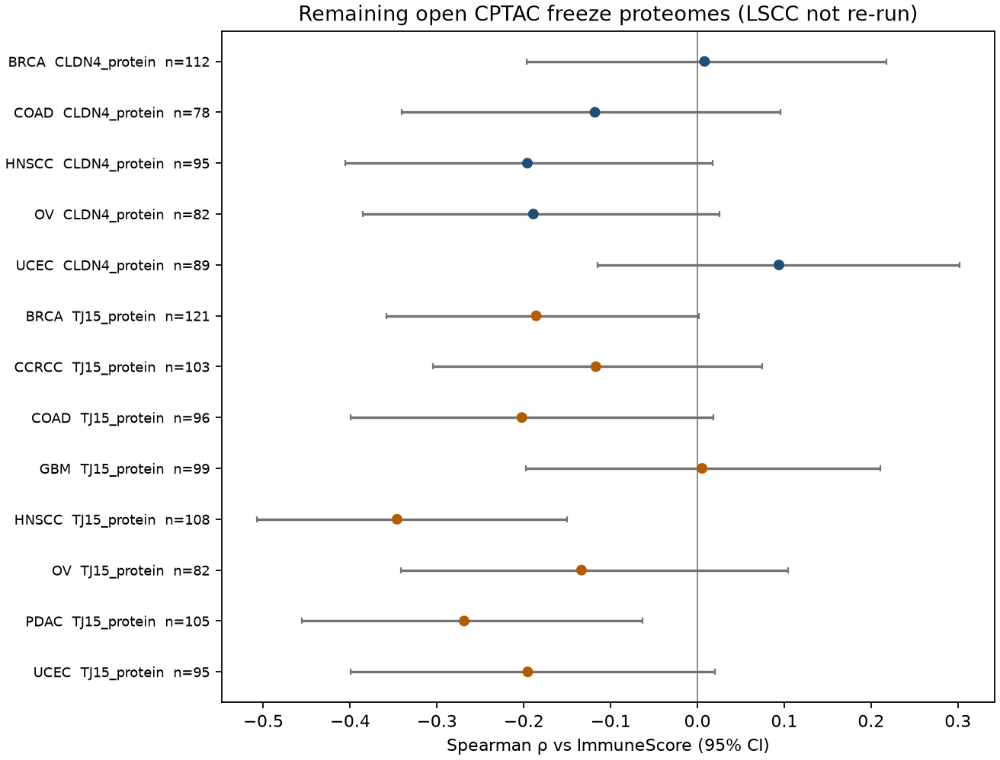
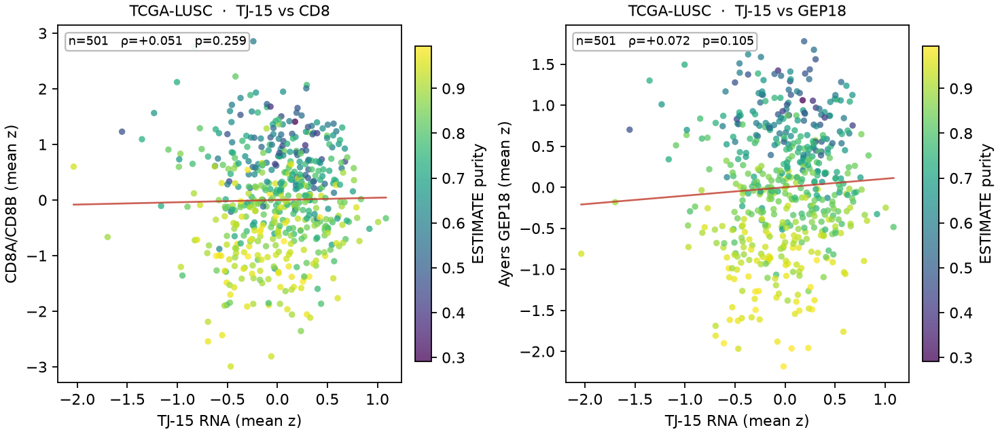
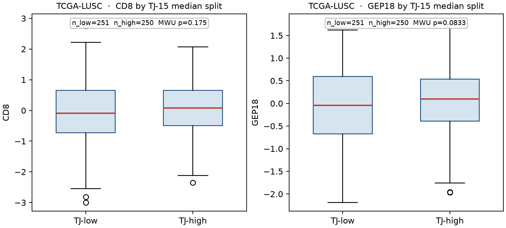

# Results — B3 extra: CPTAC LUAD CLDN4 / TJ protein, remaining open proteomes, TCGA-LUSC

User B3 (TCGA-LUAD TJ-high → CD8 / GEP low) is taken as given and is not re-estimated. CPTAC LSCC CLDN4 protein versus ImmuneScore is already public and is not repeated here.

All numbers below are pairwise-complete Spearman ρ with two-sided p and a 2,000-resample bootstrap 95% CI (seed 20260816). Partial ρ residualizes ranks on WES purity (CPTAC) or Yoshihara ESTIMATE purity (TCGA-LUSC). Methods: [`methods/B3_extra_proteome_lusc.md`](../../methods/B3_extra_proteome_lusc.md).

## 1. CPTAC LUAD protein (Gillette 2020; freeze v1.2)

n = **110** tumors. CLDN4 protein is quantified in **79 / 110** (31 NA). The structural TJ-15 protein score uses all 15 member rows; CLDN1 (9 tumors) and CLDN7 (17 tumors) are sparse, so those two genes contribute only where measured. Immune columns are the freeze phenotype: `ESTIMATE_ImmuneScore`, `CIBERSORT_T_cell_CD8+`, `xCell_T_cell_CD8+`. Matched RNA supplies CD8A/CD8B and Ayers GEP18. No ICI labels.

### CLDN4 protein

| Endpoint | n | ρ | 95% CI | p | Partial \| WES (n, ρ, p) |
|---|---:|---:|---|---:|---|
| ESTIMATE ImmuneScore | 79 | −0.168 | −0.382 to +0.069 | 0.140 | 77, −0.109, 0.344 |
| CIBERSORT CD8 | 79 | −0.059 | −0.295 to +0.187 | 0.608 | 77, −0.036, 0.757 |
| xCell CD8 | 79 | −0.195 | −0.413 to +0.053 | 0.085 | 77, −0.152, 0.187 |
| CD8 RNA (CD8A/B) | 79 | −0.126 | −0.350 to +0.121 | 0.270 | 77, −0.107, 0.356 |
| GEP18 RNA | 79 | −0.237 | −0.440 to −0.017 | 0.036 | 77, −0.191, 0.096 |
| CYT RNA (GZMA/PRF1) | 79 | −0.268 | −0.450 to −0.039 | 0.017 | 77, −0.215, 0.061 |

Median-split (39 high / 40 low CLDN4 protein): ImmuneScore MWU p = 0.056; xCell CD8 p = 0.020; GEP18 RNA p = 0.017.

CLDN4 protein point estimates are negative against every immune readout listed. The ImmuneScore and CIBERSORT CD8 intervals include zero. GEP18 and CYT RNA are the two endpoints whose unadjusted CIs exclude zero; both attenuate after WES residualization.

### TJ-15 protein (same 15 genes as B3)

| Endpoint | n | ρ | 95% CI | p | Partial \| WES (n, ρ, p) |
|---|---:|---:|---|---:|---|
| ESTIMATE ImmuneScore | 110 | −0.296 | −0.460 to −0.119 | 0.00167 | 108, −0.256, 0.0075 |
| CIBERSORT CD8 | 110 | −0.205 | −0.386 to −0.027 | 0.032 | 108, −0.162, 0.093 |
| xCell CD8 | 110 | −0.097 | −0.285 to +0.086 | 0.312 | 108, −0.048, 0.625 |
| CD8 RNA | 110 | −0.231 | −0.405 to −0.050 | 0.015 | 108, −0.187, 0.052 |
| GEP18 RNA | 110 | −0.297 | −0.459 to −0.120 | 0.00161 | 108, −0.250, 0.0089 |
| CYT RNA | 110 | −0.256 | −0.427 to −0.075 | 0.0069 | 108, −0.210, 0.029 |
| xCell immune score | 110 | −0.333 | −0.493 to −0.152 | 0.00039 | 108, −0.286, 0.0027 |

Median-split (55 / 55): ImmuneScore MWU p = 4.5×10⁻⁴; GEP18 RNA p = 0.0010; CD8 RNA p = 0.014.

The 7-gene claim-page module at protein (n = 100 with ≥4 members) is in the same direction: vs ImmuneScore ρ = −0.271, p = 0.0063; vs GEP18 RNA ρ = −0.295, p = 0.0029.

### Same-cohort RNA companion (not a TCGA-LUAD re-run)

On the matched CPTAC LUAD RNA matrix (n = 110):

| Predictor | Endpoint | n | ρ | 95% CI | p | Partial \| WES |
|---|---|---:|---:|---|---:|---|
| TJ-15 RNA | CD8 RNA | 110 | −0.436 | −0.600 to −0.250 | 1.9×10⁻⁶ | −0.412, p = 9.6×10⁻⁶ |
| TJ-15 RNA | GEP18 RNA | 110 | −0.348 | −0.520 to −0.146 | 1.98×10⁻⁴ | −0.314, p = 9.2×10⁻⁴ |
| TJ-15 RNA | ImmuneScore | 110 | −0.316 | −0.494 to −0.125 | 7.6×10⁻⁴ | −0.284, p = 0.0029 |

## 2. Remaining open freeze proteomes

Same S3 freeze, protein + phenotype, LSCC omitted. CLDN4 protein is absent as a quantified row in CCRCC, GBM, and PDAC. Associations versus `ESTIMATE_ImmuneScore`:

| Cohort | n tumors | CLDN4 n | CLDN4 vs ImmuneScore ρ (p) | TJ-15 n genes | TJ-15 vs ImmuneScore ρ (p) |
|---|---:|---:|---|---:|---|
| BRCA | 122 | 113 | +0.008 (0.93), n=112 | 11 | −0.186 (0.041), n=121 |
| COAD | 97 | 79 | −0.118 (0.30), n=78 | 12 | −0.202 (0.048), n=96 |
| CCRCC | 103 | 0 | no CLDN4 row | 13 | −0.117 (0.24), n=103 |
| GBM | 99 | 0 | no CLDN4 row | 10 | +0.005 (0.96), n=99 |
| HNSCC | 108 | 95 | −0.196 (0.057), n=95 | 15 | −0.346 (2.4×10⁻⁴), n=108 |
| OV | 83 | 83 | −0.189 (0.089), n=82 | 13 | −0.134 (0.23), n=82 |
| PDAC | 105 | 0 | no CLDN4 row | 12 | −0.269 (0.0056), n=105 |
| UCEC | 95 | 89 | +0.094 (0.38), n=89 | 12 | −0.195 (0.058), n=95 |

HNSCC is the strongest remaining CLDN4 / TJ-15 protein-versus-ImmuneScore pair. These rows are descriptive extras, not a pooled lung meta-analysis.

## 3. TCGA-LUSC histology extra

n = **501** primary tumors (`*-01`) with Xena HiSeqV2 and official ESTIMATE RNAseqV2. All 15 TJ genes, both CD8 genes, and all 18 GEP genes are present. This is LUSC only; it does not revise B3 LUAD.

### Structural TJ-15 (B3 primary set)

| Endpoint | n | ρ | 95% CI | p | Partial \| ESTIMATE purity (ρ, p) |
|---|---:|---:|---|---:|---|
| CD8 (CD8A/B) | 501 | +0.051 | −0.040 to +0.143 | 0.259 | −0.068, 0.130 |
| GEP18 | 501 | +0.072 | −0.015 to +0.162 | 0.105 | −0.107, 0.016 |
| CYT | 501 | +0.008 | −0.078 to +0.097 | 0.851 | −0.151, 6.7×10⁻⁴ |
| ImmuneScore | 501 | +0.151 | +0.063 to +0.238 | 7.0×10⁻⁴ | −0.005, 0.908 |

TJ-15 high vs low (250 / 251): CD8 MWU p = 0.175; GEP18 p = 0.083.

Unadjusted TJ-15 versus CD8 / GEP sits near zero. After ESTIMATE purity, GEP18 and CYT are weakly negative; CD8 remains compatible with zero. ImmuneScore versus TJ-15 is positive unadjusted and is algebraically entangled with ESTIMATE purity (ImmuneScore is a term in ESTIMATEScore).

### 7-gene claim-page module (sensitivity)

| Endpoint | n | ρ | 95% CI | p | Partial \| purity (ρ, p) |
|---|---:|---:|---|---:|---|
| CD8 | 501 | −0.181 | −0.264 to −0.090 | 4.4×10⁻⁵ | −0.094, 0.035 |
| GEP18 | 501 | −0.147 | −0.230 to −0.061 | 9.6×10⁻⁴ | −0.033, 0.465 |
| CYT | 501 | −0.153 | −0.237 to −0.070 | 5.8×10⁻⁴ | −0.064, 0.156 |

TJ-7 high vs low: CD8 MWU p = 1.5×10⁻⁴; GEP18 p = 0.0011.

## What these numbers are

- CPTAC LUAD **TJ-15 protein** versus ImmuneScore is ρ = −0.296 (n = 110, p = 0.0017) and remains ρ = −0.256 after WES purity (n = 108, p = 0.0075). Versus GEP18 RNA the same score is ρ = −0.297 (p = 0.0016; partial −0.250, p = 0.0089).
- CPTAC LUAD **CLDN4 protein** versus ImmuneScore is ρ = −0.168 (n = 79, p = 0.14). Versus GEP18 RNA, ρ = −0.237 (p = 0.036).
- CPTAC LUAD **TJ-15 RNA** versus CD8 / GEP on the same 110 tumors is ρ = −0.436 / −0.348.
- TCGA-LUSC **TJ-15** versus CD8 is ρ = +0.051 (n = 501, p = 0.26). The 7-gene module versus CD8 is ρ = −0.181 (p = 4.4×10⁻⁵).

Machine-readable tables: `tables/`. Per-sample scores: `tables/luad_sample_scores.tsv`, `tables/lusc_sample_scores.tsv`.
