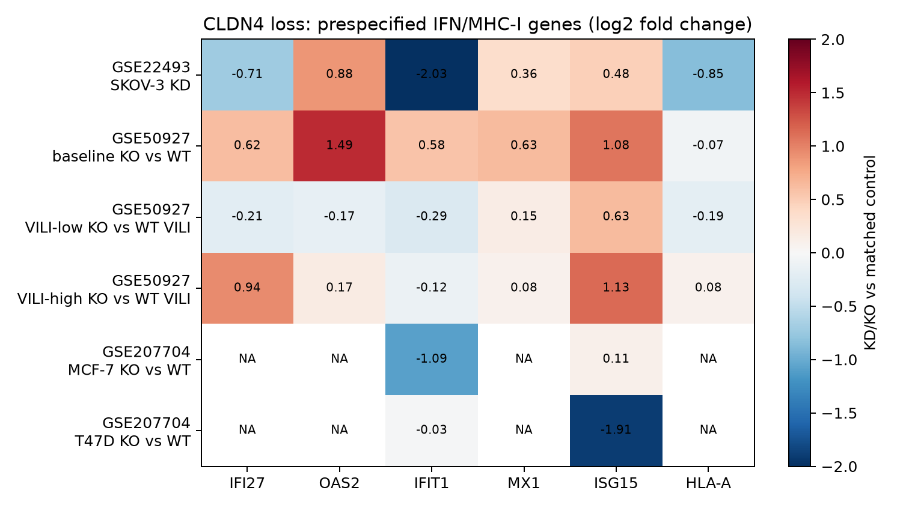

# Claim C4 — public CLDN4 loss-of-function analogs

Audit date: 2026-08-16

## Claim tested

> CLDN4 knockdown opens an IFN/MHC-I program: IFI27, OAS2, IFIT1, MX1, ISG15, and HLA-A increase.

## Verdict

**Not supported as a general public-data analog.** None of the six evaluable
contrasts had all six prespecified genes increase. The one clear partial signal
was in uninjured whole lung from germline `Cldn4`-KO mice (GSE50927): five of
six genes increased, with Oas2, Ifit1, and Isg15 individually significant at
the submitter's FDR < 0.05. However, H2-K1 (the HLA-A ortholog used here) did
not increase, the six-gene directional test was not significant (5/6,
one-sided exact sign test P = 0.109), and the pattern did not reproduce
consistently after ventilator-induced lung injury.

The direct human analogs are negative or incomplete:

- **GSE22493, SKOV-3 CLDN4 KD:** 3/6 genes increased (sign test P = 0.656);
  IFI27, IFIT1, and HLA-A decreased. No target gene passed FDR < 0.05.
- **GSE207704, MCF-7 and T47D CLDN4 KO:** the deposited processed matrix omits
  four of the six claim genes. Of the two present, IFIT1 decreased in both
  lines; ISG15 was nearly unchanged in MCF-7 and decreased in T47D. The
  submitted matrix contains condition-mean FPKM only, so no replicate-level
  inference is possible from it.
- **GSE50927, mouse lung:** baseline KO gives a real IFN-like subset, but not
  MHC-I. VILI-low is mostly opposite (2/6 positive); VILI-high is weakly
  directional (5/6 positive) but no claim gene passes FDR < 0.05.

The honest interpretation is **context-specific partial support for an
interferon-stimulated subset in one mouse whole-lung comparison, with no public
replication of the full IFN/MHC-I claim and contrary evidence in human cells.**



## Public-data search

The search covered GEO DataSets (programmatic queries for `CLDN4` and
`"claudin 4"`, with KD/KO/silencing/siRNA/shRNA/CRISPR terms), web/PubMed
searches, and the downloadable LINCS L1000 CRISPR KO consensus collection.
Three public genome-wide expression series with direct CLDN4 loss were found:

| Accession | Direct comparison | Context | Usable result |
|---|---|---|---|
| [GSE22493](https://www.ncbi.nlm.nih.gov/geo/query/acc.cgi?acc=GSE22493) | lentiviral CLDN4 KD vs control | human SKOV-3, 3 paired two-colour arrays | complete 6-gene panel |
| [GSE50927](https://www.ncbi.nlm.nih.gov/geo/query/acc.cgi?acc=GSE50927) | germline Cldn4 KO vs WT | mouse whole lung, baseline/VILI strata | submitter edgeR tables |
| [GSE207704](https://www.ncbi.nlm.nih.gov/geo/query/acc.cgi?acc=GSE207704) | CRISPR CLDN4 KO vs WT | human MCF-7 and T47D, 2 replicates/group | incomplete condition-mean FPKM |

The LINCS consensus GMT has 5,049 perturbagens but no CLDN4 KO signature.
The 2025 H1688 CLDN4-KO RNA-seq study
([PMID 41016339](https://pubmed.ncbi.nlm.nih.gov/41016339/)) was identified,
but no public expression accession or matrix was located, so it cannot be
tested. Detailed inclusions and exclusions are in
[`data/processed/discovery_audit.tsv`](data/processed/discovery_audit.tsv).
“All public” therefore means all discoverable, downloadable direct CLDN4-loss
transcriptomes as of the audit date; it cannot prove that no unindexed or
privately hosted dataset exists.

## Analysis choices and limitations

- Fold changes are always oriented **KD/KO versus matched control**.
- GSE22493 submitted normalized log2 Cy5/Cy3 ratios were used. Cy5 is CLDN4 KD
  and Cy3 is control. Repeated HLA-A probes were collapsed by the within-array
  median; the legacy symbol G1P2 was mapped to ISG15. One-sided one-sample
  t-tests across three paired arrays were BH-adjusted. Some values are missing,
  leaving two arrays for CLDN4 and MX1.
- GSE50927 submitter edgeR logFC/P/FDR values were used. Human-to-mouse mapping
  was IFI27→Ifi27l2a, OAS2→Oas2, IFIT1→Ifit1, MX1→Mx1, ISG15→Isg15, and
  HLA-A→H2-K1. H2-D1 gives the same qualitative MHC-I conclusion. Each
  condition reportedly contains two mice, a very small sample, and whole-lung
  composition, germline development, and injury severity can confound a
  cell-autonomous CLDN4 effect.
- GSE207704 fold changes are log2 ratios of submitted mean FPKM with a 0.5
  pseudocount. Although GEO lists two replicates per group, replicate values
  are absent from the processed matrix. Genomic/protein KO was validated in
  the linked paper; residual CLDN4-aligned RNA should not be read as failed KO.
- The exact sign test asks whether positive directions are enriched among the
  six prespecified genes. It is descriptive with only six genes and does not
  replace gene-level inference. Missing genes are reported, never counted as
  positive.
- This is a targeted claim test, not an unbiased pathway analysis. No genes
  were selected after seeing the results.

## Files

- `analyze.py` — downloads source files and regenerates every result.
- `data/processed/gene_effects.tsv` — gene-level effects and available tests.
- `data/processed/contrast_summary.tsv` — six-gene direction summaries.
- `data/processed/discovery_audit.tsv` — inclusion/exclusion trail.
- `data/processed/lincs_coverage.tsv` — explicit LINCS null coverage result.
- `data/processed/source_manifest.tsv` — source URLs, sizes, and SHA-256 hashes.
- `figures/claim_C4_heatmap.{png,svg}` — visual summary.

## Reproduce

```bash
python3 -m pip install -r results/claim_C4/requirements.txt
python3 results/claim_C4/analyze.py
```

Raw downloads are intentionally git-ignored; checksummed derived outputs are
tracked.
