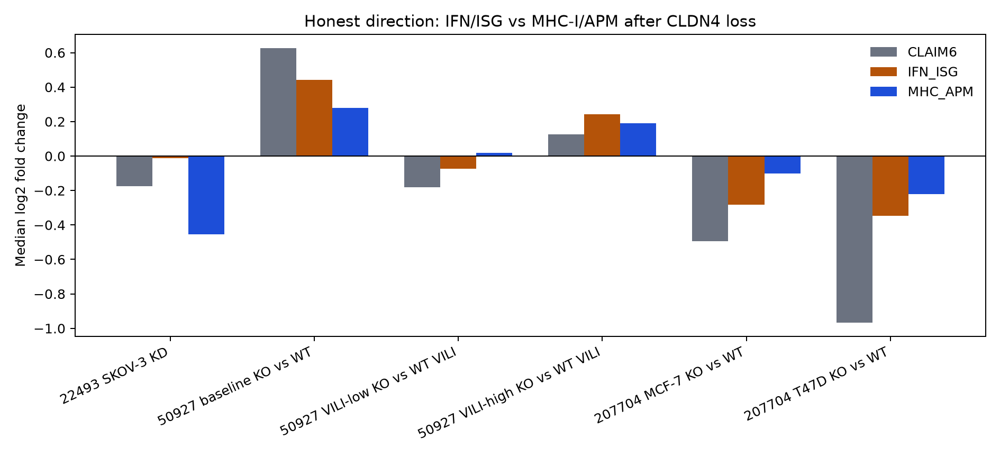
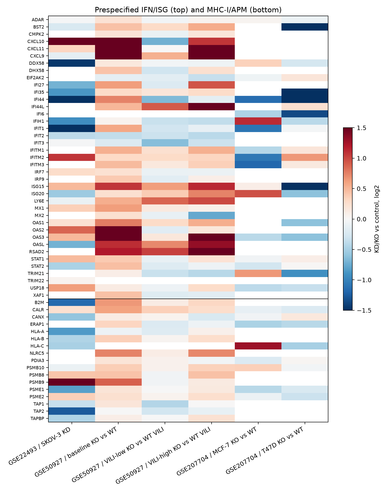

# Claim C4 — public CLDN4 loss and IFN/MHC-I/APM

Audit date: 2026-08-16

## Claim tested

> CLDN4 knockdown/knockout opens an IFN/MHC-I program.
> The original six genes are IFI27, OAS2, IFIT1, MX1, ISG15, and HLA-A.
> This update also tests a prespecified IFN/ISG panel and a classical MHC-I/APM panel.

Fold changes are always **KD/KO versus matched control**. Positive means the program opened.

## Verdict

**Not supported as a general public analog.** Direction is context-specific.

| Contrast | CLAIM6 | IFN/ISG | MHC-I/APM | Honest read |
|---|---|---|---|---|
| GSE50927 baseline Cldn4-KO lung | 5/6 up, median +0.63 | **up** 34/37, median +0.44 | **up** 14/16, median +0.28 | Real IFN/APM shift; H2-K1/HLA-A flat |
| GSE50927 VILI-high KO | 5/6 up, median +0.12 | **up** 25/37, median +0.24 | **up** 12/16, median +0.19 | Weaker copy of baseline; no claim-gene FDR hit |
| GSE50927 VILI-low KO | 2/6 up, median −0.18 | weak down | null | Fails when injury is matched to WT |
| GSE22493 SKOV-3 KD | 3/6 up, median −0.17 | weak down | **down** 4/14, median −0.45 | Human ovarian analog is opposite for APM |
| GSE207704 MCF-7 KO | 1/2 assayed, median −0.49 | weak down | weak down | Incomplete processed matrix |
| GSE207704 T47D KO | 0/2 assayed, median −0.97 | **down** 7/21, median −0.35 | **down** 2/8, median −0.22 | Human breast analog is opposite |

The only public support is **germline Cldn4 knockout in uninjured (and high-injury) whole mouse lung**. That support is IFN/ISG plus antigen-processing machinery, not classical MHC-I heavy chain: H2-K1 log2FC = −0.07 (FDR = 1). Human cancer-cell KD/KO analogs do not open the program and in SKOV-3 and T47D they close APM or IFN.






## What actually moved in the one supporting dataset

GSE50927 baseline KO vs WT, submitter edgeR, n = 2 mice/group:

- IFN/ISG: Oas2 +1.49 (FDR 0.0015), Isg15 +1.08 (FDR 0.0031), Ifit1 +0.58 (FDR 0.028). Ifi27l2a +0.62 and Mx1 +0.63 do not pass FDR 0.05.
- APM: Calr +0.60 (FDR 0.0014), B2m +0.66 (FDR 0.034), Psmb9 +0.90 (FDR 0.037). Tap1/Tap2 and H2-K1 do not.
- Classical MHC-I: H2-K1 −0.07; H2-D1 +0.35 (FDR 0.48).

So “opens IFN/MHC-I” is too strong even where the set-level tests are positive. The mouse lung signal is an interferon-stimulated / immunoproteasome-leaning shift, not HLA-A induction.

## Public-data search

GEO DataSets was queried for `CLDN4` / `"claudin 4"` / `Cldn4` plus KD/KO/silencing/siRNA/shRNA/CRISPR. LINCS L1000 CRISPR KO consensus signatures were downloaded. Three direct loss-of-function transcriptomes were usable:

| Accession | Perturbation | Context | Limitation |
|---|---|---|---|
| [GSE22493](https://www.ncbi.nlm.nih.gov/geo/query/acc.cgi?acc=GSE22493) | lentiviral CLDN4 KD | human SKOV-3, 3 paired two-colour arrays | old custom array; some ISGs absent |
| [GSE50927](https://www.ncbi.nlm.nih.gov/geo/query/acc.cgi?acc=GSE50927) | germline Cldn4 KO | mouse whole lung, baseline and VILI | n = 2; tissue composition and injury confounders |
| [GSE207704](https://www.ncbi.nlm.nih.gov/geo/query/acc.cgi?acc=GSE207704) | CRISPR CLDN4 KO | human MCF-7 and T47D | deposited matrix is condition-mean FPKM and omits HLA-A, B2M, TAP1/2, MX1, OAS2, IFI27 |

LINCS has 5,049 CRISPR consensus perturbagens and **no CLDN4 signature**. The 2025 H1688 CLDN4-KO RNA-seq paper ([PMID 41016339](https://pubmed.ncbi.nlm.nih.gov/41016339/)) has no public expression accession. Cldn18 KO (GSE48443) and CLDN7 overexpression (GSE26055) were excluded as the wrong gene. Full trail: [`data/processed/discovery_audit.tsv`](data/processed/discovery_audit.tsv).

“All public” means all discoverable, downloadable direct CLDN4-loss transcriptomes as of the audit date.

## Gene sets

Defined before looking at expanded-set effects. Lists: [`data/processed/gene_sets.tsv`](data/processed/gene_sets.tsv).

- **CLAIM6**: IFI27, OAS2, IFIT1, MX1, ISG15, HLA-A.
- **IFN_ISG**: 39-gene type-I IFN / ISG panel (IFI/IFIT/OAS/MX/STAT/IRF/RLR and related ISGs).
- **MHC_APM**: 18-gene classical MHC-I and antigen-processing set (HLA-A/B/C, B2M, TAP1/2, TAPBP, immunoproteasome, ERAP, NLRC5, CALR/CANX/PDIA3).
- **HALLMARK_IFNA / IFNG**: MSigDB Hallmark v2023.2.Hs, used only as a sensitivity check.

Mouse mapping is explicit for the curated panels (IFI27→Ifi27l2a, OAS1→Oas1a, HLA-A→H2-K1, HLA-B→H2-D1). Hallmark mouse lookup uses that table, then a title-case fallback. HLA-C has no one-to-one mouse ortholog and is left unmapped.

## Statistics

- Gene-set tests are one-sided for the claim direction (up after CLDN4 loss): exact sign test, Wilcoxon signed-rank on set log2FCs, and Mann–Whitney against the genome-wide background.
- A complementary Wilcoxon (less) is used only to call **down**.
- Calls: `up` or `down` require median on that side and P ≤ 0.05; otherwise `weak_up` / `weak_down` / `null`.
- Missing genes are reported and never counted as positive.
- GSE22493 uses submitted log2(Cy5 KD / Cy3 control) ratios; probes are median-collapsed; G1P2 is treated as ISG15.
- GSE50927 uses the submitter edgeR tables.
- GSE207704 uses log2((KO+0.5)/(WT+0.5)) on submitted mean FPKM; genes with mean FPKM < 0.5 are dropped. Replicate-level tests are impossible from the processed file.

Small n, whole-lung mixture, germline development, and VILI severity can all move IFN genes without a cell-autonomous CLDN4–IFN circuit. The human cell-line analogs are the closer test of that circuit, and they do not support it.

## Files

- `analyze.py` — downloads sources and regenerates every result.
- `data/processed/geneset_summary.tsv` — set-level direction calls.
- `data/processed/contrast_summary.tsv` — CLAIM6 nested test.
- `data/processed/gene_effects.tsv` — every set member in every contrast.
- `data/processed/key_gene_effects.tsv` — claim genes plus core APM genes.
- `data/processed/verdict.tsv` — machine-readable overall call.
- `data/processed/discovery_audit.tsv` — inclusion/exclusion trail.
- `data/processed/lincs_coverage.tsv` — explicit LINCS null.
- `data/processed/source_manifest.tsv` — URLs, sizes, SHA-256.
- `figures/claim_C4_heatmap.{png,svg}` — six-gene claim.
- `figures/claim_C4_set_direction.{png,svg}` — IFN vs APM medians.
- `figures/claim_C4_ifn_apm_heatmap.{png,svg}` — full curated panels.

## Reproduce

```bash
python3 -m pip install -r results/claim_C4/requirements.txt
python3 results/claim_C4/analyze.py
```

Raw downloads are git-ignored; checksummed derived outputs are tracked.
