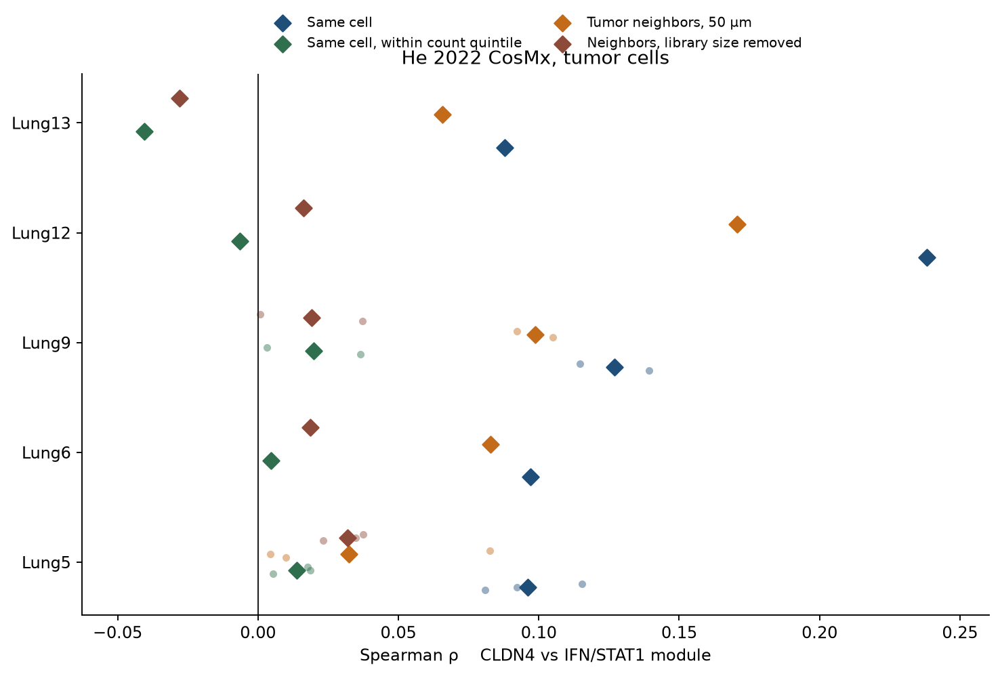

# CosMx He 2022: CLDN4 vs IFN/STAT1 among tumor cells

**Answer.** Among tumor cells, CLDN4 is not anti-correlated with an IFN/STAT1 module, in the same cell or in neighboring tumor cells. The unadjusted association is positive in 5/5 patients and 8/8 sections, and it is a library-size effect. Inside count quintiles the same-cell ρ is −0.002. Neighbor-tumor IFN at 50 µm falls from 0.090 to 0.012 after residualizing on library size.

This is the IFN side of an NHEJ–STING–IFN chain. It is not an NHEJ test. The 960-plex panel does not contain the NHEJ ligation genes.

Public object: `cosmx_human_nsclc_clustered.h5ad` (figshare 25976224; He et al., Nat Biotechnol 2022, with the CellCharter release). 8 sections, 5 patients (Lung5 ×3, Lung9 ×2, Lung6, Lung12, Lung13). Lung6 is LUSC; the other four patients are LUAD. Tumor cells are `cell_type` labels that start with `tumor`. Normal `epithelial` cells are not in the test. CLDN4 only. No TACSTD2 gate. No private 8-KL. The locked exclusion result (fewer cytotoxic cells around CLDN4-high tumor) is not re-estimated here.

Diamonds are patient means. Dots are sections. Zero is marked.

## Panel limit

Core NHEJ genes on the panel: none. Absent: PRKDC, XRCC4, XRCC5, XRCC6, LIG4, NHEJ1, DCLRE1C, POLL, POLM, PAXX, TP53BP1, RIF1, MAD2L2. ATM, ATR, CHEK1, CHEK2, and DNTT are present and are not scored.

cGAS–STING machinery present: IRF3 only. Absent: CGAS, MB21D1, STING1, TMEM173, TBK1, MAVS, IFI16. No cGAS–STING score is computed.

## IFN/STAT1 module

Pre-specified core, all 17 present on the panel, scored as the mean of within-section z-scores of log1p(CP10k) counts (zeros kept; gene dropped in a section if detected in <2% of QC tumor cells; every section kept all 17):

STAT1, IFIT1, IFITM1, IFITM3, MX1, OAS1, OAS2, OAS3, OASL, IFI27, CXCL9, CXCL10, IDO1, CD274, DDX58, IFIH1, NLRC5.

Notable IFN genes not on this panel, so not in the score: ISG15, IRF1, STAT2, IFIT2, IFIT3, MX2, GBP1, PSMB8, PSMB9, PSMB10.

A broader score (HLA-A/B/C, B2M, TAP1/2, CIITA, JAK1/2, IFNGR1/2, CCL5) and the Hallmark interferon-gamma genes that are on the panel (64/200) are secondary. Both are positively correlated with CLDN4 before any depth control (patient-mean ρ 0.164 and 0.166) and are not anti-correlations.

QC: n_counts ≥ 50; FOVs with <40 QC tumor cells dropped. 287,468 QC tumor cells; 281,758 have ≥5 other tumor cells within 50 µm. Pixel size 0.18 µm (median nearest-neighbor spacing in one FOV, 9.0 µm). Primary radius 50 µm; 20 and 100 µm agree in sign. The test unit is the patient (n=5). A one-sided sign test reaches P=0.031 only at 5/5. Cell-level p-values are not used.

## Same cell

| | Patient-mean ρ | Patients negative | Sections negative |
|---|---:|---:|---:|
| Unadjusted | +0.129 | 0/5 | 0/8 |
| Within FOV (mean of FOV ρ) | +0.120 | 0/5 | — |
| Within count quintile | −0.002 | 2/5 | — |
| Residualized on log n_counts | −0.010 | 3/5 | — |
| Residualized on KRT8/18/19 | +0.105 | 0/5 | 0/8 |
| STAT1 alone | +0.046 | 0/5 | 0/8 |

Unadjusted patient ρ: Lung5 +0.096, Lung6 +0.097, Lung9 +0.127, Lung12 +0.238, Lung13 +0.088. One-sided sign P for a positive ρ is 0.031; for a negative ρ it is 1. The positive ρ is inside FOVs, not only a between-FOV mix.

It tracks depth. Patient-mean Spearman of the module with log n_counts is +0.565 (5/5). CLDN4 with log n_counts is +0.229 (5/5). Lung12, the largest unadjusted ρ, is also the strongest CLDN4–depth correlation (+0.391) and falls to −0.007 inside count quintiles. Keratin residualization does not remove the unadjusted ρ. Library size does.

STAT1 itself is weakly positive (+0.046 unadjusted; +0.026 after a linear library-size residual, 1/5 patients negative). No core gene has a negative patient-mean ρ against CLDN4. A few sparse ISGs stay near +0.10 after a linear library residual; that is not the pre-specified module, and the module is null inside count quintiles.

Median split, unadjusted: CLDN4-high tumor cells sit +0.087 module z above CLDN4-low (5/5 patients positive). That gap is the same depth effect, not a lower IFN program in CLDN4-high cells.

## Neighboring tumor cells

Neighbor score = mean IFN/STAT1 of other tumor cells within 50 µm (≥5 neighbors).

| | Patient-mean ρ | Patients negative |
|---|---:|---:|
| Unadjusted, 50 µm | +0.090 | 0/5 |
| Unadjusted, 20 µm | +0.055 | 0/5 |
| Unadjusted, 100 µm | +0.097 | 1/5 |
| Neighbor IFN given the cell's own IFN | +0.046 | 0/5 |
| Neighbor IFN given own IFN and KRT8/18/19 | +0.038 | 0/5 |
| Residualized on own and neighbor log n_counts | +0.012 | 1/5 |
| Partial, also residualized on library size | +0.014 | 1/5 |

Unadjusted patient ρ at 50 µm: Lung5 +0.032, Lung6 +0.083, Lung9 +0.099, Lung12 +0.171, Lung13 +0.066.

A within-FOV shuffle of the IFN score (299 permutations in the main run; 199 in the positive-tail run) does not produce an anti-correlation (one-sided P for ρ below the null = 1). The unadjusted neighbor ρ sits above that null (observed +0.090 vs null mean +0.050, null SD 0.0026; one-sided P for a larger ρ = 0.005 at 199 permutations). The partial ρ does too (+0.046 vs null mean +0.031, same minimum P). That excess is spatial co-localization of transcript depth: CLDN4 vs the neighbors' mean log n_counts is +0.108 (5/5). After residualizing CLDN4 and neighbor IFN on own and neighbor library size, the patient-mean ρ is +0.012.

So the neighbor correlation is not an IFN anti-correlation, and it is not an IFN association beyond library size. Immune-neighbor IFN was not the test: immune cells carry the IFN transcripts, and CLDN4-high tumor already has fewer cytotoxic neighbors in the locked analysis. Scoring immune neighbors would restate that exclusion.

## What this does not say

NHEJ is not supported or refuted. cGAS and STING1 are not on the panel. The unadjusted positive ρ is not evidence that CLDN4 marks an IFN-high tumor cell once depth is held fixed. Visium same-spot correlation is not used. Private 8-KL matrices are not used.

## Files

- `tables/patient_summary.tsv` — patient means used above
- `tables/section_correlations.tsv` — per section
- `tables/depth_within_fov.tsv`, `tables/depth_summary.json`
- `tables/neighbor_library.tsv`, `tables/perm_positive_tail.json`
- `tables/gene_spearman.tsv`, `tables/panel_inventory.json`, `tables/summary.json`
- `figures/patient_forest.png`, `figures/gene_spearman.png`

Scripts: `scripts/cosmx_cldn4_ifn_stat1_spatial.py`, `scripts/cosmx_cldn4_ifn_stat1_depth.py`, `scripts/cosmx_cldn4_ifn_stat1_neighbor_library.py`, `scripts/cosmx_cldn4_ifn_stat1_perm_tail.py`. Download: `scripts/download_cosmx_he2022_h5ad.py`.
