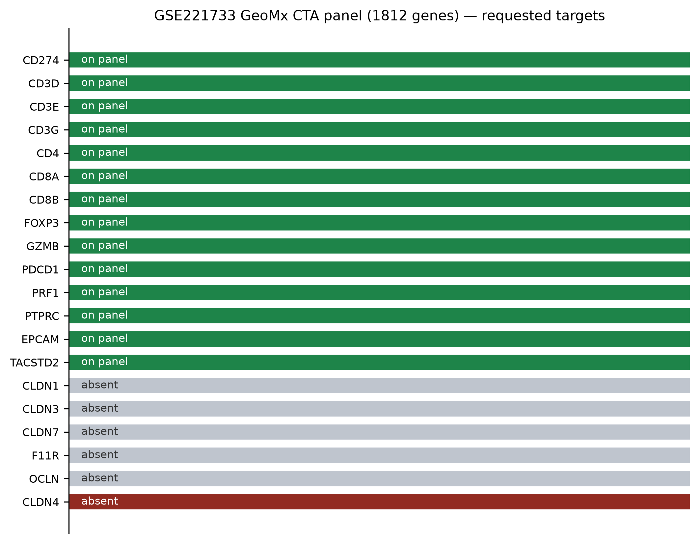
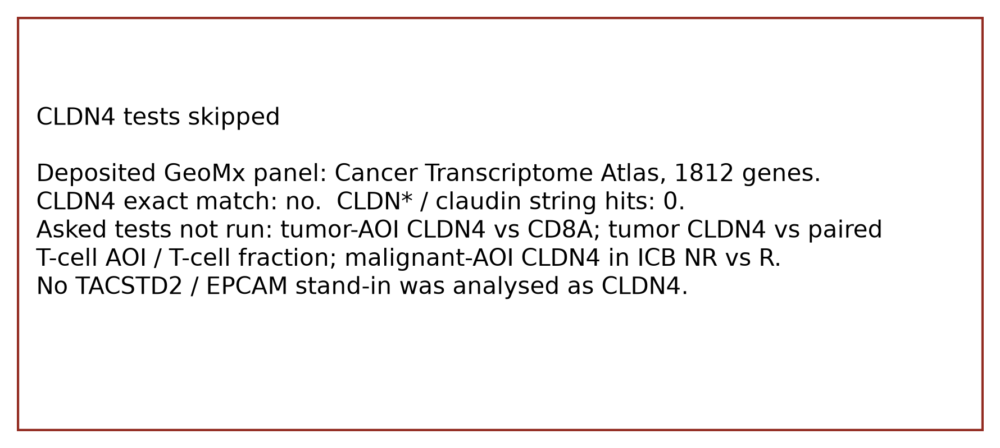
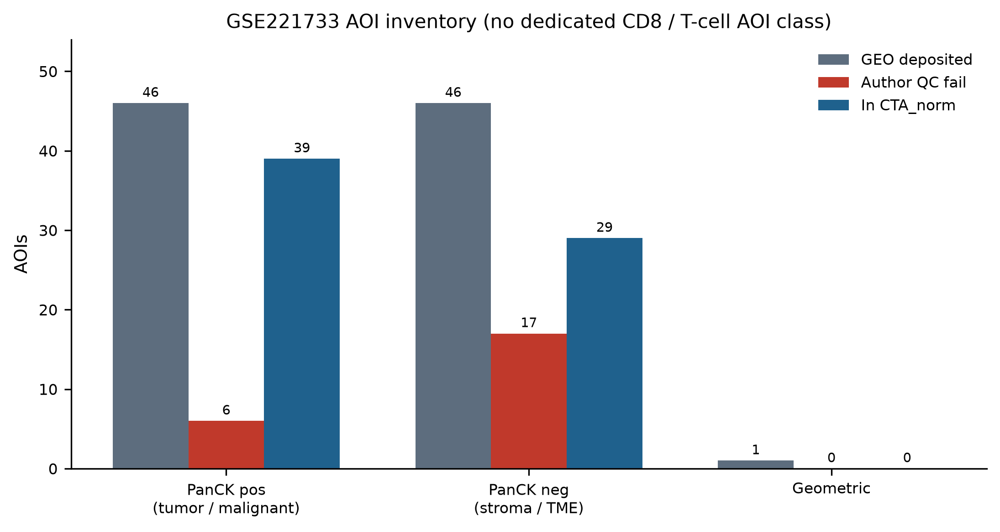
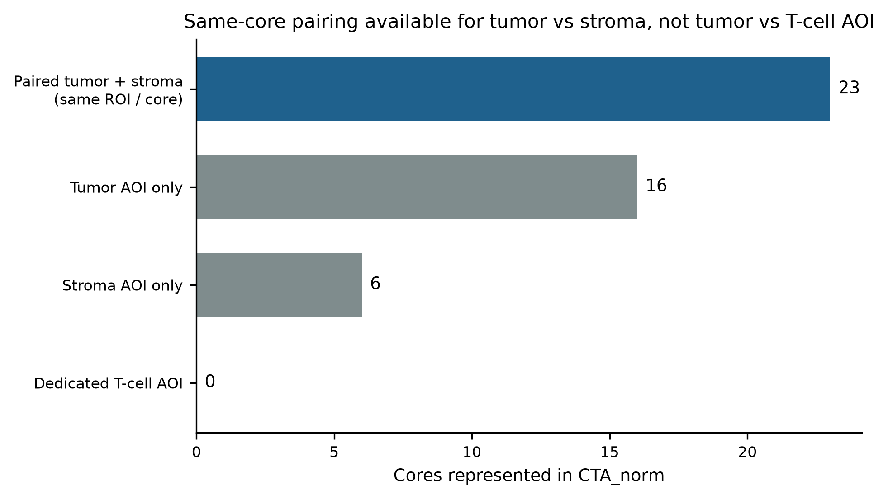
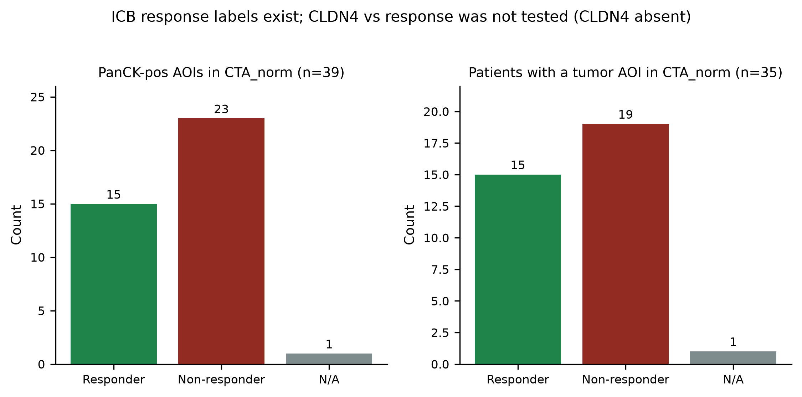
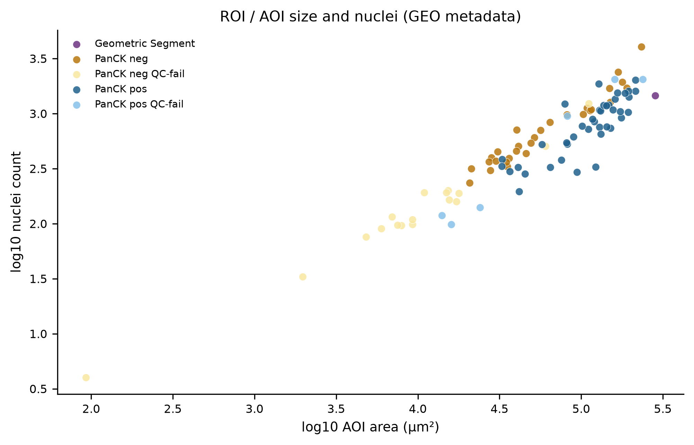

# GSE221733 GeoMx CTA RNA — CLDN4 vs CD8 / ICB (skip)

Additive public GeoMx DSP RNA only. **CLDN4-only.** No private 8-KL. No Visium / CosMx (those accessions are covered by sibling agents). No gene substitution.

Dataset: [GSE221733](https://www.ncbi.nlm.nih.gov/geo/query/acc.cgi?acc=GSE221733). Monkman J, Kim H, Mayer A, et al. Multi-omic and spatial dissection of immunotherapy response groups in non-small cell lung cancer. Immunology. 2023;169(4):487-502. PMID 37022147. DOI 10.1111/imm.13646.

## TL;DR

**CLDN4 is not on the deposited GeoMx Cancer Transcriptome Atlas (CTA) panel.** It is absent from `GSE221733_4301_CTA_norm.xlsx` (1812 genes), the matching QC collapsed-count table, and the uncollapsed initial probe file (8659 probes / 1812 gene symbols). There are **0** gene or probe names matching `CLDN` / `claudin`.

The asked tests were therefore **not run**:

1. In tumor / malignant AOIs, is CLDN4 higher when CD8 / T-cell AOIs or CD8A are lower?
2. Same-core CLDN4 (tumor AOI) vs CD8A (T-cell AOI) or vs T-cell fraction.
3. CLDN4 in malignant AOIs of ICB non-responders vs responders.

This is a panel-content skip, not a negative biological result. TACSTD2 and EPCAM **are** on the CTA panel; they were **not** analysed as CLDN4 stand-ins.

## What was downloaded

| File | Role | Used for |
|---|---|---|
| `GSE221733_4301_CTA_norm.xlsx` | Author RUV-normalised CTA matrix (AOIs × 1812 genes) | Panel inventory; AOIs that authors retained |
| `GSE221733_4301_CTA_QC.xlsx` | Collapsed probe counts | Confirm same gene universe; one extra Geometric AOI |
| `GSE221733_4301_CTA_initial.csv.gz` | Uncollapsed probes (8659 columns) | Confirm no CLDN4 probe barcode |
| `GSE221733_series_matrix.txt` | ROI / patient / response / QC flags | AOI metadata |

GEO also lists per-AOI DCC files in `GSE221733_RAW.tar`. Those were not needed to decide panel membership.

## Panel

CTA, **1812** gene symbols after the AOI index column. Housekeeping / control symbols present include `HK1`, `HK2`, and `Negative Probe`.

| Requested | On CTA_norm / QC / initial probes? |
|---|---|
| **CLDN4** | **no / no / no** |
| CLDN3, CLDN7, CLDN1, F11R, OCLN | no |
| TACSTD2 | yes (not used as a CLDN4 proxy) |
| EPCAM | yes (not used as a CLDN4 proxy) |
| CD8A, CD8B, CD3E, CD3D, CD3G, PTPRC, GZMB, PRF1, CD4, FOXP3, PDCD1, CD274 | yes |

Full checklist: `tables/panel_inventory.csv`.

## Cohort (deposited metadata)

93 AOIs on the series record: **46** PanCK pos (tumor / malignant), **46** PanCK neg (stroma / TME), **1** Geometric Segment. **41** patient IDs. Treatment field is Immunotherapy for every AOI. ICB labels exist: Responder / Non-responder / N/A.

Author `qc fail: Fail` on **23** AOIs (low nuclei, low negative-probe count, low surface area, and/or low sequencing saturation). The normalised matrix keeps **68** AOIs (**39** PanCK pos, **29** PanCK neg). The QC count table has those plus the single Geometric Segment.

There is **no dedicated CD8 or T-cell AOI class**. Segmentation in the titles and `segment` field is PanCK pos / PanCK neg / Geometric only. Same-core pairing in CTA_norm: **23** ROIs with both tumor and stroma, **16** tumor-only, **6** stroma-only. A paired CLDN4 (tumor) vs CD8A (T-cell AOI) test is not constructible from the deposited masks even if CLDN4 were present; the fallback would have been tumor-AOI CLDN4 vs tumor-AOI CD8A or vs stroma CD8A as a T-cell-fraction proxy.

Among PanCK-pos AOIs in CTA_norm: **15** Responder, **23** Non-responder, **1** N/A, from **35** patients (**15** R / **19** NR / **1** N/A). Those labels would have supported the ICB comparison if CLDN4 existed on the panel.

## Tests (not run)

| Test | Status | Reason |
|---|---|---|
| Tumor AOI CLDN4 vs same-AOI CD8A | skipped | CLDN4 absent |
| Tumor AOI CLDN4 vs paired T-cell AOI CD8A | skipped | CLDN4 absent; no T-cell AOI class |
| Tumor AOI CLDN4 vs T-cell fraction / stroma CD8A | skipped | CLDN4 absent |
| Tumor AOI CLDN4, ICB NR vs R | skipped | CLDN4 absent |

No Spearman ρ, Mann–Whitney U, or median-split was computed for CLDN4. No TACSTD2–CD8A or EPCAM–CD8A correlation is reported here.

## What this does **not** claim

- It does not claim CLDN4 is low, high, or associated with CD8 or ICB outcome in this cohort.
- It does not claim the CTA assay failed; CD8A and other IO genes are on the panel.
- It does not re-analyse GSE221322 (protein DSP from the same paper; CLDN4 protein is also off that 68-plex — sibling branch).
- It does not re-analyse Visium / CosMx accessions already covered elsewhere (GSE307534, official CosMx NSCLC, GSE299786).

## Files

| File | Contents |
|---|---|
| `stats.txt` | Key counts |
| `provenance.json` | GEO URLs and dump of `stats` |
| `tables/panel_inventory.csv` | Requested genes vs panel |
| `tables/aoi_metadata.csv` | 93 AOIs, QC, response, in-norm flag |
| `tables/pairing_summary.csv` | Same-ROI tumor/stroma pairing |
| `tables/tests_not_run.csv` | Asked tests and skip reasons |
| `figures/` | Panel, AOI inventory, pairing, labels, QC |

Raw GEO xlsx/csv files are not in git. Rebuild with `bash scripts/gse221733_geomx/00_fetch.sh && python3 scripts/gse221733_geomx/analyze.py`.
