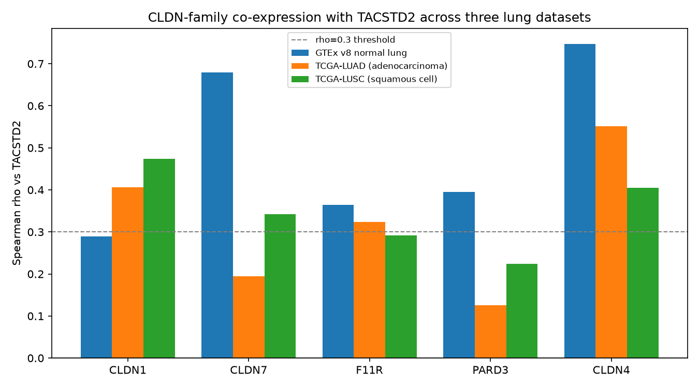
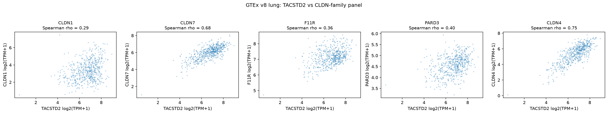

# Hunt: CLDN / tight-junction family vs TACSTD2 (Trop-2) in public lung RNA

_Generated by `src/analyze.py`. Every number below is computed directly from the data; nothing is hand-edited._

## TL;DR

- Across three independent lung RNA-seq datasets (GTEx normal lung, TCGA-LUAD, TCGA-LUSC), **1 of 5** CLDN-family panel genes (CLDN1, CLDN7, F11R, PARD3, CLDN4) land in the *triple-intersection* robust positive co-expression core of TACSTD2 (BH-FDR < 0.05 and Spearman rho >= 0.3 in **all three**).

  - In the robust core: **CLDN4**.

  - Not in the robust core: **CLDN1, CLDN7, F11R, PARD3**.

- The triple-intersection core (all genes, not just the panel) contains **85** genes.


## Datasets

| key | source | unit | samples | genes tested |
|---|---|---|---:|---:|
| `gtex_lung` | GTEx v8 normal lung | raw TPM | 578 | 20727 |
| `tcga_luad` | TCGA-LUAD (adenocarcinoma) | log2(TPM+1) | 589 | 21226 |
| `tcga_lusc` | TCGA-LUSC (squamous cell) | log2(TPM+1) | 552 | 21211 |

All three are per-sample gene-expression matrices for human lung. Because Spearman rank correlation is used throughout, the differing normalisations (GTEx raw TPM vs TCGA log2(TPM+1)) do not affect results.


## Panel: Spearman rho vs TACSTD2 (with genome-wide rank)

`rank` is out of all tested genes (1 = most positively correlated with TACSTD2); `pct` is the percentile.

| gene | gtex_lung rho (rank, pct) | tcga_luad rho (rank, pct) | tcga_lusc rho (rank, pct) | mean rho |
|---|---|---|---|---|
| **CLDN1** | +0.29 (#1990, 90.4%) | +0.41 (#121, 99.4%) | +0.47 (#110, 99.5%) | +0.39 |
| **CLDN7** | +0.68 (#48, 99.8%) | +0.19 (#3312, 84.4%) | +0.34 (#474, 97.8%) | +0.41 |
| **F11R** | +0.36 (#1155, 94.4%) | +0.32 (#537, 97.5%) | +0.29 (#766, 96.4%) | +0.33 |
| **PARD3** | +0.40 (#913, 95.6%) | +0.13 (#6609, 68.9%) | +0.22 (#1463, 93.1%) | +0.25 |
| **CLDN4** | +0.75 (#10, 100.0%) | +0.55 (#2, 100.0%) | +0.40 (#249, 98.8%) | +0.57 |






## Threshold sensitivity (why the pass/fail is not the whole story)

The triple-intersection membership above uses a hard `rho >= 0.3` cut in *every* dataset. Several panel genes are positive and FDR-significant in all three datasets and only miss the core because they dip just below the magnitude cut in one dataset. This matters for an honest reading.

| gene | positive & FDR-sig in all 3? | min rho (dataset) | in triple core? |
|---|---|---|---|
| **CLDN1** | yes | +0.29 (`gtex_lung`) | no |
| **CLDN7** | yes | +0.19 (`tcga_luad`) | no |
| **F11R** | yes | +0.29 (`tcga_lusc`) | no |
| **PARD3** | yes | +0.13 (`tcga_luad`) | no |
| **CLDN4** | yes | +0.40 (`tcga_lusc`) | yes |

So the accurate one-line summary is: **all five panel genes are positively and significantly co-expressed with TACSTD2 in every dataset tested**, but only **CLDN4** clears the deliberately strict `rho >= 0.30`-in-all-three bar; CLDN1, CLDN7 and F11R are borderline (they exceed 0.30 in two of three datasets), and PARD3 is the weakest, especially in the tumour datasets.


## Robust positive set sizes and overlaps

A gene is a *robust positive partner* of TACSTD2 in a dataset if BH-FDR < 0.05 **and** Spearman rho >= 0.3.

| set | size |
|---|---:|
| gtex_lung | 1843 |
| tcga_luad | 748 |
| tcga_lusc | 700 |
| gtex_lung&tcga_luad | 196 |
| gtex_lung&tcga_lusc | 146 |
| tcga_luad&tcga_lusc | 223 |
| triple_intersection | 85 |

## Top of the triple-intersection core

Genes positively co-expressed with TACSTD2 in **all three** datasets, ranked by mean Spearman rho (top 30 shown; full list in `triple_intersection.csv`).

| gene | ensembl | gtex_lung rho | tcga_luad rho | tcga_lusc rho | mean rho |
|---|---|---|---|---|---|
| PRSS22 | ENSG00000005001 | +0.54 | +0.59 | +0.63 | +0.59 |
| KRT19 | ENSG00000171345 | +0.71 | +0.55 | +0.48 | +0.58 |
| SPINT1 | ENSG00000166145 | +0.75 | +0.46 | +0.51 | +0.57 |
| CLDN4 | ENSG00000189143 | +0.75 | +0.55 | +0.40 | +0.57 |
| PERP | ENSG00000112378 | +0.66 | +0.50 | +0.53 | +0.57 |
| SDC1 | ENSG00000115884 | +0.70 | +0.48 | +0.51 | +0.56 |
| TTC22 | ENSG00000006555 | +0.59 | +0.53 | +0.49 | +0.54 |
| AIM1L | ENSG00000176092 | +0.52 | +0.48 | +0.60 | +0.54 |
| ZNF185 | ENSG00000147394 | +0.59 | +0.48 | +0.52 | +0.53 |
| CDH1 | ENSG00000039068 | +0.81 | +0.46 | +0.31 | +0.52 |
| C6orf132 | ENSG00000188112 | +0.68 | +0.44 | +0.45 | +0.52 |
| MAL2 | ENSG00000147676 | +0.73 | +0.40 | +0.44 | +0.52 |
| RNF223 | ENSG00000237330 | +0.57 | +0.52 | +0.47 | +0.52 |
| EVPL | ENSG00000167880 | +0.66 | +0.45 | +0.44 | +0.52 |
| C1orf106 | ENSG00000163362 | +0.62 | +0.38 | +0.54 | +0.51 |
| SOWAHB | ENSG00000186212 | +0.66 | +0.42 | +0.46 | +0.51 |
| WNT7B | ENSG00000188064 | +0.56 | +0.49 | +0.49 | +0.51 |
| KIAA1522 | ENSG00000162522 | +0.54 | +0.51 | +0.47 | +0.51 |
| PPL | ENSG00000118898 | +0.56 | +0.51 | +0.44 | +0.50 |
| IRF6 | ENSG00000117595 | +0.73 | +0.37 | +0.41 | +0.50 |
| NECTIN4 | ENSG00000143217 | +0.44 | +0.48 | +0.57 | +0.50 |
| PKP3 | ENSG00000184363 | +0.71 | +0.36 | +0.41 | +0.49 |
| TMEM30B | ENSG00000182107 | +0.71 | +0.33 | +0.42 | +0.49 |
| RIPK4 | ENSG00000183421 | +0.63 | +0.34 | +0.49 | +0.49 |
| LAMB3 | ENSG00000196878 | +0.75 | +0.35 | +0.35 | +0.48 |
| SERINC2 | ENSG00000168528 | +0.51 | +0.43 | +0.50 | +0.48 |
| MPZL2 | ENSG00000149573 | +0.44 | +0.41 | +0.59 | +0.48 |
| EPS8L1 | ENSG00000131037 | +0.47 | +0.46 | +0.52 | +0.48 |
| LAMC2 | ENSG00000058085 | +0.70 | +0.44 | +0.30 | +0.48 |
| GIPC1 | ENSG00000123159 | +0.50 | +0.46 | +0.48 | +0.48 |

## Methods

1. **Data.** Three public per-sample lung RNA-seq matrices (see table above and `data/provenance.json` for exact URLs, sizes and SHA-256 hashes). Download with `python src/download_data.py`.
2. **Gene matching.** Genes are matched across datasets by base Ensembl gene id (version stripped). Symbols come from the GTEx GCT `Description` column (GENCODE).
3. **Filtering.** Within each dataset a gene is kept if it is detected (TPM >= 1) in at least 20% of samples and has non-zero variance.
4. **Correlation.** For each dataset, genome-wide Spearman rank correlation of TACSTD2 against every kept gene (average ranks for ties). Two-sided p from the Student-t approximation, then Benjamini-Hochberg FDR across all genes.
5. **Triple-intersect.** Per dataset, the robust positive set = {FDR < 0.05 and rho >= 0.3}. The triple intersection is the set common to all three datasets.


## Honest caveats

- **This is correlation, not regulation or physical interaction.** Co-expression is consistent with shared transcriptional programs but does not prove a direct link.
- **Tissue/tumour composition is a real confounder.** TACSTD2 and the CLDN/JAM/PAR3 genes are all epithelial. In bulk tissue, samples with more epithelial content (or, in tumours, higher purity) raise all of them together, which inflates positive correlations among epithelial genes generally. A positive rho here does **not** isolate a TACSTD2-specific relationship from generic epithelial-content covariation.
- **The rho >= 0.30 / FDR < 0.05 cut is a deliberate but arbitrary choice.** The full ranked tables are provided so any threshold can be re-derived.
- **GTEx is normal lung; TCGA-LUAD/LUSC are tumours** with different biology and batch/processing pipelines. Agreement across all three is evidence of robustness, not of a single mechanism.
- **PARD3** is a large polarity-scaffold gene expressed broadly (not a tight-junction structural protein like the claudins); interpret its behaviour accordingly.


## Reproduce

```bash
pip install -r requirements.txt
python src/download_data.py   # ~380 MB, writes data/ (git-ignored)
python src/analyze.py         # writes results/hunt_cldn_family/
```

