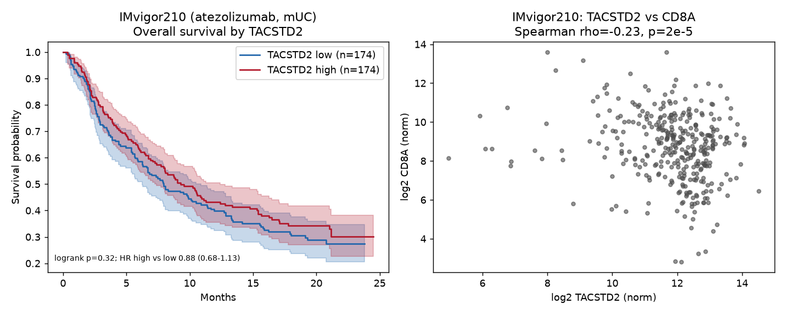
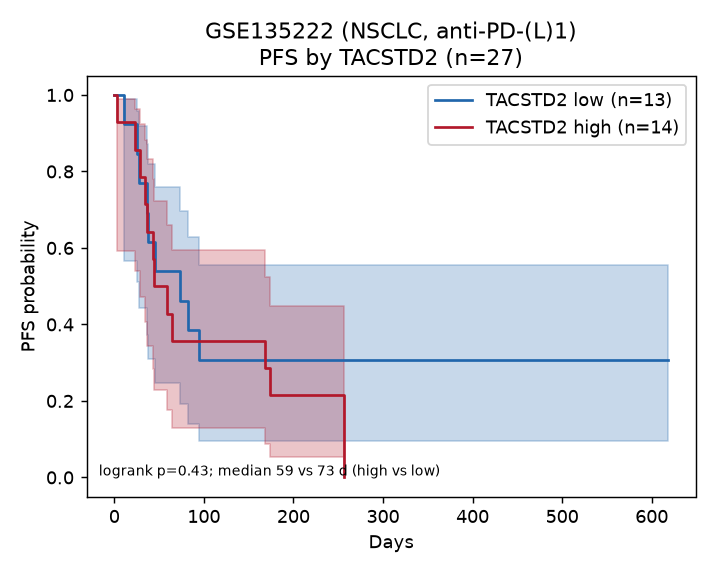

# Hunt: open leftovers of OAK/POPLAR that can test TACSTD2 vs atezolizumab benefit

**Verdict (2026-08-16): still closed.**
There is no open processed leftover of OAK or POPLAR that joins `TACSTD2` (TROP2) expression to atezolizumab outcome. Bessede’s claim cannot be recomputed from public files. The two open atezolizumab / PD-(L)1 cohorts that *do* have per-sample `TACSTD2` do **not** reproduce a significant “TACSTD2-high → worse benefit” signal.

## What Bessede claimed, and what data they used

Bessede et al., *Clin Cancer Res* 2024;30:779–785 (doi:10.1158/1078-0432.CCR-23-2566) reported that high tumor `TACSTD2` predicted worse PFS and OS **on atezolizumab but not docetaxel** in 891 pretreatment NSCLC tumors from POPLAR (phase II) + OAK (phase III):

| Endpoint (atezo arm) | TACSTD2-high vs low | Source |
|---|---|---|
| median PFS | 2.5 vs 4.1 mo, p < 0.001 | Bessede Fig. 1 |
| median OS | 12.6 vs 16.3 mo, p = 0.007 | Bessede Fig. 1 |
| DCB rate | 15.7% vs 26.2%, p = 0.009 | Bessede Fig. 1 |
| multivariate PFS HR | **1.31** (1.06–1.61), p = 0.013 | their Suppl. Table S2 (extracted here) |
| multivariate OS HR | **1.26** (1.19–1.60), p = 0.04 | their Suppl. Table S2 |

They downloaded FASTQs from EGA DAC **EGAC00001002120** (study **EGAS00001005013**, deposited by Patil et al., *Cancer Cell* 2022) and reprocessed them. That is the dataset this hunt was asked to find an *open* leftover of.

## The OAK/POPLAR RNA-seq is still controlled

Every matrix that would let us re-test the claim is behind the Genentech DAC. Full map: [`provenance/ega_access_map.md`](provenance/ega_access_map.md).

| ID | Contents | Access |
|---|---|---|
| EGAD00001007703 | 891-sample FASTQ | Controlled |
| EGAD00001008390 / 08391 | log2(TPM+1) POPLAR n=192 / OAK n=699 | Controlled |
| EGAD00001008628–08631 | counts + CPM, both trials | Controlled |
| EGAD00001008548 / 08549 | clinical (arm, histology, OS, PFS, response) | Controlled |
| vivli.org (Roche) | additional clinical | Gated |
| EGAS00001004343 | another POPLAR TPM dump mixed with IMvigor210 | Controlled |

No GEO series, no Zenodo/figshare matrix, no IOBR/TIGER/tigeR redistributed eset, and no GitHub leak of the expression table was found (inventory: [`outputs/hunt_inventory.json`](outputs/hunt_inventory.json)).

## Open leftovers that *do* exist — and why they cannot test TACSTD2

### 1. Bessede’s own supplements (open, unusable)

AACR figshare collection [10.1158/1078-0432.c.7077754](https://doi.org/10.1158/1078-0432.c.7077754). Downloaded and extracted in full: [`data/derived/bessede_supplements_extracted.md`](data/derived/bessede_supplements_extracted.md).

- **S1** — aggregated N/% characteristics of the 405 atezo + 401 docetaxel RNA-seq patients. No per-patient rows.
- **S2** — four-row multivariate Cox (TLS, PD-L1, TACSTD2-high, histology). This is a *result*, not data.
- **S3 / S4** — BIP institutional protein-level cohorts (mIHF n=50, plasma n=74), not OAK/POPLAR RNA-seq.
- **Fig S1 / S2** — images + captions. No underlying points table.

These cannot recompute a hazard ratio.

### 2. Gandara 2018 *Nature Medicine* ESM (open leftover, wrong analyte)

[doi:10.1038/s41591-018-0134-3](https://doi.org/10.1038/s41591-018-0134-3) supplementary xlsx is a genuine public leftover of OAK/POPLAR:

- `POPLAR_Clinical_Data` n=287 (144 atezo / 143 docetaxel) with PFS, OS, arm, histology, bTMB
- `OAK_Clinical_Data` n=850 (425 / 425) same
- `OAK_POPLAR_btmb_variants` 12,022 blood-TMB variant rows; **0 TACSTD2 mutations**

Schema: [`data/derived/gandara2018_schema.json`](data/derived/gandara2018_schema.json). This is what `Askir/pbmf-reproduction` uses. It has randomized-arm outcomes, but **no RNA-seq and no TACSTD2 expression**, so it cannot test Bessede.

## What *can* be tested openly (proxies, not OAK)

Because the target table does not exist in the open, the same *association* (TACSTD2-high → worse outcome on PD-L1 blockade) was run on the two genuinely-open cohorts that have per-sample `TACSTD2` + ICI outcome. Neither is a substitute for the OAK interaction test.

### IMvigor210 — atezolizumab, metastatic urothelial carcinoma, n=348 (single-arm)

Authoritative `CountDataSet` from IMvigor210CoreBiologies (Mariathasan et al., *Nature* 2018). Official `research-pub.gene.com` tarball is **HTTP 404** as of 2026-08-16; `data/cds.RData` was taken from the SiYangming GitHub mirror (Entrez rownames, real symbols, DESeq sizeFactors). A CSV mirror (`mimifp/tfm_mUC`) was tried and **rejected**: its `gene_N` rows are misaligned with its resorted `fData`, so gene identity is lost.

| Test | Result | Supports Bessede? |
|---|---|---|
| OS Cox, TACSTD2 per +1 SD | HR **0.997** (0.88–1.12), p = 0.96 | No |
| OS Cox, median-split high vs low | HR **0.88** (0.68–1.13), p = 0.32 | No (point estimate is the *opposite* direction) |
| OS log-rank, median split | p = 0.32; median OS 9.3 vs 7.9 mo (high vs low) | No |
| CR/PR rate, high vs low | 24.8% vs 20.7%, Fisher OR 1.27, p = 0.41 | No |
| TACSTD2 vs CD8A | Spearman ρ = **−0.23**, p = 2×10⁻⁵ | Yes, T-cell-low association |
| TACSTD2 vs CD274 (PD-L1) | Spearman ρ = **−0.29**, p < 10⁻⁷ | Inverse, not confounding toward benefit |



Honest reading: in the largest *open* atezolizumab RNA-seq cohort, TACSTD2 is weakly anti-correlated with CD8A (consistent with Bessede’s TME observation) but is **not** associated with worse OS or lower response. This is a single-arm mUC study, so it cannot test the treatment-by-biomarker interaction Bessede reported in NSCLC.

### GSE135222 — NSCLC, anti-PD-1/PD-L1, n=27 (single-arm, GEO)

Right disease class, tiny n. TPM + PFS from GEO.

| Test | Result | Supports Bessede? |
|---|---|---|
| PFS Cox, TACSTD2 per +1 SD | HR **1.07** (0.68–1.69), p = 0.78 | No (CI includes Bessede’s 1.31 and the null) |
| PFS log-rank, median split | p = 0.43; median 59 vs 73 days (high vs low) | Directionally consistent, not significant |
| TACSTD2 vs CD8A | ρ = −0.01, p = 0.95 | No |



Underpowered. A real OAK-sized effect would often be invisible here.

## What this does *not* mean

- It does **not** refute Bessede on OAK/POPLAR. That test is still locked.
- It does **not** say TACSTD2 is irrelevant in NSCLC. The only open NSCLC ICI RNA-seq set with PFS is n=27.
- It **does** say: if someone claims they “validated Bessede on public OAK leftovers,” they did not — those leftovers do not exist in a usable form.

The next honest step is a DAC request to EGAC00001002120, not more open-data scraping.

## Reproduce the open analyses

```bash
bash    results/hunt_oak/scripts/fetch_data.sh
Rscript results/hunt_oak/scripts/00_extract_imvigor210_cds.R
python3 results/hunt_oak/scripts/01_imvigor210.py
python3 results/hunt_oak/scripts/02_gse135222.py
python3 results/hunt_oak/scripts/03_figures.py
```

Per-sample derived tables (committable): `data/derived/imvigor210_tacstd2_persample.csv`, `data/derived/gse135222_tacstd2_persample.csv`.
Machine-readable results: `outputs/imvigor210_results.json`, `outputs/gse135222_results.json`.
Checksums of raw downloads: `provenance/sha256.txt`.
