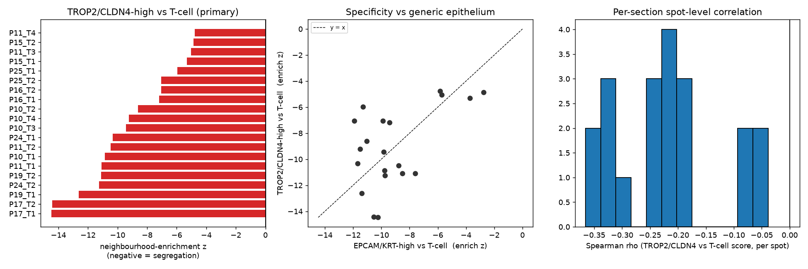

# Hunt: TACSTD2/CLDN4-high vs T-cell spots in E-MTAB-13530 Visium

**Verdict:** TROP2/CLDN4-high spots are spatially segregated from T-cell-high
spots in every tumor section. That segregation is **not specific** to
TROP2/CLDN4 — generic epithelium (EPCAM/KRT) shows the same pattern, of
similar magnitude. This is the expected tumor-nest vs stroma architecture of
NSCLC Visium, not a TROP2/CLDN4-specific immune-exclusion phenotype.

## Data

Public ArrayExpress / BioStudies processed 10x Visium of human NSCLC lesions
and non-involved tissue ([E-MTAB-13530](https://www.ebi.ac.uk/biostudies/arrayexpress/studies/E-MTAB-13530)).

We used the 20 **tumor** (`*_T*`) sections from 8 patients (P10, P11, P15,
P16, P17, P19, P24, P25). Adjacent non-involved (`*_B*`) and donor (`D*`)
sections were not included — the question is about tumor immune geography.

Per section we downloaded the public processed files:

- `<sample>-filtered_feature_bc_matrix.h5` — in-tissue gene × spot counts
- `<sample>-spatial.tar` — `tissue_positions_list.csv` + scalefactors

Re-download: `bash scripts/download_data.sh`

## Question

Are spots with high tight-junction / epithelial-tumor signal
(`TACSTD2` = TROP2, `CLDN4`) spatially **anti-colocalized** with T-cell
spots (`CD3D/E/G`, `TRAC`, `CD2`, `CD8A/B`)?

## Methods (short)

Per section, after QC (`≥200` genes, `≥500` counts) and log-normalization:

1. **Signatures.** `sc.tl.score_genes` on TROP2+CLDN4 (TJ), T-cell genes,
   and an epithelial control (EPCAM, KRT8/18/19). “High” = top 20% of that
   score *within the section*.
2. **Spot-level Spearman** of TJ vs T-cell scores. Descriptive only.
   Spot-level p-values are anti-conservative (spatial autocorrelation) and
   are **not** used for inference.
3. **Nearest-neighbour distance.** Median distance (µm) from each
   T-cell-high-only spot to the nearest TJ-high-only spot. Null = 1000
   permutations of the TJ-high labels (fixed count). Anti-colocalization ⇒
   observed / null **> 1**.
4. **Neighbourhood enrichment (primary).** Count hex-graph edges that
   connect TJ-high-only spots to T-cell-high-only spots. Null = 1000
   permutations of the categorical labels. **Negative z** = fewer contacts
   than expected = segregation.
5. **Specificity control.** Repeat (3–4) with EPCAM/KRT-high instead of
   TROP2/CLDN4-high.
6. **Inference.** Average each section-level effect to one value per
   patient (n = 8), then Wilcoxon signed-rank. This avoids treating
   autocorrelated spots, or paired sections from the same patient, as
   independent.

Script: `scripts/hunt_visium_tj.py`. Seed = 0.

## Results

### Primary: TROP2/CLDN4-high vs T-cell

| metric | 20 sections | 8 patients (Wilcoxon) |
|---|---|---|
| neighbourhood-enrichment z | 20 / 20 negative; median **−9.32** | median −8.69; W = 0; **p = 0.0039** (less than 0) |
| NN distance ratio (obs / null) | 20 / 20 > 1; typical **~1.73** | median (ratio − 1) = 0.73; W = 0; **p = 0.0039** (greater than 0) |
| Spearman ρ (TJ vs T-cell) | 20 / 20 negative; median **−0.21** | median −0.21; W = 0; **p = 0.0039** (less than 0) |

Typical observed NN distance is ~147 µm (~2 hex steps) vs ~85 µm (~1 hex
step) under random labels. That is modest separation at Visium resolution:
T-cell-high spots sit around tumor-nest interiors, not kilometres away.

P15_T2 is the exception on distance (ratio ≈ 1.00) but still has
enrichment z = −4.87: the two populations form territories, so they have
fewer *contacts* than a random labeling even when a T-cell-high spot
usually has a TJ-high neighbour one step away.



### Specificity: TROP2/CLDN4 vs generic epithelium

This is the result that changes the interpretation.

| | TROP2/CLDN4 vs T-cell | EPCAM/KRT vs T-cell |
|---|---|---|
| median section enrichment z | −9.32 | **−9.80** |
| sections more segregated than the other | 10 / 20 | 10 / 20 |
| patient-level Wilcoxon on (TJ z − epi z) | median −0.36; W = 17; **p = 0.47** (two-sided p = 0.95) | |

TROP2/CLDN4 does **not** segregate from T cells more than generic
epithelium. In P10, P16 and P25 the epithelial control is *more*
segregated. Only P17 (and to a lesser extent P19) looks TROP2/CLDN4-biased.

Signatures themselves are doing what they should: TJ vs epithelium
Spearman median ρ = 0.35; T-cell vs PTPRC median ρ = 0.24.

### Patient-level effects

| patient | n sections | TJ enrich z | epi enrich z | TJ − epi | TJ NN ratio | Spearman ρ |
|---|---|---|---|---|---|---|
| P10 | 4 | −9.53 | −10.54 | +1.01 | 1.73 | −0.23 |
| P11 | 4 | −7.84 | −7.21 | −0.63 | 2.11 | −0.20 |
| P15 | 2 | −5.10 | −3.24 | −1.86 | 1.36 | −0.07 |
| P16 | 2 | −7.12 | −9.65 | +2.53 | 1.73 | −0.20 |
| P17 | 2 | −14.44 | −10.38 | −4.06 | 1.74 | −0.31 |
| P19 | 2 | −11.86 | −9.49 | −2.37 | 1.73 | −0.21 |
| P24 | 2 | −10.80 | −10.71 | −0.09 | 1.73 | −0.35 |
| P25 | 2 | −6.51 | −11.60 | +5.09 | 1.73 | −0.21 |

Representative maps (most segregated P17_T2, mid P10_T3, least P11_T4) plus
all 20 sections are in `maps/`.

## What this does **not** show

- **Not TROP2/CLDN4-specific immune exclusion.** The same anti-colocalization
  is seen with EPCAM/KRT. The honest reading is tumor epithelium vs
  T-cell-rich stroma, the default geography of these NSCLC sections.
- **Not single-cell exclusion.** Visium spots are 55 µm and mix cell types.
  “T-cell-high” means T-cell-enriched spots, not individual T cells inside
  or outside a tumor nest.
- **Not a large exclusion zone.** Median extra distance is one hex step
  (~60–70 µm). That is nest interior vs rim/stroma, not a wide cold
  halo.
- **`nn_z` is not a useful number.** The permutation null of the *median*
  NN distance is extremely tight around one hex spacing, so z-scores of
  hundreds to thousands are an artifact of that tightness. Use `nn_ratio`
  and `enrich_z`.
- **Spot-level Spearman p-values are not valid.** Spatial autocorrelation
  makes them anti-conservative. They are in `per_section_stats.csv` only
  as a record; inference is the patient-level Wilcoxon.
- **n = 8 patients.** The Wilcoxon p = 0.0039 is the smallest possible
  one-sided p for n = 8 with no sign ties (W = 0). It says “every patient
  goes the same way,” not that the effect is precisely estimated.
- Adjacent non-involved lung was not analysed. Whether the same
  epithelium–T-cell segregation exists in normal parenchyma is unanswered.

## Files

| file | what |
|---|---|
| `per_section_stats.csv` | all per-section metrics, including the epithelial control |
| `per_patient_stats.csv` | patient means (the analysis unit) |
| `summary.json` | config + Wilcoxon results |
| `summary_overview.png` | enrichment bars, TJ-vs-epi scatter, Spearman histogram |
| `maps/<sample>.png` | TJ-high (red) / T-cell-high (blue) / both (purple) |

Reproduce:

```bash
bash scripts/download_data.sh
pip install -r requirements.txt
python3 scripts/hunt_visium_tj.py
```
