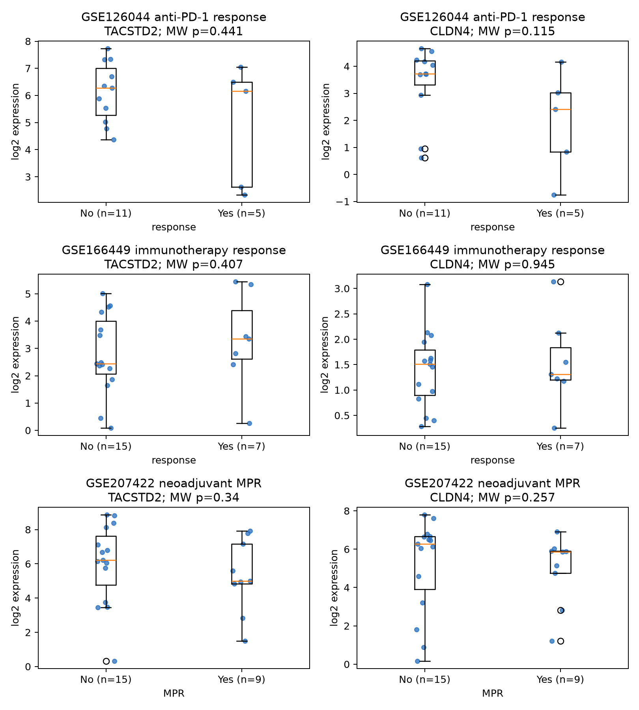
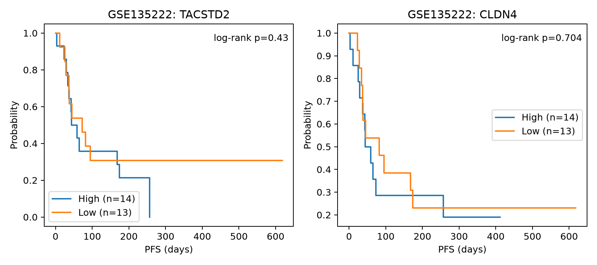
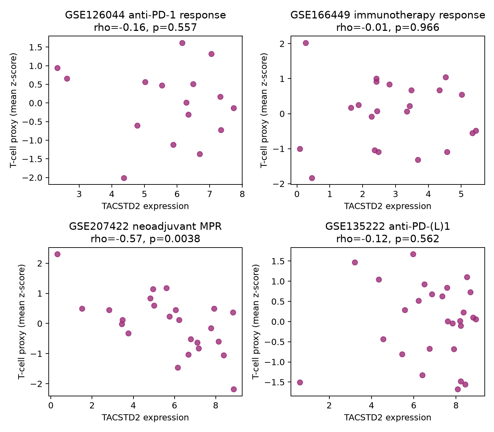

# Lung-cancer ICI: TACSTD2 (TROP2) and CLDN4

## English

### Scope and data

This analysis uses only open, processed human lung-cancer expression data with immune-checkpoint-inhibitor labels. GEO accessions and files were verified on their GEO records; no FASTQ/SRA data were used and no file larger than 2 GB was downloaded. The complete inventory, exclusions, exact file sizes, and controlled resources are in [`notes/ici_catalog.tsv`](../../notes/ici_catalog.tsv). Download URLs and SHA-256 checksums are in [`data/manifest.tsv`](data/manifest.tsv).

Four open cohorts were analyzed:

- **GSE126044:** pre-treatment bulk RNA-seq, anti-PD-1, 5 GEO-labeled responders versus 11 non-responders.
- **GSE166449:** pre-treatment bulk RNA-seq, immunotherapy, 7 GEO-labeled responders versus 15 non-responders.
- **GSE207422:** pre-treatment bulk RNA-seq before anti-PD-1 plus chemotherapy, 9 MPR versus 15 NMPR; RECIST also permits 17 CR/PR versus 7 SD.
- **GSE135222:** bulk RNA-seq from 27 anti-PD-1/PD-L1-treated patients, 21 PFS events.

### Methods

GSE126044 counts were transformed to log2(CPM + 0.5). The other response matrices were used as deposited (GSE166449 and GSE207422 are deposited on log2 expression scales). GSE135222 expression was transformed as log2(value + 1). Response groups were compared using two-sided Mann–Whitney tests. The reported median-split odds ratio is the odds of response in the high-expression half versus the low-expression half; its interval uses a 0.5 correction only when a cell is zero. Fisher exact tests assess the corresponding 2×2 table. PFS used univariable Cox regression per one expression standard deviation and a descriptive median-split log-rank test. Benjamini–Hochberg (BH) correction was applied within each result family.

The bulk T-cell proxy is the mean within-cohort z-score of **CD3D, CD3E, and CD8A**. It is a transcriptomic proxy, not a measured cell count.

### Results

**Response.** No TACSTD2 or CLDN4 response comparison remained significant after BH correction ([full table](response_statistics.tsv)).

- GSE126044: responder versus non-responder median difference was −0.121 log2 units for TACSTD2 (Mann–Whitney p=0.441; high/low response OR 0.56, 95% CI 0.06–4.76) and −1.305 for CLDN4 (p=0.115; OR 0.14, 95% CI 0.012–1.76).
- GSE166449: the TACSTD2 direction was reversed—responders had a +0.911 median difference (p=0.407; OR 3.75, 95% CI 0.54–26.05). CLDN4 differed by −0.201 (p=0.945; OR 0.66, 95% CI 0.11–4.00).
- GSE207422 MPR: median differences were −1.223 for TACSTD2 (p=0.340; OR 0.33, 95% CI 0.06–1.88) and −0.418 for CLDN4 (p=0.257; OR 0.14, 95% CI 0.021–0.96; Fisher p=0.089). For RECIST CR/PR versus SD, differences were −0.170 (TACSTD2, p=0.757) and −0.619 (CLDN4, p=0.318).

**Survival.** In GSE135222, neither gene was associated with PFS ([full table](survival_statistics.tsv)). TACSTD2 HR per SD was 1.07 (95% CI 0.68–1.69; Cox p=0.776; median-split log-rank p=0.430). CLDN4 HR per SD was 1.12 (95% CI 0.72–1.75; Cox p=0.608; log-rank p=0.704). OS was not exposed for this cohort on GEO and was not inferred.

**T-cell proxy and the Bessede et al. claim.** Bessede et al. reported that high TACSTD2 was associated with worse atezolizumab benefit and lower T-cell infiltration in OAK/POPLAR (Clin Cancer Res 2024;30:779–785, DOI [10.1158/1078-0432.CCR-23-2566](https://doi.org/10.1158/1078-0432.CCR-23-2566)). Their controlled data are listed as EGAS00001005013 and were not downloaded. In that report, the atezolizumab group had median PFS 2.5 versus 4.1 months (p<0.001), median OS 12.6 versus 16.3 months (p=0.007), and DCB 15.7% versus 26.2% (p=0.009) for TACSTD2-high versus low; these are published statistics, not estimates from the present analysis.

The open-cohort test here does **not consistently replicate** the response component: TACSTD2 was lower with response/MPR in GSE126044 and GSE207422 but higher with response in GSE166449, and all response tests were non-significant. TACSTD2 correlated inversely with the T-cell proxy in GSE207422 (Spearman rho=−0.568, p=0.00380, BH q=0.0152), but not in GSE126044 (rho=−0.159, p=0.557), GSE166449 (rho=−0.010, p=0.966), or GSE135222 (rho=−0.117, p=0.562). Thus, one chemo-immunotherapy cohort supports the infiltration direction, while three small cohorts do not; this is partial, context-dependent support rather than independent validation.

### Caveats

- These are small retrospective cohorts; confidence intervals are wide and a non-significant result is not evidence of no effect.
- Response definitions differ (GEO responder label, MPR, and RECIST ORR), and GSE207422 combines ICI with chemotherapy.
- GSE126044 mixes fresh and FFPE specimens. GSE166449 does not expose the exact ICI drug or RECIST category in GEO.
- Median splits lose information and are shown only for interpretability; continuous/rank tests are primary.
- Bulk CD3D/CD3E/CD8A expression reflects both abundance and transcriptional state and cannot establish T-cell exclusion.
- The controlled OAK/POPLAR comparison has a chemotherapy control arm and 891 tumors; these open cohorts do not provide an equivalent treatment-by-biomarker interaction test.
- CLDN4 and TACSTD2 are correlated epithelial-state markers in some settings; these univariable analyses do not establish causality or independence from histology, tumor purity, PD-L1, or other covariates.

## 中文

### 范围与数据

本分析仅使用开放的、人肺癌且带有免疫检查点抑制剂（ICI）标签的处理后表达数据。所有 GEO 编号和文件均在 GEO 页面核实；未使用 FASTQ/SRA，未下载大于 2 GB 的文件。完整目录、排除原因、文件大小和受控数据资源见 [`notes/ici_catalog.tsv`](../../notes/ici_catalog.tsv)，下载地址及 SHA-256 校验值见 [`data/manifest.tsv`](data/manifest.tsv)。

分析包括四个开放队列：GSE126044（抗 PD-1，5 名应答者/11 名非应答者）、GSE166449（免疫治疗，7/15）、GSE207422（抗 PD-1 联合化疗，9 MPR/15 NMPR；另有 17 CR/PR 对 7 SD）及 GSE135222（抗 PD-1/PD-L1，27 例、21 个 PFS 事件）。

### 方法

GSE126044 采用 log2(CPM+0.5)，GSE135222 采用 log2(value+1)，其余使用 GEO 存储的 log2 表达值。应答比较采用双侧 Mann–Whitney 检验；中位数分组 OR 表示高表达组相对低表达组的应答优势比，并同时给出 Fisher 精确检验。PFS 采用每 1 个标准差表达量的单因素 Cox 回归，中位数分组 log-rank 仅作描述。每一类结果内部使用 BH 多重检验校正。T 细胞代理指标为 CD3D、CD3E、CD8A 在队列内标准化后的均值，并非直接细胞计数。

### 结果

**应答：** BH 校正后，TACSTD2 和 CLDN4 均无显著关联（[完整结果](response_statistics.tsv)）。

- GSE126044：TACSTD2 在应答者中的中位数差为 −0.121（p=0.441；高/低表达应答 OR 0.56，95% CI 0.06–4.76）；CLDN4 为 −1.305（p=0.115；OR 0.14，95% CI 0.012–1.76）。
- GSE166449：TACSTD2 方向相反，应答者中位数高 0.911（p=0.407；OR 3.75，95% CI 0.54–26.05）；CLDN4 差值 −0.201（p=0.945）。
- GSE207422：MPR 与 NMPR 相比，TACSTD2 差值 −1.223（p=0.340），CLDN4 差值 −0.418（p=0.257）。RECIST CR/PR 与 SD 相比，TACSTD2 和 CLDN4 的差值分别为 −0.170（p=0.757）和 −0.619（p=0.318）。

**生存：** GSE135222 中两基因均未与 PFS 显著相关（[完整结果](survival_statistics.tsv)）。TACSTD2 每 1 SD 的 HR=1.07（95% CI 0.68–1.69，Cox p=0.776）；CLDN4 HR=1.12（95% CI 0.72–1.75，p=0.608）。GEO 未提供该队列 OS，因此未作推断。

**对 Bessede 等人结论的检验：** 该研究报道 OAK/POPLAR 中 TACSTD2 高表达与较差的阿替利珠单抗获益及较少 T 细胞浸润相关（DOI 同上）；其受控数据 EGAS00001005013 仅列出，未下载。本次开放队列分析未一致复现应答方向：GSE126044 和 GSE207422 中 TACSTD2 在获益组较低，而 GSE166449 中较高，且均不显著。TACSTD2 与 T 细胞代理指标仅在 GSE207422 呈显著负相关（rho=−0.568，p=0.00380，BH q=0.0152）；GSE126044、GSE166449 和 GSE135222 均不显著。因此结果只是在一个联合化疗队列中部分支持“较少 T 细胞浸润”的方向，不能视为独立验证。

### 局限性

- 样本量小、回顾性强、置信区间宽；未显著不等于无效应。
- 各队列终点不同，GSE207422 还存在化疗混杂。
- GSE126044 混合新鲜与 FFPE；GSE166449 的具体 ICI 和 RECIST 分类未在 GEO 公开。
- 中位数分组会损失信息；主要依据连续/秩检验。
- bulk RNA 的 T 细胞代理指标不能证明空间性免疫排斥。
- 开放队列没有 OAK/POPLAR 那样的化疗对照臂，不能检验治疗×生物标志物交互作用。
- 单因素结果未校正组织学、肿瘤纯度、PD-L1 等因素，不能推出 TACSTD2 或 CLDN4 的因果作用。
