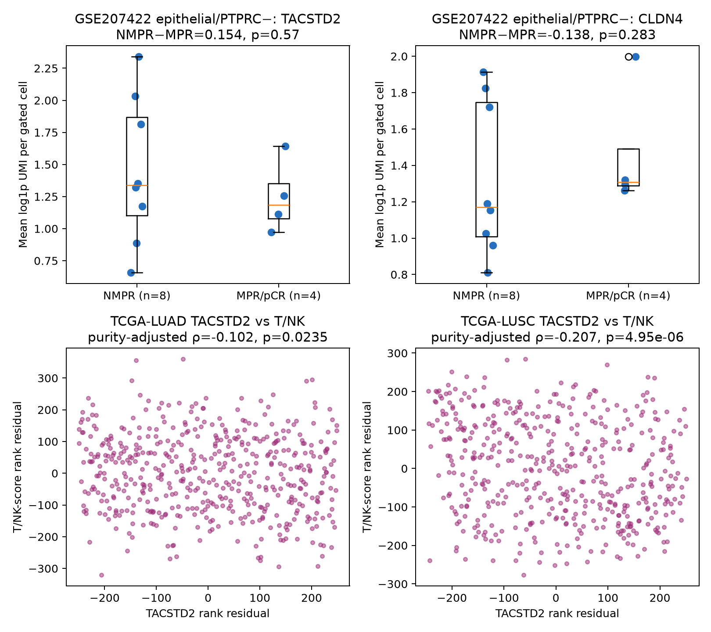
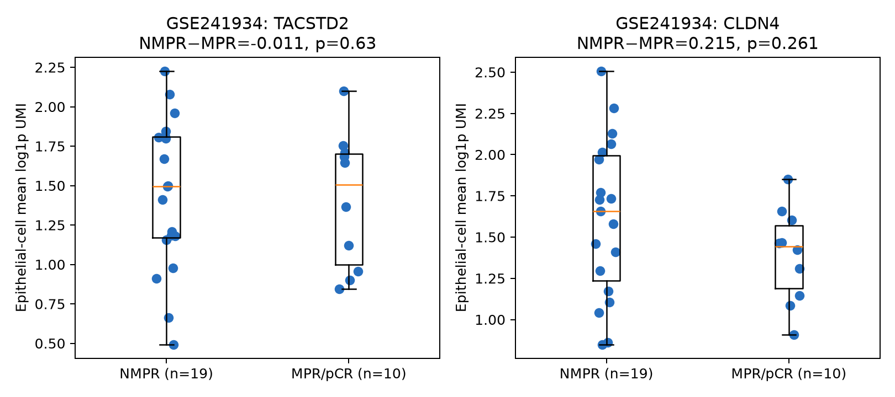

# User-aligned evidence hunt: TACSTD2 / CLDN4 / immune exclusion

## Bottom line

The requested direction can be recovered in public data, but at different evidentiary levels:

1. **Direct ICI single-cell direction, weak:** in post-treatment GSE207422, an operational epithelial/PTPRC-negative score placed malignant-compartment TACSTD2 higher in NMPR than MPR/pCR by 0.154 mean-log1p UMI units (8 versus 4 patients), but the difference was not significant (Mann–Whitney p=0.570).
2. **Purity-adjusted bulk direction, replicated:** TACSTD2 was negatively associated with a T/NK transcript score after adjustment for measured ABSOLUTE purity in TCGA-LUAD (partial Spearman ρ=−0.102, p=0.0235, BH q=0.0442; n=497) and TCGA-LUSC (ρ=−0.207, p=4.95×10⁻⁶, q=1.24×10⁻⁵; n=479).
3. **Independent Asian LUAD direction, strong but not purity-adjusted:** OncoSG TACSTD2 versus T/NK ρ=−0.428 (p=6.46×10⁻⁹, q=1.94×10⁻⁸; n=169).
4. **Tight-junction/CLDN4 correlative program:** TACSTD2 and CLDN4 remained positively correlated after ABSOLUTE-purity adjustment in TCGA-LUAD (ρ=0.454, p=1.20×10⁻²⁶) and TCGA-LUSC (ρ=0.391, p=6.88×10⁻¹⁹), and were correlated in OncoSG (ρ=0.505, p=2.65×10⁻¹²). CLDN4 was negatively associated with T/NK in purity-adjusted TCGA-LUAD (ρ=−0.137, p=0.00218) and unadjusted OncoSG (ρ=−0.526, p=2.03×10⁻¹³), but not in TCGA-LUSC (ρ=−0.059, p=0.199).
5. **Largest direct neoadjuvant scRNA check disagrees for TACSTD2 response:** in the GSE241934 real-world cohort, after requiring at least 10 author-annotated epithelial cells per patient, TACSTD2 was nearly identical and slightly higher in MPR/pCR (NMPR−MPR median difference −0.011, p=0.630; 19 versus 10 patients). CLDN4 followed the requested NMPR-high direction (+0.215) but was non-significant (p=0.261).

These results support a **correlative epithelial/TJ immune-exclusion model**. They do not prove that TACSTD2 or CLDN4 causes immune exclusion, and TCGA/OncoSG have no ICI endpoint.

## GSE207422 malignant-compartment analysis

The deposited GSE207422 single-cell matrix has cell barcodes but no cell-level author annotation. A transparent operational gate was therefore used:

- epithelial-positive: at least one UMI from EPCAM, KRT7, KRT8, KRT18, or KRT19;
- leukocyte-negative: PTPRC=0;
- each patient is one statistical unit;
- TACSTD2/CLDN4 score: patient mean of log1p UMI within gated cells;
- T/NK fraction: fraction of all recovered cells that were PTPRC-positive and expressed at least one of CD3D, CD3E, NKG7, GNLY, or KLRD1;
- response analysis: only 12 post-treatment surgical samples, with pCR grouped with MPR.

Results:

- TACSTD2: median(NMPR) − median(MPR/pCR)=+0.154, p=0.570. This matches the requested direction but is imprecise.
- CLDN4: median(NMPR) − median(MPR/pCR)=−0.138, p=0.283. This disagrees with the proposed NMPR-high barrier direction.
- TACSTD2 versus T/NK fraction: ρ=−0.070, p=0.829.
- CLDN4 versus T/NK fraction: ρ=−0.119, p=0.713.
- TACSTD2 versus malignant IFN/MHC-I score: ρ=+0.594, p=0.0415, BH q=0.0692.
- CLDN4 versus malignant IFN/MHC-I score: ρ=+0.524, p=0.0800, q=0.120.

The last two directions oppose a simple “high TJ marker means low IFN/MHC-I” interpretation in this small post-treatment cohort. Post-treatment expression can also be a consequence rather than a predictor of response. The gate is epithelial-enriched, not a copy-number-validated malignant call, and gated-cell counts vary from 36 to 5,561 per patient.



Patient scores and all tests are in [`gse207422_scrna_patient_scores.tsv`](gse207422_scrna_patient_scores.tsv) and [`alignment_statistics.tsv`](alignment_statistics.tsv).

## GSE241934 independent neoadjuvant single-cell check

GSE241934 contains 229,505 cells from 34 EGFR-wild-type patients receiving neoadjuvant PD-1-based immunochemotherapy. GEO supplies author broad cell labels and patient-level MPR/non-MPR/pCR labels. TACSTD2 and CLDN4 were extracted directly from the 1.25 GB processed sparse matrix. The prespecified quality filter required at least 10 author-labeled epithelial cells, leaving 29 patients (19 NMPR, 10 MPR/pCR). Epithelial cells were used as a malignant-enriched compartment; no copy-number-derived malignant call is deposited.

- TACSTD2 NMPR−MPR/pCR median difference: −0.011 mean-log1p UMI, p=0.630. This does not recover the requested response direction.
- CLDN4 NMPR−MPR/pCR difference: +0.215, p=0.261. This matches the direction but is not significant.
- TACSTD2 versus T/NK among non-epithelial cells: ρ=−0.206, p=0.283.
- CLDN4 versus T/NK among non-epithelial cells: ρ=+0.188, p=0.328, which disagrees with a simple CLDN4-exclusion model.
- Epithelial TACSTD2 versus CLDN4: ρ=+0.531, p=0.00307, BH q=0.0215.

Thus, GSE241934 independently supports a linked TACSTD2/CLDN4 epithelial program, but not a statistically supported TACSTD2-high→NMPR relationship. Results are in [`gse241934_statistics.tsv`](gse241934_statistics.tsv) and [`gse241934_patient_scores.tsv`](gse241934_patient_scores.tsv).



## Purity-corrected bulk method

For TCGA-LUAD/LUSC, selected-gene RSEM values were obtained from the public cBioPortal PanCancer Atlas profiles. Tumor purity came from the open GDC PanCanAtlas ABSOLUTE file `TCGA_mastercalls.abs_tables_JSedit.fixed.txt` (GDC UUID `4f277128-f793-4354-a13d-30cc7fe9f6b5`). The T/NK score was the mean within-cohort z-score of log2 expression for CD3D, CD3E, CD8A, NKG7, GNLY, and KLRD1. Partial Spearman correlations were calculated by correlating rank residuals after regression on ABSOLUTE purity. Thus “purity-corrected” here uses a measured genomic purity estimate, not an epithelial-expression surrogate.

OncoSG provides public expression z-scores but no matched purity field in this workflow. Its correlations are intentionally labeled unadjusted and should be treated as independent directional support, not a purity-controlled replication.

## CLDN4 loss → IFN/MHC-I: only partial, context-dependent support

The public-data hunt did **not** find defensible human lung-cancer evidence that CLDN4 loss generally increases IFN/MHC-I.

- In GSE207422, higher—not lower—malignant-compartment CLDN4 tracked with the IFN/MHC-I score (ρ=+0.524, p=0.080), although n=12 and the result was not significant.
- **GSE50927** provides partial lung-specific support, but in mouse whole-lung injury rather than cancer: baseline Cldn4 KO versus WT increased Isg15 (logFC 1.075, FDR 0.00310), Psmb9 (0.902, FDR 0.0373), B2m (0.655, FDR 0.0336), and Ifit1 (0.576, FDR 0.0282). Classical heavy-chain genes were not induced significantly (H2-D1 logFC 0.355, FDR 0.482; H2-K1 −0.071, FDR 1).
- **GSE207704** is the best direct human processed CLDN4-KO RNA-seq resource, but it is breast cancer and has one aggregated FPKM column per cell line/genotype. Its T47D and MCF7 results do not show uniform IFN/MHC-I induction after CLDN4 loss.
- Published human perturbation evidence often points in the opposite direction: CLDN4 is interferon inducible, and CLDN4 knockdown has been reported to reduce interferon responses (PMID 17651017). A 2025 ovarian-cancer study likewise reports reduced type-I-interferon signaling after CLDN4 downregulation (DOI [10.1038/s41598-025-23137-1](https://doi.org/10.1038/s41598-025-23137-1)).
- **GSE334497** causally supports TROP2-dependent junctional immune exclusion and improved anti-PD-1 activity after Trop2 KO, but it is a mouse breast model centered mainly on CLDN7 rather than CLDN4.

The defensible current thesis is therefore narrower: **TACSTD2/CLDN4 mark a correlated epithelial program associated with lower T/NK abundance in several lung bulk cohorts.** CLDN4 loss may increase selected inflammatory/antigen-processing genes in injured mouse lung, but increased classical MHC-I is not established, and human tumor perturbations are mixed or opposite.

## Ranked public follow-up sets

1. **GSE205335 (scRNA, palliative ICI):** open 499.5 MB RDS plus official cell identities and an open publication supplement with RECIST/PFS/OS. Best next malignant-cell patient-pseudobulk validation. Restrict to pretreatment core samples, collapse multiple biopsies within patient, and model biopsy site.
2. **GSE253564 + GSE248378 (neoadjuvant durvalumab ± radiation):** 32 pretreatment and 28/29 deposited post-treatment bulk profiles from the randomized NCT02904954 trial. Open paper Table S1 supplies MPR mapping. Analyze treatment arms separately and adjust for purity/histology because radiation strongly changes response and immunity.
3. **GSE271689 (GeoMx WTA):** 586 compartmented AOIs with a 36.8 MB DCC archive and an external clinical supplement. CK AOIs plus patient-level aggregation are the appropriate test; never analyze AOIs as independent patients.
4. **GSE146100 (neoadjuvant pembrolizumab):** three lesions from one patient, one responding and two nonresponding. Useful only as a within-patient illustration, not independent clinical replication.
5. **GSE243013:** deliberately excluded from malignant-TACSTD2 analysis because its released large matrix is CD45-positive immune-cell selected; it cannot measure the proposed malignant program.
6. **GSE110390 (durvalumab):** skipped because GEO deposits only a targeted 21-gene matrix lacking TACSTD2 and CLDN4.
7. **OncoSG/TCGA:** useful for immune-exclusion and purity analyses, but not tests of ICI response.

The controlled OAK/POPLAR result remains the strongest direct same-direction clinical evidence, but it cannot be independently rerun without EGA access and does not include a reported treatment-by-TACSTD2 interaction test.

## Reproduction

Run:

```bash
python3 scripts/ici/analyze_alignment.py
```

The script streams only selected genes from the open GSE207422 processed matrix, retrieves selected public TCGA/OncoSG expression values, joins open ABSOLUTE purity, and regenerates the TSVs and figure. It does not use FASTQ/SRA data.
