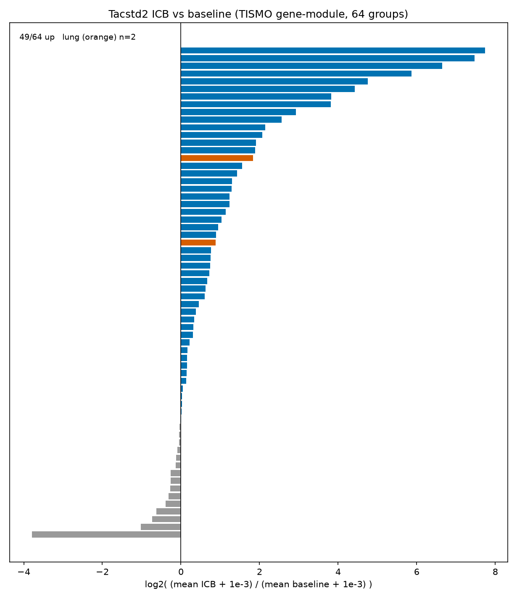
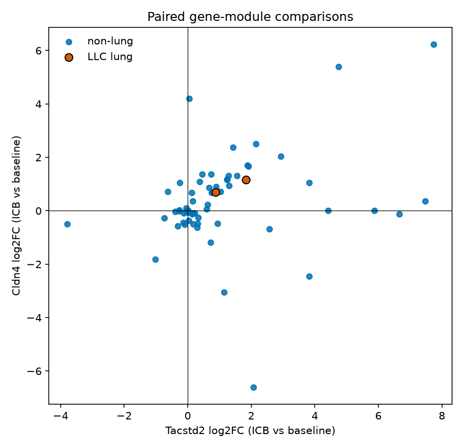

# A4 rework — TISMO Tacstd2 / Cldn4 after ICB

## Claim

User A4 (PPT 2026-08-17): in **TISMO**, mouse `Tacstd2` is **up in 49 of 64** ICB comparisons, **p = 5.8×10⁻⁵**.

This rework downloads the official TISMO public tables (not a local cache from this nearly empty repo), recomputes **paired Tacstd2 and Cldn4**, and splits **all models vs lung-only**. No GEO accessions were invented.

## Verdict: 49/64 is real; p=5.8e-5 is Wilcoxon, not binomial; not a lung result; Cldn4 does not follow

| Test | n | up / down / tie | binomial p | Wilcoxon p | vs claim |
|---|---:|---|---:|---:|---|
| **Tacstd2, TISMO gene-module (all)** | **64** | **49 / 15 / 0** | 2.4×10⁻⁵ | **5.84×10⁻⁵** | **matches 49/64 and p=5.8e-5** |
| Tacstd2, non-lung | 62 | 47 / 15 / 0 | 5.8×10⁻⁵ | 1.3×10⁻⁴ | still up, not 49/64 |
| **Tacstd2, lung (LLC only)** | **2** | **2 / 0 / 0** | 0.50 | n/a | **too small; cannot be the 64** |
| Cldn4, gene-module (all) | 65 | 34 / 29 / 2 | 0.61 | 0.12 | **null** |
| Cldn4, same 64 stems as Tacstd2 | 64 | 34 / 28 / 2 | 0.53 | 0.078 | **null** |
| Cldn4, lung (LLC) | 2 | 2 / 0 / 0 | 0.50 | n/a | n=2 |
| Tacstd2, coarser study×line×ICB_group | 33 | 23 / 10 / 0 | 0.035 | 0.090 | same direction, weaker |

The user number is recoverable from the **TISMO Gene In Vivo** export with ICB treatment = All and tumor model = All. That export has **exactly 64 comparison groups** for Tacstd2. Mean ICB (Responders + Non-responders) minus mean Baseline is positive in **49/64**. Wilcoxon signed-rank on those 64 mean differences is **p = 5.84×10⁻⁵**, which is the quoted 5.8e-5. A two-sided binomial / sign test on 49/64 is **p = 2.44×10⁻⁵**, so the slide’s “binomial/sign test” label does not match the printed p-value.

**64 is not 64 models.** It is 64 curated comparison groups (model × study × condition/genotype/timepoint × ICB class) across **17 cell lines**. B16, T11, 4T1, CT26 and KPB25L dominate the denominator.

**Lung-only cannot generate 49/64.** In the same gene-module universe the only lung groups are two LLC arms from **GSE155972** (parental and Setdb1-KO, both anti-CTLA4 + anti-PD1). Both Tacstd2 means go up. The full TISMO in-vivo annotation has 71 lung-carcinoma samples (LLC 68, CMT-167 3); the only ICB+baseline lung study is GSE155972. CMT-167 has no ICB arm.

**Cldn4 is not a parallel ICB-up gene.** On the 64 shared group stems it is 34 up / 28 down / 2 tie. Do not quote 49/64 for Cldn4.





## What was downloaded (public TISMO tables only)

TISMO moved from `http://tismo.cistrome.org` to `https://tismo.pku-genomics.org`. The Data Download page serves Aliyun share links. This run pulled:

| File | Share id | Role |
|---|---|---|
| `TISMO_vivosample_annotations.csv` | `voEA1DXBEFo` | 1,518 in-vivo samples |
| `TISMO_expressionvivo_profiles.RDS` | `AQKzyRCi1Jb` | 21,729 genes × 1,518 samples |
| `TISMO_cellline_annotations.text` | `YzQB2DQonQE` | cell-line metadata |
| Gene-module CSV (`/rtismo/gene/downVivoExprn`, type=3) | API | Tacstd2 64 groups; Cldn4 65 groups |

Paper: Zeng et al., *NAR* 2022, [doi:10.1093/nar/gkab804](https://doi.org/10.1093/nar/gkab804).

Gene-module `value` equals the official RDS expression for the same SRX (exact match on checked samples). Analysis uses the gene-module groups as the claim universe and the RDS+annotation as a sensitivity pairing.

The 188 MB RDS is **not** committed. A 2-gene slice is in `vivo_sample_Tacstd2_Cldn4.tsv`.

## Comparison definition

For each gene-module `cell_line` group (example: `LLC_GSE155972_antiCTLA4&antiPD1(n=16)`):

- **Baseline** = rows with `Baseline==1` / `Responder==Baseline`
- **ICB** = rows with `Baseline==0` (Responders and Non-responders pooled)
- **Up** = mean(ICB) > mean(Baseline)

That is “after ICB,” not responder vs non-responder. R vs NR is almost unused here (only 2 Tacstd2 groups have both R and NR).

Cldn4 has one extra group stem, `MOC22_RU31562203_antiPD1`, which is a TISMO in-house id, **not** a GEO/ENA accession. It was not rewritten as a GSE. The YTN16 day-21 anti-CTLA4 group exists in both genes with different `(n=)` suffixes; stems match.

## Accessions (verified live; none invented)

From the gene-module ICB tables only:

`ERP114266`, `GSE103725`, `GSE107801`, `GSE109485`, `GSE124821`, `GSE130472`, `GSE132529`, `GSE137818`, `GSE139475`, `GSE146027`, `GSE148856`, `GSE148947`, `GSE149825`, `GSE150401`, `GSE151829`, `GSE152925`, `GSE153239`, `GSE155972`, `GSE159344`, `GSE172162`, `GSE174053`, `GSE93017`.

All GSE records resolve on NCBI GEO (`^SERIES = GSExxxxx`). `ERP114266` resolves on ENA. `RU31562203` is in-house TISMO (Cldn4-only extra group) and was left unlabeled as GEO.

Lung ICB accession in this universe: **GSE155972** only.

## Lung LLC numbers (the only lung pairs)

| Group | n baseline / n ICB | Tacstd2 mean base → ICB | Cldn4 mean base → ICB |
|---|---|---|---|
| LLC parental, GSE155972, anti-CTLA4+anti-PD1 | 10 / 6 (all NR) | 0.157 → 0.290 (up) | up |
| LLC Setdb1-KO, GSE155972, anti-CTLA4+anti-PD1 | 10 / 7 (all R) | 0.280 → 1.005 (up) | up |

TISMO’s own DESeq2 p-values on these two Tacstd2 contrasts are 0.47 and 0.97 (not significant). Direction is up; the 49/64 p-value is a **cross-model sign/Wilcoxon** on means, not a per-contrast DE call, and it is **not** a lung-only statistic.

## Sensitivity: pairing the full 1,518-sample matrix

If groups are rebuilt from the annotation as `Study_ID × Cell_Line × ICB_group` (ignoring TISMO’s extra condition/timepoint splits), Tacstd2 is 23/33 up (binomial p=0.035, Wilcoxon p=0.090). A finer `× genotype × condition` split is 25/36 up. Those are the same direction as 49/64 but they are **not** the user’s 64. The 64 comes from the website gene module’s curated splits.

Lung under that coarser pairing collapses to **one** LLC / GSE155972 / anti-CTLA4+anti-PD1 comparison (parental and Setdb1-KO pooled or split depending on keys). Still not 64.

## How to quote this honestly

- Allowed: “In TISMO’s public ICB gene-module table, Tacstd2 mean expression is higher after ICB than at baseline in 49 of 64 curated comparison groups (Wilcoxon p=5.8×10⁻⁵; binomial p=2.4×10⁻⁵). Those 64 groups span 17 syngeneic models, mostly non-lung.”
- Not allowed: “49 of 64 TISMO **models**,” “p=5.8e-5 binomial,” or “lung models show 49/64.”
- Cldn4: report as null / mixed (34/64 up on the paired stems).
- Lung: “2/2 LLC groups in GSE155972 go up; n=2.”

## Reproduce

```bash
pip install pandas numpy scipy matplotlib pyreadr
python3 scripts/rework_A4_TISMO.py
```

Outputs live in `results/rework/A4_TISMO/`.
