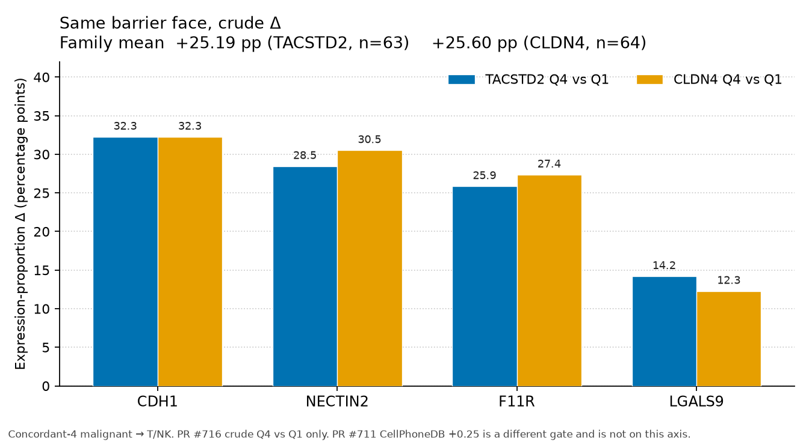

# Story gap — one PPT sentence for the shared barrier face

Numbers are copied from PR [#716](https://github.com/jinxuanhong1-blip/sdaxcge/pull/716) (`50108f59`) and PR [#711](https://github.com/jinxuanhong1-blip/sdaxcge/pull/711) (`b1020ec1`). Nothing was re-fit.

Concordant-4 only (GSE123902, GSE131907, GSE205335, GSE189357). Senders are malignant cells. Receiver is T/NK. Ligands are F11R, NECTIN2, CDH1, and LGALS9. The patient is the unit. This is an expression ligand–receptor contrast.

## Slide sentence

Same barrier face, crude Δ only: on concordant-4, TACSTD2 Q4 vs Q1 and CLDN4 Q4 vs Q1 raise the same T/NK ligands in the same order (CDH1, NECTIN2, F11R, LGALS9), +25.19 and +25.60 percentage points (CellChat Hill +0.0663 and +0.0651; n=63 and 64; 4/4 cohorts).

That sentence is the whole claim. The two family means sit 0.41 percentage points apart. The Wilcoxon tests in #716 compare high vs low inside one gate. They do not compare the two gates with each other.

## Why this wording

The phrase to land is a shared barrier face. On the co-primary expression-proportion score, both gates are positive in every cohort, and the ligand order is CDH1, then NECTIN2, then F11R, then LGALS9.

| ligand | TACSTD2 Δ (pp) | CLDN4 Δ (pp) | CLDN4 − TACSTD2 |
|---|---:|---:|---:|
| CDH1 | +32.26 | +32.26 | +0.00 |
| NECTIN2 | +28.46 | +30.52 | +2.06 |
| F11R | +25.85 | +27.36 | +1.51 |
| LGALS9 | +14.20 | +12.28 | −1.92 |
| **Family** | **+25.19** | **+25.60** | **+0.41** |

The subtraction column is arithmetic on the published means. It is not a paired test. Patient sets differ by one unit: EBUS_13 has no malignant TACSTD2 counts, so TACSTD2 is n=63 and CLDN4 is n=64. Family means are positive in 60/63 and 62/64 patients.

The same agreement is on the other #716 crude scales, which stay off the spoken sentence because they are not percentage points:

| score | TACSTD2 | CLDN4 |
|---|---:|---:|
| CellChat Hill (no population-size weight) | +0.0663 | +0.0651 |
| cpdb_means, receptor term cancelled | +0.107 | +0.105 |
| liana log2FC of log1p means | +0.308 | +0.304 |

Cohort family means, expression proportion, order GSE123902 / GSE131907 / GSE205335 / GSE189357: TACSTD2 +18.90 / +21.98 / +32.18 / +25.12; CLDN4 +21.33 / +21.77 / +32.44 / +24.79. GSE205335 is the large cohort on both gates. I² is 45% and 34%.

LGALS9 is the small ligand on both gates (patient fraction positive 0.73 and 0.64). The family call does not require every ligand in every patient.

Decile crude means, not in the sentence: TACSTD2 +26.14 (n=59) and CLDN4 +27.76 (n=60). The locked CLDN4 decile figure is +27.8.

## What stays off this slide

**Cold niche.** Neighbor depletion is a spatial count. PR #716 and PR #711 both say their readout is an expression ligand–receptor contrast. The CosMx cytotoxic ratios (0.36 / 0.52) and the TACSTD2 CD8+NK ratios (0.455 / 0.670) belong on the spatial slide.

**Mediation.** PR #716 also residualizes each gene on the other (expression proportion +25.19 → +10.44 after CLDN4 strata; CLDN4 +25.60 → +12.02 after TACSTD2 strata). Those rows are a dependence analysis. This sentence uses the crude rows only.

**PR #711’s +0.2533.** That winner is CLDN4-positive vs CLDN4-negative, CellPhoneDB `lr_means` +0.2533 and Connectome +0.1250, n=53, expr_prop 0.10, 52/53 patients positive, 4/4 cohorts. It has no TACSTD2 arm. Its ligand order is CDH1, F11R, NECTIN2, LGALS9, so F11R and NECTIN2 swap relative to the expression-proportion profile. Missing ligands are not filled with zero. PR #716’s own `cpdb_means` is a different formula, Δ = (Lhigh − Llow) / 2, and those family means are +0.107 and +0.105. Keep +0.2533 in the #711 column.

## Paste table

| Show | Number | Source |
|---|---|---|
| Slide sentence | TACSTD2 +25.19 pp, CLDN4 +25.60 pp; Hill +0.0663 and +0.0651; same ligand order | #716 crude Q4 vs Q1 |
| Ligand order | CDH1 +32.26 / +32.26; NECTIN2 +28.46 / +30.52; F11R +25.85 / +27.36; LGALS9 +14.20 / +12.28 | #716 crude |
| Separate CLDN4 score | CellPhoneDB family +0.2533; Connectome +0.1250; n=53 | #711 winner |
