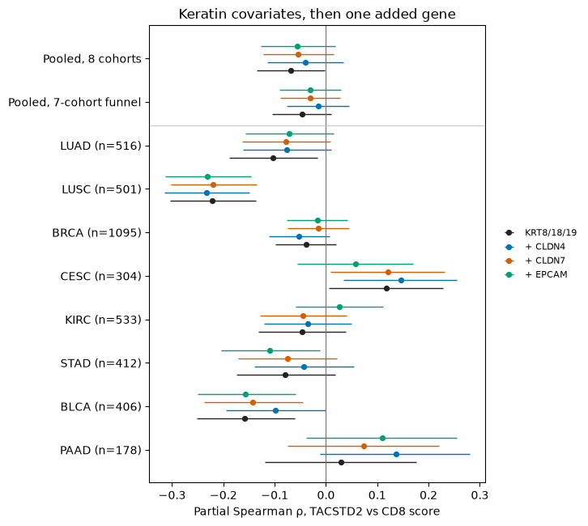
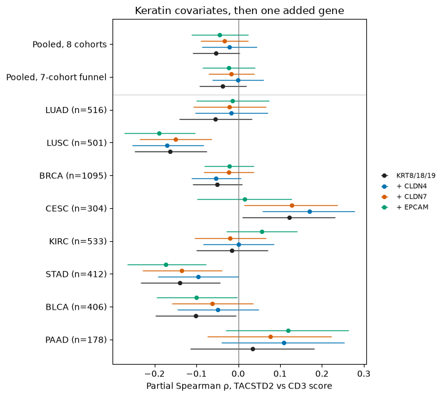
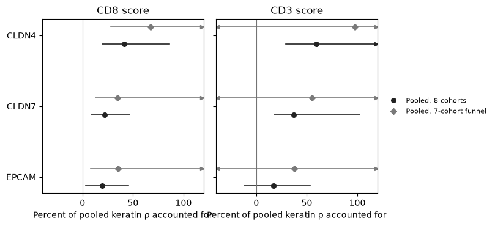
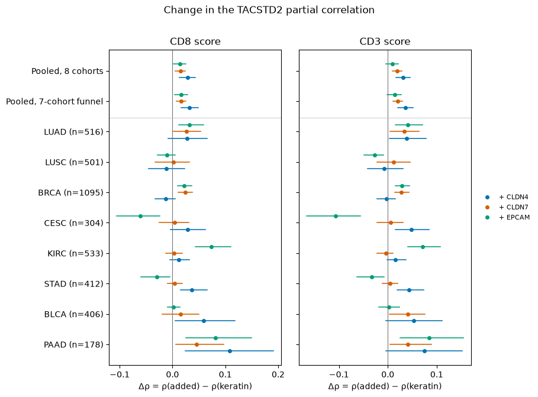

# TCGA: share of the keratin-adjusted TACSTD2–immune correlation accounted for by CLDN4

Numbers in this file are written by `scripts/tcga_trop2_cldn4_mediation/run_analysis.py`.

## Answer

In the eight lung and keratin-funnel cohorts (3945 primary tumors), the DerSimonian–Laird pooled partial Spearman correlation of TACSTD2 with the CD8 score after KRT8+KRT18+KRT19 is -0.069 (95% CI -0.135 to -0.002, p=0.0427, I²=76.1%, 6/8 cohorts negative). Adding CLDN4 changes that pooled correlation to -0.040 (95% CI -0.114 to 0.034, p=0.2861, I²=80.7%, 6/8 negative). The share accounted for, (ρ_before − ρ_after) / ρ_before, is 41.3% (patient-bootstrap 95% percentile interval 19.8% to 86.1%). Adding CLDN7 instead accounts for 21.6% (interval 8.5% to 46.7%). Adding EPCAM instead accounts for 19.7% (interval 3.5% to 45.7%).

CLDN4 minus CLDN7 is 19.7% (interval -2.7% to 51.7%). CLDN4 minus EPCAM is 21.6% (interval -3.9% to 62.0%). After CLDN7 and EPCAM are already in the model, adding CLDN4 accounts for a further 1.8% of the original keratin-adjusted CD8 correlation (interval -21.0% to 23.3%). On the CD3 score the eight-cohort keratin ρ is -0.053 (95% CI -0.109 to 0.004, p=0.0700, I²=67.2%) and the CLDN4 model is -0.021 (95% CI -0.087 to 0.044, p=0.5249, I²=75.2%), a CLDN4 share of 59.6% (interval 29.3% to 165.2%).

In the seven-cohort keratin funnel (LUAD, BRCA, CESC, KIRC, STAD, BLCA, PAAD; 3444 tumors) the CD8 pooled ρ is -0.047 after keratin (95% CI -0.105 to 0.011, p=0.1111, I²=63.1%, 5/7 negative) and -0.015 after adding CLDN4 (95% CI -0.076 to 0.046, p=0.6215, I²=66.4%). The CLDN4 share is 67.5% (interval 28.1% to 295.3%).

That eight-cohort percentage describes the two pooled correlations. Adding CLDN4 shrinks a negative CD8 correlation in LUAD (-0.104 to -0.076), KIRC (-0.047 to -0.035), STAD (-0.079 to -0.043), BLCA (-0.158 to -0.099). It makes a negative correlation more negative in LUSC (-0.221 to -0.233), BRCA (-0.039 to -0.052). It makes a positive correlation more positive in CESC (0.118 to 0.147), PAAD (0.029 to 0.137). The most negative keratin-adjusted correlation is LUSC (-0.221 to -0.233 after CLDN4).

In LUSC only, KRT5+KRT6A+KRT14 in place of KRT8/18/19 gives TACSTD2–CD8 ρ -0.138 and a CLDN4 share of 30.2% (interval 1.2% to 95.6%). That row is outside both pools.

A positive mediation percentage means the later pooled correlation is closer to zero than the keratin-only correlation. The eight-cohort keratin-only CD8 correlation is negative.

## 中文摘要

八队列（3945 例原发灶）：TACSTD2 与 CD8 分数在 KRT8+KRT18+KRT19 后的合并偏 Spearman ρ 为 -0.069（95% CI -0.135 to -0.002），加入 CLDN4 后为 -0.040。CLDN4 解释的合并相关比例为 41.3%（bootstrap 95% 区间 19.8% to 86.1%）。CLDN7 为 21.6%，EPCAM 为 19.7%。CD3 上 CLDN4 的比例为 59.6%。七队列角蛋白漏斗（3444 例）CD8 的 CLDN4 比例为 67.5%。CLDN4 与 CLDN7 的比例之差为 19.7%（区间 -2.7% to 51.7%）。在 CLDN7 与 EPCAM 已进入模型后，CLDN4 再解释的比例为 1.8% （区间 -21.0% to 23.3%）。这是批量 RNA 上的统计分解。

## Design

The expression values are UCSC Xena GDC STAR log2(TPM+1), GENCODE v36, primary solid tumor (sample type 01), with replicate aliquots averaged to the patient. The eight-cohort pool is LUAD, LUSC, BRCA, CESC, KIRC, STAD, BLCA, PAAD. The seven-cohort pool is the locked keratin funnel: LUAD, BRCA, CESC, KIRC, STAD, BLCA, PAAD. Keratin covariates are KRT8, KRT18, and KRT19. The CD8 score is the mean of CD8A and CD8B. The CD3 score is the mean of CD3D, CD3E, and CD3G.

Partial Spearman is the Pearson correlation of average-rank residuals after regression on an intercept and the rank-transformed covariates. The t test uses df = n − 2 − k. Fisher intervals use variance 1/(n − 3 − k). Cohorts are combined by DerSimonian–Laird random effects on Fisher z.

Mediation percentage = 100 × (ρ_keratin − ρ_keratin+covariate) / ρ_keratin, using the two pooled correlations. The bootstrap resamples patients inside each cohort, refits every cohort, re-pools, and takes the 2.5 and 97.5 percentiles. Draws: 2000. Master seed: 20260921. Cohort c uses seed 20260921+1000×(index+1).

The rank-OLS proportion is a×b/c on the same average ranks, with keratins in every equation, then an n-weighted mean across cohorts. On this scale c − c′ = a×b. CLDN7 and EPCAM are fit the same way, one mediator at a time. The incremental row puts CLDN7 and EPCAM in the covariate set and then adds CLDN4. Its further share is (ρ_controls − ρ_controls+CLDN4) / ρ_keratin.

Benjamini–Hochberg q-values are computed inside each pre-specified family: keratin tests for one outcome; keratin+CLDN4 tests for one outcome; the two negative-control tests for one outcome. Families are not mixed.

Cohort rows with |keratin ρ| < 0.05 are marked `small ρ` because that cohort's percentage divides by a small number. Those cohorts stay in every pool.

## Pooled correlations

| pool | outcome | model | k | N | negative cohorts | pooled ρ | 95% CI | p | I² |
| --- | --- | --- | --- | --- | --- | --- | --- | --- | --- |
| lung_funnel8 | CD8_score | keratin | 3 | 3945 | 6/8 | -0.069 | -0.135 to -0.002 | 0.0427 | 76.1% |
| lung_funnel8 | CD8_score | keratin_CLDN4 | 4 | 3945 | 6/8 | -0.040 | -0.114 to 0.034 | 0.2861 | 80.7% |
| lung_funnel8 | CD8_score | keratin_CLDN7 | 4 | 3945 | 6/8 | -0.054 | -0.122 to 0.015 | 0.1263 | 77.8% |
| lung_funnel8 | CD8_score | keratin_EPCAM | 4 | 3945 | 5/8 | -0.055 | -0.127 to 0.018 | 0.1376 | 80.1% |
| lung_funnel8 | CD8_score | keratin_CLDN7_EPCAM | 5 | 3945 | 5/8 | -0.052 | -0.125 to 0.021 | 0.1630 | 80.3% |
| lung_funnel8 | CD8_score | keratin_CLDN7_EPCAM_CLDN4 | 6 | 3945 | 5/8 | -0.051 | -0.123 to 0.022 | 0.1709 | 80.0% |
| lung_funnel8 | CD3_score | keratin | 3 | 3945 | 6/8 | -0.053 | -0.109 to 0.004 | 0.0700 | 67.2% |
| lung_funnel8 | CD3_score | keratin_CLDN4 | 4 | 3945 | 5/8 | -0.021 | -0.087 to 0.044 | 0.5249 | 75.2% |
| lung_funnel8 | CD3_score | keratin_CLDN7 | 4 | 3945 | 6/8 | -0.033 | -0.090 to 0.024 | 0.2571 | 67.5% |
| lung_funnel8 | CD3_score | keratin_EPCAM | 4 | 3945 | 5/8 | -0.044 | -0.112 to 0.024 | 0.2084 | 77.3% |
| lung_funnel8 | CD3_score | keratin_CLDN7_EPCAM | 5 | 3945 | 5/8 | -0.039 | -0.105 to 0.028 | 0.2543 | 75.8% |
| lung_funnel8 | CD3_score | keratin_CLDN7_EPCAM_CLDN4 | 6 | 3945 | 5/8 | -0.041 | -0.104 to 0.023 | 0.2069 | 73.6% |
| keratin_funnel7 | CD8_score | keratin | 3 | 3444 | 5/7 | -0.047 | -0.105 to 0.011 | 0.1111 | 63.1% |
| keratin_funnel7 | CD8_score | keratin_CLDN4 | 4 | 3444 | 5/7 | -0.015 | -0.076 to 0.046 | 0.6215 | 66.4% |
| keratin_funnel7 | CD8_score | keratin_CLDN7 | 4 | 3444 | 5/7 | -0.031 | -0.089 to 0.027 | 0.2961 | 62.9% |
| keratin_funnel7 | CD8_score | keratin_EPCAM | 4 | 3444 | 4/7 | -0.030 | -0.090 to 0.030 | 0.3210 | 65.5% |
| keratin_funnel7 | CD8_score | keratin_CLDN7_EPCAM | 5 | 3444 | 4/7 | -0.027 | -0.086 to 0.032 | 0.3720 | 64.1% |
| keratin_funnel7 | CD8_score | keratin_CLDN7_EPCAM_CLDN4 | 6 | 3444 | 4/7 | -0.026 | -0.080 to 0.029 | 0.3574 | 57.8% |
| keratin_funnel7 | CD3_score | keratin | 3 | 3444 | 5/7 | -0.037 | -0.092 to 0.019 | 0.1968 | 60.0% |
| keratin_funnel7 | CD3_score | keratin_CLDN4 | 4 | 3444 | 4/7 | -0.001 | -0.062 to 0.060 | 0.9772 | 66.5% |
| keratin_funnel7 | CD3_score | keratin_CLDN7 | 4 | 3444 | 5/7 | -0.016 | -0.071 to 0.038 | 0.5539 | 57.9% |
| keratin_funnel7 | CD3_score | keratin_EPCAM | 4 | 3444 | 4/7 | -0.023 | -0.085 to 0.040 | 0.4757 | 68.3% |
| keratin_funnel7 | CD3_score | keratin_CLDN7_EPCAM | 5 | 3444 | 4/7 | -0.018 | -0.077 to 0.042 | 0.5598 | 65.0% |
| keratin_funnel7 | CD3_score | keratin_CLDN7_EPCAM_CLDN4 | 6 | 3444 | 4/7 | -0.019 | -0.071 to 0.033 | 0.4663 | 53.4% |





Fisher-z intervals are drawn for each cohort. Pooled rows use the DerSimonian–Laird interval.

## Mediation percentage

| pool | outcome | added | ρ before | ρ after | Δρ | Δρ bootstrap CI | mediation % | mediation % bootstrap CI | fraction of bootstraps with |ρ_before|<0.02 |
| --- | --- | --- | --- | --- | --- | --- | --- | --- | --- |
| lung_funnel8 | CD8_score | CLDN4 | -0.069 | -0.040 | 0.028 | 0.013 to 0.043 | 41.3% | 19.8% to 86.1% | 0.004 |
| lung_funnel8 | CD8_score | CLDN7 | -0.069 | -0.054 | 0.015 | 0.006 to 0.024 | 21.6% | 8.5% to 46.7% | 0.004 |
| lung_funnel8 | CD8_score | EPCAM | -0.069 | -0.055 | 0.014 | 0.002 to 0.025 | 19.7% | 3.5% to 45.7% | 0.004 |
| lung_funnel8 | CD8_score | CLDN7+EPCAM | -0.069 | -0.052 | 0.017 | 0.002 to 0.030 | 24.1% | 3.5% to 53.2% | 0.004 |
| lung_funnel8 | CD3_score | CLDN4 | -0.053 | -0.021 | 0.031 | 0.017 to 0.046 | 59.6% | 29.3% to 165.2% | 0.035 |
| lung_funnel8 | CD3_score | CLDN7 | -0.053 | -0.033 | 0.020 | 0.010 to 0.029 | 37.1% | 17.5% to 102.6% | 0.035 |
| lung_funnel8 | CD3_score | EPCAM | -0.053 | -0.044 | 0.009 | -0.004 to 0.021 | 16.7% | -12.0% to 53.4% | 0.035 |
| lung_funnel8 | CD3_score | CLDN7+EPCAM | -0.053 | -0.039 | 0.014 | -0.002 to 0.029 | 26.7% | -4.9% to 76.2% | 0.035 |
| keratin_funnel7 | CD8_score | CLDN4 | -0.047 | -0.015 | 0.032 | 0.016 to 0.048 | 67.5% | 28.1% to 295.3% | 0.092 |
| keratin_funnel7 | CD8_score | CLDN7 | -0.047 | -0.031 | 0.016 | 0.007 to 0.025 | 34.6% | 13.1% to 134.4% | 0.092 |
| keratin_funnel7 | CD8_score | EPCAM | -0.047 | -0.030 | 0.017 | 0.004 to 0.029 | 35.5% | 7.8% to 147.3% | 0.092 |
| keratin_funnel7 | CD8_score | CLDN7+EPCAM | -0.047 | -0.027 | 0.020 | 0.005 to 0.035 | 43.0% | 9.5% to 160.0% | 0.092 |
| keratin_funnel7 | CD3_score | CLDN4 | -0.037 | -0.001 | 0.036 | 0.020 to 0.052 | 97.6% | -270.1% to 726.1% | 0.215 |
| keratin_funnel7 | CD3_score | CLDN7 | -0.037 | -0.016 | 0.020 | 0.011 to 0.030 | 55.2% | -139.3% to 368.9% | 0.215 |
| keratin_funnel7 | CD3_score | EPCAM | -0.037 | -0.023 | 0.014 | -0.001 to 0.028 | 37.9% | -49.1% to 249.0% | 0.215 |
| keratin_funnel7 | CD3_score | CLDN7+EPCAM | -0.037 | -0.018 | 0.019 | 0.001 to 0.034 | 51.5% | -68.3% to 301.7% | 0.215 |

Δρ = ρ(after adding the covariate) − ρ(keratin). A positive Δρ moves the correlation upward. When the keratin correlation is negative, a positive Δρ moves it toward zero.



The mediation-percentage axis is fixed at −40% to 120% so the three covariates can be compared. An arrow marks an interval that continues past the axis. The table holds the unclipped interval.



### CLDN4 compared with the controls

| pool | outcome | contrast | mediation % difference | bootstrap CI |
| --- | --- | --- | --- | --- |
| lung_funnel8 | CD8_score | CLDN4 minus CLDN7 | 19.7% | -2.7% to 51.7% |
| lung_funnel8 | CD8_score | CLDN4 minus EPCAM | 21.6% | -3.9% to 62.0% |
| lung_funnel8 | CD3_score | CLDN4 minus CLDN7 | 22.5% | -6.6% to 80.3% |
| lung_funnel8 | CD3_score | CLDN4 minus EPCAM | 42.9% | 8.9% to 139.6% |
| keratin_funnel7 | CD8_score | CLDN4 minus CLDN7 | 32.9% | -2.8% to 167.8% |
| keratin_funnel7 | CD8_score | CLDN4 minus EPCAM | 31.9% | -9.9% to 173.4% |
| keratin_funnel7 | CD3_score | CLDN4 minus CLDN7 | 42.4% | -122.7% to 318.3% |
| keratin_funnel7 | CD3_score | CLDN4 minus EPCAM | 59.7% | -157.5% to 477.4% |

### CLDN4 after CLDN7 and EPCAM are in the model

| pool | outcome | ρ keratin | ρ +CLDN7+EPCAM | ρ +CLDN7+EPCAM+CLDN4 | further share from CLDN4 | bootstrap CI | rank-OLS incremental proportion | rank-OLS CI |
| --- | --- | --- | --- | --- | --- | --- | --- | --- |
| lung_funnel8 | CD8_score | -0.069 | -0.052 | -0.051 | 1.8% | -21.0% to 23.3% | -31.9% | -322.8% to 197.7% |
| lung_funnel8 | CD3_score | -0.053 | -0.039 | -0.041 | -4.6% | -45.4% to 21.9% | -22.0% | -182.3% to 169.0% |
| keratin_funnel7 | CD8_score | -0.047 | -0.027 | -0.026 | 2.8% | -41.3% to 59.8% | -34.4% | -367.7% to 226.7% |
| keratin_funnel7 | CD3_score | -0.037 | -0.018 | -0.019 | -4.0% | -104.1% to 91.9% | -22.4% | -205.0% to 196.9% |

### Rank-OLS proportion mediated

On average ranks, the cohort proportion is a×b/c. The n-weighted mean of those proportions is a different summary from the pooled-ρ percentage. A cohort with a small total coefficient, PAAD in particular, can dominate the weighted mean. The cohort rows are the ones to read.

| pool | outcome | mediator | n-weighted rank-OLS proportion | bootstrap CI |
| --- | --- | --- | --- | --- |
| lung_funnel8 | CD8_score | CLDN4 | -22.0% | -274.5% to 248.9% |
| lung_funnel8 | CD8_score | CLDN7 | 14.1% | -168.4% to 242.1% |
| lung_funnel8 | CD8_score | EPCAM | 27.7% | -285.3% to 413.5% |
| lung_funnel8 | CD3_score | CLDN4 | 10.6% | -324.2% to 288.8% |
| lung_funnel8 | CD3_score | CLDN7 | 17.5% | -217.8% to 232.3% |
| lung_funnel8 | CD3_score | EPCAM | 81.7% | -485.7% to 515.0% |
| keratin_funnel7 | CD8_score | CLDN4 | -23.1% | -310.6% to 286.6% |
| keratin_funnel7 | CD8_score | CLDN7 | 17.0% | -192.4% to 281.1% |
| keratin_funnel7 | CD8_score | EPCAM | 32.6% | -325.1% to 474.3% |
| keratin_funnel7 | CD3_score | CLDN4 | 14.2% | -369.5% to 331.3% |
| keratin_funnel7 | CD3_score | CLDN7 | 19.9% | -249.7% to 265.8% |
| keratin_funnel7 | CD3_score | EPCAM | 96.1% | -553.9% to 591.6% |

| cohort | outcome | mediator | n | proportion | total coefficient c |
| --- | --- | --- | --- | --- | --- |
| LUAD | CD8_score | CLDN4 | 516 | 20.1% | -0.121 |
| LUAD | CD8_score | CLDN7 | 516 | 27.4% | -0.121 |
| LUAD | CD8_score | EPCAM | 516 | 32.0% | -0.121 |
| LUSC | CD8_score | CLDN4 | 501 | -14.8% | -0.235 |
| LUSC | CD8_score | CLDN7 | 501 | -6.2% | -0.235 |
| LUSC | CD8_score | EPCAM | 501 | -6.4% | -0.235 |
| BRCA | CD8_score | CLDN4 | 1095 | -41.4% | -0.038 |
| BRCA | CD8_score | CLDN7 | 1095 | 60.7% | -0.038 |
| BRCA | CD8_score | EPCAM | 1095 | 55.5% | -0.038 |
| CESC | CD8_score | CLDN4 | 304 | -29.2% | 0.144 |
| CESC | CD8_score | CLDN7 | 304 | -6.2% | 0.144 |
| CESC | CD8_score | EPCAM | 304 | 50.2% | 0.144 |
| KIRC | CD8_score | CLDN4 | 533 | 23.6% | -0.050 |
| KIRC | CD8_score | CLDN7 | 533 | 4.5% | -0.050 |
| KIRC | CD8_score | EPCAM | 533 | 154.6% | -0.050 |
| STAD | CD8_score | CLDN4 | 412 | 45.9% | -0.084 |
| STAD | CD8_score | CLDN7 | 412 | 6.1% | -0.084 |
| STAD | CD8_score | EPCAM | 412 | -33.5% | -0.084 |
| BLCA | CD8_score | CLDN4 | 406 | 28.0% | -0.171 |
| BLCA | CD8_score | CLDN7 | 406 | 3.9% | -0.171 |
| BLCA | CD8_score | EPCAM | 406 | 1.4% | -0.171 |
| PAAD | CD8_score | CLDN4 | 178 | -440.7% | 0.039 |
| PAAD | CD8_score | CLDN7 | 178 | -149.4% | 0.039 |
| PAAD | CD8_score | EPCAM | 178 | -277.4% | 0.039 |
| LUAD | CD3_score | CLDN4 | 516 | 67.6% | -0.063 |
| LUAD | CD3_score | CLDN7 | 516 | 63.4% | -0.063 |
| LUAD | CD3_score | EPCAM | 516 | 75.8% | -0.063 |
| LUSC | CD3_score | CLDN4 | 501 | -13.7% | -0.172 |
| LUSC | CD3_score | CLDN7 | 501 | 1.1% | -0.172 |
| LUSC | CD3_score | EPCAM | 501 | -17.3% | -0.172 |
| BRCA | CD3_score | CLDN4 | 1095 | -11.6% | -0.049 |
| BRCA | CD3_score | CLDN7 | 1095 | 54.6% | -0.049 |
| BRCA | CD3_score | EPCAM | 1095 | 57.2% | -0.049 |
| CESC | CD3_score | CLDN4 | 304 | -43.8% | 0.149 |
| CESC | CD3_score | CLDN7 | 304 | -7.9% | 0.149 |
| CESC | CD3_score | EPCAM | 304 | 88.0% | 0.149 |
| KIRC | CD3_score | CLDN4 | 533 | 104.4% | -0.016 |
| KIRC | CD3_score | CLDN7 | 533 | -31.9% | -0.016 |
| KIRC | CD3_score | EPCAM | 533 | 472.7% | -0.016 |
| STAD | CD3_score | CLDN4 | 412 | 31.0% | -0.148 |
| STAD | CD3_score | CLDN7 | 412 | 3.8% | -0.148 |
| STAD | CD3_score | EPCAM | 412 | -20.3% | -0.148 |
| BLCA | CD3_score | CLDN4 | 406 | 45.1% | -0.110 |
| BLCA | CD3_score | CLDN7 | 406 | 36.1% | -0.110 |
| BLCA | CD3_score | EPCAM | 406 | 4.7% | -0.110 |
| PAAD | CD3_score | CLDN4 | 178 | -262.9% | 0.047 |
| PAAD | CD3_score | CLDN7 | 178 | -116.1% | 0.047 |
| PAAD | CD3_score | EPCAM | 178 | -241.5% | 0.047 |

## Cohort correlations

### CD8

| cohort | n | ρ keratin | p | q | ρ +CLDN4 | p | q | ρ +CLDN7 | ρ +EPCAM |
| --- | --- | --- | --- | --- | --- | --- | --- | --- | --- |
| LUAD | 516 | -0.104 | 0.0190 | 0.0508 | -0.076 | 0.0861 | 0.1148 | -0.078 | -0.071 |
| LUSC | 501 | -0.221 | 6.09e-07 | 4.87e-06 | -0.233 | 1.44e-07 | 1.15e-06 | -0.220 | -0.232 |
| BRCA | 1095 | -0.039 | 0.1993 | 0.2657 | -0.052 | 0.0846 | 0.1148 | -0.015 | -0.017 |
| CESC | 304 | 0.118 | 0.0408 | 0.0817 | 0.147 | 0.0109 | 0.0434 | 0.122 | 0.057 |
| KIRC | 533 | -0.047 | 0.2781 | 0.3178 | -0.035 | 0.4153 | 0.4153 | -0.044 | 0.026 |
| STAD | 412 | -0.079 | 0.1087 | 0.1739 | -0.043 | 0.3906 | 0.4153 | -0.075 | -0.109 |
| BLCA | 406 | -0.158 | 0.0015 | 0.0059 | -0.099 | 0.0471 | 0.1148 | -0.143 | -0.156 |
| PAAD | 178 | 0.029 | 0.7015 | 0.7015 | 0.137 | 0.0710 | 0.1148 | 0.074 | 0.110 |

| cohort | added | ρ before | ρ after | Δρ | Δρ CI | mediation % | mediation % CI | small ρ |
| --- | --- | --- | --- | --- | --- | --- | --- | --- |
| LUAD | CLDN4 | -0.104 | -0.076 | 0.028 | -0.009 to 0.065 | 26.6% | -13.1% to 109.8% |  |
| LUAD | CLDN7 | -0.104 | -0.078 | 0.026 | 0.002 to 0.053 | 25.1% | 0.9% to 94.8% |  |
| LUAD | EPCAM | -0.104 | -0.071 | 0.032 | 0.012 to 0.059 | 31.2% | 9.6% to 117.4% |  |
| LUSC | CLDN4 | -0.221 | -0.233 | -0.012 | -0.046 to 0.023 | -5.4% | -26.6% to 10.7% |  |
| LUSC | CLDN7 | -0.221 | -0.220 | 0.002 | -0.033 to 0.032 | 0.7% | -16.9% to 16.3% |  |
| LUSC | EPCAM | -0.221 | -0.232 | -0.010 | -0.028 to 0.005 | -4.7% | -15.1% to 2.1% |  |
| BRCA | CLDN4 | -0.039 | -0.052 | -0.013 | -0.033 to 0.005 | -34.4% | -386.1% to 292.0% | yes |
| BRCA | CLDN7 | -0.039 | -0.015 | 0.024 | 0.011 to 0.038 | 61.2% | -400.6% to 593.8% | yes |
| BRCA | EPCAM | -0.039 | -0.017 | 0.022 | 0.010 to 0.036 | 55.6% | -361.7% to 536.4% | yes |
| CESC | CLDN4 | 0.118 | 0.147 | 0.029 | -0.004 to 0.062 | -24.5% | -198.5% to 10.1% |  |
| CESC | CLDN7 | 0.118 | 0.122 | 0.004 | -0.025 to 0.031 | -3.0% | -62.0% to 33.2% |  |
| CESC | EPCAM | 0.118 | 0.057 | -0.061 | -0.105 to -0.023 | 51.4% | 12.9% to 325.8% |  |
| KIRC | CLDN4 | -0.047 | -0.035 | 0.012 | -0.005 to 0.032 | 24.8% | -167.8% to 220.8% | yes |
| KIRC | CLDN7 | -0.047 | -0.044 | 0.003 | -0.013 to 0.018 | 5.8% | -110.7% to 113.7% | yes |
| KIRC | EPCAM | -0.047 | 0.026 | 0.074 | 0.043 to 0.110 | 155.8% | -1121.3% to 1363.6% | yes |
| STAD | CLDN4 | -0.079 | -0.043 | 0.037 | 0.015 to 0.065 | 46.4% | -305.5% to 319.7% |  |
| STAD | CLDN7 | -0.079 | -0.075 | 0.004 | -0.010 to 0.019 | 5.5% | -54.2% to 63.0% |  |
| STAD | EPCAM | -0.079 | -0.109 | -0.029 | -0.060 to -0.005 | -37.1% | -307.0% to 278.1% |  |
| BLCA | CLDN4 | -0.158 | -0.099 | 0.059 | 0.005 to 0.118 | 37.2% | 2.7% to 96.7% |  |
| BLCA | CLDN7 | -0.158 | -0.143 | 0.015 | -0.019 to 0.050 | 9.6% | -14.9% to 38.5% |  |
| BLCA | EPCAM | -0.158 | -0.156 | 0.002 | -0.009 to 0.014 | 1.0% | -7.4% to 10.9% |  |
| PAAD | CLDN4 | 0.029 | 0.137 | 0.108 | 0.025 to 0.191 | -370.2% | -2177.4% to 2237.3% | yes |
| PAAD | CLDN7 | 0.029 | 0.074 | 0.045 | 0.007 to 0.097 | -153.9% | -1023.3% to 861.6% | yes |
| PAAD | EPCAM | 0.029 | 0.110 | 0.081 | 0.025 to 0.150 | -277.5% | -1548.7% to 1490.2% | yes |

### CD3

| cohort | n | ρ keratin | p | q | ρ +CLDN4 | p | q | ρ +CLDN7 | ρ +EPCAM |
| --- | --- | --- | --- | --- | --- | --- | --- | --- | --- |
| LUAD | 516 | -0.054 | 0.2193 | 0.2924 | -0.016 | 0.7150 | 0.8171 | -0.021 | -0.013 |
| LUSC | 501 | -0.162 | 0.0003 | 0.0022 | -0.170 | 0.0001 | 0.0012 | -0.150 | -0.189 |
| BRCA | 1095 | -0.050 | 0.0961 | 0.1538 | -0.053 | 0.0779 | 0.1559 | -0.023 | -0.022 |
| CESC | 304 | 0.122 | 0.0345 | 0.0811 | 0.170 | 0.0031 | 0.0124 | 0.128 | 0.015 |
| KIRC | 533 | -0.015 | 0.7312 | 0.7312 | 0.001 | 0.9882 | 0.9882 | -0.019 | 0.057 |
| STAD | 412 | -0.139 | 0.0047 | 0.0190 | -0.096 | 0.0520 | 0.1386 | -0.135 | -0.173 |
| BLCA | 406 | -0.102 | 0.0406 | 0.0811 | -0.049 | 0.3309 | 0.4412 | -0.062 | -0.099 |
| PAAD | 178 | 0.035 | 0.6476 | 0.7312 | 0.109 | 0.1525 | 0.2439 | 0.076 | 0.119 |

| cohort | added | ρ before | ρ after | Δρ | Δρ CI | mediation % | mediation % CI | small ρ |
| --- | --- | --- | --- | --- | --- | --- | --- | --- |
| LUAD | CLDN4 | -0.054 | -0.016 | 0.038 | 0.003 to 0.079 | 70.2% | -677.3% to 567.1% |  |
| LUAD | CLDN7 | -0.054 | -0.021 | 0.033 | 0.004 to 0.064 | 61.6% | -480.0% to 491.4% |  |
| LUAD | EPCAM | -0.054 | -0.013 | 0.041 | 0.016 to 0.071 | 75.3% | -634.3% to 589.2% |  |
| LUSC | CLDN4 | -0.162 | -0.170 | -0.007 | -0.041 to 0.031 | -4.4% | -35.0% to 20.8% |  |
| LUSC | CLDN7 | -0.162 | -0.150 | 0.012 | -0.022 to 0.045 | 7.4% | -17.3% to 33.4% |  |
| LUSC | EPCAM | -0.162 | -0.189 | -0.026 | -0.048 to -0.009 | -16.2% | -45.8% to -4.9% |  |
| BRCA | CLDN4 | -0.050 | -0.053 | -0.003 | -0.022 to 0.016 | -6.0% | -114.8% to 80.0% |  |
| BRCA | CLDN7 | -0.050 | -0.023 | 0.028 | 0.014 to 0.043 | 55.1% | -247.6% to 319.3% |  |
| BRCA | EPCAM | -0.050 | -0.022 | 0.029 | 0.015 to 0.044 | 57.0% | -247.7% to 352.1% |  |
| CESC | CLDN4 | 0.122 | 0.170 | 0.048 | 0.015 to 0.085 | -39.6% | -272.6% to -5.7% |  |
| CESC | CLDN7 | 0.122 | 0.128 | 0.006 | -0.023 to 0.032 | -4.6% | -57.6% to 31.1% |  |
| CESC | EPCAM | 0.122 | 0.015 | -0.107 | -0.166 to -0.056 | 87.8% | 32.1% to 457.2% |  |
| KIRC | CLDN4 | -0.015 | 0.001 | 0.016 | -0.001 to 0.037 | 104.3% | -468.0% to 495.5% | yes |
| KIRC | CLDN7 | -0.015 | -0.019 | -0.004 | -0.022 to 0.011 | -30.1% | -183.7% to 191.8% | yes |
| KIRC | EPCAM | -0.015 | 0.057 | 0.072 | 0.041 to 0.108 | 478.8% | -1938.2% to 2119.1% | yes |
| STAD | CLDN4 | -0.139 | -0.096 | 0.043 | 0.019 to 0.073 | 30.9% | 12.0% to 94.8% |  |
| STAD | CLDN7 | -0.139 | -0.135 | 0.004 | -0.011 to 0.020 | 3.0% | -8.5% to 21.5% |  |
| STAD | EPCAM | -0.139 | -0.173 | -0.033 | -0.063 to -0.008 | -23.9% | -91.0% to -4.7% |  |
| BLCA | CLDN4 | -0.102 | -0.049 | 0.053 | -0.004 to 0.111 | 52.4% | -45.3% to 257.4% |  |
| BLCA | CLDN7 | -0.102 | -0.062 | 0.040 | 0.003 to 0.076 | 39.5% | -8.7% to 187.4% |  |
| BLCA | EPCAM | -0.102 | -0.099 | 0.003 | -0.018 to 0.024 | 2.6% | -43.2% to 42.2% |  |
| PAAD | CLDN4 | 0.035 | 0.109 | 0.074 | -0.004 to 0.152 | -213.1% | -1403.3% to 1210.5% | yes |
| PAAD | CLDN7 | 0.035 | 0.076 | 0.041 | 0.005 to 0.090 | -118.9% | -740.7% to 662.6% | yes |
| PAAD | EPCAM | 0.035 | 0.119 | 0.084 | 0.026 to 0.154 | -242.5% | -1633.8% to 1267.8% | yes |

## Paths

Path a is the partial Spearman correlation of TACSTD2 with the candidate mediator after KRT8/18/19. Path b is the partial Spearman correlation of the mediator with the immune score after KRT8/18/19 and TACSTD2.

| pool | path | pooled ρ | 95% CI | p | I² | sign count |
| --- | --- | --- | --- | --- | --- | --- |
| lung_funnel8 | a: TACSTD2–CLDN4 | keratin | 0.354 | 0.273 to 0.429 | 5.97e-16 | 86.9% | 8/8 positive |
| lung_funnel8 | b: CLDN4–CD8 | keratin+TACSTD2 | -0.061 | -0.127 to 0.007 | 0.0784 | 76.6% | 6/8 negative |
| lung_funnel8 | b: CLDN4–CD3 | keratin+TACSTD2 | -0.082 | -0.146 to -0.017 | 0.0132 | 74.9% | 6/8 negative |
| keratin_funnel7 | a: TACSTD2–CLDN4 | keratin | 0.348 | 0.255 to 0.434 | 2.80e-12 | 88.2% | 7/7 positive |
| keratin_funnel7 | b: CLDN4–CD8 | keratin+TACSTD2 | -0.080 | -0.148 to -0.012 | 0.0217 | 73.7% | 6/7 negative |
| keratin_funnel7 | b: CLDN4–CD3 | keratin+TACSTD2 | -0.101 | -0.166 to -0.036 | 0.0023 | 71.0% | 6/7 negative |
| lung_funnel8 | a: TACSTD2–CLDN7 | keratin | 0.207 | 0.131 to 0.280 | 1.28e-07 | 82.7% | 8/8 positive |
| lung_funnel8 | b: CLDN7–CD8 | keratin+TACSTD2 | -0.094 | -0.166 to -0.020 | 0.0125 | 80.5% | 7/8 negative |
| lung_funnel8 | b: CLDN7–CD3 | keratin+TACSTD2 | -0.116 | -0.195 to -0.035 | 0.0052 | 84.1% | 7/8 negative |
| keratin_funnel7 | a: TACSTD2–CLDN7 | keratin | 0.184 | 0.113 to 0.252 | 4.32e-07 | 76.2% | 7/7 positive |
| keratin_funnel7 | b: CLDN7–CD8 | keratin+TACSTD2 | -0.113 | -0.185 to -0.039 | 0.0027 | 77.4% | 7/7 negative |
| keratin_funnel7 | b: CLDN7–CD3 | keratin+TACSTD2 | -0.132 | -0.217 to -0.045 | 0.0029 | 83.9% | 6/7 negative |
| lung_funnel8 | a: TACSTD2–EPCAM | keratin | 0.032 | -0.102 to 0.164 | 0.6455 | 94.2% | 5/8 positive |
| lung_funnel8 | b: EPCAM–CD8 | keratin+TACSTD2 | -0.191 | -0.250 to -0.131 | 6.91e-10 | 71.8% | 8/8 negative |
| lung_funnel8 | b: EPCAM–CD3 | keratin+TACSTD2 | -0.244 | -0.288 to -0.199 | 1.46e-24 | 53.0% | 8/8 negative |
| keratin_funnel7 | a: TACSTD2–EPCAM | keratin | 0.063 | -0.072 to 0.195 | 0.3605 | 93.3% | 5/7 positive |
| keratin_funnel7 | b: EPCAM–CD8 | keratin+TACSTD2 | -0.207 | -0.266 to -0.147 | 3.01e-11 | 67.7% | 7/7 negative |
| keratin_funnel7 | b: EPCAM–CD3 | keratin+TACSTD2 | -0.256 | -0.300 to -0.211 | 5.27e-27 | 45.5% | 7/7 negative |

| cohort | mediator | a ρ | a p | b ρ CD8 | b p CD8 | b ρ CD3 | b p CD3 |
| --- | --- | --- | --- | --- | --- | --- | --- |
| LUAD | CLDN4 | 0.405 | 1.13e-21 | -0.047 | 0.2872 | -0.083 | 0.0605 |
| LUAD | CLDN7 | 0.110 | 0.0130 | -0.258 | 2.98e-09 | -0.313 | 4.26e-13 |
| LUAD | EPCAM | 0.161 | 0.0002 | -0.204 | 3.34e-06 | -0.253 | 6.70e-09 |
| LUSC | CLDN4 | 0.396 | 3.95e-20 | 0.078 | 0.0834 | 0.052 | 0.2454 |
| LUSC | CLDN7 | 0.357 | 2.11e-16 | 0.037 | 0.4149 | -0.005 | 0.9150 |
| LUSC | EPCAM | -0.181 | 4.66e-05 | -0.078 | 0.0809 | -0.155 | 0.0005 |
| BRCA | CLDN4 | 0.313 | 3.20e-26 | 0.049 | 0.1065 | 0.018 | 0.5585 |
| BRCA | CLDN7 | 0.202 | 1.81e-11 | -0.115 | 0.0001 | -0.134 | 9.24e-06 |
| BRCA | EPCAM | 0.154 | 2.99e-07 | -0.138 | 4.51e-06 | -0.185 | 7.69e-10 |
| CESC | CLDN4 | 0.277 | 1.03e-06 | -0.120 | 0.0377 | -0.186 | 0.0012 |
| CESC | CLDN7 | 0.244 | 1.84e-05 | -0.029 | 0.6120 | -0.038 | 0.5081 |
| CESC | EPCAM | -0.302 | 8.73e-08 | -0.188 | 0.0011 | -0.341 | 1.37e-09 |
| KIRC | CLDN4 | 0.189 | 1.22e-05 | -0.058 | 0.1828 | -0.081 | 0.0619 |
| KIRC | CLDN7 | 0.169 | 9.31e-05 | -0.012 | 0.7774 | 0.028 | 0.5227 |
| KIRC | EPCAM | 0.233 | 5.88e-08 | -0.305 | 7.48e-13 | -0.295 | 4.14e-12 |
| STAD | CLDN4 | 0.215 | 1.10e-05 | -0.166 | 0.0008 | -0.198 | 5.76e-05 |
| STAD | CLDN7 | 0.041 | 0.4060 | -0.118 | 0.0170 | -0.131 | 0.0082 |
| STAD | EPCAM | -0.103 | 0.0378 | -0.259 | 1.17e-07 | -0.277 | 1.24e-08 |
| BLCA | CLDN4 | 0.507 | 1.12e-27 | -0.076 | 0.1277 | -0.079 | 0.1147 |
| BLCA | CLDN7 | 0.344 | 1.15e-12 | -0.017 | 0.7309 | -0.101 | 0.0431 |
| BLCA | EPCAM | 0.023 | 0.6404 | -0.097 | 0.0528 | -0.204 | 3.65e-05 |
| PAAD | CLDN4 | 0.515 | 3.07e-13 | -0.214 | 0.0045 | -0.152 | 0.0447 |
| PAAD | CLDN7 | 0.167 | 0.0271 | -0.257 | 0.0006 | -0.239 | 0.0015 |
| PAAD | EPCAM | 0.270 | 0.0003 | -0.289 | 0.0001 | -0.300 | 5.78e-05 |

## LUSC with squamous keratins

KRT5+KRT6A+KRT14 replace KRT8/18/19 in LUSC only. This row is not entered into either pool.

| outcome | model | n | ρ | p | 95% CI | share of squamous ρ | share CI | rank-OLS CLDN4 proportion |
| --- | --- | --- | --- | --- | --- | --- | --- | --- |
| CD8_score | squamous | 501 | -0.138 | 0.0020 | -0.224 to -0.051 |  |  |  |
| CD8_score | squamous_CLDN4 | 501 | -0.097 | 0.0313 | -0.183 to -0.009 | 30.2% | 1.2% to 95.6% | 22.0% |
| CD8_score | squamous_CLDN7 | 501 | -0.103 | 0.0223 | -0.189 to -0.015 | 25.9% | -0.7% to 86.6% |  |
| CD8_score | squamous_EPCAM | 501 | -0.160 | 0.0004 | -0.244 to -0.073 | -15.3% | -54.5% to -2.1% |  |
| CD3_score | squamous | 501 | -0.091 | 0.0423 | -0.177 to -0.003 |  |  |  |
| CD3_score | squamous_CLDN4 | 501 | -0.037 | 0.4114 | -0.124 to 0.051 | 59.4% | -19.0% to 334.7% | 54.7% |
| CD3_score | squamous_CLDN7 | 501 | -0.035 | 0.4411 | -0.122 to 0.053 | 62.0% | -62.4% to 358.4% |  |
| CD3_score | squamous_EPCAM | 501 | -0.122 | 0.0064 | -0.208 to -0.035 | -34.2% | -229.8% to 13.9% |  |

## Reproduction check

The earlier keratin script reported TACSTD2–CD8 partial correlations at three decimals. The comparison below is an audit. Those printed values are not covariates, weights, or filters.

The keratin-only TACSTD2–CD8 correlations match the earlier three-decimal values within 0.0005. That check does not use those values as inputs.

| cohort | n | prior n | ρ | prior ρ (3 d.p.) | |difference| |
| --- | --- | --- | --- | --- | --- |
| LUAD | 516 | 516 | -0.1035 | -0.104 | 0.0005 |
| LUSC | 501 | 501 | -0.2213 | -0.221 | 0.0003 |
| BRCA | 1095 | 1095 | -0.0389 | -0.039 | 0.0001 |
| CESC | 304 | 304 | 0.1180 | 0.118 | 0.0000 |
| KIRC | 533 | 533 | -0.0472 | -0.047 | 0.0002 |
| STAD | 412 | 412 | -0.0794 | -0.079 | 0.0004 |
| BLCA | 406 | 406 | -0.1579 | -0.158 | 0.0001 |
| PAAD | 178 | 178 | 0.0292 | 0.029 | 0.0002 |

## Intervals

The bootstrap interval for the eight-cohort CD8 CLDN4 mediation percentage lies above zero (point 41.3%, interval 19.8% to 86.1%).
The bootstrap interval for the eight-cohort CD8 CLDN7 mediation percentage lies above zero (point 21.6%, interval 8.5% to 46.7%).
The bootstrap interval for the eight-cohort CD8 EPCAM mediation percentage lies above zero (point 19.7%, interval 3.5% to 45.7%).
The bootstrap interval for the CD8 CLDN4−CLDN7 difference contains zero (point 19.7%, interval -2.7% to 51.7%).
The bootstrap interval for the CD8 CLDN4−EPCAM difference contains zero (point 21.6%, interval -3.9% to 62.0%).
The bootstrap interval for the further CD8 share from CLDN4 after CLDN7 and EPCAM contains zero (point 1.8%, interval -21.0% to 23.3%).
The bootstrap interval for the eight-cohort CD3 CLDN4 mediation percentage lies above zero (point 59.6%, interval 29.3% to 165.2%).
The bootstrap interval for the seven-cohort CD8 CLDN4 mediation percentage lies above zero (point 67.5%, interval 28.1% to 295.3%).
I² for the eight-cohort keratin-adjusted CD8 correlation is 76.1%, so that pooled ρ averages cohorts that do not share one effect size.
Keratin-adjusted TACSTD2–CD8 ρ is negative in LUAD, LUSC, BRCA, KIRC, STAD, BLCA (6/8) and positive in CESC, PAAD.
Keratin-adjusted TACSTD2–CD3 ρ is negative in LUAD, LUSC, BRCA, KIRC, STAD, BLCA (6/8) and positive in CESC, PAAD.

## What the percentage is

The percentage is an accounting split of a bulk-tumor partial correlation. Patients were not randomized to TACSTD2 or CLDN4. The samples are untreated primary tumors in TCGA, so the split does not estimate a change after checkpoint blockade. A keratin residual is a covariate adjustment for KRT8, KRT18, and KRT19, and the LUSC squamous row is the corresponding adjustment for KRT5, KRT6A, and KRT14. The split does not locate immune cells relative to tumor cells.

The surface-gene screen that ranked CLDN4 against other membrane genes is a different analysis and is not rerun here.

## Reproduce

```bash
python3 scripts/tcga_trop2_cldn4_mediation/test_stats.py
python3 scripts/tcga_trop2_cldn4_mediation/run_analysis.py
```

The script streams each cohort from the Xena GDC hub, caches the patient-level gene table under `TCGA_MED_CACHE` (default `/tmp/tcga_trop2_cldn4_mediation`), and rewrites this file, the TSV tables, and the figures. This run used 2000 bootstrap draws and master seed 20260921.

## Gene IDs

| symbol | ensembl |
| --- | --- |
| TACSTD2 | ENSG00000184292.7 |
| CLDN4 | ENSG00000189143.9 |
| CLDN7 | ENSG00000181885.18 |
| EPCAM | ENSG00000119888.11 |
| KRT8 | ENSG00000170421.12 |
| KRT18 | ENSG00000111057.11 |
| KRT19 | ENSG00000171345.13 |
| KRT5 | ENSG00000186081.12 |
| KRT6A | ENSG00000205420.11 |
| KRT14 | ENSG00000186847.6 |
| CD8A | ENSG00000153563.16 |
| CD8B | ENSG00000172116.23 |
| CD3D | ENSG00000167286.10 |
| CD3E | ENSG00000198851.10 |
| CD3G | ENSG00000160654.11 |

## Sample counts

| cohort | extracted patients | complete | dropped | type-01 columns |
| --- | --- | --- | --- | --- |
| LUAD | 516 | 516 | 0 | 528 |
| LUSC | 501 | 501 | 0 | 501 |
| BRCA | 1095 | 1095 | 0 | 1106 |
| CESC | 304 | 304 | 0 | 304 |
| KIRC | 533 | 533 | 0 | 537 |
| STAD | 412 | 412 | 0 | 412 |
| BLCA | 406 | 406 | 0 | 409 |
| PAAD | 178 | 178 | 0 | 178 |

