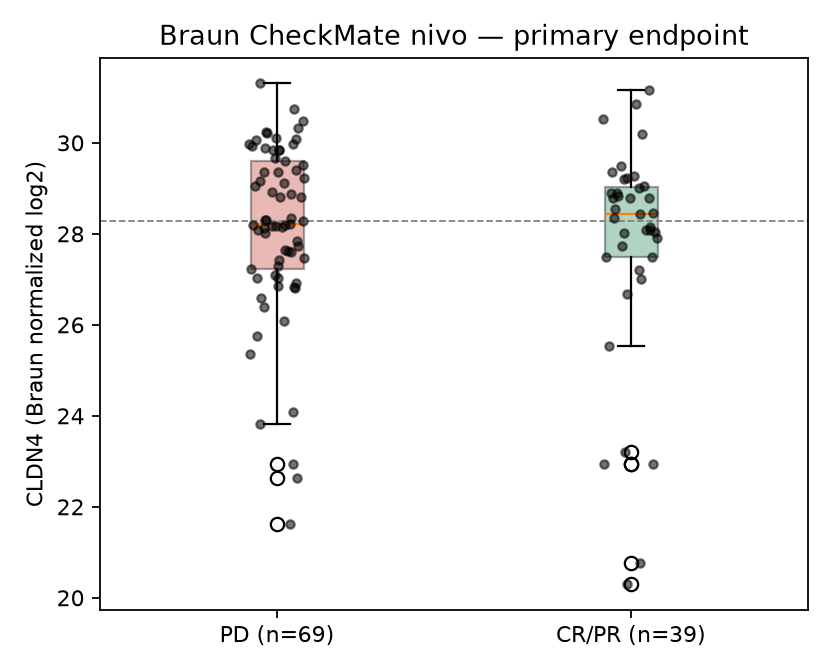
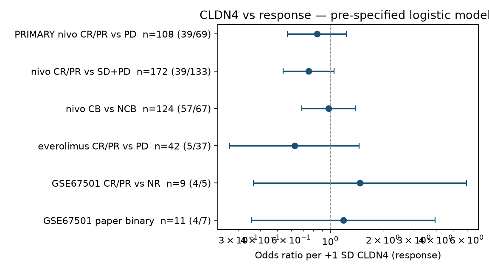

# B5 analog — KIRC: CLDN4 vs ICI response (open RNA only)

**Verdict: not supported.**

In the only public RCC ICI cohort that has both transcriptome and RECIST response
(Braun 2020 CheckMate-009/010/025, nivolumab arm):

| | |
|---|---|
| **OR per +1 SD CLDN4** | **0.84** |
| **95% CI** | **0.57 – 1.24** |
| **p** | **0.38** |
| **n** | **108 (39 CR/PR vs 69 PD)** |

The user B5 claim is a pooled **OR = 0.42** (CLDN4-high → worse ICI response).
That number is **not reproduced in open KIRC ICI RNA**. The 95% CI on the
pre-specified primary test excludes 0.42. The cohort had ~99% power to detect
OR = 0.42 if it were true here.

B5-style median split (high vs low CLDN4, same 108 patients): **OR = 1.27**
(95% CI 0.58–2.80), **p = 0.69** — point estimate in the *opposite* direction
of the claim, and null.

No other open KIRC ICI expression cohort has a usable response endpoint of
meaningful size.

---

## What was tested (pre-specified)

Plan committed in `ANALYSIS_PLAN.md` **before** any CLDN4-vs-outcome test was run.
Primary test (one shot, α = 0.05, two-sided):

- Population: Braun nivolumab patients with RNA and best response CR/PR or PD
- Model: `logit(response) ~ z(CLDN4)` within that population
- Metric: odds ratio per +1 SD of the author-supplied normalized CLDN4 value

## Open KIRC ICI expression inventory

| Cohort | ICI | RNA n | Response? | Used for |
|---|---|---|---|---|
| Braun 2020 *Nat Med* CheckMate-009/010/025 | nivo (everolimus control) | 181 nivo / 130 evero | Yes (RECIST + clinical benefit) | **Primary OR** |
| Motzer 2020 *Nat Med* JAVELIN Renal 101 | avelumab+axitinib (sunitinib control) | 726 | **No** (PFS only in the public xlsx) | PFS HR only; cannot make an OR |
| GSE67501 Ascierto 2016 | nivo | 11 | Yes (4 CR/PR, 2 SD, 5 NR) | Exploratory; n is too small |

Not open (so not used): IMmotion150/151 RNA (EGA / controlled), CheckMate-214
RNA, HCRN GU16-260, and any hospital/internal RCC ICI matrix. This analysis is
restricted to **open expression**.

---

## Primary (Braun nivo, CR/PR vs PD)

- n = 108; 39 responders (1 CR + 13 PR + 25 CRPR) vs 69 PD
- logistic OR per +1 SD CLDN4 = **0.841** (0.572–1.238), **p = 0.380**
- Mann–Whitney p = 0.636; AUC = 0.47 (chance)
- median CLDN4: responders 28.43 vs PD 28.22 (author-normalized log2 units)
- mean CLDN4: responders 27.74 vs PD 28.12

The continuous OR is slightly below 1 and the median-split OR is slightly above 1.
That combination is what a flat, noisy relationship looks like. It is not a
CLDN4-high-resistant signal.



## Secondary (pre-specified; not alpha-protected)

| Test | n (resp/non) | OR or HR | 95% CI | p |
|---|---|---|---|---|
| Median-split high vs low, CR/PR vs PD | 108 (21/33 high; 18/36 low) | OR 1.27 | 0.58–2.80 | 0.69 |
| Tertile high vs low, CR/PR vs PD | 36 vs 36 | OR 0.77 | 0.28–2.10 | 0.80 |
| CR/PR vs SD+PD (all evaluable nivo) | 172 (39/133) | OR 0.75 | 0.54–1.05 | 0.095 |
| Clinical benefit CB vs NCB | 124 (57/67) | OR 0.98 | 0.69–1.40 | 0.92 |
| + cohort + purity (n with WES purity) | 70 | OR 1.02 | 0.60–1.73 | 0.95 |
| + MSKCC | 97 | OR 0.79 | 0.52–1.20 | 0.27 |
| Everolimus control, CR/PR vs PD | 42 (5/37) | OR 0.63 | 0.27–1.46 | 0.28 |
| Nivo PFS, Cox per +1 SD | 181 (159 events) | HR 1.04 | 0.90–1.22 | 0.58 |
| Nivo OS, Cox per +1 SD | 181 (123 events) | HR 1.02 | 0.86–1.21 | 0.79 |
| Everolimus PFS | 130 (117 events) | HR 0.95 | 0.78–1.15 | 0.59 |
| Everolimus OS | 130 (108 events) | HR 0.94 | 0.78–1.13 | 0.49 |

The only secondary p near 0.05 is CR/PR vs SD+PD (p = 0.095). That was not the
primary endpoint, does not reach 0.05, and the CI still excludes OR = 0.42.
It is not evidence for the claim.



## JAVELIN Renal 101 (PFS only — no OR possible)

Public supplement has TPM + PFS, not RECIST. Reported because it is the largest
open RCC ICI transcriptome, but it **cannot** test the B5 odds-ratio claim.

| Arm | n (events) | HR per +1 SD CLDN4 | 95% CI | p |
|---|---|---|---|---|
| Avelumab+axitinib | 354 (157) | 0.89 | 0.76–1.03 | 0.13 |
| Sunitinib (control) | 372 (201) | 0.86 | 0.75–0.99 | 0.031 |
| Arm × CLDN4 interaction | 726 | HR_int 1.03 | — | 0.79 |

High CLDN4, if anything, tracks *better* PFS, and the nominal signal is in the
**sunitinib** arm. There is no ICI-specific interaction. Direction is opposite
the B5 claim and is not an ICI-response result.

## GSE67501 (n = 11)

Probe ILMN_2132458 (CLDN4). Paper binary 4 response vs 7 no-response:
OR per +1 SD = 1.19 (0.36–3.97), p = 0.78. CR/PR vs NR (n = 9): OR = 1.48,
p = 0.58. Mann–Whitney p = 0.79. Uninformative.

## Honesty controls

**Transcriptome-wide calibration** (same primary logistic, every gene, n = 108):

- 43,893 genes tested
- CLDN4 p-rank **17,915 / 43,893** (middle of the genome)
- CLDN4 BH-FDR = 0.93
- genes with raw p < 0.05: 1,901 (expected ~2,195 under a global null)
- genes with BH-FDR < 0.05: **0**

A gene sitting at rank 17,915 with FDR 0.93 is not a biomarker. The top 15 genes
by p (see `genomewide_top15.tsv`) also have FDR 0.93. This cohort does not
support *any* single-gene response classifier at FDR < 0.05, CLDN4 included.

**Power** (Wald, primary n = 108, event rate 0.36):

- power for OR = 0.42: **0.99**
- power for OR = 0.50: 0.93
- power for OR = 0.67: 0.52
- 80% power down to OR ≈ 0.57 (or up to 1.75)

This is a powered null for the claimed effect size, not an underpowered shrug.

**Reference genes** (same primary model; context only): TACSTD2 OR 0.86 p = 0.46;
CLDN3 0.81 p = 0.29; CD8A 1.04 p = 0.86; GZMB 0.94 p = 0.76; CD274 1.30 p = 0.25.
Nominal hits in this panel were CA9 (OR 1.79 p = 0.039) and PAX8 (OR 0.61 p = 0.022).
Those are ccRCC lineage/hypoxia markers, not pre-specified claims, and they would
not survive genome-wide FDR.

CLDN4 vs TACSTD2 in nivo RNA: Spearman ρ = 0.35 (n = 181). vs purity ρ = 0.20
(n = 117). vs CD8A ρ = −0.02.

## What this does and does not say

- Open KIRC ICI RNA **does not** support “CLDN4-high → worse ICI response, OR ≈ 0.42”.
- The primary estimate is compatible with no association (OR 0.84, CI crosses 1).
- The claimed OR 0.42 is outside the primary 95% CI.
- There is no second open RCC ICI *response* cohort large enough to replicate an OR.
- JAVELIN cannot supply an OR; its PFS association is weak, not ICI-specific, and
  opposite in direction.
- This is a KIRC analog, not a test of the user’s 11-cohort pan-cancer meta. A
  null in kidney does not by itself falsify a pooled OR built from other histologies.

## Reproduce

```bash
python3 scripts/w200/B5_KIRC/analyze.py
```

Requires the public supplements already downloaded under `data/` (gitignored;
URLs in `provenance.md`). Patient-level analysis tables are in this folder so
the primary OR can be re-fit from `braun_primary_patients.tsv` alone.
